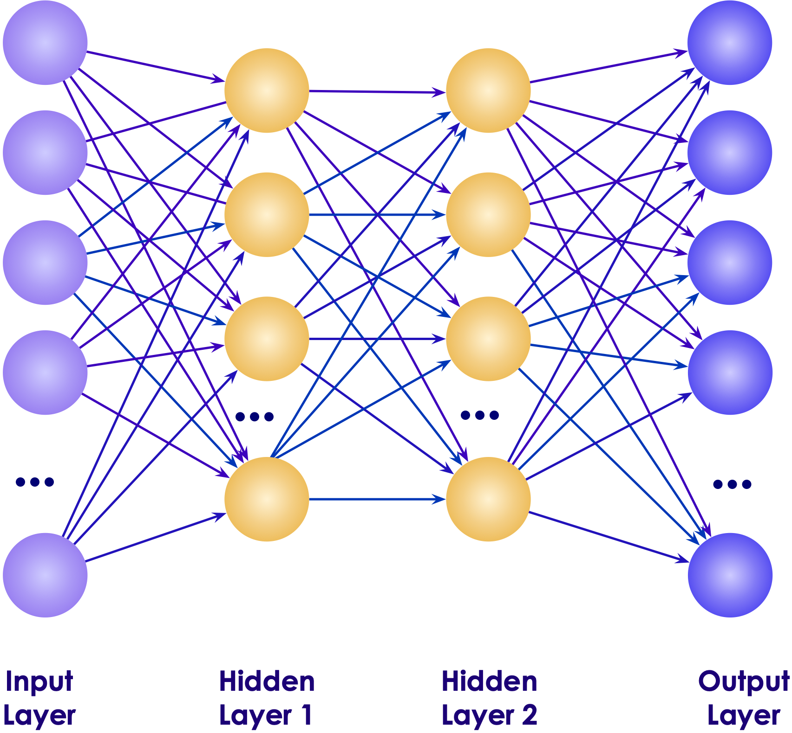

# Deep Learning With TensorFlow & Keras

  <!-- {"left" : 3.79, "top" : 7.53, "height" : 3.09, "width" : 3.37} -->    &nbsp; &nbsp;
   <!-- {"left" : 8.08, "top" : 7.92, "height" : 1.78, "width" : 2.1} -->    &nbsp; &nbsp;
  <!-- {"left" : 11.1, "top" : 8.43, "height" : 0.75, "width" : 2.62} -->

---

## About This Class

* A **practical approach to Deep Learning**

* Goals
    - **'Top-Down' learning**
    - **Learn** fundamentals of DL
    - And **implement** them in an DL environment

* Beyond the scope
    - Deep Math / Stats coverage

Notes:

---
## Pre-requisites and Expectations

<!-- {"left" : 11.74, "top" : 2.08, "height" : 1.35, "width" : 5.6} -->

 * Basic Python knowledge is assumed
    - if you are new to Python, we will provide some resources

 * We don't expect Math / Statistics background

 * Curiosity! Ask a lot of questions

 * This is a **Intro** Deep Learning class
    - No previous knowledge is assumed
    - Class will be based on the pace of majority of the students

Notes:

---
## Data Science Totem pole

 <!-- {"left" : 2.19, "top" : 2.9, "height" : 7.91, "width" : 13.12} -->

Notes:

---

## Agenda - 3 Days

*  **Day 1 (Introducing TensorFlow and Deep Learning)**
    - Deep Learning Intro
    - TensorFlow Intro
    - TensorFlow Playground
*  **Day 2 (TensorFlow / Keras)**
     - Keras Intro
     - Neural Network intro
     - Deep Learning concepts
     - Regression
     - Classification
*  **Day 3 (Deep Learning)**
     - CNNs (Images)
     - RNNs (Text, Translation)
     - Transfer Learning
     - Model serving
     - Workshop

Notes:

---

## Our Teaching Philosophy

 * Emphasis on concepts & fundamentals

 * Highly interactive (questions and discussions are welcome)

 * Hands-on (learn by doing)

 <!-- {"left" : 4.75, "top" : 4.55, "height" : 6.45, "width" : 7.99} -->

---

## Introductions

 * About Instructor
 * About you
     - Your Name
     - Your background (developer, admin, manager, ...)
     - Technologies you are familiar with
     - Familiarity with Python (scale of 1 - 4 ;  1 - new,   4 - expert)
     - Familiarity with TensorFlow / Deep Learning (scale of 1 - 4 ;  1 - new,   4 - expert)
     - Something non-technical about you!(favorite ice cream flavor / hobby...)

 &nbsp; <!-- {"left" : 2.31, "top" : 7.39, "height" : 3.17, "width" : 3.58} --> &nbsp; <!-- {"left" : 5.93, "top" : 7.42, "height" : 3.06, "width" : 5.64} --> &nbsp; <!-- {"left" : 11.6, "top" : 7.39, "height" : 3.17, "width" : 3.58} -->

Notes:

---

## Class Logistics

* Instructor's contact

* Slides
    - For each session, slides will be emailed out or delivered via virtual classroom

* Labs
    - Lab files will be distributed

* Lab environment
    - Provided in the cloud

---

## Let's Get Started!
