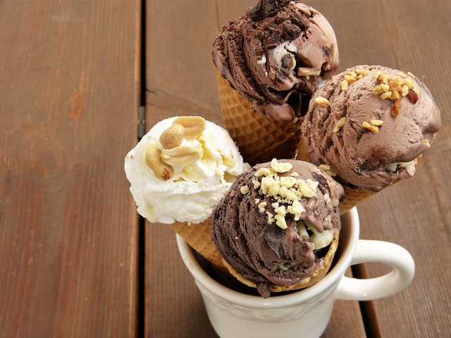

# Deep Learning With TensorFlow & Keras

---

## About This Class

* A **practical approach to Deep Learning**

* Goals
    - **'Top-Down' learning**
    - **Learn** fundamentals of DL
    - And **implement** them in an DL environment

* Beyond the scope
    - Deep Math / Stats coverage

Notes:

---
## Pre-requisites and Expectations

* Basic Python knowledge is assumed

* Have a Python development environment
   - We will set this up in class
 
* We don't expect Math / Statistics background

* Curiosity! Ask a lot of questions 

* This is a **Intro** Deep Learning class
    - No previous knowledge is assumed
    - Class will be based on the pace of majority of the students

Notes: 

---
## Data Science Totem pole

 <!-- {"left" : 0.55, "top" : 1.09, "height" : 5.48, "width" : 9.16} -->

Notes:

---

## Agenda - 3 Days

*  **Day 1 (Introducing TensorFlow and Machine Learning)** 

    - Machine Learning Intro
    - Data Exploration
    - TensorFlow Intro
    - TensorFlow Playground

*  **Day 2 (TensorFlow APIs)** 
     - TensorFlow Low Level API
     - Datasets
     - Estimator API
     - Regression
     - Neural Networks

Notes: 

---
## Agenda Continued

 *  **Day 3  (Deep Learning)**

     - CNNs
     - RNNs
     - Parallel TensorFlow

Notes: 

---
## Our Teaching Philosophy

 * Emphasis on concepts & fundamentals
 * Highly interactive (questions and discussions are welcome)
 * Hands-on (learn by doing)

 <!-- {"left" : 1.7, "top" : 0.97, "height" : 5.53, "width" : 6.85} -->

---

## About You And Me

 * About Instructor

 * About you
     - Your Name
     - Your background (developer, admin, manager, …)
     - Technologies you are familiar with
     - Familiarity with Python (scale of 1 – 4 ;  1 – new,   4 – expert)
     - Familiarity with TensorFlow (scale of 1 – 4 ;  1 – new,   4 – expert)
     - Something non-technical about you!(favorite ice cream flavor / hobby…)
     
    &nbsp;
 

Notes: 

---

## Class Logistics

* Instructor’s contact

* Slides
    - For each session, slides will be emailed out or delivered via virtual classroom

* Labs
    - Lab files will be distributed

* Lab environment
    - Provided in the cloud

---

## Let's Get Started !
