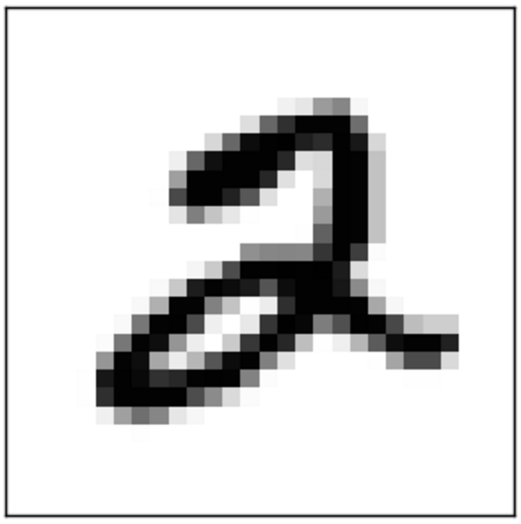

## Feedforward Network Limitations

 * Let’s imagine that we want to find a pattern in an image.

 * For example, say we want to locate a number in an image.

 * How would we do that in a NN?

     - We could take each pixel as a feature,

     - Apply those as input.

     - 640 x 480 image = 307,200 features

     - A LOT of features!

 * But let’s think… is this going to work for us? 

     - What are some problems?

 <!-- {"left" : 4.15, "top" : 5.08, "height" : 1.95, "width" : 1.94} -->

Notes: 

---
## Problems with MLP (Multilayer Perceptron) 

 * An image is 2-D, while our input is just a vector

     - Limited ways to learn patterns between vectors vertically

     - Feedforward Net COULD represent this

     - But how do we learn patterns?

     - Huge numbers of features 300k+

 * Finding pattern in image?

     - What if the “2” is in a different place?

     - Perhaps the right corner

     - Or the left corner?

 * Feedforward net may not realize

     - We are looking for a pattern WITHIN image

 <!-- {"left" : 7.93, "top" : 2.41, "height" : 2.08, "width" : 1.73} -->

 <!-- {"left" : 7.93, "top" : 4.81, "height" : 2.08, "width" : 1.73} -->

Notes:

---

## Too Many Features

 * Too many features

     - There’s just too many features here to learn.

 <!-- {"left" : 3.3, "top" : 2.47, "height" : 3.67, "width" : 3.64} -->

Notes: 

---
