# Convolutional Neural Networks (CNN)

---

# Image Recognition

---

## Image Recognition is a Challenging Problem

 <!-- {"left" : 10.18, "top" : 2.17, "height" : 5.4, "width" : 6.95} -->

 * [IBM's Deep Blue supercomputer](https://en.wikipedia.org/wiki/Deep_Blue_(chess_computer)) beat the chess world champion Garry Kasparov back in 1996

 * But not until recently (2010) or so, computers were unable to recognize a cat or a dog from an image

 * Human brains can do image recognition quite 'effortlessly'

 * How ever for computers this is hard
    - Large number of features
    - Features can vary considerably
    - Large Images especially difficult

Notes:
- https://en.wikipedia.org/wiki/Deep_Blue_(chess_computer)
- https://www.ibm.com/ibm/history/ibm100/us/en/icons/deepblue/

---

# Dealing With Images

---
## Representing Images

- Images can be represented as a 2D array

- Here is a 5x5 (5 pixels wide, 5 pixels high) image

- for black and white images:
    - black = 0
    - white = 1

<!-- {"left" : 3.64, "top" : 6.14, "height" : 4.7, "width" : 10.22} -->

---

## Greyscale Images

- Pixels are represented as numbers ranging from 0 - 255
    - 0: black
    - 255: white
    - in between: grey

<!-- {"left" : 2.7, "top" : 5.17, "height" : 6.16, "width" : 12.1} -->

---

## Color Images

- In color images, each pixel has colors
    - These are represented as RGB (Red, Green, Blue) colors

- Each RGB values are represented as numbers ranging 0-255

<!-- {"left" : 1.44, "top" : 5.93, "height" : 4, "width" : 14.63} -->

---

## Color Images

- Each pixel has 3 'channels' (RGB)

- Color images can be represented as 3D array

<!-- {"left" : 3.28, "top" : 4.08, "height" : 7.48, "width" : 10.94} -->

---

## Channels in Images

- Images could contain more channels than usual RGB
    - For example, satellite images might have infrared spectrum

- Here is an example of Hubble image taken using multiple cameras in multiple wave lengths, combined together

<!-- {"left" : 4.96, "top" : 5.31, "height" : 5.68, "width" : 7.57} -->

Notes:  
source : https://photographingspace.com/ap-color/

---

# Image Analysis Using Neural Networks

---
## Fully Connected Network's Limitations

<!-- {"left" : 10.76, "top" : 2.19, "height" : 6.17, "width" : 6.44} -->

- Assume we are analyzing a 200px by 200px image
    - Image has 40,000 (200x200) pixels

- If we connect each neuron on second layer to a neuron in the first layer, each neuron will have 40,000 connections

---

## Fully Connected Network's Limitations

- The second layer will have  
    - 40,000 connections per pixels x (200 px x 200 px) = 1.6 billion connections
    - 10 layers ==>  16 billion connections
- That is way too many connections

<!-- {"left" : 3.11, "top" : 6.51, "height" : 4.5, "width" : 5.09} --> &nbsp; &nbsp; <!-- {"left" : 9.3, "top" : 6.51, "height" : 4.5, "width" : 5.09} -->

---
## Fully Connected Network's Limitations

* Each layer has 1.6 billion  connections; and that many weights to learn
* How ever, a 200px x 200px image is very small!
* 4K picture is ~ 4000 x 2000 pixels (see picture below, credit [wikimedia](https://commons.wikimedia.org/wiki/File:8K,_4K,_2K,_UHD,_HD,_SD.png))
* Can you compute how many weights we will need to compute for a 4K image?
* **Quiz**: Take a picture with your phone.  What is the size? (probably 3000 x 2000 pixels)
* __So we need a another approach__

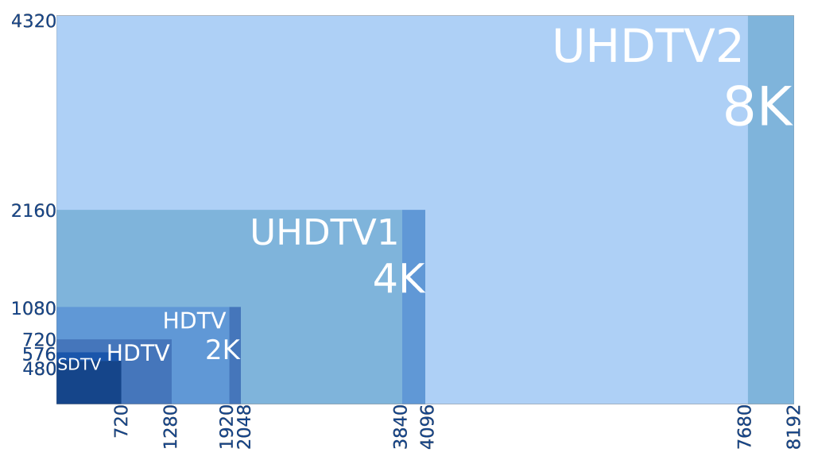<!-- {"left" : 9.23, "top" : 2, "height" : 4.31, "width" : 7.55} -->

---

## Famous 'Cat Experiment'

<!-- {"left" : 10.44, "top" : 2.28, "height" : 4.34, "width" : 6.54} -->

* David H. Hubel and Torsten Wiesel performed experiments on cats (1958/1959) that gave us crucial understanding of brain's visual cortex.  ([paper](https://physoc.onlinelibrary.wiley.com/doi/pdf/10.1113/jphysiol.1959.sp006308))

* They hooked up electrodes to a cat's brain (cat is sedated of course!)

* Showed different shapes (dots / lines ..etc) and looked for 'neurons firing'

* But they couldn't get neurons to fire!

* Until they accidentally dragged the shape  across the screen,  then neurons fired!

* Authors won the Nobel Prize in Physiology or Medicine in 1981 for their work!

Notes:  
- https://www.princeton.edu/~cggross/Hubel.pdf
- https://www.ncbi.nlm.nih.gov/pmc/articles/PMC2718241/

---

## Our Visual Cortex is Hierarchical

<!-- {"left" : 9.38, "top" : 2.19, "height" : 2.54, "width" : 7.67} -->

* First level neurons detect simple shapes

* Next level neurons detect more complex shapes, and so on

 

<!-- {"left" : 4.5, "top" : 6.61, "height" : 4.38, "width" : 8.49} -->

[Link to video](https://www.youtube.com/watch?v=IOHayh06LJ4)

---

## Hierarchical Visual Cortex

- Our brain's visual system works hierarchically to perceive images

- Some neurons only recognize horizontal lines, some only slanted lines

- Higher level neurons can 'build on' the work done by other neurons

- In the image below, left to right, visual cortex is perceiving 'higher features'
    - Lower level neurons, visualize simple features like lines and shapes
    - Higher level neurons recognize complex shapes

<!-- {"left" : 2.42, "top" : 7.42, "height" : 3.02, "width" : 12.67} -->

---

# Filters

---

## Pre-Processing Images

  <!-- {"left" : 11.06, "top" : 2.2, "height" : 4.07, "width" : 6.13} -->

  * Image processing is a standard task for machine learning

  * Before we load the images, we can use Photoshop, OpenCV to "clean up" the image
    - remove noise
    - find edges
    - etc

  * Even now, this is a common task to help get better results.

  * This is  *feature engineering*  
  (Example image, with background blurred)

---
## Image Filter Examples

- Some sample filters
    - Blur filter
    - Sharpen filter
    - Edge detection filter

<!-- {"left" : 4.3, "top" : 5.14, "height" : 6.01, "width" : 8.91} -->

---

## Problems with Image Pre-Processing

  * How do we *know* that one filter will help us
    - Takes a lot of experience!
    - In some cases it might **hurt** rather than help.

  * Lots of trial and error!

  * What if...
    - Maybe there was a way we could find a filter that gives us better results for sure.
    - Could we automate finding the perfect filter?
    - Maybe if we used more than one filter?

---

# Convolutions

---

## A Little History: Yann LeCun

  * Yann LeCun was working on the problem of recognizing digits: MNIST
    - Recognize zip codes in letters for US Postal Service
    - Recognize digits in bank checks

  * Classical MLP networks were unable to get very high accuracy on the problem.
    - 96,97% was the best such networks could do.
    - LeCun proposed a new architecture that could be over 99% better.
    - The difference between 96% and 99+% is a big deal!

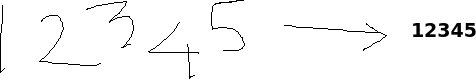<!-- {"left" : 1.32, "top" : 8.43, "height" : 1.77, "width" : 14.86} -->

---

## A Little History: Yann LeCun

  * LeCun's new architecture is called LeNet ([1998 paper](http://yann.lecun.com/exdb/publis/pdf/lecun-01a.pdf))
    - Named after himself!
    - LeNet became the basis of a transfer learning architecture (we will discuss later)

  * Lecun's architecture had 2 new elements
    - Convolutional layer
    - Pooling layer

Notes:  

---

## Convolution

* Imagine a small patch being slid across the input image. This sliding is called  **convolving** .

* It is similar to a flashlight moving from the top left end progressively scanning the entire image. This patch is called the  **filter/kernel**. The area under the filter is the receptive field.

<!-- {"left" : 2.57, "top" : 5.92, "height" : 4.89, "width" : 4.89} -->   &nbsp; &nbsp;  <!-- {"left" : 9.64, "top" : 5.92, "height" : 4.89, "width" : 5.29} -->

---

## Convolution Example: Edge Detection

* Here we are applying an edge filter to an image

* The resulting image has edges 'highlighted'

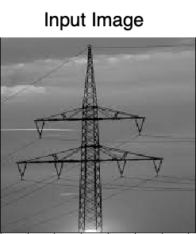 <!-- {"left" : 1.58, "top" : 4.12, "height" : 6.17, "width" : 5.18} -->
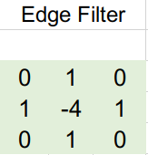 <!-- {"left" : 6.86, "top" : 6.3, "height" : 3.98, "width" : 3.82} -->
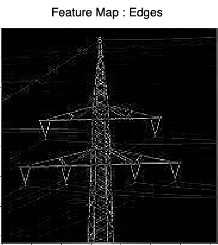 <!-- {"left" : 10.74, "top" : 4.45, "height" : 5.83, "width" : 5.18} -->

---
## Convolution Example: Vertical Edges Detection

* The resulting image has vertical edges highlighted

 <!-- {"left" : 1.58, "top" : 4.12, "height" : 6.17, "width" : 5.18} -->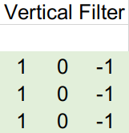 <!-- {"left" : 6.86, "top" : 6.3, "height" : 3.98, "width" : 3.82} -->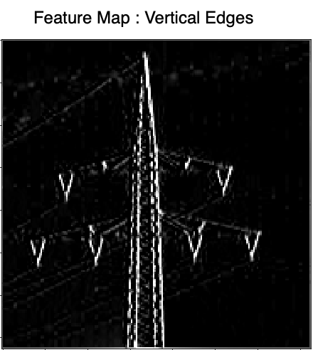 <!-- {"left" : 10.74, "top" : 4.45, "height" : 5.83, "width" : 5.18} -->

---

## Convolution Example: Horizontal Edges Detection

* The resulting image has horizontal edges highlighted

 <!-- {"left" : 1.58, "top" : 4.12, "height" : 6.17, "width" : 5.18} -->
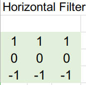  <!-- {"left" : 6.86, "top" : 6.3, "height" : 3.98, "width" : 3.82} -->
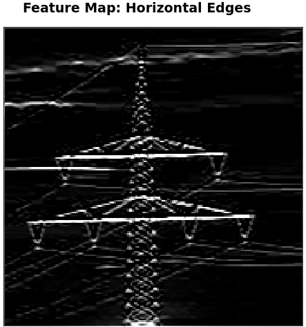 <!-- {"left" : 10.74, "top" : 4.45, "height" : 5.83, "width" : 5.18} -->

---

## Convolution Example: Edges

 <!-- {"left" : 3.79, "top" : 1.75, "height" : 3.29, "width" : 2.76} --> <!-- {"left" : 7.51, "top" : 2.68, "height" : 2.44, "width" : 2.34} --> <!-- {"left" : 10.81, "top" : 2.01, "height" : 3.11, "width" : 2.76} -->

 <!-- {"left" : 3.79, "top" : 5.06, "height" : 3.29, "width" : 2.76} --> <!-- {"left" : 7.59, "top" : 5.91, "height" : 2.44, "width" : 2.37} --> <!-- {"left" : 10.81, "top" : 5.26, "height" : 3.09, "width" : 2.76} -->

 <!-- {"left" : 3.79, "top" : 8.45, "height" : 3.29, "width" : 2.76} --> <!-- {"left" : 7.55, "top" : 9.29, "height" : 2.44, "width" : 2.46} --> <!-- {"left" : 10.81, "top" : 8.78, "height" : 2.96, "width" : 2.76} -->

---

## Learning Features

* Here we are analyzing a picture of elephant

* Assume each neuron is 'trained' recognize a certain feature (like ears / trunks / tail ..etc)

* As we scan through the image, the neurons will **'recognize the features'**

* And putting their findings together, we can conclude that we are seeing an elephant

<!-- {"left" : 3.35, "top" : 5.79, "height" : 5.01, "width" : 10.8} -->

---

## Learning Features

 <!-- {"left" : 11.47, "top" : 2.35, "height" : 7.7, "width" : 5.82} -->

- Each layer builds on previous layer's work

- First layer detects simple shapes - horizontal lines, slanted lines ..etc

- Second layer recognizes more complex features: eyes / nose ..etc

- Third layer recognizes faces

---

## Convolutional Layer

<!-- {"left" : 12.4, "top" : 1.89, "height" : 4.98, "width" : 4.82} -->

- Here we represent our neurons in a 2D grid format (instead of linear before), this makes visualizing connections easier

- Neurons in the convolutional layer are NOT connected to every single neuron in the layer before

- Instead each neuron is connected to a few pixels/neurons in their **receptive field**
    * The idea is to detect local features in a smaller section of the input space, section by section to eventually cover the entire image.

- This allows the first convolutional layer to concentrate on low level features

- Next layers assemble inputs from previous layers into higher level features

---

## Convolutional Process

* Here we see that in second layer, the neurons only read from a few neurons from previous layer

* They read from their 'field of view'

 <!-- {"left" : 1.5, "top" : 5.94, "height" : 2.89, "width" : 2.98} --> &nbsp; &nbsp;  <!-- {"left" : 5.4, "top" : 5.94, "height" : 2.89, "width" : 2.81} --> &nbsp; &nbsp;  <!-- {"left" : 9.32, "top" : 5.94, "height" : 2.89, "width" : 2.79} --> &nbsp; &nbsp; <!-- {"left" : 13.2, "top" : 5.94, "height" : 2.89, "width" : 2.79} -->

---
## Fully Connected vs. Convolutional

<!-- {"left" : 6.58, "top" : 2.59, "height" : 4.29, "width" : 4.34} -->

 <!-- {"left" : 2.06, "top" : 7.88, "height" : 2.66, "width" : 2.75} --> &nbsp; &nbsp;  <!-- {"left" : 5.66, "top" : 7.88, "height" : 2.66, "width" : 2.59} --> &nbsp; &nbsp;  <!-- {"left" : 9.28, "top" : 7.88, "height" : 2.66, "width" : 2.58} --> &nbsp; &nbsp; <!-- {"left" : 12.86, "top" : 7.88, "height" : 2.66, "width" : 2.58} -->

Notes:

---

## Fully Connected vs. Convolutional

<!-- {"left" : 13.64, "top" : 2.25, "height" : 3.26, "width" : 3.16} -->

<!-- {"left" : 13.64, "top" : 5.87, "height" : 3.26, "width" : 3.16} -->

* Fully connected layers connect to every neuron from previous layer
    - This results in too many connections

* But in convolutional layers, the number of connections is greatly reduced
    - Makes computationally feasible

---

## Convolutional Layer: Local Receptive Field

- Here each neuron connects to neurons in its input / perceptive field

<!-- {"left" : 3.09, "top" : 4.54, "height" : 6.08, "width" : 11.31} -->

---

## How is Convolution Performed?

* The following slides illustrate the math behind convolutions

* Provided as a reference

* Feel free to skip / go-over depending on the time constraint

---

## Process of Convolution

* On the left we have the image matrix  (6x6)

* On the right we have filter/kernel matrix (3x3).  Also known as weight matrix (Wk)

* The weight matrix is a filter to extract some particular features from the original image. It could be for  extracting curves, identifying a specific color, or recognizing a particular voice.

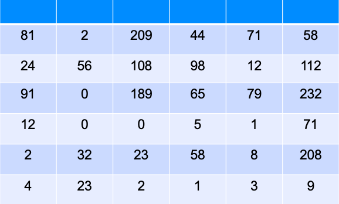<!-- {"left" : 1.64, "top" : 7.13, "height" : 3.67, "width" : 6.8} -->
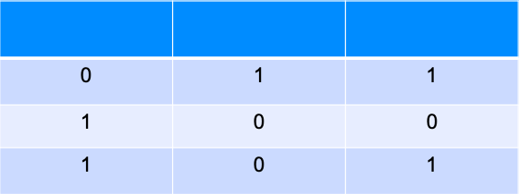<!-- {"left" : 8.89, "top" : 7.08, "height" : 3.76, "width" : 6.97} -->

---
## Process of Convolution (Contd.)

* We use matrix multiplication to multiply input matrix vs. weight matrix  
__`I .  W`__
* When the weighted matrix starts from the top left corner of the input layer, the output value is calculated as:  
__`(81x0+2x1+209x1)+(24x1+56x0+108X0)+(91x1+0x0+189x1) = 515`__

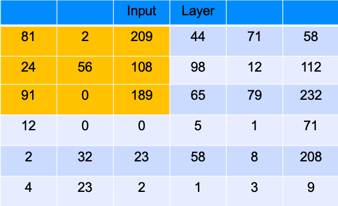<!-- {"left" : 4.11, "top" : 5.85, "height" : 2.93, "width" : 5.44} -->
<!-- {"left" : 9.85, "top" : 6.88, "height" : 1.9, "width" : 3.54} -->

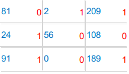<!-- {"left" : 4.33, "top" : 9.07, "height" : 2.69, "width" : 5.01} --> &nbsp;  &nbsp;
<!-- {"left" : 9.85, "top" : 9.76, "height" : 1.9, "width" : 3.54} -->

---

## Process of Convolution (Contd.)

 * The filter then moves by 1 pixel to the next receptive field and the process is repeated. The output layer obtained after the filter slides over the entire image would be a 4X4 matrix.

 * This output is called an  **activation map/ feature map**

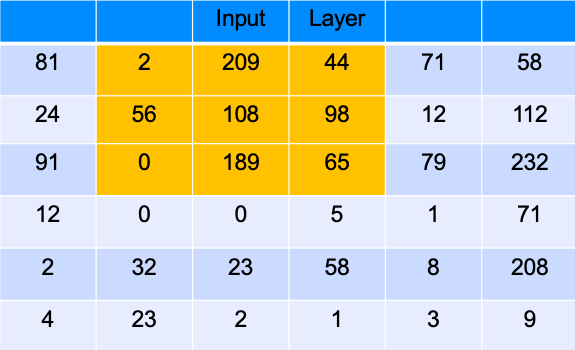<!-- {"left" : 8.42, "top" : 4, "height" : 2.83, "width" : 5.25} -->
<!-- {"left" : 13.88, "top" : 5.04, "height" : 1.79, "width" : 3.32} -->

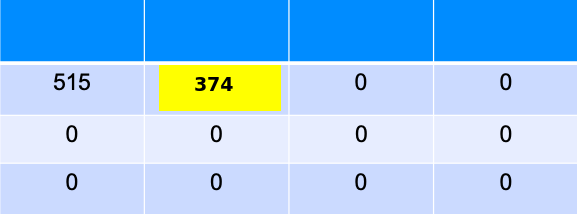<!-- {"left" : 10.55, "top" : 7.28, "height" : 2.43, "width" : 4.52} -->

---

## Stride

* The distance between two consecutive receptive fields is called the  **stride** .

* In this example stride is 1 since the receptive field was moved by 1 pixel at a time.

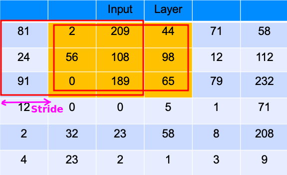<!-- {"left" : 4.48, "top" : 5.55, "height" : 5.19, "width" : 8.53} -->

Notes:

---
## Zero Padding

- It is common to add zeros around the image (black pixels)

- Called 'zero padding'

- This ensures 'corner pixels' are processed properly

 <!-- {"left" : 4.8, "top" : 5.53, "height" : 5.89, "width" : 7.91} -->

---

## Zero Padding

 * Assumptions
   - Output image is `32 x 32 x 3`
   - Filter size is `5 x 5 x 3`
 * To achieve the **same** size:
   - You need padding of ` (K - 1) / 2`
   - In this case `(5 - 1) / 2 = 2`
 * We pad a "frame" around the image
   - black pixels
   - size 2
   - Image is then `36 x 36 x 3`
 * Output Size:
   - `O = ((W - K - 2P) / S) + 1`

Notes:

---
## Convolution Parameters

  * Three Hyperparameters control the convolution:

    - **Depth:** The number of filters, and the number of neurons per convolution

    - **Stride:** Usually 1 or 2: the number of pixels we "jump" when applying the filter.

    - **Zero Padding:** Creates a "frame" of zero (black) pixels around the border of image.

  * Stride > 1 will reduce dimensions

    - Allows us to both do convolution and reduce dimensions in one step

    - Usually, we use pooling layers for reducing dimensions.

---

## Convolutions: Further Reading

* [Tutorial on convolutions](https://www.youtube.com/watch?v=XuD4C8vJzEQ&list=PLkDaE6sCZn6Gl29AoE31iwdVwSG-KnDzF&index=2) by Andrew Ng

* [Tutorial on padding](https://www.youtube.com/watch?v=smHa2442Ah4&list=PLkDaE6sCZn6Gl29AoE31iwdVwSG-KnDzF&index=4) by Andrew Ng

* [Tutorial on strides](https://www.youtube.com/watch?v=tQYZaDn_kSg&list=PLkDaE6sCZn6Gl29AoE31iwdVwSG-KnDzF&index=5) by Andrew Ng

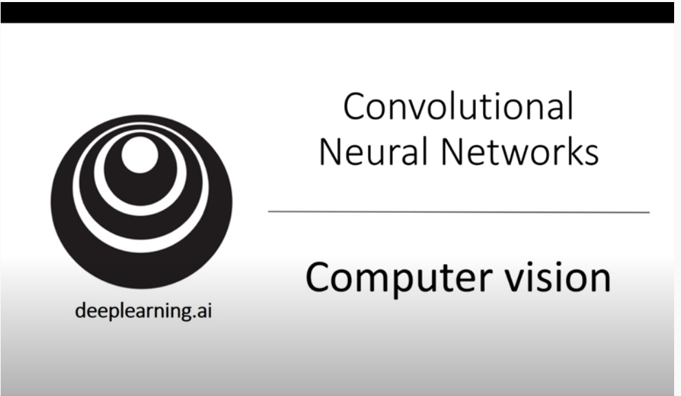 <!-- {"left" : 4.45, "top" : 5.69, "height" : 5.01, "width" : 8.61} -->

---

## Filters / Kernels

- CNNs use filters to detect patterns in images

- Imagine the filter like a flashlight shining on the image

- As 'the flashlight'  'moves' along the image, it 'convolves' the image
    - Output from a filter is called **feature map**

- CNN learns filters during training phase

<!-- {"left" : 11.36, "top" : 3.47, "height" : 5.44, "width" : 5.89} -->

Notes:  
- https://www.saama.com/blog/different-kinds-convolutional-filters/

---
## Filters in Computer Vision

* We just saw a single filter can extract a certain **pattern or feature**

* Convolutional neural networks (CNN) do not learn just a single filter. In fact, they learn multiple features in parallel for a given input

* Typically in practice CNNs learn from 32 to 512 filters

* This gives the model 32, or even 512, different ways of extracting features from an input

* In other words CNNs "learn to see" features from given input

---

## Stacking Feature Maps

* So far, we have seen Convolutional layer as a thin 2D layer
* In fact, **Convolutional layer is composed of  series of feature maps**
* These feature maps are 'stacked' forming a 3D structure
* Each filter creates a new volume slice
* Typically have more than one slice (as images tends to have multiple channels like RGB)
* Here we see
    - 3 channels x 5 filters  = 15 feature maps

<!-- {"left" : 4.02, "top" : 7.91, "height" : 2.95, "width" : 9.46} -->

---

## Stacking Feature Maps

  <!-- {"left" : 3.47, "top" : 3.41, "height" : 6.89, "width" : 10.55} -->

---

## Stacking Multiple Feature Maps

  <!-- {"left" : 10.9, "top" : 2.41, "height" : 4.12, "width" : 6.28} -->

 * Within a single feature map all neurons share the same parameters (weights and bias term)
    - This simplifies training

 * Different feature maps can have different parameters (weights + biases).

 * The receptive field of previous layer extends across all of its feature maps.

 * In summary, a **convolutional layer applies multiple filters to the input image, making it capable of detecting multiple features in the input**

Notes:

---

## Stacking Multiple Feature Maps (Contd.)

  <!-- {"left" : 10.9, "top" : 2.41, "height" : 4.12, "width" : 6.28} -->

 * Images that are greyscale have just one channel. So it needs just 1 sublayer. Colored images have three channels - Red, Green and Blue. So it needs 3 sublayers.

 * Satellite imagery that capture extra light frequencies (e.g. infrared) can have more channels.

Notes:

---

## Stacking Multiple Feature Maps (Contd.)

  <!-- {"left" : 10.9, "top" : 2.41, "height" : 4.12, "width" : 6.28} -->

 * The fact that all neurons in a feature map has just one set of parameters dramatically reduces the number of parameters needed.

 * This also means that once a CNN has learned to recognize a pattern in one location, it can recognize it in any other location. This is known as location invariance.
    - For example it can detect an 'eye' any where in the picture

 * In contrast, if a regular DNN has learned to recognize a pattern in one location, it can recognize it only in that location.

Notes:

---

## Convolutional Layer Hyperparameters

 * The hyperparameters of CNN are:

 *  **Padding type**

 *  **Filter height and width**

 *  **Strides**

 *  **Number of filters**

Notes:

---

## Convolutions: Further Reading

* [Tutorial on convolutions on volumes](https://www.youtube.com/watch?v=KTB_OFoAQcc&list=PLkDaE6sCZn6Gl29AoE31iwdVwSG-KnDzF&index=6) by Andrew Ng

  <!-- {"left" : 3.86, "top" : 4.91, "height" : 5.69, "width" : 9.78} -->

---
## Convolutions Summary

 * Images have too many features for a network to learn.

 * Convolutions are a standard way that we do image processing

 * Convolutional Layers help to extract higher-level features

 * Convolution is the process of adding each element of the image to its local neighbors, weighted by the kernel

    - It means we take a nxn *filter* and apply that to the image

 * Different filters do different things:
    - Edge Detection filters
    - Sharpening Filters
    - Gaussian blur

Notes:
https://en.wikipedia.org/wiki/Kernel_(image_processing)

---

# Pooling
---

## Pooling Layer

- Pooling layer is used to subsample (i.e., shrink) the input image, while **keeping important features intact**

- Reduces the computational load, reduce memory usage, and reduce the number of parameters (limits overfitting)

- Here we are shrinking the picture, while still keeping the prominent feature (lighthouse)

<!-- {"left" : 1.53, "top" : 7.4, "height" : 3.74, "width" : 5.61} --> &nbsp; &nbsp; <!-- {"left" : 8.47, "top" : 8.08, "height" : 2.71, "width" : 2.71} --> &nbsp; &nbsp; <!-- {"left" : 12.2, "top" : 8.18, "height" : 2.5, "width" : 3.77} -->

---

## Pooling Types

- Pooling types
    - MAX pooling
    - Average pooling
    - L2-Norm pooling
    - Stochastic pooling

---

## Max Pooling

* MAX pooling is most common.

* Notice in this case we take the max of each receptive field

* 2x2 window with stride 2

* Here input is shrunk by factor of 4 --> 1  
so the resulting image is 25% of original image

 <!-- {"left" : 4.02, "top" : 6.44, "height" : 4.58, "width" : 9.47} -->

Notes:

---

## Max Pooling Example

* With 2x2 window, stride=2,  and max pooling, the image is reduced to 25% of original size

<!-- {"left" : 1.53, "top" : 5.87, "height" : 3.74, "width" : 5.61} --> &nbsp; &nbsp; <!-- {"left" : 8.47, "top" : 6.55, "height" : 2.71, "width" : 2.71} --> &nbsp; &nbsp; <!-- {"left" : 12.2, "top" : 6.65, "height" : 2.5, "width" : 3.77} -->

---

## Pooling Hyperparameters

- Filter / Spatial Extent F: (for example, F = 2 is 2x2 filter)

- Stride S, how many pixels we "move" (Commonly 2)

- We do not use Zero Padding (black pixel padding) with pooling layers.

- Common Parameters:
    - F = 3, S = 2: 3x3 filters, stride 2 : Overlapping pooling
    - F = 2, S = 2: 2x2 filters, stride 2: No overlaps

 <!-- {"left" : 3.89, "top" : 6.75, "height" : 4.27, "width" : 4.62} --> &nbsp; &nbsp; <!-- {"left" : 8.99, "top" : 6.75, "height" : 4.27, "width" : 4.62} -->

---

## Do We Need Pooling?

 <!-- {"left" : 13.57, "top" : 1.89, "height" : 3.25, "width" : 3.51} -->

<!-- {"left" : 13.57, "top" : 5.29, "height" : 3.25, "width" : 3.51} -->

 * We need to reduce dimensionality somehow!

 * Possible to use CONV Layer with Stride=2 instead of a pool.

 * We can provide the stride to the convolutional layers to reduce features

 * Pooling layers have *traditionally* seemed to help make a network more efficient.
   - particularly with max pooling

 * Recent trends have led to all convolutional networks
   - Use a convolution layer with stride greater than 1

---

## Pooling: Further Reading

* [Tutorial on pooling](https://www.youtube.com/watch?v=8oOgPUO-TBY&list=PLkDaE6sCZn6Gl29AoE31iwdVwSG-KnDzF&index=9) by Andrew Ng

<!-- {"left" : 3.16, "top" : 3.94, "height" : 6.51, "width" : 11.18} -->

---

## Lab: Explore Convolutions and Pooling

<!-- {"left" : 12.74, "top" : 1.89, "height" : 5.42, "width" : 4.07} -->

* **Overview:**
    - Understand convolutions and pooling

* **Approximate run time:**
    - 15-20 mins

* **Instructions:**
    - Instructor: Please demo **convolutions** lab

Notes:

---

# Convolutional Neural Networks (CNNs)

---

## Introduction to Convolutional Neural Networks (ConvNets)

* CNNs are a sequence of layers:
   - Input layer
   - Convolutional Layer
   - ReLU (Rectified Linear Unit) Activation
   - Pooling Layer
   - Fully Connected Layer(s)

  * Many times we have more than one sequence of layers

 <!-- {"left" : 1.46, "top" : 7.84, "height" : 1.81, "width" : 14.59} -->

Notes:

---

## Pooling Layer

- Apply some function (commonly MAX) to each nxn  
- Reduce features!
- Notice the reduced features.
- We can also reduce features simply by resizing the image.

  <!-- {"left" : 11.38, "top" : 2.49, "height" : 5.19, "width" : 5.83} -->

---

## Fully Connected Layers

 * Fully Connected Layer

     - Finally, have one or more fully connected layers at the end

 * Why Fully Connected?

     - Need to take the convolutional layers and apply to our problem

 * Softmax Layer at the end (for classification problems)
    - Classify digits into 0,1,...9
    - Classify images into cats, dogs, elephants

  <!-- {"left" : 1.7, "top" : 7.94, "height" : 1.76, "width" : 14.09} -->

Notes:

---
## Convolutions Further Reading

* Watch this brilliant [tutorial series](https://www.youtube.com/watch?v=ArPaAX_PhIs&list=PLkDaE6sCZn6Gl29AoE31iwdVwSG-KnDzF&index=2&t=0s) on convolutions by Andrew Ng

<!-- {"left" : 3.56, "top" : 4.08, "height" : 6.04, "width" : 10.38} -->

---

## Example Convolutional Network

- Here we have repeating layers of convolutional and pooling layers

- And a final Softmax layer is giving the probabilities of the image class

<!-- {"left" : 3.81, "top" : 5.07, "height" : 4.74, "width" : 9.89} -->

Notes:

---

## CNN Training Workflow

- Make predictions on training data images (forward pass).

- Determine which predictions were incorrect and propagate back the difference between the prediction and the true value (backpropagation).

- Rinse and repeat till the predictions become sufficiently accurate.

- It's quite likely that the initial iteration would have close to 0% accuracy. Repeating the process several times, however, can yield a highly accurate model (> 90%).

 * **Animation** : [link-youtube](https://youtu.be/krTFCDCbkZg), [link-S3](https://elephantscale-public.s3.amazonaws.com/media/machine-learning/backpropagation-5.mp4)

 <!-- {"left" : 11.54, "top" : 2.9, "height" : 3.77, "width" : 5.56} -->

---

## CNN Training Batches

- The batch size defines how many images are seen by the CNN at a time

- Each batch should have a good variety of images from different classes in order to prevent large fluctuations in the accuracy metric between iterations.
    - A sufficiently large batch size would be necessary for that.

- However, don't let the batch size too large
    - It could consume too much memory
    - The training process would be slower.

- Usually, batch sizes are set as powers of 2.  
64 is a good number to start, then tweak it from there.

---
## CNN Batch Size and Memory

* Image input is: 150 x 100 RGB image (three channels)
* Convolutional layer with 5 x 5 filters, outputting 200 feature maps of size 150 x 100
* Then the number of parameters is (5 x 5 x 3 + 1) x 200 = 15,200 (the +1 corresponds to the bias terms), which is fairly small compared to a fully connected layer
* Each of the 200 feature maps contains 150 x 100 neurons, and each of these neurons needs to compute a weighted sum of its 5 x 5 x 3 = 75  inputs: that's a total of 225 million float computations
* If the feature maps are represented using 32-bit floats, then the convolutional layer's output will occupy 200 x 150 x 100 x 32 = 96 million bits
* About **11.4 MB of RAM per image**
* If a training batch contains **100 images**, then this layer will use up over **1 GB of RAM!**
- Reference: [Neural Networks and Deep Learning, Chapter 3](https://learning.oreilly.com/library/view/neural-networks-and/9781492037354/ch03.html%0A)

---

## Data Augmentation

- State of the art image classifiers are trained with millions of images

- What if we only have a small sample (say a few hundred) ?

- NNs could 'memorize' the small dataset.
    - great accuracy on training set
    - but bad accuracy on test set (or new/unseen images)
    - this is classic 'overfitting'

- If available images are limited, then we can use a technique called 'augmentation' to create more data samples

- Only augment training set
    - Do not augment validation/test set because the resulting accuracy metric would be inconsistent and hard to compare across other iterations.

Notes:  
From : https://learning.oreilly.com/library/view/practical-deep-learning/9781492034858/ch02.html

---

## Data Augmentation

- Augmentation techniques
    - Rotation (rotate image 10-20' clockwise or counter-clockwise)
    - Shift images to left/right of center
    - Zoom in/out
    - combine the above

- Augmentation tools
    - Keras ImageDataGenerator
    - [imaging library](https://github.com/aleju/imgaug)

Notes:  

---

## Image Augmentation Example

- Use techniques like: rotate slightly to left and right,  flip the image ...etc.

 <!-- {"left" : 3.43, "top" : 4.69, "height" : 4.34, "width" : 10.63} -->

---

# Popular CNN Architectures

---

##  Popular CNN Architectures

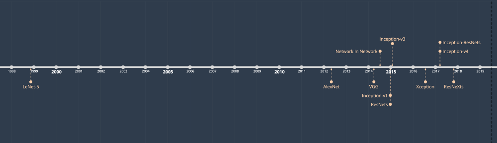 <!-- {"left" : 3.86, "top" : 1.89, "height" : 3.99, "width" : 9.78} -->

* References:
  - [Illustrated: 10 CNN Architectures](https://towardsdatascience.com/illustrated-10-cnn-architectures-95d78ace614d)
  - ["Programming PyTorch for Deep Learning" book  Chapter 03](https://learning.oreilly.com/library/view/programming-pytorch-for/9781492045342/ch03.html#convolutional-neural-networks)

---

## Popular CNN Models

| Year | Name                     | Created By   | Layers | Parameters  | Description                                                                                             |
|------|--------------------------|--------------|--------|-------------|---------------------------------------------------------------------------------------------------------|
| 1998 | LeNet                    | Yann Lecun   | 5      | 60,000      | Simple, but basic template for CNN architecture                                                         |
| 2012 | AlexNet                  | Hinton et al | 8      | 60 million  | Dominated ImageNet Challenge in 2012.  Ignited the NeuralNet boom.  Introduced ReLU activation function |
| 2014 | VGG-16                   | Oxford Uni   | 19     | 138 million | 2014 ImageNet 2nd place. Introduced deeper network (twice as deep as AlexNet)                                                    |
| 2014 | Inception V1 (GoogLeNet) | Google       | 22     | 7 million   | Won 2014 ImageNet competition.  Introduced Inception model of using dense modules/blocks                |
| 2015 | Inception V3             | Google       | 42     | 24 million  | 2015 ImageNet runner up.  Introduced batch normalization technique                                      |
| 2015 | ResNet-50                | Microsoft    | 150    | 26 million  | 2015 ImageNet winner.  Went way deeper than previous models                                             |
| 2016 | Xception                 | Keras Team   |        | 23 million  | Extension of Inception model                                                                            |
| 2016 | Inception V4             | Google       |        | 43 million  | Updated from previous Inception v3                                                                      |
| 2016 | Inception-ResNet-V2      | Google       |        | 56 million  | A merge of Inception and ResNet                                                                         |

<!-- {"left" : 0.24, "top" : 2.64, "height" : 1, "width" : 17.02, "columnwidth" : [1.78, 2.32, 2.4, 1.6, 2.09, 6.82]} -->

---

## LeNet (1998)

* The 'OG' of CNNs

* Created by Yann LeCun

* Handwritten digits / MNIST type data (10 classes)
  - To identify Zipcodes for USPS

* 28x28x1 monochrome images

* Revolutionary in its time
  - Mostly constrained by resources of the day

 <!-- {"left" : 2.05, "top" : 7.62, "height" : 3.3, "width" : 13.41} -->

Notes:

---

## AlexNet (2012)

* AlexNet was an important milestone in CNNs.  It kick-started the latest boom in CNNs

* In 2012 ImageNet competition, it dominated with top-5 error rate is 15.3%,  beating the second place entry with a top-5 error of 26.2%;  Almost a 10% gap

* AlexNet was the blueprint for lot of later architectures

* It introduced `MaxPool` and `DropOut` concepts,  Also introduced `ReLU` activation function

* Applied LeNet to full size RGB images (224x224x3) with 1000 classes.

* References:
  - [ImageNet Classification with Deep Convolutional
Neural Networks - original paper](https://papers.nips.cc/paper/4824-imagenet-classification-with-deep-convolutional-neural-networks.pdf)
  - [Review: AlexNet, CaffeNet — Winner of ILSVRC 2012 (Image Classification)](https://medium.com/coinmonks/paper-review-of-alexnet-caffenet-winner-in-ilsvrc-2012-image-classification-b93598314160)

---

## AlexNet (2012)

 <!-- {"left" : 2.52, "top" : 3.84, "height" : 6.03, "width" : 12.47} -->

---

## Inception V1 / GoogLeNet  (2014)

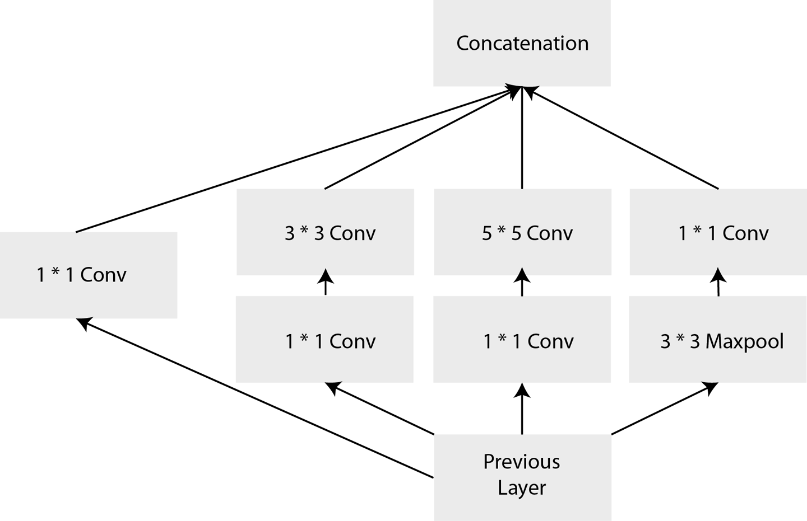 <!-- {"left" : 9.85, "top" : 2.75, "height" : 3.52, "width" : 7.27} -->

* 2014 ImageNet winner from Google, introduced a `Inception` concept

* AlexNet had a fixed size kernel;  Inception had various sized kernels
  - So a large kernel can identify a car
  - A smaller kernel can further identify logos ..etc

* The Inception network runs a series of convolutions of different sizes all on the same input, and concatenates all of the filters together to pass on to the next layer

* Number of layers:22,  
Number of parameters: 5 million

Notes:

Image credit : "Programming PyTorch for Deep Learning"

---

## Inception V1

 <!-- {"left" : 1.04, "top" : 3.73, "height" : 4.94, "width" : 15.41} -->

Notes:

---

## VGG (2014)

* From University of Oxford—the Visual Geometry Group (VGG)

* Won 2nd place on 2014 ImageNet competition

* It introduced deeper layers (19 layers)

* One downside of VGG is final fully connected layers make the network balloon to a large size, weighing in at 138 million parameters in comparison with GoogLeNet’s 7 million

* Despite it's large size, still popular transfer learning architecture

* Number of layers: 19  
Number of parameters: 138 million

---

## VGGNet

 <!-- {"left" : 3.08, "top" : 4.95, "height" : 6.7, "width" : 11.34} -->

 <!-- {"left" : 1.18, "top" : 2.33, "height" : 1.89, "width" : 15.14} -->

Notes:

---

## ResNet (2015)

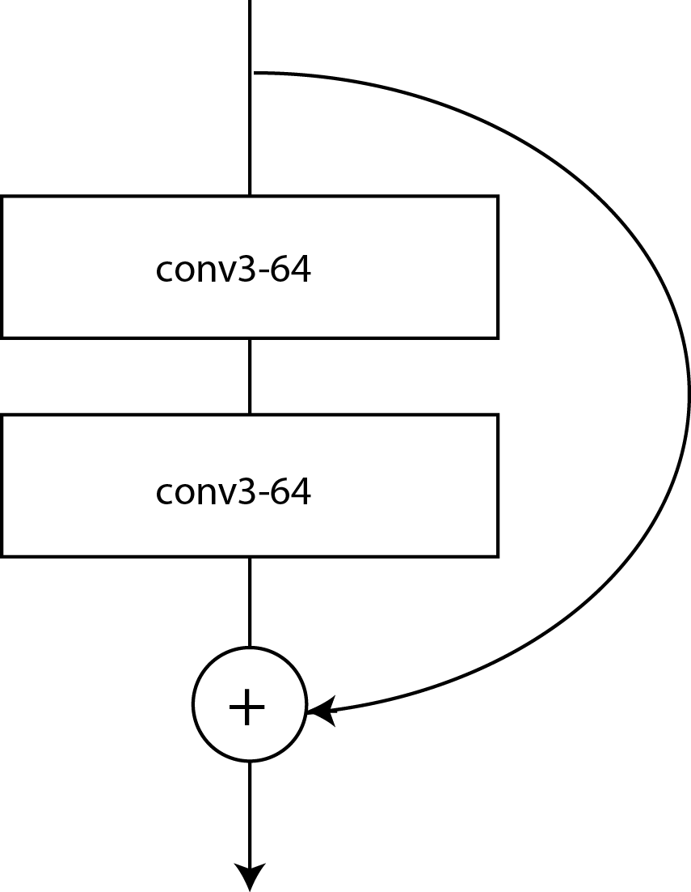 <!-- {"left" : 14.72, "top" : 1.63, "height" : 3.2, "width" : 2.49} -->

* ResNet-152 model from Microsoft is the 2015 ImageNet winner  with top-5 score of 4.49%
* ResNet uses Residual Neural Networks (RNNs); Not feed forward; Both Residual and Convolutional
* ResNet improved on the Inception-style (stacking bundle of layers approach), wherein each bundle performed the usual CNN operations but also added the incoming input to the output of the block
* Number of layers: 150  
Number of parameters: 26 million

 <!-- {"left" : 2.94, "top" : 8.4, "height" : 3.72, "width" : 11.62} -->

Notes:

Image credit : "Programming PyTorch for Deep Learning"

---

## CNN Architectures Comparison

* Inception wins on performance, accuracy, and size of network (number of params)
* ResNet is a close second with some valid use cases.
* Inception and ResNet are often ensembled (combined together).

 <!-- {"left" : 2.85, "top" : 5.79, "height" : 4.81, "width" : 11.79} -->

---

# Image Datasets

[./Datasets-Images.md](./Datasets-Images.md)
