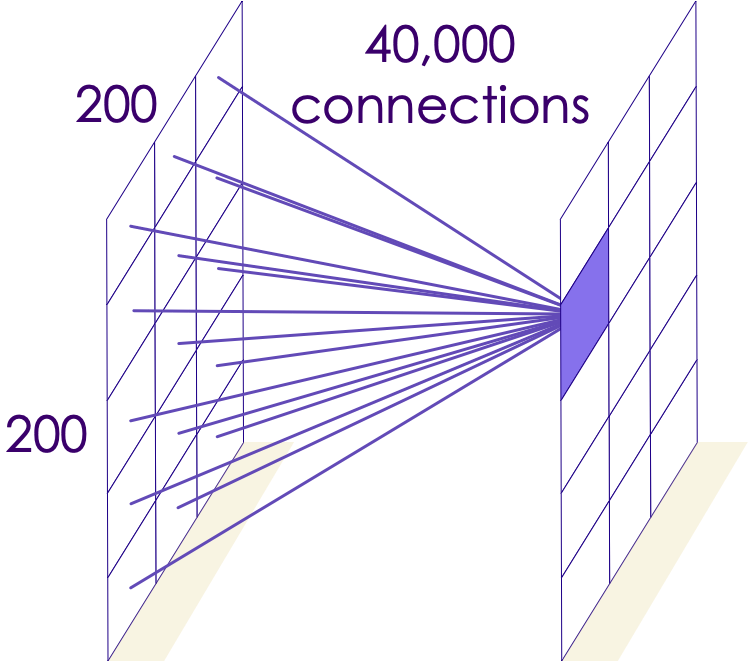
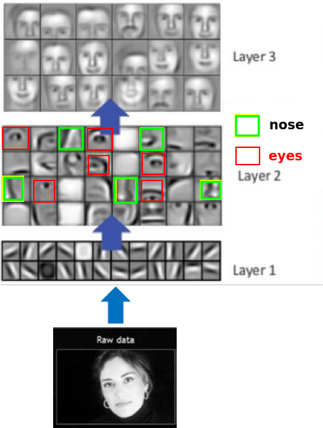
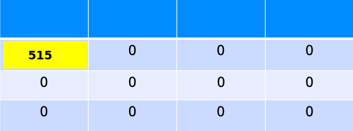
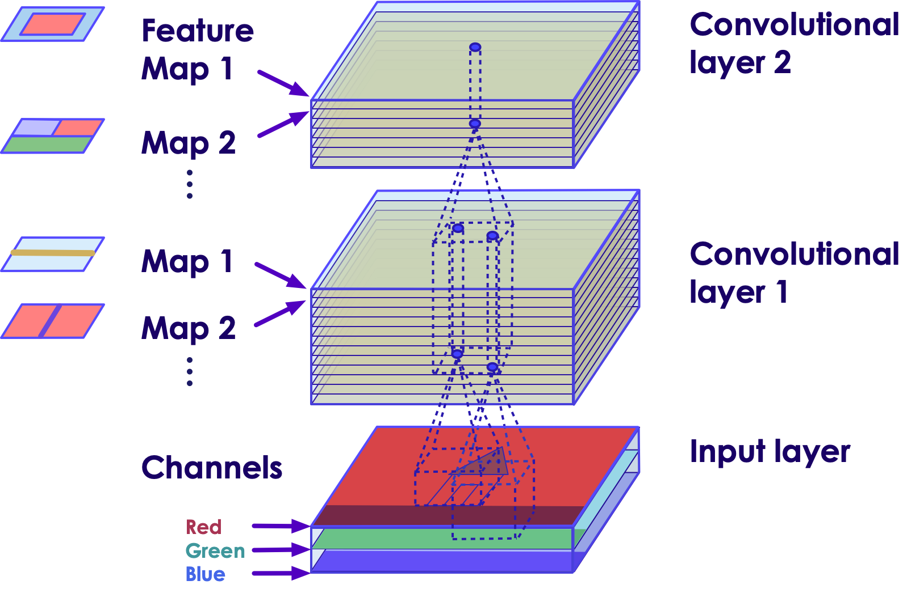

# Convolutional Neural Networks (CNN)

---

# Image Recognition

---

## Image Recognition is a Challenging Problem

 <!-- {"left" : 5.67, "top" : 1.72, "height" : 3.26, "width" : 4.2} -->

 * [IBM's Deep Blue supercomputer](https://en.wikipedia.org/wiki/Deep_Blue_(chess_computer)) beat the chess world champion Garry Kasparov back in 1996

 * But not until recently (2010) or so, computers were unable to recognize a cat or a dog from an image

 * Human brains can do image recognition quite 'effortlessly'

 * How ever for computers this is hard
    - Large number of features
    - Features can vary considerably
    - Large Images especially difficult

Notes:
- https://en.wikipedia.org/wiki/Deep_Blue_(chess_computer)
- https://www.ibm.com/ibm/history/ibm100/us/en/icons/deepblue/

---

# Dealing With Images

---
## Representing Images

- Images can be represented as a 2D array

- Here is a 5x5 (5 pixels wide, 5 pixels high) image

- for black and white images:
    - black = 0
    - white = 1

<!-- {"left" : 1.63, "top" : 4.18, "height" : 3.21, "width" : 6.99} -->

---

## Greyscale Images

- Pixels are represented as numbers ranging from 0 - 255
    - 0: black
    - 255: white
    - in between: grey

<!-- {"left" : 0.9, "top" : 3.56, "height" : 4.3, "width" : 8.44} -->

---

## Color Images

- In color images, each pixel has colors
    - These are represented as RGB (Red, Green, Blue) colors

- Each RGB values are represented as numbers ranging 0-255

<!-- {"left" : 0.75, "top" : 4.24, "height" : 2.39, "width" : 8.75} -->

---

## Color Images

- Each pixel has 3 'channels' (RGB)

- Color images can be represented as 3D array

<!-- {"left" : 1.55, "top" : 3.06, "height" : 4.9, "width" : 7.16} -->

---

## Channels in Images

- Images could contain more channels than usual RGB
    - For example, satellite images might have infrared spectrum

- Here is an example of Hubble image taken using multiple cameras in multiple wave lengths, combined together

<!-- {"left" : 2.25, "top" : 3.62, "height" : 4.32, "width" : 5.76} -->

Notes:  
source : https://photographingspace.com/ap-color/

---

# Image Analysis Using Neural Networks

---
## Fully Connected Network's Limitations

<!-- {"left" : 6.26, "top" : 1.06, "height" : 3.65, "width" : 3.81} -->

- Assume we are analyzing a 200px by 200px image
    - Image has 40,000 (200x200) pixels

- If we connect each neuron on second layer to a neuron in the first layer, each neuron will have 40,000 connections

---

## Fully Connected Network's Limitations

<!-- {"left" : 1.88, "top" : 5.12, "height" : 2.59, "width" : 2.93} --> &nbsp; &nbsp; <!-- {"left" : 5.44, "top" : 5.12, "height" : 2.59, "width" : 2.93} -->

- The second layer will have  
    - 40,000 connections per pixels x (200 px x 200 px) = 1.6 billion connections
    - 10 layers ==>  16 billion connections
- That is way too many connections

---
## Fully Connected Network's Limitations

* Each layer has 1.6 billion  connections; and that many weights to learn
* How ever, a 200px x 200px image is very small!
* 4K picture is ~ 4000 x 2000 pixels (see picture below, credit [wikimedia](https://commons.wikimedia.org/wiki/File:8K,_4K,_2K,_UHD,_HD,_SD.png))
* Can you compute how many weights we will need to compute for a 4K image?
* **Quiz**: Take a picture with your phone.  What is the size? (probably 3000 x 2000 pixels)
* __So we need a another approach__

<!-- {"left" : 2.65, "top" : 5.72, "height" : 2.82, "width" : 4.94} -->

---

## Famous 'Cat Experiment'

<!-- {"left" : 7.54, "top" : 1.08, "height" : 1.66, "width" : 2.5} -->

* David H. Hubel and Torsten Wiesel performed experiments on cats (1958/1959) that gave us crucial understanding of brain's visual cortex.  ([paper](https://physoc.onlinelibrary.wiley.com/doi/pdf/10.1113/jphysiol.1959.sp006308))

* They hooked up electrodes to a cat's brain (cat is sedated of course!)

* Showed different shapes (dots / lines ..etc) and looked for 'neurons firing'

* But they couldn't get neurons to fire!

* Until they accidentally dragged the shape  across the screen,  then neurons fired!

* Authors won the Nobel Prize in Physiology or Medicine in 1981 for their work!

Notes:  
- https://www.princeton.edu/~cggross/Hubel.pdf
- https://www.ncbi.nlm.nih.gov/pmc/articles/PMC2718241/

---

## Our Visual Cortex is Hierarchical

<!-- {"left" : 6.2, "top" : 1.28, "height" : 1.26, "width" : 3.81} -->

* First level neurons detect simple shapes

* Next level neurons detect more complex shapes, and so on

 

<!-- {"left" : 2.5, "top" : 4, "height" : 2.71, "width" : 5.25} -->

[Link to video](https://www.youtube.com/watch?v=IOHayh06LJ4)

---

## Hierarchical Visual Cortex

- Our brain's visual system works hierarchically to perceive images

- Some neurons only recognize horizontal lines, some only slanted lines

- Higher level neurons can 'build on' the work done by other neurons

- In the image below, left to right, visual cortex is perceiving 'higher features'
    - Lower level neurons, visualize simple features like lines and shapes
    - Higher level neurons recognize complex shapes

<!-- {"left" : 1.02, "top" : 6.25, "height" : 1.96, "width" : 8.21} -->

---

# Filters

---

## Pre-Processing Images

  <!-- {"left" : 5.99, "top" : 1.25, "height" : 2.63, "width" : 3.96} -->

  * Image processing is a standard task for machine learning

  * Before we load the images, we can use Photoshop, OpenCV to "clean up" the image
    - remove noise
    - find edges
    - etc

  * Even now, this is a common task to help get better results.

  * This is  *feature engineering*  
  (Example image, with background blurred)

---
## Image Filter Examples

- Some sample filters
    - Blur filter
    - Sharpen filter
    - Edge detection filter

<!-- {"left" : 2.28, "top" : 3.55, "height" : 3.84, "width" : 5.69} -->

---

## Problems with Image Pre-Processing

  * How do we *know* that one filter will help us
    - Takes a lot of experience!
    - In some cases it might **hurt** rather than help.

  * Lots of trial and error!

  * What if...
    - Maybe there was a way we could find a filter that gives us better results for sure.
    - Could we automate finding the perfect filter?
    - Maybe if we used more than one filter?

---

# Convolutions

---

## A Little History: Yann LeCun

  * Yann LeCun was working on the problem of recognizing digits: MNIST
    - Recognize zip codes in letters for US Postal Service
    - Recognize digits in bank checks

  * Classical MLP networks were unable to get very high accuracy on the problem.
    - 96,97% was the best such networks could do.
    - LeCun proposed a new architecture that could be over 99% better.
    - The difference between 96% and 99+% is a big deal!

<!-- {"left" : 0.38, "top" : 6.26, "height" : 1.13, "width" : 9.49} -->

---

## A Little History: Yann LeCun

  * LeCun's new architecture is called LeNet ([1998 paper](http://yann.lecun.com/exdb/publis/pdf/lecun-01a.pdf))
    - Named after himself!
    - LeNet became the basis of a transfer learning architecture (we will discuss later)

  * Lecun's architecture had 2 new elements
    - Convolutional layer
    - Pooling layer

Notes:  

---

## Convolution

* Imagine a small patch being slid across the input image. This sliding is called  **convolving** .

* It is similar to a flashlight moving from the top left end progressively scanning the entire image. This patch is called the  **filter/kernel**. The area under the filter is the receptive field.

<!-- {"left" : 0.93, "top" : 4.05, "height" : 3.32, "width" : 3.32} -->   &nbsp; &nbsp;  <!-- {"left" : 5.73, "top" : 4.05, "height" : 3.32, "width" : 3.59} -->

---

## Convolution Example: Edge Detection

* Here we are applying an edge filter to an image

* The resulting image has edges 'highlighted'

<!-- TODO shiva -->
<!-- {"left" : 1.02, "top" : 4.45, "height" : 3.81, "width" : 8.21} -->
<!-- {"left" : 1.02, "top" : 4.45, "height" : 3.81, "width" : 8.21} -->
<!-- {"left" : 1.02, "top" : 4.45, "height" : 3.81, "width" : 8.21} -->

---
## Convolution Example: Vertical Edges Detection

* The resulting image has vertical edges highlighted

<!-- TODO shiva -->
<!-- {"left" : 1.02, "top" : 4.45, "height" : 3.81, "width" : 8.21} -->
<!-- {"left" : 1.02, "top" : 4.45, "height" : 3.81, "width" : 8.21} -->
<!-- {"left" : 1.02, "top" : 4.45, "height" : 3.81, "width" : 8.21} -->

---

## Convolution Example: Horizontal Edges Detection

* The resulting image has horizontal edges highlighted

<!-- TODO shiva -->
<!-- {"left" : 1.02, "top" : 4.45, "height" : 3.81, "width" : 8.21} -->
<!-- {"left" : 1.02, "top" : 4.45, "height" : 3.81, "width" : 8.21} -->
<!-- {"left" : 1.02, "top" : 4.45, "height" : 3.81, "width" : 8.21} -->

---

## Convolution Example: Edges
<!-- TODO shiva -->
<!-- {"left" : 1.02, "top" : 4.45, "height" : 3.81, "width" : 8.21} -->
<!-- {"left" : 1.02, "top" : 4.45, "height" : 3.81, "width" : 8.21} -->
<!-- {"left" : 1.02, "top" : 4.45, "height" : 3.81, "width" : 8.21} -->

<!-- {"left" : 1.02, "top" : 4.45, "height" : 3.81, "width" : 8.21} -->
<!-- {"left" : 1.02, "top" : 4.45, "height" : 3.81, "width" : 8.21} -->
<!-- {"left" : 1.02, "top" : 4.45, "height" : 3.81, "width" : 8.21} -->

<!-- {"left" : 1.02, "top" : 4.45, "height" : 3.81, "width" : 8.21} -->
<!-- {"left" : 1.02, "top" : 4.45, "height" : 3.81, "width" : 8.21} -->
<!-- {"left" : 1.02, "top" : 4.45, "height" : 3.81, "width" : 8.21} -->

---

## Learning Features

* Here we are analyzing a picture of elephant

* Assume each neuron is 'trained' recognize a certain feature (like ears / trunks / tail ..etc)

* As we scan through the image, the neurons will **'recognize the features'**

* And putting their findings together, we can conclude that we are seeing an elephant

<!-- {"left" : 1.02, "top" : 4.45, "height" : 3.81, "width" : 8.21} -->

---

## Learning Features

 <!-- {"left" : 6.23, "top" : 1.1, "height" : 5.04, "width" : 3.81} -->

- Each layer builds on previous layer's work

- First layer detects simple shapes - horizontal lines, slanted lines ..etc

- Second layer recognizes more complex features: eyes / nose ..etc

- Third layer recognizes faces

---

## Convolutional Layer

<!-- {"left" : 7.64, "top" : 1, "height" : 2.42, "width" : 2.34} -->

- Here we represent our neurons in a 2D grid format (instead of linear before), this makes visualizing connections easier

- Neurons in the convolutional layer are NOT connected to every single neuron in the layer before

- Instead each neuron is connected to a few pixels/neurons in their **receptive field**
    * The idea is to detect local features in a smaller section of the input space, section by section to eventually cover the entire image.

- This allows the first convolutional layer to concentrate on low level features

- Next layers assemble inputs from previous layers into higher level features

---

## Convolutional Process

* Here we see that in second layer, the neurons only read from a few neurons from previous layer

* They read from their 'field of view'

 <!-- {"left" : 0.48, "top" : 3.6, "height" : 1.85, "width" : 1.91} --> &nbsp; &nbsp;  <!-- {"left" : 2.98, "top" : 3.6, "height" : 1.85, "width" : 1.8} --> &nbsp; &nbsp;  <!-- {"left" : 5.49, "top" : 3.6, "height" : 1.85, "width" : 1.79} --> &nbsp; &nbsp; <!-- {"left" : 7.98, "top" : 3.6, "height" : 1.85, "width" : 1.79} -->

---
## Fully Connected vs. Convolutional

<!-- {"left" : 3.53, "top" : 1.61, "height" : 3.15, "width" : 3.18} -->

 <!-- {"left" : 0.48, "top" : 5.45, "height" : 1.85, "width" : 1.91} --> &nbsp; &nbsp;  <!-- {"left" : 2.98, "top" : 5.45, "height" : 1.85, "width" : 1.8} --> &nbsp; &nbsp;  <!-- {"left" : 5.49, "top" : 5.45, "height" : 1.85, "width" : 1.79} --> &nbsp; &nbsp; <!-- {"left" : 7.98, "top" : 5.45, "height" : 1.85, "width" : 1.79} -->

Notes:

---

## Fully Connected vs. Convolutional

<!-- {"left" : 7.9, "top" : 1.16, "height" : 2.38, "width" : 2.31} -->

<!-- {"left" : 7.9, "top" : 3.8, "height" : 2.38, "width" : 2.31} -->

* Fully connected layers connect to every neuron from previous layer
    - This results in too many connections

* But in convolutional layers, the number of connections is greatly reduced
    - Makes computationally feasible

---

## Convolutional Layer: Local Receptive Field

- Here each neuron connects to neurons in its input / perceptive field

<!-- {"left" : 1.48, "top" : 2.86, "height" : 3.92, "width" : 7.29} -->

---

## How is Convolution Performed?

* The following slides illustrate the math behind convolutions

* Provided as a reference

* Feel free to skip / go-over depending on the time constraint

---

## Process of Convolution

* On the left we have the image matrix  (6x6)

* On the right we have filter/kernel matrix (3x3).  Also known as weight matrix (Wk)

* The weight matrix is a filter to extract some particular features from the original image. It could be for  extracting curves, identifying a specific color, or recognizing a particular voice.

<!-- {"left" : 0.48, "top" : 5.01, "height" : 2.41, "width" : 4.47} -->
<!-- {"left" : 5.3, "top" : 5.04, "height" : 2.41, "width" : 4.47} -->

---
## Process of Convolution (Contd.)

* We use matrix multiplication to multiply input matrix vs. weight matrix  
__`I .  W`__
* When the weighted matrix starts from the top left corner of the input layer, the output value is calculated as:  
__`(81x0+2x1+209x1)+(24x1+56x0+108X0)+(91x1+0x0+189x1) = 515`__

<!-- {"left" : 1.25, "top" : 3.95, "height" : 2.45, "width" : 4.55} -->
<!-- {"left" : 6.05, "top" : 4.82, "height" : 1.59, "width" : 2.96} -->

<!-- {"left" : 3.22, "top" : 6.77, "height" : 2.04, "width" : 3.8} --> &nbsp;  &nbsp;
<!-- {"left" : 3.22, "top" : 6.77, "height" : 2.04, "width" : 3.8} -->

---

## Process of Convolution (Contd.)

 * The filter then moves by 1 pixel to the next receptive field and the process is repeated. The output layer obtained after the filter slides over the entire image would be a 4X4 matrix.

 * This output is called an  **activation map/ feature map**

<!-- {"left" : 1.41, "top" : 3.87, "height" : 2.39, "width" : 4.44} -->
<!-- {"left" : 6.03, "top" : 4.75, "height" : 1.51, "width" : 2.81} -->

<!-- {"left" : 3.54, "top" : 6.61, "height" : 2.12, "width" : 3.94} -->

---

## Stride

* The distance between two consecutive receptive fields is called the  **stride** .

* In this example stride is 1 since the receptive field was moved by 1 pixel at a time.

<!-- {"left" : 1.88, "top" : 3.54, "height" : 3.95, "width" : 6.49} -->

Notes:

---
## Zero Padding

- It is common to add zeros around the image (black pixels)

- Called 'zero padding'

- This ensures 'corner pixels' are processed properly

 <!-- {"left" : 1.91, "top" : 2.88, "height" : 4.79, "width" : 6.43} -->

---

## Zero Padding

 * Assumptions
   - Output image is `32 x 32 x 3`
   - Filter size is `5 x 5 x 3`
 * To achieve the **same** size:
   - You need padding of ` (K - 1) / 2`
   - In this case `(5 - 1) / 2 = 2`
 * We pad a "frame" around the image
   - black pixels
   - size 2
   - Image is then `36 x 36 x 3`
 * Output Size:
   - `O = ((W - K - 2P) / S) + 1`

Notes:

---
## Convolution Parameters

  * Three Hyperparameters control the convolution:

    - **Depth:** The number of filters, and the number of neurons per convolution

    - **Stride:** Usually 1 or 2: the number of pixels we "jump" when applying the filter.

    - **Zero Padding:** Creates a "frame" of zero (black) pixels around the border of image.

  * Stride > 1 will reduce dimensions

    - Allows us to both do convolution and reduce dimensions in one step

    - Usually, we use pooling layers for reducing dimensions.

---

## Convolutions: Further Reading

* [Tutorial on convolutions](https://www.youtube.com/watch?v=XuD4C8vJzEQ&list=PLkDaE6sCZn6Gl29AoE31iwdVwSG-KnDzF&index=2) by Andrew Ng

* [Tutorial on padding](https://www.youtube.com/watch?v=smHa2442Ah4&list=PLkDaE6sCZn6Gl29AoE31iwdVwSG-KnDzF&index=4) by Andrew Ng

* [Tutorial on strides](https://www.youtube.com/watch?v=tQYZaDn_kSg&list=PLkDaE6sCZn6Gl29AoE31iwdVwSG-KnDzF&index=5) by Andrew Ng

---

## Filters  / Kernels

- CNNs use filters to detect patterns in images

- Imagine the filter like a flashlight shining on the image

- As 'the flashlight'  'moves' along the image, it 'convolves' the image
    - Output from a filter is called **feature map**

- CNN learns filters during training phase

<!-- {"left" : 2.95, "top" : 4.04, "height" : 4.02, "width" : 4.35} -->

Notes:  
- https://www.saama.com/blog/different-kinds-convolutional-filters/

---
## Filters in Computer Vision

* We just saw a single filter can extract a certain **pattern or feature**

* Convolutional neural networks (CNN) do not learn just a single filter. In fact, they learn multiple features in parallel for a given input

* Typically in practice CNNs learn from 32 to 512 filters

* This gives the model 32, or even 512, different ways of extracting features from an input

* In other words CNNs "learn to see" features from given input

---

## Stacking Feature Maps

* So far, we have seen Convolutional layer as a thin 2D layer
* In fact, **Convolutional layer is composed of  series of feature maps**
* These feature maps are 'stacked' forming a 3D structure
* Each filter creates a new volume slice
* Typically have more than one slice (as images tends to have multiple channels like RGB)
* Here we see
    - 3 channels x 5 filters  = 15 feature maps

---

## Stacking Feature Maps

  <!-- {"left" : 1.02, "top" : 2.14, "height" : 5.36, "width" : 8.21} -->

---

## Stacking Multiple Feature Maps

  <!-- {"left" : 5.76, "top" : 1.18, "height" : 2.78, "width" : 4.24} -->

 * Within a single feature map all neurons share the same parameters (weights and bias term)
    - This simplifies training

 * Different feature maps can have different parameters (weights + biases).

 * The receptive field of previous layer extends across all of its feature maps.

 * In summary, a **convolutional layer applies multiple filters to the input image, making it capable of detecting multiple features in the input**

Notes:

---

## Stacking Multiple Feature Maps (Contd.)

<!-- {"left" : 5.6, "top" : 1.18, "height" : 2.85, "width" : 4.36} -->

 * Images that are greyscale have just one channel. So it needs just 1 sublayer. Colored images have three channels - Red, Green and Blue. So it needs 3 sublayers.

 * Satellite imagery that capture extra light frequencies (e.g. infrared) can have more channels.

Notes:

---

## Stacking Multiple Feature Maps (Contd.)

<!-- {"left" : 5.83, "top" : 1.18, "height" : 2.75, "width" : 4.21} -->

 * The fact that all neurons in a feature map has just one set of parameters dramatically reduces the number of parameters needed.

 * This also means that once a CNN has learned to recognize a pattern in one location, it can recognize it in any other location. This is known as location invariance.
    - For example it can detect an 'eye' any where in the picture

 * In contrast, if a regular DNN has learned to recognize a pattern in one location, it can recognize it only in that location.

Notes:

---

## Convolutional Layer Hyperparameters

 * The hyperparameters of CNN are:

 *  **Padding type**

 *  **Filter height and width**

 *  **Strides**

 *  **Number of filters**

Notes:

---

## Convolutions: Further Reading

* [Tutorial on convolutions on volumes](https://www.youtube.com/watch?v=KTB_OFoAQcc&list=PLkDaE6sCZn6Gl29AoE31iwdVwSG-KnDzF&index=6) by Andrew Ng

---
## Convolutions Summary

 * Images have too many features for a network to learn.

 * Convolutions are a standard way that we do image processing

 * Convolutional Layers help to extract higher-level features

 * Convolution is the process of adding each element of the image to its local neighbors, weighted by the kernel

    - It means we take a nxn *filter* and apply that to the image

 * Different filters do different things:
    - Edge Detection filters
    - Sharpening Filters
    - Gaussian blur

Notes:
https://en.wikipedia.org/wiki/Kernel_(image_processing)

---

# Pooling
---

## Pooling Layer

- Pooling layer is used to subsample (i.e., shrink) the input image, while **keeping important features intact**

- Reduces the computational load, reduce memory usage, and reduce the number of parameters (limits overfitting)

- Here we are shrinking the picture, while still keeping the prominent feature (lighthouse)

<!-- {"left" : 0.68, "top" : 4.52, "height" : 2.3, "width" : 3.45} --> &nbsp; &nbsp; <!-- {"left" : 4.95, "top" : 4.94, "height" : 1.67, "width" : 1.67} --> &nbsp; &nbsp; <!-- {"left" : 7.25, "top" : 5, "height" : 1.54, "width" : 2.32} -->

---

## Pooling Types

- Pooling types
    - MAX pooling
    - Average pooling
    - L2-Norm pooling
    - Stochastic pooling

---

## Max Pooling

* MAX pooling is most common.

* Notice in this case we take the max of each receptive field

* 2x2 window with stride 2

* Here input is shrunk by factor of 4 --> 1  
so the resulting image is 25% of original image

 <!-- {"left" : 1.63, "top" : 4.49, "height" : 3.39, "width" : 7} -->

Notes:

---

## Max Pooling Example

* With 2x2 window, stride=2,  and max pooling, the image is reduced to 25% of original size

<!-- {"left" : 0.68, "top" : 3.67, "height" : 2.3, "width" : 3.45} --> &nbsp; &nbsp; <!-- {"left" : 4.95, "top" : 4.09, "height" : 1.67, "width" : 1.67} --> &nbsp; &nbsp; <!-- {"left" : 7.25, "top" : 4.15, "height" : 1.54, "width" : 2.32} -->

---

## Pooling Hyperparameters

- Filter / Spatial Extent F: (for example, F = 2 is 2x2 filter)

- Stride S, how many pixels we "move" (Commonly 2)

- We do not use Zero Padding (black pixel padding) with pooling layers.

- Common Parameters:
    - F = 3, S = 2: 3x3 filters, stride 2 : Overlapping pooling
    - F = 2, S = 2: 2x2 filters, stride 2: No overlaps

 <!-- {"left" : 2.1, "top" : 4.88, "height" : 2.59, "width" : 2.8} --> &nbsp; &nbsp; <!-- {"left" : 5.19, "top" : 4.88, "height" : 2.59, "width" : 2.8} -->

---

## Do We Need Pooling?

 <!-- {"left" : 7.65, "top" : 1.02, "height" : 2.28, "width" : 2.46} -->

<!-- {"left" : 7.65, "top" : 3.4, "height" : 2.28, "width" : 2.46} -->

 * We need to reduce dimensionality somehow!

 * Possible to use CONV Layer with Stride=2 instead of a pool.

 * We can provide the stride to the convolutional layers to reduce features

 * Pooling layers have *traditionally* seemed to help make a network more efficient.
   - particularly with max pooling

 * Recent trends have led to all convolutional networks
   - Use a convolution layer with stride greater than 1

---

## Pooling: Further Reading

* [Tutorial on pooling](https://www.youtube.com/watch?v=8oOgPUO-TBY&list=PLkDaE6sCZn6Gl29AoE31iwdVwSG-KnDzF&index=9) by Andrew Ng

---

## Lab: Explore Convolutions and Pooling

<!-- {"left" : 6.76, "top" : 0.88, "height" : 4.37, "width" : 3.28} -->

* **Overview:**
    - Understand convolutions and pooling

* **Approximate run time:**
    - 15-20 mins

* **Instructions:**
    - Instructor: Please demo **convolutions** lab

Notes:

---

# Convolutional Neural Networks (CNNs)

---

## Introduction to Convolutional Neural Networks (ConvNets)

* CNNs are a sequence of layers:
   - Input layer
   - Convolutional Layer
   - ReLU (Rectified Linear Unit) Activation
   - Pooling Layer
   - Fully Connected Layer(s)

  * Many times we have more than one sequence of layers

 <!-- {"left" : 0.66, "top" : 5.47, "height" : 1.11, "width" : 8.93} -->

Notes:

---

## Pooling Layer

- Apply some function (commonly MAX) to each nxn  
- Reduce features!
- Notice the reduced features.
- We can also reduce features simply by resizing the image.

  <!-- {"left" : 2.84, "top" : 3.65, "height" : 4.07, "width" : 4.57} -->

---

## Fully Connected Layers

 * Fully Connected Layer

     - Finally, have one or more fully connected layers at the end

 * Why Fully Connected?

     - Need to take the convolutional layers and apply to our problem

 * Softmax Layer at the end (for classification problems)
    - Classify digits into 0,1,...9
    - Classify images into cats, dogs, elephants

  <!-- {"left" : 0.69, "top" : 5.12, "height" : 1.11, "width" : 8.88} -->

Notes:

---
## Convolutions Further Reading

* Watch this brilliant [tutorial series](https://www.youtube.com/watch?v=ArPaAX_PhIs&list=PLkDaE6sCZn6Gl29AoE31iwdVwSG-KnDzF&index=2&t=0s) on convolutions by Andrew Ng

---

## Example Convolutional Network

- Here we have repeating layers of convolutional and pooling layers

- And a final Softmax layer is giving the probabilities of the image class

<!-- {"left" : 1.02, "top" : 3.62, "height" : 3.94, "width" : 8.21} -->

Notes:

---

## CNN Training Workflow

- Make predictions on training data images (forward pass).

- Determine which predictions were incorrect and propagate back the difference between the prediction and the true value (backpropagation).

- Rinse and repeat till the predictions become sufficiently accurate.

- It's quite likely that the initial iteration would have close to 0% accuracy. Repeating the process several times, however, can yield a highly accurate model (> 90%).

 * **Animation** : [link-youtube](https://youtu.be/krTFCDCbkZg), [link-S3](https://elephantscale-public.s3.amazonaws.com/media/machine-learning/backpropagation-5.mp4)

<!-- {"left" : 1.5, "top" : 4.53, "height" : 3.62, "width" : 7.24} -->

---

## CNN Training Batches

- The batch size defines how many images are seen by the CNN at a time

- Each batch should have a good variety of images from different classes in order to prevent large fluctuations in the accuracy metric between iterations.
    - A sufficiently large batch size would be necessary for that.

- However, don't let the batch size too large
    - It could consume too much memory
    - The training process would be slower.

- Usually, batch sizes are set as powers of 2.  
64 is a good number to start, then tweak it from there.

---
## CNN Batch Size and Memory

* Image input is: 150 x 100 RGB image (three channels)
* Convolutional layer with 5 x 5 filters, outputting 200 feature maps of size 150 x 100
* Then the number of parameters is (5 x 5 x 3 + 1) x 200 = 15,200 (the +1 corresponds to the bias terms), which is fairly small compared to a fully connected layer
* Each of the 200 feature maps contains 150 x 100 neurons, and each of these neurons needs to compute a weighted sum of its 5 x 5 x 3 = 75  inputs: that's a total of 225 million float computations
* If the feature maps are represented using 32-bit floats, then the convolutional layer's output will occupy 200 x 150 x 100 x 32 = 96 million bits
* About **11.4 MB of RAM per image**
* If a training batch contains **100 images**, then this layer will use up over **1 GB of RAM!**
- Reference: [Neural Networks and Deep Learning, Chapter 3](https://learning.oreilly.com/library/view/neural-networks-and/9781492037354/ch03.html%0A)

---

## Data Augmentation

- State of the art image classifiers are trained with millions of images

- What if we only have a small sample (say a few hundred) ?

- NNs could 'memorize' the small dataset.
    - great accuracy on training set
    - but bad accuracy on test set (or new/unseen images)
    - this is classic 'overfitting'

- If available images are limited, then we can use a technique called 'augmentation' to create more data samples

- Only augment training set
    - Do not augment validation/test set because the resulting accuracy metric would be inconsistent and hard to compare across other iterations.

Notes:  
From : https://learning.oreilly.com/library/view/practical-deep-learning/9781492034858/ch02.html

---

## Data Augmentation

- Augmentation techniques
    - Rotation (rotate image 10-20' clockwise or counter-clockwise)
    - Shift images to left/right of center
    - Zoom in/out
    - combine the above

- Augmentation tools
    - Keras ImageDataGenerator
    - [imaging library](https://github.com/aleju/imgaug)

Notes:  

---

## Image Augmentation Example

- Use techniques like: rotate slightly to left and right,  flip the image ...etc.

 <!-- {"left" : 0.95, "top" : 3.12, "height" : 3.41, "width" : 8.36} -->

---

# Image Datasets

[./Datasets-Images.md](./Datasets-Images.md)
