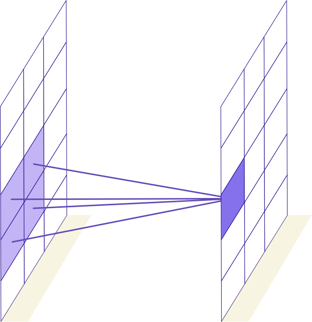

Convolutional Neural Networks-CNN
======

# Limitations of ANN 

## Image Recognition

 * Image Classification a **challenging** problem 
 * Large number of features
 * Features can vary considerably.
 * Large Images especially difficult.

 <!-- {"left" : 2.61, "top" : 3.07, "height" : 3.9, "width" : 5.03} -->

Notes: 

   
---

## Feedforward Network Limitations

 * Let’s imagine that we want to find a pattern in an image.

 * For example, say we want to locate a number in an image.

 * How would we do that in a NN?

     - We could take each pixel as a feature,

     - Apply those as input.

     - 640 x 480 image = 307,200 features

     - A LOT of features!

 * But let’s think… is this going to work for us? 

     - What are some problems?

 <!-- {"left" : 4.15, "top" : 5.08, "height" : 1.95, "width" : 1.94} -->

Notes: 

---

## Problems with MLP (Multilayer Perceptron) 

 * An image is 2-D, while our input is just a vector

     - Limited ways to learn patterns between vectors vertically

     - Feedforward Net COULD represent this

     - But how do we learn patterns?

     - Huge numbers of features 300k+

 * Finding pattern in image?

     - What if the “2” is in a different place?

     - Perhaps the right corner

     - Or the left corner?

 * Feedforward net may not realize

     - We are looking for a pattern WITHIN image

 <!-- {"left" : 7.93, "top" : 2.41, "height" : 2.08, "width" : 1.73} -->

 <!-- {"left" : 7.93, "top" : 4.81, "height" : 2.08, "width" : 1.73} -->

Notes:

---

## Too Many Features

 * Too many features

     - There’s just too many features here to learn.

 <!-- {"left" : 3.3, "top" : 2.47, "height" : 3.67, "width" : 3.64} -->

Notes: 

---

# Convolutions

## Feature Engineering
  * Image processing is a standard task for machine learning
  * Before we load the images, we can use Photoshop, OpenCV to "clean up" the image
    - remove noise
    - find edges
    - etc
  * Even now, this is a common task to help get better results.
  * Example of *feauture engineering*

## Convolutions
  * Convolutions are a standard way that we do image processing
  * Convolution is the process of adding each element of the image to its local neighbors, weighted by the kerne
    - It means we take a nxn *filter* and apply that to the image
  * Different filters do different things:
    - Edge Detection filters
    - Sharpening Filters
    - Gaussian blur

Notes:
https://en.wikipedia.org/wiki/Kernel_(image_processing)

## Problems
  * Doctoring images in advance with image processing is a good idea
  * But it's a lot of guesswork!
  * How do we *know* that one filter will help us
    - takes a lot of experience!
    - In some cases it might **hurt** rather than help.
  * Lots of trial and error
  * What if...
    - Maybe there was a way we could find a filter that gives us better results for sure.
    - Could we automate finding the perfect filter?
    - Maybe if we used more than one filter?

## History: Yann LeCun

  * Yann LeCun was working on the problem of recognizing digits: MNIST
  * Classical MLP networks were unable to get very high accuracy on the problem.
    - 96,97% was the best such networks could do.
    - LeCun proposed a new architecture that could be over 99% better.
  * What's the difference?  Well, the technology was used to process check images
    - The difference between 96% and 99+% is a big deal!
  * LeCun proposed a new architecture he called LeNet in 1998
    - Named after himself!
    - LeNet became the basis of a transfer learning architecture (we will discuss later)

## Visual Cortex
  * The Visual Cortex gives us some inspiration
  * Studies were done on the visual cortex of cats
  * Noticed that a vertical line caused a similar pattern of neurons to fire even when held in different parts of field of view
  * Similarly, horizontal line caused a distinctive pattern of neurons to fire.
  * A guess was made that in the visual cortex a connections are **not** fully connected, but rather connected in a small group of neuron
  

## Introduction to Convolutional Neural Networks (ConvNets)

  * CNNs are a sequence of layers:

      - Input layer

      - Convolutional Layer

      - ReLU (Rectified Linear Unit) Activation

      - Pooling Layer

      - Fully Connected Layer(s)

  * Many times we have more than one sequence of layers

 <!-- {"left" : 0.66, "top" : 4.9, "height" : 1.11, "width" : 8.93} -->

Notes: 

---
## 3-D Volumes

   * Convolutions are 3-D!
   * Convolutions are a series of filters
   * Each filter creates a new volume slice
   * Typically have more than one slice

 <!-- {"left" : 0.71, "top" : 3.75, "height" : 2.99, "width" : 8.83} -->

Notes: 

---

## Convolutional Networks

 * Images have too many features for a network to learn.

 * Convolutional Layers help to extract higher-level features

 * Convolutional Layer:

     - Take a rectangular nxn block of pixels (called a filter)

     - Take Dot product of this nxn block of pixels to get a scalar number.

     - Move nxn block of pixels to a new part of image and repeat.

 <!-- {"left" : 0.56, "top" : 4.67, "height" : 1.13, "width" : 9.12} -->

Notes: 

---
## Fully Connected vs Convolutional

  * Fully Connected

 <!-- {"left" : 3.01, "top" : 2, "height" : 4.19, "width" : 4.24} -->

Notes: 

---

## Convolutional

 <!-- {"left" : 3.52, "top" : 1.38, "height" : 2.47, "width" : 2.55} -->

 <!-- {"left" : 3.59, "top" : 4.32, "height" : 2.47, "width" : 2.41} -->

Notes: 

---
## Convolutional

 <!-- {"left" : 3.88, "top" : 1.39, "height" : 2.38, "width" : 2.49} -->

 <!-- {"left" : 3.88, "top" : 4.4, "height" : 2.38, "width" : 2.49} -->

Notes: 

---

## Local Connectivity

  * Only neurons within the nxn square are connected!
  * Reduces need for fully connected neurons.
  * Depth (in this case 5) is the number of filters used.

 <!-- {"left" : 2.27, "top" : 3.41, "height" : 3.41, "width" : 5.41} -->

Notes: 

---

## Spatial Arrangment

  * Three Hyperparameters control the convolution:

    - Depth: The number of filters, and the number of neurons per convolution

    - Stride: Usually 1 or 2: the number of pixels we "jump" when applying the filter.

    - Zero Padding: Creates a "frame" of zero (black) pixels around the border of image.

  * Stride > 1 will reduce dimensions

    - Allows us to both do convolution and reduce dimensions in one step

    - Usually, we use pooling layers for reducing dimensions.

---

## Pooling Layer

  * Pooling Layer

     - Apply some function (commonly MAX) to each nxn  

     - Reduce features!

     - Notice the reduced features.

     - We can also reduce features simply by resizing the image.

 <!-- {"left" : 3.51, "top" : 3.18, "height" : 2.87, "width" : 3.22} -->

 <!-- {"left" : 2.08, "top" : 6.42, "height" : 0.76, "width" : 6.08} -->

---

## Pooling HyperParameters

   * Hyperparameters for pooling

     - Filter / Spatial Extent F: (for example, F = 2 is 2x2 filter)

     - Stride S, how many pixels we "move" (Commonly 2)

     - We do not use Zero Padding (black pixel padding) with pooling layers.

     - Common Parameters:

        - F = 3, S = 2: 3x3 filters, stride 2 : Overlapping pooling
        - F = 2, S = 2: 2x2 filters, stride 2: No overlaps

---
## Pooling Types
  * MAX pooling is most common.

  * Notice in this case we take the Max

 <!-- {"left" : 1.02, "top" : 2.75, "height" : 3.98, "width" : 8.21} -->

Notes: 

---
## Pooling Layers

 * Do we need pooling layers?

   - We need to reduce dimensionality somehow!

 * What if we just increase the stride on the CONV layers?

   - Possible to use CONV Layer with Stride=2 instead of a pool.

---
## Other Pooling Functions

 * Other Pooling functions:

   - Average Pooling: Apply the mean, not commonly used now

   - L2-Norm Pooling: Apply L2 penalty to pooling to reduce overfitting

   - Stochastic Pooling

---

## Do we need pooling?

 * We can provide the stride to the convolutional layers to reduce features
 * So why do we need pooling layers?
 * Pooling layers have *traditionally* seemed to help make a network more efficient.
   - particularly with max pooling
 * Recent trends have led to all convolutional networks
   - Use a convolution layer with stride greater than 1

## Fully Connected Layers
 
 * Fully Connected Layer

     - Finally, have one or more fully connected layers at the end

 * Why Fully Connected?

     - Need to take the convolutional layers and apply to our problem

 * Softmax Layer At end (for classification problems.)

 <!-- {"left" : 0.71, "top" : 4.63, "height" : 1.1, "width" : 8.83} -->

Notes: 

---

## Example Convolutional Network

 <!-- {"left" : 0.69, "top" : 1.86, "height" : 4.25, "width" : 8.86} -->

Notes: 

---
## MNIST Example

 * MNIST Dataset is the “hello world” of deep learning
 
 * 28x28 greyscale scanned digits

 * How to classify them?

Notes: 

---

