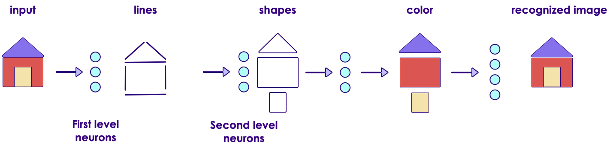
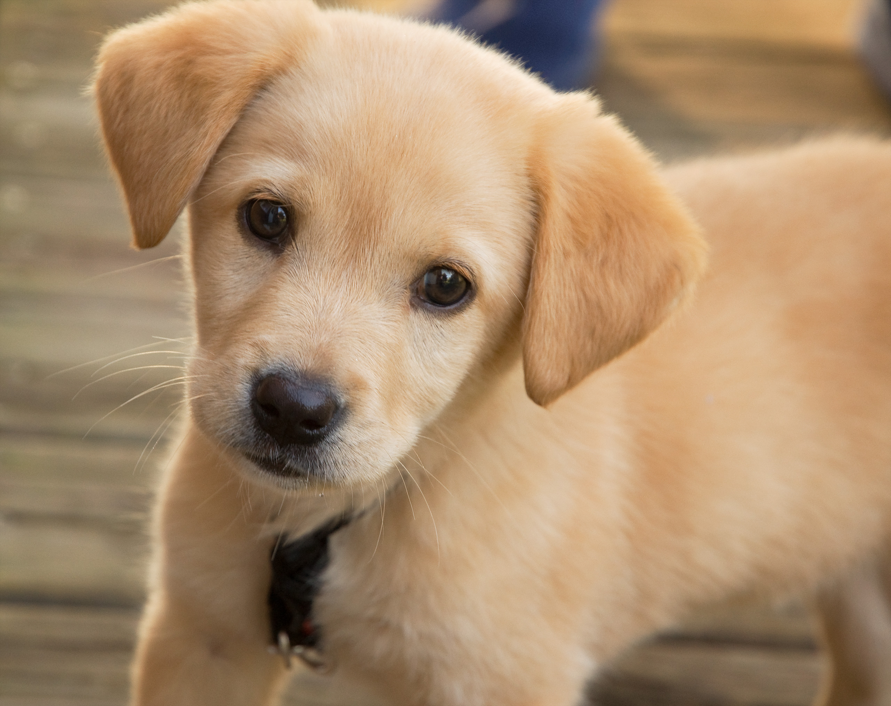

# Convolutional Neural Networks (CNN)

---

# Image Recognition

---

## Image Recognition is a Challenging Problem

 <!-- {"left" : 2.61, "top" : 3.07, "height" : 3.9, "width" : 5.03} -->


 * [IBM’s Deep Blue supercomputer](https://en.wikipedia.org/wiki/Deep_Blue_(chess_computer) beat the chess world champion Garry Kasparov back in 1996
 
 * But not until recently (2010) or so, computers were unable to recognize a cat or a dog from an image
 
 * Human brains can do image recognition quite 'effortlessly'
 
 * How ever for computers this is hard
    - Large number of features
    - Features can vary considerably
    - Large Images especially difficult

Notes: 
- https://en.wikipedia.org/wiki/Deep_Blue_(chess_computer)
- https://www.ibm.com/ibm/history/ibm100/us/en/icons/deepblue/
   
---

# Dealing With Images

---
## Representing Images 

- Images can be represented as a 2D array

- Here is a 5x5 (5 pixels wide, 5 pixels high) image

- for black and white images:
    - black = 0
    - white = 1


---

## Greyscale Images

- Pixels are represented as numbers ranging from 0 - 255
    - 0 : black
    - 255 : white
    - in between : grey


---

## Color Images

- In color images, each pixel has colors
    - These are represented as RGB (Red, Green, Blue) colors
    
- Each RGB values are represented as numbers ranging 0-255


---

## Color Images

- Each pixel has 3 'channels' (RGB)

- Color images can be represented as 3D array


---

## Channels in Images

- Images could contain more channels than usual RGB
    - For example, satellite images might have infrared spectrum
    
- Here is an example of Hubble image taken using multiple cameras in multiple wave lengths, combined together


Notes:  
source : https://photographingspace.com/ap-color/

---

# Image Analysis Using Neural Networks

---
## Fully Connected Network's Limitations

- Assume we are analyzing a 200px by 200px image 
    - Image has 40,000 (200x200) pixels

- If we connect each neuron on second layer to a neuron in the first layer, each neuron will have 40,000 connections


---

## Fully Connected Network's Limitations


- The second layer will have  
    - 40,000 connections per pixels x (200 px x 200 px) = 1.6 billion connections
    - 10 layers ==>  16 billion connections

- That is way too many connections


---

## Famous 'Cat Experiment'

* David H. Hubel and Torsten Wiesel performed experiments on cats (1958/1959) that gave us crucial understanding of brain's visual cortex.  ([paper](https://physoc.onlinelibrary.wiley.com/doi/pdf/10.1113/jphysiol.1959.sp006308))

* They hooked up electrodes to a cat's brain (cat is sedated of course!)

* Showed different shapes (dots / lines ..etc) and looked for 'neurons firing'

* But they couldn't get neurons to fire!

* Until they accidentally dragged the shape  across the screen,  then neurons fired!
 
* Authors won the Nobel Prize in Physiology or Medicine in 1981 for their work!

  &nbsp;


Notes:  
- https://www.princeton.edu/~cggross/Hubel.pdf
- https://www.ncbi.nlm.nih.gov/pmc/articles/PMC2718241/

---

## Visual Cortex is Hierarchical

* First level neurons detect simple shapes

* Next level neurons detect more complex shapes, and so on


    


[Link to video](https://www.youtube.com/watch?v=IOHayh06LJ4)

---

## Hierarchical Visual Cortex

- Our brain's visual system works hierarchically to perceive images 

- Some neurons only recognize horizontal lines, some only slanted lines

- Higher level neurons can 'build on' the work done by other neurons




---

# Convolutions

---
## A Little History: Yann LeCun

  * Yann LeCun was working on the problem of recognizing digits: MNIST
    - Recognize zip codes in letters for US Postal Service
    - Recognize digits in bank checks
  
  * Classical MLP networks were unable to get very high accuracy on the problem.
    - 96,97% was the best such networks could do.
    - LeCun proposed a new architecture that could be over 99% better.
    - The difference between 96% and 99+% is a big deal!
    
  * LeCun's new architecture is called LeNet ([1998 paper](http://yann.lecun.com/exdb/publis/pdf/lecun-01a.pdf))
    - Named after himself!
    - LeNet became the basis of a transfer learning architecture (we will discuss later)
    
  * Lecun's architecture had 2 new elements 
    - Convolutional layer
    - Pooling layer

Notes:  
[1998 paper by Yann Lecun](http://yann.lecun.com/exdb/publis/pdf/lecun-01a.pdf)


---
## Fully Connected vs Convolutional

  * Fully Connected
  
<!-- {"left" : 3.01, "top" : 2, "height" : 4.19, "width" : 4.24} -->


Notes: 


---

## Convolutional

 <!-- {"left" : 3.52, "top" : 1.38, "height" : 2.47, "width" : 2.55} -->
 <!-- {"left" : 3.59, "top" : 4.32, "height" : 2.47, "width" : 2.41} -->

 
 

Notes: 

---
## Convolutions

 * Images have too many features for a network to learn.

 * Convolutions are a standard way that we do image processing
 
 * Convolutional Layers help to extract higher-level features
  
 * Convolution is the process of adding each element of the image to its local neighbors, weighted by the kernel
  
    - It means we take a nxn *filter* and apply that to the image
    
 * Different filters do different things:
    - Edge Detection filters
    - Sharpening Filters
    - Gaussian blur

Notes:
https://en.wikipedia.org/wiki/Kernel_(image_processing)

---

## Convolutional Layer

- Here we represent our neurons in a 2D grid format (instead of linear before), this makes visualizing connections easier 

- Neurons in the convolutional layer are NOT connected to every single neuron in the layer before 

- Instead each neuron is connected to a few pixels/neurons in their **receptive field**

- This allows the first convolutional layer to concentrate on low level features

- Next layers assemble inputs from previous layers into higher level features

- See next slides for examples

---
## Convolutional Layer : Local Receptive Field

- Here each neuron connects to neurons in its input / perceptive field

   

---
## Example of Convolutions 

 

---
## Example of Convolutions 

 

- Each layer builds on previous layer's work 

- First layer detects simple shapes - horizontal lines, slanted lines ..etc 

- Second layer recognizes more complex features : eyes / nose ..etc 

- Third layer recognizes faces

---

## Pre-Processing Images 

  
 
  * Image processing is a standard task for machine learning
  
  * Before we load the images, we can use Photoshop, OpenCV to "clean up" the image
    - remove noise
    - find edges
    - etc
    
  * Even now, this is a common task to help get better results.
  
  * This is  *feature engineering*
  
  (Example image, with background blurred)
  

---

## Problems with Image Pre-Processing 

  * How do we *know* that one filter will help us
    - Takes a lot of experience!
    - In some cases it might **hurt** rather than help.
    
  * Lots of trial and error!
  
  * What if...
    - Maybe there was a way we could find a filter that gives us better results for sure.
    - Could we automate finding the perfect filter?
    - Maybe if we used more than one filter?


---

## Filters  / Kernels

- CNNs use filters to detect patterns in images

- Imagine the filter like a flashlight shining on the image

- As 'the flashlight'  'moves' along the image, it 'convolves' the image
    - Output from a filter is called 'feature map'

- CNN learns filters during training phase

   


Notes:  
- https://www.saama.com/blog/different-kinds-convolutional-filters/

---

## Image Filter Examples 

- Some sample filters 
    - Blur filter 
    - Sharpen filter 
    - Edge detection filter
    


---

## Local Connectivity

  * Only neurons within the nxn square are connected!
  * Reduces need for fully connected neurons.
  * Depth (in this case 5) is the number of filters used.

 <!-- {"left" : 2.27, "top" : 3.41, "height" : 3.41, "width" : 5.41} -->

Notes: 


---

## Convolution Parameters

  * Three Hyperparameters control the convolution:

    - **Depth**: The number of filters, and the number of neurons per convolution

    - **Stride**: Usually 1 or 2: the number of pixels we "jump" when applying the filter.

    - **Zero Padding**: Creates a "frame" of zero (black) pixels around the border of image.

  * Stride > 1 will reduce dimensions

    - Allows us to both do convolution and reduce dimensions in one step

    - Usually, we use pooling layers for reducing dimensions.


---


## Zero Padding 

- It is common to add zeros around the image 

- Called 'zero padding'

   

---

## Stacking Feature Maps

* Convolutions are a series of filters
* In convolution layer, feature maps are 'stacked' forming a 3D structure
* Each filter creates a new volume slice
* Typically have more than one slice

  <!-- {"left" : 0.71, "top" : 3.75, "height" : 2.99, "width" : 8.83} -->


---

## Stacking Feature Maps 


  

---

## Pooling Layer

- Pooling layer is used to subsample (i.e., shrink) the input image
    - reduces the computational load, reduce memory usage, and reduce the number of parameters (limits overfitting).
    
- Pooling types 
    - MAX pooling 
    - Average pooling 
    - L2-Norm pooling 
    - Stochastic poooling


---

## Max Pooling

* MAX pooling is most common.

* Notice in this case we take the max of each receptive field

* 2x2 window with stride 2

* Here input is shrunk by factor of 4 --> 1  
so the resulting image is 25% of original image

 <!-- {"left" : 1.02, "top" : 2.75, "height" : 3.98, "width" : 8.21} --> 


Notes: 


---

## Max Pooling Example

* With 2x2 window, stride=2,  and max pooling, the image is reduced to 25% of original size


---

## Pooling HyperParameters


- Filter / Spatial Extent F: (for example, F = 2 is 2x2 filter)

- Stride S, how many pixels we "move" (Commonly 2)

- We do not use Zero Padding (black pixel padding) with pooling layers.

- Common Parameters:
    - F = 3, S = 2: 3x3 filters, stride 2 : Overlapping pooling
    - F = 2, S = 2: 2x2 filters, stride 2: No overlaps
    
 &nbsp; &nbsp;


---

## Do We Need Pooling?

 * We need to reduce dimensionality somehow!
 
 * Possible to use CONV Layer with Stride=2 instead of a pool.
 
 * We can provide the stride to the convolutional layers to reduce features
 
 * So why do we need pooling layers?
 
 * Pooling layers have *traditionally* seemed to help make a network more efficient.
   - particularly with max pooling
   
 * Recent trends have led to all convolutional networks
   - Use a convolution layer with stride greater than 1
---


## Introduction to Convolutional Neural Networks (ConvNets)

* CNNs are a sequence of layers:
   - Input layer
   - Convolutional Layer
   - ReLU (Rectified Linear Unit) Activation
   - Pooling Layer
   - Fully Connected Layer(s)

  * Many times we have more than one sequence of layers

 <!-- {"left" : 0.66, "top" : 4.9, "height" : 1.11, "width" : 8.93} -->


Notes: 


---


## Pooling Layer


 - Apply some function (commonly MAX) to each nxn  

 - Reduce features!

 - Notice the reduced features.

 - We can also reduce features simply by resizing the image.

   <!-- {"left" : 3.51, "top" : 3.18, "height" : 2.87, "width" : 3.22} -->


---


## Fully Connected Layers
 
 * Fully Connected Layer

     - Finally, have one or more fully connected layers at the end

 * Why Fully Connected?

     - Need to take the convolutional layers and apply to our problem

 * Softmax Layer At end (for classification problems.)

 <!-- {"left" : 0.71, "top" : 4.63, "height" : 1.1, "width" : 8.83} -->


Notes: 


---


## Example Convolutional Network

 <!-- {"left" : 0.69, "top" : 1.86, "height" : 4.25, "width" : 8.86} -->


Notes: 


---

## CNN Training Workflow

- Make predictions on training data images (forward pass).

- Determine which predictions were incorrect and propagate back the difference between the prediction and the true value (backpropagation).

- Rinse and repeat till the predictions become sufficiently accurate.

- It’s quite likely that the initial iteration would have close to 0% accuracy. Repeating the process several times, however, can yield a highly accurate model (> 90%).

---

## CNN Training Workflow

- The batch size defines how many images are seen by the CNN at a time

- Each batch should have a good variety of images from different classes in order to prevent large fluctuations in the accuracy metric between iterations. 
    - A sufficiently large batch size would be necessary for that. 
    
- However, don't let the batch size too large 
    - It could consume too much memory
    - The training process would be slower. 
    
- Usually, batch sizes are set as powers of 2.  
64 is a good number to start, then tweak it from there.


---

## Data Augmentation

- State of the art image classifiers are trained with millions of images 

- What if we only have a small sample (say a few hundred) ?

- NNs could 'memorize' the small dataset.
    - great accuracy on training set
    - but bad accuracy on test set (or new/unseen images)
    - this is classic 'overfitting'
    
- If available images are limited, then we can use a technique called 'augmentation' to create more data samples
    
    
- Only augment training set
    - Do not augment validation/test set because the resulting accuracy metric would be inconsistent and hard to compare across other iterations.

Notes:  
From : https://learning.oreilly.com/library/view/practical-deep-learning/9781492034858/ch02.html
    
---

## Data Augmentation

- Augmentation techniques
    - Rotation (rotate image 10-20' clockwise or counter-clockwise)
    - Shift images to left/right of center
    - Zoom in/out
    - combine the above
    
- Augmentation tools 
    - Keras ImageDataGenerator
    - [imgaug library](https://github.com/aleju/imgaug)


Notes:  


---

## Image Augmentation Example

- Use techniques like : rotate slightly to left and right,  flip the image ...etc.


---

# Image Datasets 

---

## Popular Image Datasets

- [MNIST](http://yann.lecun.com/exdb/mnist/)

- [ImageNet](http://image-net.org) 

- [Street View House numbers](http://ufldl.stanford.edu/housenumbers/)

- Cats & Dogs


---

## MNIST Example


 * MNIST Dataset is the “hello world” of deep learning
 
 * 28x28 greyscale scanned digits

 * How to classify them?

Notes: 


---

## ImageNet

- [ImageNet](http://www.image-net.org/) is an image database

- 15 millions+ labeled high-resolution images with around 22,000 categories. 

- It is organized hierarchically

```
imagenet/
└── animals
    └── domestic
        ├── cat
        │   ├── cat1.jpg
        │   └── cat2.jpg
        └── dog
            ├── dog1.jpg
            └── dog2.jpg
```

---

## Imagenet 


---

## Imagenet

- The ImageNet dataset was the basis for the famous ImageNet Large Scale Visual Recognition Challenge (ILSVRC)

- ILSVRC uses a subset of ImageNet of around 1000 images in each of 1000 categories.   
~1.2 million training images, 50,000 validation images and 150,000 testing images.

- ILSVRC competition started in 2010

- Since then it is considered the 'Olympics' of image recognition.  
 Researchers compete to win this prestigious competition

- The accuracy has gone up from 70% to 97%

- Also researchers are sharing models trained with ImageNet, making rapid progress in image recognition

---

## Street View Numbers

- http://ufldl.stanford.edu/housenumbers/

- Comes from Google Street View data

- over 600,000 images


---

## Cats & Dogs

- In 2014 Microsoft Research was working on a CAPTCHA system
- For that they were using ASIRRA (Animal Species Image Recognition for Restricting Access)
- 3 million images  (800 MB in size)
- Labelled by animal shelters throughout US and also [PetFinder.com](https://petfinder.com)
- When the dataset came out the accuracy was around 80%.  Within a few weeks the top algorithms were scoring 98% accuracy!
- This image set has become a 'classic' test for image recognition algorithms!  
(The cuteness doesn't hurt either!)





Notes:

- [Link to Paper](https://www.microsoft.com/en-us/research/publication/asirra-a-captcha-that-exploits-interest-aligned-manual-image-categorization/) ,   
- [Link to download](https://www.microsoft.com/en-us/download/details.aspx?id=54765)


---
