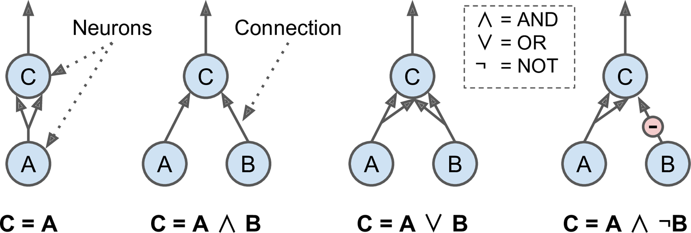
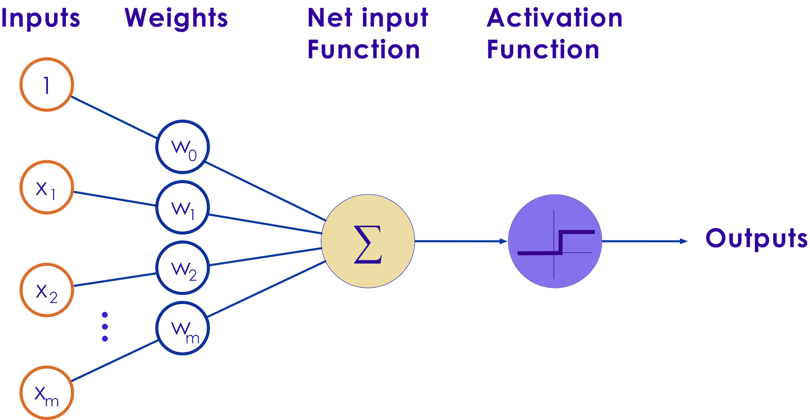
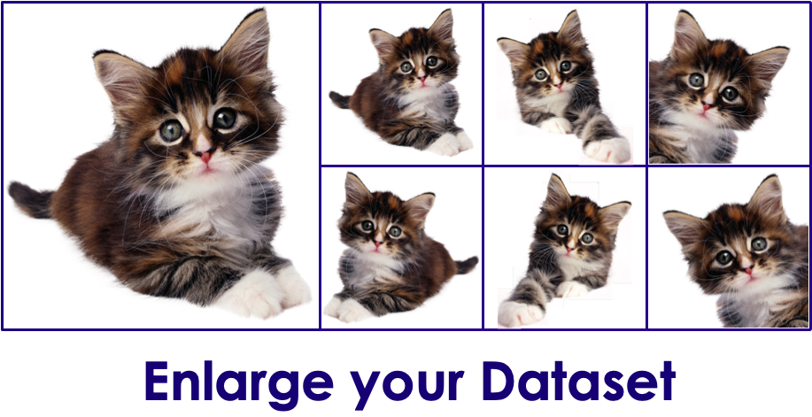

# Deep Learning Concepts

---

## Resources

* [Neural networks and deep learning](https://learning.oreilly.com/library/view/neural-networks-and/9781492037354/)  
by  Aurélien Géron (ISBN: 9781492037347)


---

# Artificial Neural Networks (ANN)

---

## Artificial Neural Networks (ANN)

- ANNs are at the core of Deep Learning
    - they are powerful, scalable and can solve complex problems like classifying billions of images (Google Images)

- ANNs were inspired by neurons in human brain

- How ever ANNs have evolved quite a bit from their original inception.  
For example planes are inspired by birds first, but now modern planes have evolved a lot from their original designs


Notes:  
- https://en.wikipedia.org/wiki/Artificial_neuron

---

## ANN History

- 1943: McCulloch Pitts Neural model

- 1962: Frank Rosenblatt invented the Perceptron:

- 1969: Marvin Minsky's paper threw cold water on ANNs.  
He demonstrated the ANNs can't solve a simple XOR problem

- 1970s: First AI Winter

- 1980s: some revival in ANNs  (new models + training techniques)

- 1986: D. E. Rumelhart et al. published a [groundbreaking paper](https://scholar.google.com/scholar?q=Learning+Internal+Representations+by+Error+Propagation) introducing the backpropagation training algorithm.

- 1990s: Second AI winter (Methods like SVMs were producing better results)

- 2010s: huge revival in AI after some promising results

- Now: The race is on!

Notes:  
- https://en.wikipedia.org/wiki/Artificial_neuron
- https://medium.com/@jayeshbahire/the-xor-problem-in-neural-networks-50006411840b

---

## 1943: McCulloch Pitts Neural Model

- McCulloch and Pitts defined a simple model of a Neuron ([paper](https://scholar.google.com/scholar?q=A+Logical+Calculus+of+Ideas+Immanent+in+Nervous+Activity))

- It consisted of N inputs In and N Weights

- Inputs are binary (on/off)

- Inputs and weights are summed up and a threshold function produces output

- Limitations:

     - Binary input / output

     - Weights (Wn) were set manually; No way to automatically train weights

 <!-- {"left" : 1.38, "top" : 3.95, "height" : 3.28, "width" : 7.49} -->

Notes:  
- https://scholar.google.com/scholar?q=A+Logical+Calculus+of+Ideas+Immanent+in+Nervous+Activity
- https://towardsdatascience.com/mcculloch-pitts-model-5fdf65ac5dd1

---

## Neuron operations



Notes:  
Source : [Neural networks and deep learning](https://learning.oreilly.com/library/view/neural-networks-and/9781492037354/)  by  Aurélien Géron (ISBN: 9781492037347)

---


## 1962: The Perceptron

- Frank Rosenblatt invented the Perceptron

- Inputs are numbers (not binary as before)

- Simplest type of feedforward neural network

 <!-- {"left" : 0.75, "top" : 2.28, "height" : 4.55, "width" : 8.75} -->


Notes:  
Mark I Perceptron at the Cornell Aeronautical Laboratory', hardware implementation of the first Perceptron (Source: Wikipedia)

---

## Perceptron Operations

- Step 1: Calculate sum of inputs and weights  
`z = w0 + w1.x1 + w2.x2 + ... + wn.xn`  
In matrix operations this is  
`wT · x`

- Step 2: Apply Step function to the sum  
`hw(x) = step (z)`  
`hw(x) = step (wT · x)`

- Simple step function
    - if sum is positive (`z >= 0`) --> output is 1
    - otherwise, output is 0


---

# Neural Network Concepts

---

## NN Concepts (Overview)

- Learning rate, Loss function, Cost

- Batch size, epoch, iterations

- Backpropagation

- Activation Functions

- Vanishing / Exploding gradient problem

- Gradient clipping

- Optimizers


---

## Data Instance / Sample

- Sample is a single row of data

- Sample has inputs (vectors) and output
    - algorithm makes a prediction from inputs, and compares the prediction with actual (expected) output

- Sample = instance / observation / input vector / feature vector

- In the following example, we have 3 data points / samples


| Instance   | Input A | Input B | Input C | Output Y |
|------------|---------|---------|---------|----------|
| Instance 1 | a1      | b1      | c1      | y1       |
| Instance 2 | a2      | b2      | c2      | y2       |
| Instance 3 | a3      | b3      | c3      | y3       |

---

## Epoch

- One **Epoch** means when an entire dataset passed forward and backward exactly ONCE

- Why do we need more than one epoch?

- Optimizer algorithms try to adjust the weights of neural networks  based on training data

- Just one-pass isn't enough to tweak the weights
    - leads to under-fitting

- As we pass the data back and forth multiple times (multiple epochs) the model gets more accurate
    - Too many epochs, will lead to overfitting (not good either)

- Epoch values are typically in hundreds or thousands

Notes:   
- https://towardsdatascience.com/epoch-vs-iterations-vs-batch-size-4dfb9c7ce9c9
---

## Batch size

- When we are trining on large dataset, we can not fit the entire dataset into the network due to memory constraints / processing restraints

- So we send data into batches

- Algorithms (Optimizers) update the weights of neural network after each batch
    - At the end of the batch, predictions are compared with output
    - Error is calculated
    - The algorithm will then calculate error gradient and make the move to minimize the error during the next cycle


- Batch size is uaually power of 2 (4, 8, 16, 64 ...)

Notes:  
- https://machinelearningmastery.com/difference-between-a-batch-and-an-epoch/

---

## Batch Size Calculations

| Batch Size                            | Algorithm                    | Description                                        |   |
|---------------------------------------|------------------------------|----------------------------------------------------|---|
| Size of Training Set                  | Batch Gradient Descent       | All data goes in a single batch                    |   |
| 1                                     | Stochastic Gradient Descent  | Each batch has one data sample                     |   |
| 1 < batch size < size of training set | Mini-Batch Gradient Descent. | Batch size is usually power of 2 (32, 64, 128...) |   |

- What if data size is not divisable evenly by batch size?
    - That is fine, the last batch will have what is left, and will be smaller than previous batches
    - For example, if we have 10 data points and batch size is 4
        - batch-1 = 4, batch-2 = 4, batch-3 = 2


---

## Iterations

- Iterations is the number of batches needed to complete one epoch.

- `Iterations  = data size / batch size  (round up the result)`

- For each epoch, we will need to run `iteration` amount of times to pass the whole data through the network

```
# think like a nested loop

for e  in number_of_epochs {
    iterations = round_up (data_size / batch_size)
    for i in iterations {
        # process batch i
    }
}
```

---

## Epoch / Batch size / Iterations

- We have 10 data points

- Batch size is 4

- Iterations = 10 / 4 = 3 (round up!)


---
## Determning Optimal Values or Batch Size / Epochs

- Typical epochs values are in 100s to thousands

- Batch sizes are powers of 2 (32, 64, 128 ... ).  
  32 is a good value to start with

- One epoch will typically will have many iterations
    - Each iteration processing a single batch

- There is no magic formula to calculate the optimal values of batch size and epoch
    - In practice, we try a few runs to figure out optimal  values


---

# Loss Functions

[DL-Loss-Functions](DL-Loss-Functions.md)

---

# NN Concepts: Backpropagation

---

## Backpropagation Intro

- Backpropagation algorithm was proposed in 1970s

- But it's usefulness wasn't appreciated until a seminal paper in 1986.  
    - **"Learning representations by back-propagating errors"**   
    by  [David Rumelhart](http://en.wikipedia.org/wiki/David_Rumelhart), [Geoffrey Hinton](http://www.cs.toronto.edu/~hinton/), and [Ronald Williams](http://en.wikipedia.org/wiki/Ronald_J._Williams)  
    - [pdf](http://www.cs.toronto.edu/~hinton/absps/naturebp.pdf), [Google Scholar](https://scholar.google.com/scholar?hl=en&as_sdt=0%2C5&q=Learning+representations+by+back-propagating+errors&btnG=)

- This paper showed, how backpropagation can be an effective way to train neural networks.  And it worked much faster than previous approaches.

- This enabled neural networks to solve difficult problems that were unsolvable before

- This kicked started the current research boom in neural nets


Notes:   
- http://neuralnetworksanddeeplearning.com/chap2.html

---

## Backpropagation

- During training phase, algorithm feeds training data to network and calculates output for every neuron in each layer
    - This is the 'forward pass'

- Then it measures the error (networks output (prediction) vs. the expected output)

- It then computes how much each neuron in the last hidden layer contributed to each output neuron’s error

- It traverses the network in reverse, computing errors from previous layer
    - until it reaches the input layer
    - this is called 'reverse pass'
    - The reverse pass measures the error gradient across all the connection weights in the network
    - hence called **back propagation**

- During the last step algorithm applies 'Gradient Descent' algorithm on connection weights to tweak them

---

## Backpropagation Math

- TODO : need a icon for math

- Given a cost function `C`

- weight `w` in the network

- backpropagation uses partial derivative of  
`∂C/∂w`

- This tells us how quickly cost `C` changes relative to weight `w`

- For detailed math please see these links:
    - http://neuralnetworksanddeeplearning.com/chap2.html

---

## Backpropagation Summary

- For each training instance the backpropagation algorithm first makes a prediction (forward pass)

- Measures the error (prediction vs. output)

- Then traverses each layer in reverse to measure the error contribution from each connection (reverse pass)

- And finally slightly tweaks the connection weights to reduce the error (Gradient Descent step).

Notes:  
- https://medium.com/@14prakash/back-propagation-is-very-simple-who-made-it-complicated-97b794c97e5c
- http://neuralnetworksanddeeplearning.com/chap2.html

---

## Backpropagation Demos


- [Demo 1: from Google](https://google-developers.appspot.com/machine-learning/crash-course/backprop-scroll/)

- [Demo 2](https://www.youtube.com/watch?v=46Jzu-xWIBk) - from Geoffrey Hinton himself !  (~12 mins)

- [Demo2](https://www.youtube.com/watch?v=Ilg3gGewQ5U)  - Goes through pretty good details (~14 mins)

 


---


# Activation Functions

[Activation Functions](DL-activation-functions.md)

---


# Neural Network Modern Techniques

---
## Neural Network Modern Techniques
These are discussed in the following sections/slides

- Using ReLU activation functions (we just saw this)

- Xavier and He Initialization

- Batch Normalization

- Gradient Clipping

---

## Xavier and He Initialization

#### Problem
- We want signals to flow properly in both directions : forward and backwards
    - no dying out or not exploding

#### Solution
- Make the `variance of the outputs` of each layer to be equal to the `variance of its inputs`  
<small>(see paper for the math details)</small>

- Connection weights are initialized randomly
(see next slide)

- Doing this **Xavier initialization strategy** really sped up learning in neural networks and really kick started the research again

---

## Xavier and He Initialization

- For layer with n-inputs and n-outputs

- Normal distribution with mean 0 and standard deviation σ as follows  


- Or Uniform distribution between -r and r with r  


- When number of inputs == number of outputs, we get a simplified equation  
   

Notes:  
Source : [Neural Networks and Deep Learning](https://learning.oreilly.com/library/view/neural-networks-and/9781492037354/ch02.html), Ch 2

---

## Xe Initialization Parameters
TODO : Xavier Init Parameters table here


---


## Batch Normalization

- So far we have seen **Xe initialization** and **ReLU varaiants**

- These can help avoid vanishing/exploding gradient problems at the start of training
    - how ever during later phases of training, it may occur

- Sergey Ioffe and Christian Szegedy proposed a technique called Batch Normalization (BN) in this 2015 paper(https://arxiv.org/pdf/1502.03167v3.pdf)

- This approach adds another operation before the activation function of each layer
    - it normalizes input to the layer and zero centers them

---

## Batch Normalization Performance

- Significantly reduced vanishing gradient problems

- They could even try saturating functions like sigmod and tanh

- Network was less sensitive to initial weight initialization

- Learning time can be reduced by using larger learning rates (converges faster)

- In ImageNet classification it gave 4.9% top-5 validation error (and 4.8% test error), exceeding the accuracy of human raters

- Also acts as a regularizer reducing overfitting

- Downside:
    - Slower performance during predictions / inferences, because it adds extra compute for each layer
    - Even though the same penalty applies during training phase, it comes out ahead, because training converges quicker (in much fewer steps)

---

## Batch Normalization Implementation

- In Tensorflow
```python
tf.layers.batch_normalization
```

- In Keras
```python
TODO
```

---

## Batch Normalization Math (Reference Only)

For reference only, please see the paper for underlying math.


Notes:  
[Reference paper](https://arxiv.org/pdf/1502.03167v3.pdf)


---

## Batch Normalization Math (Reference Only)

For reference only, please see the paper for underlying math.

- μB is the empirical mean, evaluated over the whole mini-batch B.
- σB is the empirical standard deviation, also evaluated over the whole mini-batch.
- mB is the number of instances in the mini-batch.
- (i) is the zero-centered and normalized input.
- γ is the scaling parameter for the layer.
- β is the shifting parameter (offset) for the layer.
- ϵ is a tiny number to avoid division by zero (typically 10–5). This is called a smoothing term.
- z(i) is the output of the BN operation: it is a scaled and shifted version of the inputs.

Notes:  
[Reference paper](https://arxiv.org/pdf/1502.03167v3.pdf)

---

## Gradient Clipping

- One way to solve **exploding gradients** during backpropagation is to make sure they don't exceed a certain threshold
    - **gradient clipping**

- See [this paper](http://proceedings.mlr.press/v28/pascanu13.pdf) by Razvan Pascanu, Tomas Mikolov and Yoshua Bengio for details

---

## Figuring Out The Optimal Learning Rate

- Learning Rate (⍺) is a very important factor in the algorithm converging (finding the global minimum)

- Set it too high, algorithm may diverge

- Set it too low, algorithm will eventually converge, but will take too many iterations and too long

- Set it a little high, it will make quick progress at the start, then bounce around the global minimum (not settling)

- Modern optimizers like Adagrad, RMSProp and Adam have adaptive learning rate (they can adjust learning rate as training progresses)

---

## Learning Rate


---

## How to Find the Optimal Learning Rate

- Start with high learning rate

- Run a few epochs of training

- Watch the convergence using a tool like **[Tensorboard](https://www.tensorflow.org/guide/summaries_and_tensorboard)**

- Adjust learning rate, rinse and repeat

---

# Optimizers

[Optimizers](DL-Optimizers.md)

---

# Avoiding Overfitting

---

## Managing Overfitting

* Neural networks have tens of thousands / millions of  parameters

* With these many parameters, the networks are very flexible, they can fit very complex data sets

* Also means the network can overfit training data

* How to manage overfitting?
    - Regularization
    - Early stopping
    - Dropout
    - Max-norm regularization
    - Data augmentation

---

## Early Stopping

- Don't train too long
- Interrupt training when its performance on the validation set starts dropping.
- How to do it?
    - Measure validation accuracy every few steps (say 20)
    - If it scores higher than previous snapshot, save the current model snapshot as 'winner'


---

## Regularization

 * In conventional ML we often use regularization to control overfitting.

 * L1 and L2 are common mechanisms for regularization

 * In DL, Regularization is probably not enough
   - Even penalized, certain features will eventually dominate.
   - DL will always overfit, even with L1/L2.

 * Is there something else we can do?

---

## Dropout

* **Dropout** is the most popular regularization technique for deep neural networks

* It was proposed by Geoffrey Hinton in 2012 ([paper1](https://arxiv.org/pdf/1207.0580.pdf), [paper2](http://jmlr.org/papers/volume15/srivastava14a/srivastava14a.pdf))

* By omitting half the neurons' signal (50% dropout rate), they were able to increase an accuracy of state of the art model from 95%  to 97.5%  
    - This may not seem like a lot, but the error rate improved from 5% to 2.5%  (that is 50% reduction in error!)

* How does it work?
    - At every trainng step, each neuron has a chance (probablity) of being 'dropped'.  
    Meaning, it's output ignored during this step
    - The neuron can become active during the next step
    - Neurons in input layer and hidden layer can be dropped
    - Output neurons are not dropped
    - The parameter (p) is called 'dropout rate' - varies from 0 to 1.0.  
    Typically set to 0.5 (50%)

---

## Dropout


---

## Dropout

- It is really surprising, that dropout method works in real life.  
Imagine this scenario

- Workers of this 'unicorn' company
    - Every morning they toss a coin
    - 'Heads' they come to work, 'tails' they don't
    - So that means 50% of workers don't show up at any day
    - 'Dropput' method says, this makes the 'company' as a whole, perform better :-)

- Increase dropout rate, if you notice the model is overfitting.  
Decrease it if it is underfitting

- Dropout slows down the model convergence, but the model you get is much better at the end

---

## Max-Norm Regularization

- Max-Norm regularization is very popular for neural networks

- for each neuron, it constrains the weights `w` of the incoming connections such that ||w||2 ≤ r
    - where r is the max-norm hyperparameter and ||.||2 is the L2 norm

- TODO : draw formula  


- Max-norm regularization can also help reduce the vanishing/exploding gradients

---

## Data Augmentation

- **Data augmentation** creates new training instances from existing ones
    - this artifically boosts training set size

- This technique is mostly used in image training

- Common techniques involve:
    - adjusting brightness
    - introducing some noise
    - rotating images slightly clockwise / anti-clockwise (10 to 20 degrees)
    - cropping images / moving centers

- See next slide for an example

---

## Data Augmentation Example



---

## Stochastic Pooling
 * Normally, we apply MAX function for pooling
   - sometimes AVG (mean) pooling, but less often these days
 * Problem: Selecting MAX tends to overfit!
 * What if we do something else?
 * "Stochastic" pooling means we randomly choose another one.
 * Conform to normal distribution.
 * Similar to dropout in that we randomly ignore a preferred weight.

---

## Final Words

These default values should get you started, and should work well in most scenarios

| Parameter                  | Value                                |
|----------------------------|--------------------------------------|
| **Initialization**         | He initialization                    |
| **Activation function**    | ELU                                  |
| **Normalization**          | Batch Normalization                  |
| **Regularization**         | Dropout                              |
| **Optimizer**              | Adam / Nesterov Accelerated Gradient |
| **Learning rate schedule** | None                                 |
---

## Review Questions

 TODO Shiva: I need an icon for 'quiz'

 - **Q:** Can you name 3 activation functions and when they are used?

 - **Q:** How many neurons do you need in the output layer to classify emails into spam/ham?
     - how about for classifying digits 0 to 9?

- **Q:** Name advantages of the ELU activation function over ReLU

- **Q:** In which cases you would use the following activation functions: ELU, leaky ReLU (and its variants), ReLU, tanh, logistic, and softmax?

- **Q:** Explain how Dropoff works
