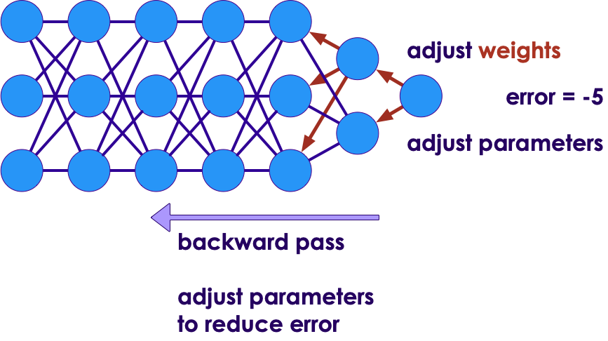
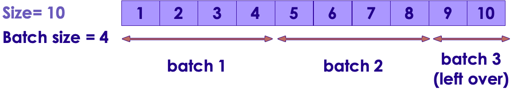
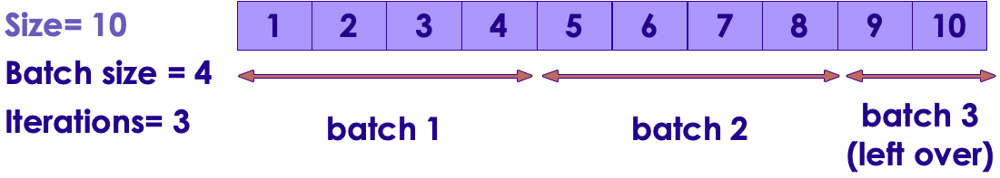
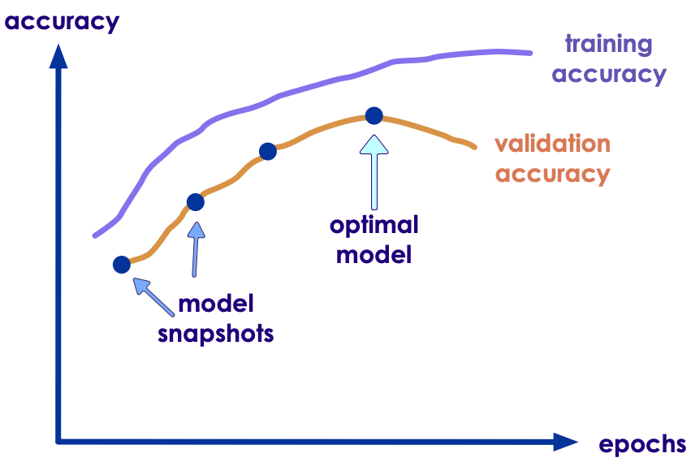

# Neural Network Concepts

---

# Part 1: Essentials

---

## NN Concepts (Overview)

 * Training a neural network

 * Backpropagation

 * Batch size, epoch, iterations

 * Activation Functions

 * Learning rate, Loss function, Cost

 * Vanishing / Exploding gradient problem

 * Gradient clipping

 * Optimizers


---

## Data Instance / Features

* **Sample** is a single row of data
* Sample = instance / observation / input vector / feature vector
* Each sample has **inputs (vectors) and output**
* Algorithm makes a prediction from inputs, and compares the prediction with actual (expected) output
* In the following example, we have 5 data points / samples (instances 1 - 5)
    - And 3 dimensional input / features: Inputs A,B,C


| Instance   | Input A | Input B | Input C | Output Y |
|------------|---------|---------|---------|----------|
| Instance 1 | a1      | b1      | c1      | y1       |
| Instance 2 | a2      | b2      | c2      | y2       |
| Instance 3 | a3      | b3      | c3      | y3       |
| Instance 4 | a4      | b4      | c4      | y4       |
| Instance 5 | a5      | b5      | c5      | y5       |

<!-- {"left" : 3.88, "top" : 7.58, "height" : 1, "width" : 9.75} -->

---

## Training the Model

 * Rosenblatt's original algorithm for training was simple:

     - Iterate through weights and look at the output error

     - Adjust weights until output error was zero.

     - Will converge only if the outputs are linearly separable.

 * The Problem:

     - With hidden layers, we now have a much greater number of weights to try.

     - This kind of "brute force" method will take too long to train.

Notes:

---

## A Restaurant on an Alien Planet

<!-- {"left" : 12.15, "top" : 2.21, "height" : 3.18, "width" : 4.78} -->

<!-- {"left" : 13.19, "top" : 5.64, "height" : 5.17, "width" : 3.74} -->

- Imagine you are at restaurant, but you and the waitstaff don't speak the same language (remember they are aliens!)

- You tell them what you want (_"I want a cheese pizza"_)

- The kitchen will try to make your pizza and bring it out

- If it is not to your liking, you send it back with feedback (_"it is not cooked well"_,  _"it needs more sauce"_ ..etc)

- You keep sending the pizza back until they get your order right!

- This happens until every one's order is cooked correctly!!


---

# Backpropagation

---

## Difficulty in Training Neural Networks

- In early days (1980s) neural networks' parameters were tuned by hand by experts

- Hand engineering required a lot of knowledge and effort; and usually a very very slow process

- Can the networks be trained automatically ?

- Enter __backpropagation__

<!-- {"left" : 2.52, "top" : 6.87, "height" : 4.1, "width" : 12.46} -->


---

## Backpropagation

* Backpropagation algorithm was proposed in 1970s

* But it's usefulness wasn't appreciated until a seminal paper in 1986.  

* **"Learning representations by back-propagating errors"**   
    by  [David Rumelhart](http://en.wikipedia.org/wiki/David_Rumelhart), [Geoffrey Hinton](http://www.cs.toronto.edu/~hinton/), and [Ronald Williams](http://en.wikipedia.org/wiki/Ronald_J._Williams)   
 ([PDF](http://www.cs.toronto.edu/~hinton/absps/naturebp.pdf), [Google Scholar](https://scholar.google.com/scholar?hl=en&as_sdt=0%2C5&q=Learning+representations+by+back-propagating+errors&btnG=))

* This paper showed, how backpropagation can be an effective way to train neural networks.  And it worked much faster than previous approaches.

* This enabled neural networks to solve difficult problems that were unsolvable before

* This kicked started the current research boom in neural nets


Notes:   
- http://neuralnetworksanddeeplearning.com/chap2.html

---

## Backpropagation Process: Forward Pass

 * During training phase, training data is fed to network

 * Neurons in each layer calculate output

<!-- {"left" : 4.69, "top" : 4.97, "height" : 5.5, "width" : 8.12} -->


---

## Backpropagation Process: Prediction

 * Network predicts an outcome

 * This prediction is not usually the same as expected outcome

 * Then it measures the error (networks output (prediction) vs. the expected output)


 <!-- {"left" : 2.77, "top" : 6, "height" : 4.46, "width" : 11.95} -->


---
## Backpropagation Process: Backward Pass

 * It then computes how much each neuron in the last hidden layer contributed to each output neuron's error

 * And the network weights are adjusted accordingly to minimize the error


 <!-- {"left" : 4.44, "top" : 5.4, "height" : 4.84, "width" : 8.63} -->


---

## Backpropagation: Backward Pass

 * It traverses the network in reverse, computing errors from previous layer
    - until it reaches the input layer
    - this is called 'reverse pass'
    - The reverse pass measures the error gradient across all the connection weights in the network
    - hence called **back propagation**

 * During the last step algorithm applies 'Gradient Descent' algorithm on connection weights to tweak them

<!-- {"left" : 9.8, "top" : 2.85, "height" : 3.61, "width" : 7.1} -->


---

## Backpropagation Math

<!-- {"left" : 11.06, "top" : 1.89, "height" : 4.03, "width" : 6.03} -->

 * Given a cost function `C`

 * weight `w` in the network

 * backpropagation uses partial derivative of  
`∂C/∂w`

 * This tells us how quickly cost `C` changes relative to weight `w`

 * For detailed math please see these links:
    - http://neuralnetworksanddeeplearning.com/chap2.html

---

## Backpropagation Summary

 * For each training instance the backpropagation algorithm first makes a prediction (forward pass)

 * Measures the error (prediction vs. output)

 * Then traverses each layer in reverse to measure the error contribution from each  connection (reverse pass)

 * And finally slightly tweaks the connection weights to reduce the error (Gradient Descent step).


Notes:  
- https://medium.com/@14prakash/back-propagation-is-very-simple-who-made-it-complicated-97b794c97e5c
- http://neuralnetworksanddeeplearning.com/chap2.html

---
## Backpropagation Demos


 * **Animation (Regression)** : [link-youtube](https://youtu.be/krTFCDCbkZg), [link-S3](https://elephantscale-public.s3.amazonaws.com/media/machine-learning/backpropagation-5.mp4)

 <!-- {"left" : 10.89, "top" : 2.03, "height" : 3.47, "width" : 6.19} -->

 * **Animation (Classification)** :
  [link-youtube](https://youtu.be/sLsCN9ZL9RI), [link-S3](https://elephantscale-public.s3.amazonaws.com/media/machine-learning/neural-networks-animation-1.mp4)

<!-- {"left" : 3.7, "top" : 6.4, "height" : 5.05, "width" : 10.1} -->

---

## Backpropagation Demos

 * [Demo 1: from Google](https://google-developers.appspot.com/machine-learning/crash-course/backprop-scroll/)

 * [Demo 2](https://www.youtube.com/watch?v=46Jzu-xWIBk) - from Geoffrey Hinton himself !  (~12 mins)

 * [Demo 3](https://www.youtube.com/watch?v=Ilg3gGewQ5U)  - Goes through pretty good details (~14 mins)

<!-- {"left" : 2.39, "top" : 5.14, "height" : 5.87, "width" : 2.68} --> &nbsp;  &nbsp; <!-- {"left" : 5.56, "top" : 6.4, "height" : 2.54, "width" : 4.37} --> <!-- {"left" : 10.87, "top" : 5.88, "height" : 3.57, "width" : 4.25} -->


---

# Controlling Training

---

## Controlling Training

* During training, data goes back and forth through the network
    - Forward passes are for prediction
    - Backward passes are for error correction

* The following parameters control how data flows through the network
    - Epoch
    - Batch size
    - Iteration

<!-- {"left" : 4.74, "top" : 6.7, "height" : 4.01, "width" : 8.02} -->


---

## Epoch

<!-- {"left" : 12.89, "top" : 1.89, "height" : 5.76, "width" : 4.19} -->

 * One **Epoch** means when an entire dataset passed forward and backward exactly ONCE
    - Restaurant Example: Entire table's meal is sent back once and re-delivered

 * Why do we need more than one epoch?
    - Optimizer algorithms try to adjust the weights of neural networks  based on training data
    - Just one-pass isn't enough to tweak the weights
    - leads to under-fitting
    - So we need to go back and forth multiple times

---

## Epoch 

<!-- {"left" : 12.89, "top" : 1.89, "height" : 5.76, "width" : 4.19} -->

 * As we pass the data back and forth multiple times (multiple epochs) the network gets more chance to learn from data and tweak the parameters  further
    - model gets more accurate
    - Too many epochs, will lead to overfitting (not good either)

 * In practice, the epoch values are typically in hundreds or thousands

 * References:
  - [Epoch vs. iterations vs. batch](https://towardsdatascience.com/epoch-vs-iterations-vs-batch-size-4dfb9c7ce9c9)

Notes:

---

## Batch size

<!-- {"left" : 12.33, "top" : 1.88, "height" : 0.88, "width" : 4.93} -->
 * When we are training on large dataset, we can not fit the entire dataset into the network due to memory constraints / processing restraints

 * So we send data into batches

 * Algorithms (Optimizers) update the weights of neural network after each batch
    - At the end of the batch, predictions are compared with output
    - Error is calculated
    - The algorithm will then calculate error gradient and make the move to minimize the error during the next cycle

 * Batch size is usually power of 2 (4, 8, 16, 64 ...)

 * Alien Restaurant Example: We send back meals in batches of 3, not the entire table.

- Reference: [Batch vs epoch](https://machinelearningmastery.com/difference-between-a-batch-and-an-epoch/)

Notes:  

---

## Batch Size Calculations

- What if data size is not divisible evenly by batch size?

- That is fine, the last batch will have what is left, and will be smaller than previous batches

- For example, if we have 10 data points and batch size is 4

- batch-1 = 4, batch-2 = 4, batch-3 = 2

<!-- {"left" : 1.93, "top" : 7.45, "height" : 2.25, "width" : 13.65} -->


---

## Iterations

 * Iterations is the number of batches needed to complete one epoch.

 * `Iterations  = data size / batch size  (round up the result)`

 * For each epoch, we will need to run `iteration` amount of times to pass the whole data through the network

```text
# think like a nested loop

for e  in number_of_epochs {
    iterations = round_up (data_size / batch_size)
    for i in iterations {
        # process batch i
    }
}
```
<!-- {"left" : 0.85, "top" : 4.56, "height" : 3, "width" : 11.45} -->

---

## Epoch / Batch size / Iterations


| Batch Size                            | Algorithm                    | Description                                        |
|---------------------------------------|------------------------------|----------------------------------------------------|
| Size of Training Set                  | Batch Gradient Descent       | All data goes in a single batch                    |  
| 1                                     | Stochastic Gradient Descent  | Each batch has one data sample                     |  
| 1 < batch size < size of training set | Mini-Batch Gradient Descent. | Batch size is usually power of 2 (32, 64, 128...)  |  

<!-- {"left" : 0.99, "top" : 2.8, "height" : 1, "width" : 15.51} -->

<!-- {"left" : 2.96, "top" : 7.81, "height" : 1.91, "width" : 11.59} -->


---

## Determining Optimal Values or Batch Size / Epochs

 * Typical epochs values are in 100s to thousands

 * Batch sizes are powers of 2 (32, 64, 128 ... ).  
  32 is a good value to start with

 * One epoch will typically will have many iterations
    - Each iteration processing a single batch

 * There is no magic formula to calculate the optimal values of batch size and epoch
    - In practice, we try a few runs to figure out optimal  values

---

# Training Neural Networks

---

## Training Parameters


<!-- {"left" : 2.49, "top" : 2.36, "height" : 8.99, "width" : 12.51} -->


---

## Training Parameters

 <!-- {"left" : 10.66, "top" : 2.07, "height" : 4.63, "width" : 6.45} -->


* For each layer, we define **number of neurons** and **activation function**
  - more neurons help the network to adopt to complex shape; but more also means increased training time

* **Activation functions:** Determine the output each neuron

* **Loss functions:** We try to minimize the error/loss
  - For example, when driving, we optimize to minimize time spent

---

## Training Parameters

 <!-- {"left" : 10.66, "top" : 2.07, "height" : 4.63, "width" : 6.45} -->


* **Optimizers:** Helps with adjusting the weights of the network, so our loss can be minimized
  - We want to tweak weights efficiently not take random guesses

* **Learning Rate:** This determines how much we update the weights.  It is a critical parameter.  
  - Too small, the training will take too long
  - Too large, the training will bounce around and not converge

---

# Loss Functions for Regressions

[../../machine-learning/generic/ML-Concepts-Errors-and-Loss-Functions.md](../../machine-learning/generic/ML-Concepts-Errors-and-Loss-Functions.md#Error/Loss Functions for Regressions)

---

# Loss Functions for Classifications

[../../machine-learning/generic/ML-Concepts-Errors-and-Loss-Functions.md](../../machine-learning/generic/ML-Concepts-Errors-and-Loss-Functions.md#Error/Loss Functions for Classifications)

---


# Activation Functions

[Activation Functions](DL-activation-functions.md)

---
## Take-away: Deciding Loss / Activation Functions

| Problem Type   | Prediction                      | Loss Function            | Activation on the last layer |
|----------------|---------------------------------|--------------------------|------------------------------|
| Regression     | a number                        | mse, sse, mae            | linear, relu                 |
|                |                                 |                          |                              |
| Classification | binary (0/1)                    | binary_crossentropy      | sigmoid                      |
|                | Multi-class <br/> (A, B, C , D) | categorical_crossentropy | softmax                      |

<!-- {"left" : 0.95, "top" : 2.5, "height" : 1, "width" : 15.6} -->

---

# Learning Rate

---

## Learning Rate

<!-- {"left" : 11.47, "top" : 1.89, "height" : 4.31, "width" : 5.93} -->

* Neural Networks update their weights using backpropagation

* The amount the weights are updated is called **step size** or **learning rate**

* Learning rate is a positive number (usually between 0.0 and 1.0 - can be more than 1.0 in some cases)

---

## Effect of Learning Rate


* When 'learning rate' is **too small**:
    - The weight updates are small
    - The model may take longer to train (too many steps to find the solution)
* When the 'learning rate' is **too large**:
    - The weight updates are too large
    - It may cauase the model to diverge, and bounce around
* Our goal is to find the **right learning rate**

 <!-- {"left" : 0.77, "top" : 7.22, "height" : 3.75, "width" : 5.16} --> <!-- {"left" : 6.17, "top" : 7.22, "height" : 3.75, "width" : 5.16} --> <!-- {"left" : 11.57, "top" : 7.22, "height" : 3.75, "width" : 5.16} -->


---

## Finding the Optimal Learning Rate

* Learning Rate is a very important factor in the algorithm converging (finding the global minimum)

* We don't want it to be too large or too small

* Set it too high, algorithm may diverge

* Set it too low, algorithm will eventually converge, but will take too many iterations and too long

<!-- {"left" : 3.84, "top" : 7.13, "height" : 4.06, "width" : 9.82} -->

---

## Finding the Optimal Learning Rate

* Unfortunately, there is **no formula** to calculate the optimal learning rate

* Learning rate is determined by **experimentation** and following **best practices**

* **Learning curve** (from Tensorboard) can give us clues on how effective the learning rate is

* _"The learning rate is perhaps the most important hyperparameter. If you have time
to tune only one hyperparameter, tune the learning rate."_ - Page 429, Deep Learning, 2016.


 <!-- {"left" : 0.94, "top" : 7.74, "height" : 2.69, "width" : 15.63} -->


---

## Determining Learning Rate

 <!-- {"left" : 8.15, "top" : 1.89, "height" : 3.93, "width" : 8.72} -->

* Read the [tweet thread](https://twitter.com/karpathy/status/801621764144971776?ref_src=twsrc%5Etfw%7Ctwcamp%5Etweetembed%7Ctwterm%5E801621764144971776%7Ctwgr%5E&ref_url=https%3A%2F%2Fwww.jeremyjordan.me%2Fnn-learning-rate%2F) for some funny reactions

* Also [Andrej's twitter](https://twitter.com/karpathy) and [karpathy.ai](https://karpathy.ai/)

---

## How to Find the Optimal Learning Rate

<!-- {"left" : 11.59, "top" : 2.12, "height" : 3.91, "width" : 5.34} -->

* Start with learning rate of **`0.1 or 0.01`**

* Run a few epochs of training

* Watch the convergence using a tool like [Tensorboard](https://www.tensorflow.org/guide/summaries_and_tensorboard)

* Adjust learning rate, rinse and repeat


---

## Finding Optimal Learning Rate

* Stochastic Gradient Descent (SGD) algorithm has 'fixed' learning rate

* In practice, **adjusting the learning rate** results in the algorithm converging sooner

* Modern optimizers like Adagrad, RMSProp and Adam have **adaptive learning rate**
    - They can adjust learning rate as training progresses

* We will see more of this in the next section **Optimizers**
---

# Optimizers

[Optimizers](DL-Optimizers.md#Optimizers)

---

## Review Questions (Part 1)

 <!-- {"left" : 10.25, "top" : 2.48, "height" : 4.7, "width" : 7.07} -->


* **Q:** Can you name 3 activation functions and when they are used?

* **Q:** What are the advantages of the ReLU activation over Sigmoid?

* **Q:** How many neurons do you need in the output layer to classify emails into spam/ham?
  - how about for classifying digits 0 to 9?

* **Q:** In which cases you would use the following activation functions: ReLU, tanh, sigmoid, and softmax?

---


## End of Part 1!

* **Instructor:** Pause here.  And move onto the next module

* Cover **Part-2** as need basis

---


# Part 2: Advanced Concepts

Cover as necessary

---

# Avoiding Overfitting

---

## Managing Overfitting

 * Neural networks have tens of thousands / millions of  parameters

 * With these many parameters, the networks are very flexible, they can fit very complex data sets

 * Also means the network can overfit training data

 * How to manage overfitting?
    - Regularization
    - Early stopping
    - Dropout
    - Max-norm regularization
    - Data augmentation

---

## Early Stopping

 * Don't train too long
 * Interrupt training when its performance on the validation set starts dropping.
 * How to do it?
    - Measure validation accuracy every few steps (say 20)
    - If it scores higher than previous snapshot, save the current model snapshot as 'winner'

<!-- {"left" : 10.8, "top" : 2.52, "height" : 4.15, "width" : 6.21} -->


---

## Regularization

 * In conventional ML we often use regularization to control overfitting.

 * L1 and L2 are common mechanisms for regularization

 * In DL, Regularization is probably not enough
   - Even penalized, certain features will eventually dominate.
   - DL will always overfit, even with L1/L2.

 * Is there something else we can do?

---

## Dropout

 * **Dropout** is the most popular regularization technique for deep neural networks

 * It was proposed by Geoffrey Hinton in 2012 ([paper1](https://arxiv.org/pdf/1207.0580.pdf), [paper2](http://jmlr.org/papers/volume15/srivastava14a/srivastava14a.pdf))

 * By omitting half the neurons' signal (50% dropout rate), they were able to increase an accuracy of state of the art model from 95%  to 97.5%  
    - This may not seem like a lot, but the error rate improved from 5% to 2.5%  (that is 50% reduction in error!)


---

## Dropout

 * How does it work?
    - At every training step, each neuron has a chance (probability) of being 'dropped'.  
    Meaning, it's output ignored during this step
    - The neuron can become active during the next step
    - Neurons in input layer and hidden layer can be dropped
    - Output neurons are not dropped
    - The parameter (p) is called 'dropout rate' - varies from 0 to 1.0.  
    Typically set to 0.5 (50%)

---

## Dropout

<!-- {"left" : 4.31, "top" : 3.08, "height" : 7.56, "width" : 8.87} -->


---

## Dropout

 * It is really surprising, that dropout method works in real life.  
Imagine this scenario

 * Workers of this 'unicorn' company
    - Every morning they toss a coin
    - 'Heads' they come to work, 'tails' they don't
    - So that means 50% of workers don't show up at any day
    - 'Dropout' method says, this makes the 'company' as a whole, perform better :-)

 * Increase dropout rate, if you notice the model is overfitting.  
Decrease it if it is underfitting

 * Dropout slows down the model convergence, but the model you get is much better at the end

---

## Max-Norm Regularization

 * Max-Norm regularization is very popular for neural networks

 * for each neuron, it constrains the weights `w` of the incoming connections such that ||w||2 ≤ r
    - where r is the max-norm hyperparameter and ||.||2 is the L2 norm

<!-- {"left" : 3.9, "top" : 4.95, "height" : 0.97, "width" : 4} -->

<br/>

- Max-norm regularization can also help reduce the vanishing/exploding gradients

---

## Data Augmentation

 * **Data augmentation** creates new training instances from existing ones
    - this artificially boosts training set size

 * This technique is mostly used in image training

 * Common techniques involve:
    - adjusting brightness
    - introducing some noise
    - rotating images slightly clockwise / anti-clockwise (10 to 20 degrees)
    - cropping images / moving centers

 * See next slide for an example

---

## Data Augmentation Example

<!-- {"left" : 2.19, "top" : 3.51, "height" : 5.36, "width" : 13.13} -->


---

## Stochastic Pooling

 * Normally, we apply MAX function for pooling
   - sometimes AVG (mean) pooling, but less often these days

 * Problem: Selecting MAX tends to overfit!

 * What if we do something else?

 * "Stochastic" pooling means we randomly choose another one.

 * Conform to normal distribution.

 * Similar to dropout in that we randomly ignore a preferred weight.

---

# Neural Network Modern Techniques (Advanced / Optional)

---
## Neural Network Modern Techniques

These are discussed in the following sections/slides

 * Using ReLU activation functions (we just saw this)

 * Xavier and He Initialization

 * Batch Normalization

 * Gradient Clipping

---

## Xavier and He Initialization

 * **Problem**
 * We want signals to flow properly in both directions : forward and backwards
    - no dying out or not exploding

 * **Solution**
 * Make the `variance of the outputs` of each layer to be equal to the `variance of its inputs`  
<small>(see paper for the math details)</small>

 * Connection weights are initialized randomly
(see next slide)

 * Doing this **Xavier initialization strategy** really sped up learning in neural networks and really kick started the research again

---

## Xavier and He Initialization

 * For layer with n-inputs and n-outputs

 * Normal distribution with mean 0 and standard deviation σ as follows  

<!-- {"left" : 2.25, "top" : 3.99, "height" : 1.13, "width" : 4.7} -->

 * Or Uniform distribution between -r and r with r  

<!-- {"left" : 2.25, "top" : 6.7, "height" : 1.23, "width" : 5.08} -->


 * When number of inputs == number of outputs, we get a simplified equation  

<!-- {"left" : 2.25, "top" : 10.01, "height" : 0.68, "width" : 3.21} -->&nbsp;  &nbsp; &nbsp;  &nbsp;<!-- {"left" : 6.69, "top" : 10.01, "height" : 0.68, "width" : 2.96} -->


Notes:  
Source : [Neural Networks and Deep Learning](https://learning.oreilly.com/library/view/neural-networks-and/9781492037354/ch02.html), Ch 2

---

## Xe Initialization Parameters


<!-- {"left" : 2.63, "top" : 3.21, "height" : 6.51, "width" : 12.25} -->


---


## Batch Normalization

 * So far we have seen **Xe initialization** and **ReLU variants**

 * These can help avoid vanishing/exploding gradient problems at the start of training
    - how ever during later phases of training, it may occur

 * Sergey Ioffe and Christian Szegedy proposed a technique called Batch Normalization (BN) in this 2015 paper(https://arxiv.org/pdf/1502.03167v3.pdf)

 * This approach adds another operation before the activation function of each layer
    - it normalizes input to the layer and zero centers them

---

## Batch Normalization Performance

 * Significantly reduced vanishing gradient problems

 * They could even try saturating functions like sigmoid and tanh

 * Network was less sensitive to initial weight initialization

 * Learning time can be reduced by using larger learning rates (converges faster)

 * In ImageNet classification it gave 4.9% top-5 validation error (and 4.8% test error), exceeding the accuracy of human raters

 * Also acts as a regularizer reducing overfitting

 * Downside:
    - Slower performance during predictions / inferences, because it adds extra compute for each layer
    - Even though the same penalty applies during training phase, it comes out ahead, because training converges quicker (in much fewer steps)

---

## Batch Normalization Implementation

 * In Tensorflow

```python
tf.layers.batch_normalization
```
<!-- {"left" : 0.85, "top" : 2.51, "height" : 0.67, "width" : 6.64} -->

 * In Keras

```python
keras.layers.BatchNormalization(axis=-1, momentum=0.99,
          epsilon=0.001, center=True, scale=True,
          beta_initializer='zeros', gamma_initializer='ones',
          moving_mean_initializer='zeros', moving_variance_initializer='ones',
          beta_regularizer=None, gamma_regularizer=None,
          beta_constraint=None, gamma_constraint=None)
```
<!-- {"left" : 0.85, "top" : 4, "height" : 2.23, "width" : 15.17} -->


---

## Batch Normalization Math (Reference Only)

* For reference only, please see the paper for underlying math.

<!-- {"left" : 11.06, "top" : 2.6, "height" : 5.01, "width" : 5.66} -->


Notes:  
[Reference paper](https://arxiv.org/pdf/1502.03167v3.pdf)


---

## Batch Normalization Math (Reference Only)

For reference only, please see the paper for underlying math.

 * μB is the empirical mean, evaluated over the whole mini-batch B.
 * σB is the empirical standard deviation, also evaluated over the whole mini-batch.
 * mB is the number of instances in the mini-batch.
 * (i) is the zero-centered and normalized input.
 * γ is the scaling parameter for the layer.
 * β is the shifting parameter (offset) for the layer.
 * ϵ is a tiny number to avoid division by zero (typically 10-5). This is called a smoothing term.
 * z(i) is the output of the BN operation: it is a scaled and shifted version of the inputs.

Notes:  
[Reference paper](https://arxiv.org/pdf/1502.03167v3.pdf)

---

## Gradient Clipping

 * One way to solve **exploding gradients** during backpropagation is to make sure they don't exceed a certain threshold
    - **gradient clipping**

 * See [this paper](http://proceedings.mlr.press/v28/pascanu13.pdf) by Razvan Pascanu, Tomas Mikolov and Yoshua Bengio for details

---

## Final Words

These default values should get you started, and should work well in most scenarios

| Parameter                  | Value                                |
|----------------------------|--------------------------------------|
| **Initialization**         | He initialization                    |
| **Activation function**    | ELU                                  |
| **Normalization**          | Batch Normalization                  |
| **Regularization**         | Dropout                              |
| **Optimizer**              | Adam / Nesterov Accelerated Gradient |
| **Learning rate schedule** | None                                 |


<!-- {"left" : 1.06, "top" : 3.67, "height" : 1, "width" : 15.38} -->


---

## Review Questions - Part 2

 <!-- {"left" : 10.8, "top" : 1.89, "height" : 4.44, "width" : 6.68} -->


* **Q:** What are the techniques to prevent overfitting?

* **Q:** Explain how Dropoff works

---

## Resources

 * [Neural networks and deep learning](https://learning.oreilly.com/library/view/neural-networks-and/9781492037354/)  
by  Aurélien Géron (ISBN: 9781492037347)

<!-- {"left" : 7.01, "top" : 5, "height" : 5.25, "width" : 3.47} -->

---

# Appendix: Optimizers

[Optimizers](DL-Optimizers.md#Appendix-Optimizers)
