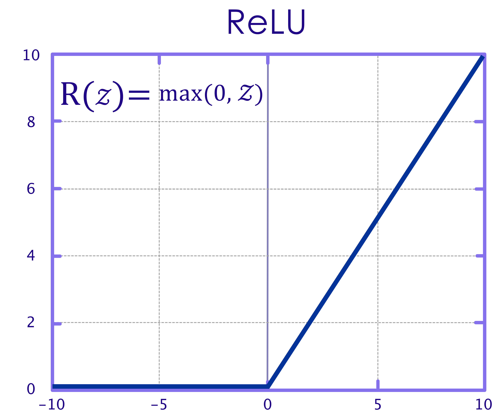
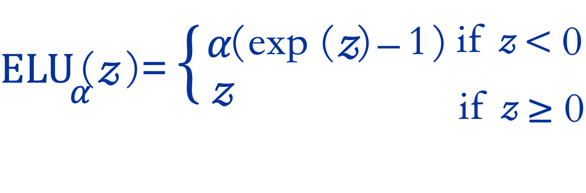

# Deep Learning Concepts

---

## Resources

* [Neural networks and deep learning](https://learning.oreilly.com/library/view/neural-networks-and/9781492037354/)  
by  Aurélien Géron (ISBN: 9781492037347)


---

# Artificial Neural Networks (ANN)

---

## Artificial Neural Networks (ANN)

- ANNs are at the core of Deep Learning
    - they are powerful, scalable and can solve complex problems like classifying billions of images (Google Images)

- ANNs were inspired by neurons in human brain

- How ever ANNs have evolved quite a bit from their original inception.  
For example planes are inspired by birds first, but now modern planes have evolved a lot from their original designs


Notes:  
- https://en.wikipedia.org/wiki/Artificial_neuron

---

## ANN History

- 1943: McCulloch Pitts Neural model

- 1962: Frank Rosenblatt invented the Perceptron:

- 1969: Marvin Minsky's paper threw cold water on ANNs.  
He demonstrated the ANNs can't solve a simple XOR problem

- 1970s: First AI Winter

- 1980s: some revival in ANNs  (new models + training techniques)

- 1986: D. E. Rumelhart et al. published a [groundbreaking paper](https://scholar.google.com/scholar?q=Learning+Internal+Representations+by+Error+Propagation) introducing the backpropagation training algorithm.

- 1990s: Second AI winter (Methods like SVMs were producing better results)

- 2010s: huge revival in AI after some promising results

- Now: The race is on!

Notes:  
- https://en.wikipedia.org/wiki/Artificial_neuron
- https://medium.com/@jayeshbahire/the-xor-problem-in-neural-networks-50006411840b

---

## 1943: McCulloch Pitts Neural Model

- McCulloch and Pitts defined a simple model of a Neuron ([paper](https://scholar.google.com/scholar?q=A+Logical+Calculus+of+Ideas+Immanent+in+Nervous+Activity))

- It consisted of N inputs In and N Weights

- Inputs are binary (on/off)

- Inputs and weights are summed up and a threshold function produces output

- Limitations:

     - Binary input / output

     - Weights (Wn) were set manually; No way to automatically train weights

 <!-- {"left" : 1.38, "top" : 3.95, "height" : 3.28, "width" : 7.49} -->

Notes:  
- https://scholar.google.com/scholar?q=A+Logical+Calculus+of+Ideas+Immanent+in+Nervous+Activity
- https://towardsdatascience.com/mcculloch-pitts-model-5fdf65ac5dd1

---

## Neuron operations


Notes:  
Source : [Neural networks and deep learning](https://learning.oreilly.com/library/view/neural-networks-and/9781492037354/)  by  Aurélien Géron (ISBN: 9781492037347)

---


## 1962: The Perceptron

- Frank Rosenblatt invented the Perceptron

- Inputs are numbers (not binary as before)

- Simplest type of feedforward neural network

 <!-- {"left" : 0.75, "top" : 2.28, "height" : 4.55, "width" : 8.75} -->


Notes:  
Mark I Perceptron at the Cornell Aeronautical Laboratory', hardware implementation of the first Perceptron (Source: Wikipedia)

---

## Perceptron Operations

- Step 1: Calculate sum of inputs and weights  
`z = w0 + w1.x1 + w2.x2 + ... + wn.xn`  
In matrix operations this is  
`wT · x`

- Step 2: Apply Step function to the sum  
`hw(x) = step (z)`  
`hw(x) = step (wT · x)`

- Simple step function
    - if sum is positive (`z >= 0`) --> output is 1
    - otherwise, output is 0


---

# Neural Network Concepts

---
# Backpropagation

---

## Backpropagation Intro

- Backpropagation algorithm was proposed in 1970s

- But it's usefulness wasn't appreciated until a seminal paper in 1986.  
    - **"Learning representations by back-propagating errors"**   
    by  [David Rumelhart](http://en.wikipedia.org/wiki/David_Rumelhart), [Geoffrey Hinton](http://www.cs.toronto.edu/~hinton/), and [Ronald Williams](http://en.wikipedia.org/wiki/Ronald_J._Williams)  
    - [pdf](http://www.cs.toronto.edu/~hinton/absps/naturebp.pdf), [Google Scholar](https://scholar.google.com/scholar?hl=en&as_sdt=0%2C5&q=Learning+representations+by+back-propagating+errors&btnG=)

- This paper showed, how backpropagation can be an effective way to train neural networks.  And it worked much faster than previous approaches.

- This enabled neural networks to solve difficult problems that were unsolvable before

- This kicked started the current research boom in neural nets


Notes:   
- http://neuralnetworksanddeeplearning.com/chap2.html

---

## Backpropagation

- During training phase, algorithm feeds training data to network and calculates output for every neuron in each layer
    - This is the 'forward pass'

- Then it measures the error (networks output (prediction) vs. the expected output)

- It then computes how much each neuron in the last hidden layer contributed to each output neuron’s error

- It traverses the network in reverse, computing errors from previous layer
    - until it reaches the input layer
    - this is called 'reverse pass'
    - The reverse pass measures the error gradient across all the connection weights in the network
    - hence called **back propagation**

- During the last step algorithm applies 'Gradient Descent' algorithm on connection weights to tweak them

---

## Backpropagation Math

- TODO : need a icon for math

- Given a cost function `C`

- weight `w` in the network

- backpropagation uses partial derivative of  
`∂C/∂w`

- This tells us how quickly cost `C` changes relative to weight `w`

- For detailed math please see these links:
    - http://neuralnetworksanddeeplearning.com/chap2.html

---

## Backpropagation Summary

- For each training instance the backpropagation algorithm first makes a prediction (forward pass)

- Measures the error (prediction vs. output)

- Then traverses each layer in reverse to measure the error contribution from each connection (reverse pass)

- And finally slightly tweaks the connection weights to reduce the error (Gradient Descent step).

Notes:  
- https://medium.com/@14prakash/back-propagation-is-very-simple-who-made-it-complicated-97b794c97e5c
- http://neuralnetworksanddeeplearning.com/chap2.html

---

## Backpropagation Demos


- [Demo 1: from Google](https://google-developers.appspot.com/machine-learning/crash-course/backprop-scroll/)

- [Demo 2](https://www.youtube.com/watch?v=46Jzu-xWIBk) - from Geoffrey Hinton himself !  (~12 mins)

- [Demo2](https://www.youtube.com/watch?v=Ilg3gGewQ5U)  - Goes through pretty good details (~14 mins)

 


---


# Activations Functions

---

## Activation Functions

- Once we have the output of neuron, what do we do it?

- In our previous example, we defined a step function

     - If the output was greater than threshold b, `y = 1`,

     - Else, `y = 0`

     - Not Differentiable (no gradient, and can’t use gradient descent to optimize)

---

## Activation Functions

- None (just use raw output of neuron)
- Linear
- Sigmoid
- Tanh
- ReLU
- Leaky ReLU


Notes:

---
## Activation Function - Linear


* `y = a.X + b`

* Differentiable
   - So we *can* use gradient descent

* Commonly used for **Regresssion**

* Linear Regression:
   - Single Layer (Linear)
   - Linear Activation Function


Notes:

---
## Activation Function - Sigmoid

 <!-- {"left" : 1.72, "top" : 3.21, "height" : 3.86, "width" : 6.81} -->

- `σ(z) = 1 / (1 + exp(–z))`

- Sigmoid(Logistic) function has well defined non-zero derivative throughout
    - so we can use Gradient Descent

- Sigmoid function ranges from **`0 to +1`**

- Implementing Logistic Regression:
    - Single Layer (Linear)
    - Sigmoid Activation Function

- Note: Historically Sigmoid function has been very popular.  
Recently, ReLU functions work better and are more popular now.


Notes:


---
## Tanh Activation

- `tanh (z) = 2σ(2z) – 1`

- Tanh is more popular, rather than Sigmoid

- The two are closely related, as tanh is a “stretched” Sigmoid

- Just like Sigmod, Tanh is S-shaped, continuous, and differentiable

- Tanh is symmetric around zero and ranges from **`-1 to +1`**   
(sigmoid ranges from **`0 to +1`**)

  <!-- {"left" : 0.77, "top" : 3.3, "height" : 3.24, "width" : 8.71} -->


Notes:

---

# Vanishing/Exploding Gradients Problems

---

## Vanishing/Exploding Gradients Problems

- As we know backpropagation works by going from output  layer to input layer (in reverse)
    - It propagates the error gradient backwards
- As it moves through the layers, the gradients gets smaller and smaller as it reaches lower layers
- So the Gradient Descent algorithm will leave lower layer connection weights virtually unchanged
    - and training never converges to a solution
    - this is **vanishing gradients problem**
- In some instances, the opposite would happen, the gradients will get larger and larger
    - so layers will get huge weight updates
    - and the algorithm will be bouncing around, never converging
    - this is **exploding gradients** problem
---

## Vanishing / Exploding Gradient Problems


- Sigmoid and Tanh both suffer from the **Vanis hing Gradient** problem.
     - The derivative of a Sigmoid is less than .25
     - As we propagate that through many layers, that gradient becomes much less.
- And their slopes (derivatives) get closer to zero for large input values
    - this is called **saturating**
- Another issue is sometimes the gradients become too big
    - **Exploding gradients**
- One way is to fix the vanishing/exploding gradient problem is repeated scaling.

Notes:

---

## Vanishing/Exploding Gradients Problems

- Vanishing/exploding gradient problem has been observed in deep neural networks in the early days
    - One of the reasons, the progress was stalled

- In 2010 Xavier Glorot and Yoshua Bengio published a game changing paper called ['Understanding the difficulty of training deep feedforward neural networks'](http://proceedings.mlr.press/v9/glorot10a/glorot10a.pdf)
    - This paper outlined very good techniques that solved some of the nagging problems of neural nets

---

##  Use a Different Activation Function Than Sigmoid


#### Problem:
- Sigmoid function was the most popular activation function used at that time   
    - Because sigmoid like functions are found in biological neurons.  (What is good for Mother Nature must be good for us too!)

- How ever, Sigmoid functions tend to 'saturate' at high values (towards the edges), that meand derivatives get close to zero.
    - Leads to vanishing gradients problem

#### Solution
- Use other activation functions like ReLU or variants (LeakyReLU)

---

## Activation Function - Rectified Linear Unit (ReLU)

 <!-- {"left" : 0.58, "top" : 3.26, "height" : 3.57, "width" : 9.09} -->

- `ReLU (z) = max (0, z)`
- ReLU is Linear when greater than zero, and constant (zero) less than zero
- So for positive values, doesn't have a maximum value
- For values less than zero, differential becomes zero
- ReLU is used very heavily
    - Simple: very easy to understand
    - Fast: computationally cheap to compute
    - No Vanishing gradient problem
    - No Exploding Gradient problem
    - and **works well in real life scenarios**


Notes:


---

## Activation Function : Leaky ReLU


- ReLU isn't perfect; For values at or below zero or values, ReLU derivative is zero
    - Gradient Descent can not be used
    - Called **dying ReLU** problem
- **Leaky ReLU** fixes this by introducing a slope for negative values
- `LeakyReLUα(z) = max(αz, z)`  
`here ⍺ = 0.001` (small value, configurable)
- `α` controls how much the ReLU function 'leaks'
- This leak ensures that the signals never die (zero) and have a chance to wake up during later training phases  
(Going into coma vs. death :-)

---

## ReLU Variants

- [This paper](https://arxiv.org/pdf/1505.00853.pdf) compares various ReLU implementations

- Leaky ReLU seems to perform better in most scenarios than regular ReLU
    - E.g. setting α=0.2 (huge leak) seems to outperform α=0.001 (small leak)

- Setting α randomly also seems to perform well
    - Got an additional benefit of acting as a regulator, preventing overfitting

---

## Exponential Linear Unit (ELU)

- A 2015 [paper](https://arxiv.org/pdf/1511.07289v5.pdf) by Djork-Arne Clevert, Thomas Unterthiner & Sepp Hochreiter introduced ELUs

- ELU outpermed all other ReLU variants, it trained quicker, and test accuracy was higher too.




---

## ELU Highlights


- Not zero for negative values (z < 0)
    - prevents signals dying out

- Works for negative values (z < 0) (doesn't go to zero).
    - So avoids vanishing gradients problem

- Very smooth function, even at z = 0
    - This makes smoother gradient descent convergence; it doesn't bounce around

- Downside:
    - More expensive to compute due to exponential function

---

## Final Word on ReLUs

- So which ReLU to use? :-)

-  `ELU > leaky ReLU (and its variants) > ReLU > tanh > logistic`

- If enough compute power is available, use **cross validation** to tweak hyper parameters like α

---

## Multi-class (non-binary) Outputs

 * So far, our neural networks have had exactly one output neuron.

     - For regression problems, the output neuron generates the response variable (a continuous value, e.g.  `stock price = 60.4`).

     - For classification problems, the output is binary (`0/1`)

 * What about multi-class classification? (non-binary)  
 For example, classifying a digit into one of `0, 1, 2 ... 9`

     - We need more than one output neuron.

     - Exactly one neuron for each class in classification.

 * How do we generate the output classes?

     - We can use a function called `Softmax`

Notes:


---
## Activation Function - Softmax

- The Softmax function converts an array of values to an array of probabilities.

- For example a digit classifier can produce the following output

| output class | 0   | 1    | 2   | 3    | 4    | 5   | 6   | 7   | 8   | 9   |
|--------------|-----|------|-----|------|------|-----|-----|-----|-----|-----|
| probability  | 0.0 | 0.15 | 0.0 | 0.00 | 0.05 | 0.0 | 0.0 | 0.8 | 0.0 | 0.0 |


- The resultant array must add up to 1, because the output enumerates all probabilities

- We can implement the softmax function on the output, where we have k neurons indicating that we expect to see k number of output classes.

Notes:


---
## Softmax Function

 <!-- {"left" : 0.38, "top" : 1.5, "height" : 4.5, "width" : 9.48} -->


Notes:


---
## Deciding the loss and activation type based on the task

| Classification Type       | Class Mode  | Loss                     | Activation on the last layer |
|---------------------------|-------------|--------------------------|------------------------------|
| 1 or 2 class              | binary      | binary_crossentropy      | sigmoid                      |
| Multi-class, single label | categorical | categorical_crossentropy | softmax                      |
| Multi-class, multi-label  | categorical | binary_crossentropy      | sigmoid                      |

Notes:   
Source :


---
## Logistic Regression Redux?


 * What we’ve done so far is essentially create a logistic regression classifier.

 * In fact, with the Sigmoid activation function, we’ve done essentially exactly that.

 * So are neural networks just a implementation scheme for logistic regression?

     - Not really.

Notes:

---

## Activation Functions - Review


 * A Sigmoid Function is a mathematical function with a Sigmoid Curve (“S” Curve) and outputs a probability between 0 and 1.

 * A rectifier or ReLU (Rectified Linear Unit) is a commonly used activation function that allows one to eliminate negative units in an ANN. It helps solve vanishing/exploding gradient problems associated with other activation functions.

 * Hyperbolic or tan h function is an extension of logistic sigmoid with output stretching between -1 and +1. It enables faster learning compared to a Sigmoid.

 * The Softmax activation function is used to output the probability of the result belonging to certain classes.

---
## Activation Functions Review


---

# Neural Network Modern Techniques

---
## Neural Network Modern Techniques
These are discussed in the following sections/slides

- Using ReLU activation functions (we just saw this)

- Xavier and He Initialization

- Batch Normalization

- Gradient Clipping

---

## Xavier and He Initialization

#### Problem
- We want signals to flow properly in both directions : forward and backwards
    - no dying out or not exploding

#### Solution
- Make the `variance of the outputs` of each layer to be equal to the `variance of its inputs`  
<small>(see paper for the math details)</small>

- Connection weights are initialized randomly
(see next slide)

- Doing this **Xavier initialization strategy** really sped up learning in neural networks and really kick started the research again

---

## Xavier and He Initialization

- For layer with n-inputs and n-outputs

- Normal distribution with mean 0 and standard deviation σ as follows  


- Or Uniform distribution between -r and r with r  


- When number of inputs == number of outputs, we get a simplified equation  
   

Notes:  
Source : [Neural Networks and Deep Learning](https://learning.oreilly.com/library/view/neural-networks-and/9781492037354/ch02.html), Ch 2

---

## Xe Initialization Parameters
TODO : Xavier Init Parameters table here


---


## Batch Normalization

- So far we have seen **Xe initialization** and **ReLU varaiants**

- These can help avoid vanishing/exploding gradient problems at the start of training
    - how ever during later phases of training, it may occur

- Sergey Ioffe and Christian Szegedy proposed a technique called Batch Normalization (BN) in this 2015 paper(https://arxiv.org/pdf/1502.03167v3.pdf)

- This approach adds another operation before the activation function of each layer
    - it normalizes input to the layer and zero centers them

---

## Batch Normalization Performance

- Significantly reduced vanishing gradient problems

- They could even try saturating functions like sigmod and tanh

- Network was less sensitive to initial weight initialization

- Learning time can be reduced by using larger learning rates (converges faster)

- In ImageNet classification it gave 4.9% top-5 validation error (and 4.8% test error), exceeding the accuracy of human raters

- Also acts as a regularizer reducing overfitting

- Downside:
    - Slower performance during predictions / inferences, because it adds extra compute for each layer
    - Even though the same penalty applies during training phase, it comes out ahead, because training converges quicker (in much fewer steps)

---

## Batch Normalization Implementation

- In Tensorflow
```python
tf.layers.batch_normalization
```

- In Keras
```python
TODO
```

---

## Batch Normalization Math (Reference Only)

For reference only, please see the paper for underlying math.


Notes:  
[Reference paper](https://arxiv.org/pdf/1502.03167v3.pdf)


---

## Batch Normalization Math (Reference Only)

For reference only, please see the paper for underlying math.

- μB is the empirical mean, evaluated over the whole mini-batch B.
- σB is the empirical standard deviation, also evaluated over the whole mini-batch.
- mB is the number of instances in the mini-batch.
- (i) is the zero-centered and normalized input.
- γ is the scaling parameter for the layer.
- β is the shifting parameter (offset) for the layer.
- ϵ is a tiny number to avoid division by zero (typically 10–5). This is called a smoothing term.
- z(i) is the output of the BN operation: it is a scaled and shifted version of the inputs.

Notes:  
[Reference paper](https://arxiv.org/pdf/1502.03167v3.pdf)

---

## Gradient Clipping

- One way to solve **exploding gradients** during backpropagation is to make sure they don't exceed a certain threshold
    - **gradient clipping**

- See [this paper](http://proceedings.mlr.press/v28/pascanu13.pdf) by Razvan Pascanu, Tomas Mikolov and Yoshua Bengio for details

---

# Optimizers

---

 ## Review

 TODO Shiva: I need an icon for 'quiz'

 - **Q:** Can you name 3 activation functions and when they are used?

 - **Q:** How many neurons do you need in the output layer to classify emails into spam/ham?
     - how about for classifying digits 0 to 9?
