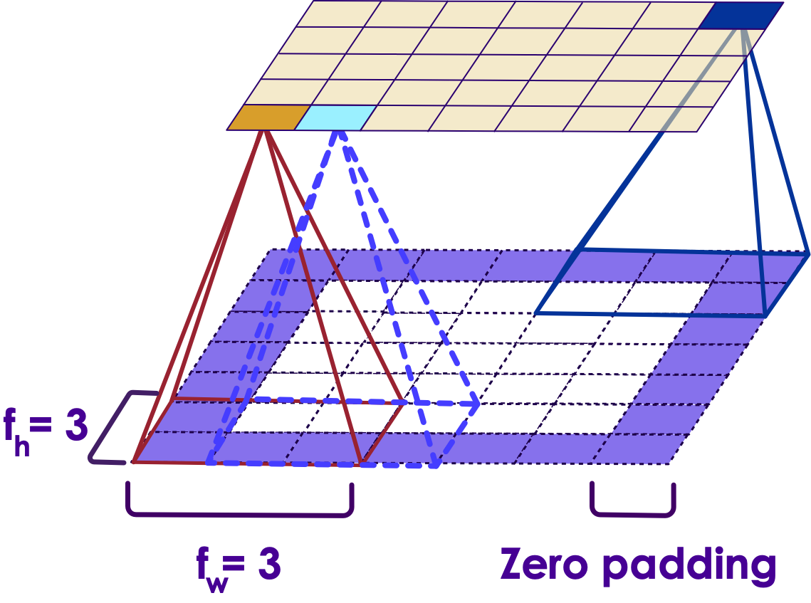
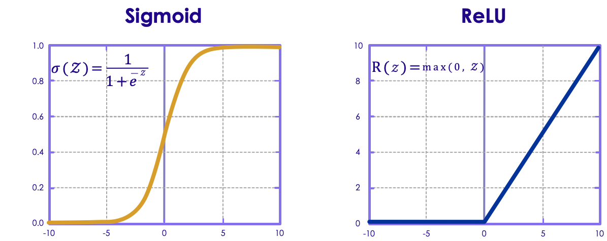

# Introducing Convolutions
---

## Process of Convolution

<!-- {"left" : 7.81, "top" : 0.99, "height" : 2.29, "width" : 2.29} -->

 * Imagine a small patch being slid across the input image. This sliding is called  **convolving**.

 * It is similar to a flashlight moving from the top left end progressively scanning the entire image. This patch is called the  **filter/kernel**. The area under the filter is the receptive field.

 * The idea is to detect local features in a smaller section of the input space, section by section to eventually cover the entire image.

 * In other words, the CNN layer neurons depends only on nearby neurons from the previous layer. This has the impact of discovering the features in a certain limited area of the input feature map.

Notes: 

---

## Process of Convolution

 * Assume the filter/kernel is a weight matrix "wk". For example, let's assume a 3X3 weighted matrix.

|   |   |   |
|---|---|---|
| 0 | 1 | 1 |
| 1 | 0 | 0 |
| 1 | 0 | 1 |
<!-- {"left" : 3.36, "top" : 2.17, "height" : 1.6, "width" : 3.53} -->

 * The weight matrix is a filter to extract some particular features from the original image. It could be for  extracting curves, identifying a specific color, or recognizing a particular voice.
 * Assume the input to be 6X6

|    |    |     |    |    |     |
|----|----|-----|----|----|-----|
| 81 | 2  | 209 | 44 | 71 | 58  |
| 24 | 56 | 108 | 98 | 12 | 112 |
| 91 | 0  | 189 | 65 | 79 | 232 |
| 12 | 0  | 0   | 5  | 1  | 71  |
| 2  | 32 | 23  | 58 | 8  | 208 |
| 4  | 23 | 2   | 1  | 3  | 9   |

<!-- {"left" : 5.69, "top" : 5.98, "height" : 2.8, "width" : 4.3} -->

Notes: 

---

## Process of Convolution (Contd.)

 * As the filter/kernel is slided across the input layer, the convolved layer is obtained by adding the values obtained by element wise multiplication of the weight matrix.
 *  **Input layer** / **Filter** 

|        |        | Input   | Layer |    |     |
|--------|--------|---------|-------|----|-----|
| **81** | **2**  | **209** | 44    | 71 | 58  |
| **24** | **56** | **108** | 98    | 12 | 112 |
| **91** | **0**  | **189** | 65    | 79 | 232 |
|   12   |   0    |   0     | 5     | 1  | 71  |
|   2    |   32   |   23    | 58    | 8  | 208 |
|   4    |   23   |   2     | 1     | 3  | 9   |

<!-- {"left" : 1.02, "top" : 3.88, "height" : 2.8, "width" : 5.46} -->
&nbsp;

|   | Filter |   |
|---|--------|---|
| 0 | 1      | 1 |
| 1 | 0      | 0 |
| 1 | 0      | 1 |

<!-- {"left" : 6.96, "top" : 3.88, "height" : 1.6, "width" : 2.28} -->

---

## Weighted Matrix

 *  **(Weighted matrix)** 

|     |   |   |   |
|-----|---|---|---|
| 515 | 0 | 0 | 0 |
| 0   | 0 | 0 | 0 |
| 0   | 0 | 0 | 0 |

<!-- {"left" : 0.25, "top" : 1.66, "height" : 2, "width" : 9.75} -->

 * For example, when the weighted matrix starts from the top left corner of the input layer, the output value is calculated as:

 * (81x0+2x1+209x1)+(24x1+56x0+108X0)+(91x1+0x0+189x1) = 515

Notes: 

---

## Process of Convolution (Contd.)

 * The filter then moves by 1 pixel to the next receptive field and the process is repeated. The output layer obtained after the filter slides over the entire image would be a 4X4 matrix.
 * This is called an  **activation map/ feature map**.
 *  **Input layer**/**Filter**

|    |        | Input   | Layer  |    |     |
|----|--------|---------|--------|----|-----|
| 81 | **2**  | **209** | **44** | 71 | 58  |
| 24 | **56** | **108** | **98** | 12 | 112 |
| 91 | **0**  | **189** | **65** | 79 | 232 |
| 12 |   0    |   0     |   5    | 1  | 71  |
| 2  |   32   |   23    |   58   | 8  | 208 |
| 4  |   23   |   2     |   1    | 3  | 9   |

<!-- {"left" : 1.02, "top" : 4.39, "height" : 2.8, "width" : 5.46} -->

|   | Filter |   |
|---|--------|---|
| 0 | 1      | 1 |
| 1 | 0      | 0 |
| 1 | 0      | 1 |

<!-- {"left" : 6.96, "top" : 4.39, "height" : 1.6, "width" : 2.28} -->

---

## Output

 *  **Output** 

|     |     |   |   |
|-----|-----|---|---|
| 515 | 374 | 0 | 0 |
| 0   | 0   | 0 | 0 |
| 0   | 0   | 0 | 0 |

<!-- {"left" : 0.25, "top" : 1.6, "height" : 2, "width" : 9.75} -->

 *  **(Activation/Feature Map)** 

 * The distance between two consecutive receptive fields is called the  **stride** .

 * In this example stride is 1 since the receptive field was moved by 1 pixel at a time.

Notes: 

---

## Convolutional Layer

 * It is also possible to connect a large input layer to a much smaller layer by spacing out the receptive fields, i.e., increasing the stride.

 * In the diagram:

     - Input layer is 5x7

     - Output layer is 3x4

     - Receptive field is 3x3

     - Stride is 2 

 * Here stride is same across two dimensions, but in general it can be different across height "sh" and width "sw".

Notes: 

---

## Convolutional Layer

 * The image shows two kernels - vertical and horizontal filters. Each is a 5x5 matrix with all 0s, except 1 in vertical line for vertical filter and 1 in horizontal line in horizontal filter.

<!-- {"left" : 2.59, "top" : 2.93, "height" : 3.2, "width" : 5.06} -->

 *  **VERTICAL AND HORIZONTAL FILTERS** 

Notes: 

---

## Convolutional Layer (Contd.)

 * The effect of multiplying with vertical kernel filter is that all pixels except the vertical lines get subdued. Similarly with horizontal kernel filter, it accentuates the horizontal lines. 

 * The output image has a feature map, which highlights the areas in the image that are most similar to the filter.

<!-- {"left" : 2.11, "top" : 3.89, "height" : 3.81, "width" : 6.02} -->

Notes: 

---

# Padding

---

## Zero Padding

 * A neuron located in row i, column j of a given layer is connected to neurons in the previous layer located in rows i to i+fh-1, columns j to j+fw-1, where fh and fw are the height and width of the receptive field.
 * To maintain height and width dimensions of convolutional layer same as previous layer, one zero-pads the input layer.

<!-- {"left" : 3, "top" : 4.13, "height" : 3.17, "width" : 4.26} -->

 *  *CNN layer with zero padding* 

Notes: 

---

## Zero Padding

 * Assumptions
   - Output image is `32 x 32 x 3`
   - Filter size is `5 x 5 x 3`
 * To achieve the **same** size:
   - You need padding of ` (K - 1) / 2`
   - In this case `(5 - 1) / 2 = 2`
 * We pad a "frame" around the image
   - black pixels
   - size 2
   - Image is then `36 x 36 x 3`
 * Output Size:
   - `O = ((W - K - 2P) / S) + 1`

Notes: 

---

## Convolutional Layer Hyperparameters

 * The hyperparameters of CNN are:

 *  **Padding type** 

 *  **Filter height and width** 

 *  **Strides** 

 *  **Number of filters** 

Notes: 

---
# Stacking Filters
---

## Stacking Multiple Feature Maps

 * A single feature map has same parameters as a single kernel has the same weights/parameters as it moves across the image; however, different feature maps can have different parameters (weights + biases).

 * The receptive field of previous layer extends across all of its feature maps.

 * In summary, a convolutional layer applies multiple filters to the input image, making it capable of detecting multiple features in the input.

 *  *CNN layers with multiple feature maps* 

<!-- {"left" : 3.02, "top" : 5.73, "height" : 2.75, "width" : 4.2} -->

Notes: 

---

## Stacking Multiple Feature Maps (Contd.)

<!-- {"left" : 5.23, "top" : 1.69, "height" : 3.21, "width" : 4.92} -->

 * Images that are greyscale have just one channel. So it needs just 1 sublayer. Colored images have three channels - Red, Green and Blue. So it needs 3 sublayers.

 * Satellite imagery that capture extra light frequencies (e.g. infrared) can have more channels.

 *  *CNN layers with multiple feature maps* 

Notes: 

---

## Stacking Multiple Feature Maps (Contd.)

<!-- {"left" : 5.23, "top" : 1.69, "height" : 3.21, "width" : 4.92} -->

 * The fact that all neurons in a feature map has just one set of parameters dramatically reduces the no of parameters needed.
 * This also means that once a CNN has learned to recognize a pattern in one location, it can recognize it in any other location. This is known as location invariance. 
 * In contrast, if a regular DNN has learned to recognize a pattern in one location, it can recognize it only in that location.

Notes: 

---

## ReLU Layer

<!-- {"left" : 1.44, "top" : 0.96, "height" : 2.93, "width" : 7.36} -->

 * After every conventional layer, a non linearity is applied to the neural network. 
 * Research has found that ReLU layers can train the neural networks much faster than other activation functions.
 * In ANN, non linearity functions like sigmoid is used. 
 * ReLU layers apply an activation function,   **f(x)= max(0,x),** 
 * which essentially drops all negative units.

Notes: 

---

## Pooling Layer

<!-- {"left" : 8.13, "top" : 1, "height" : 0.99, "width" : 2.01} -->

 * A pooling layer is used to sub-sample (i.e., shrink) the input image.
 * Like a convolutional layer, a pooling layer is connected to a small set of neurons in input image which fall within a receptive field.
 * In detail, a pooling layer takes each feature map output from the convolutional layer and prepares a condensed feature map.
 * This layer by itself does not have any weights.
 * Its function is to progressively reduce the spatial size of the representation to reduce the weight of the parameters in the network. This also controls overfitting.
 * A pooling layer has size, stride and padding type, as in case of a convolutional layer.

Notes: 

---

## Pooling Layer

 * Advantages:
   - Reduce computational load
   - Reduce memory usage
   - Reduce no of parameters (thereby help reduce overfitting)
   - Increase location invariance (i.e. tolerate a little bit of image shift)

 * Pooling allows invariance, which means that output is less sensitive to changes to input. Invariance is useful when it is more imp. to test for presence of certain features rather than the location of those features. e.g. in face detection, we wish to detect left eye and right eye, their precise locations are less important. This is what we mean by invariance.- In certain cases where location is important, invariance is not acceptable. e.g. when we wish to detect in an image the edge where the two walls meet

Notes: 

---

## Pooling Layer

<!-- {"left" : 2.26, "top" : 1.1, "height" : 2.83, "width" : 5.73} -->

 * The figure shows a max pooling layer with 2x2 kernel, stride 2 and no padding. 
 * Max-pooling involves taking the maximum value out of a group of input values.
 * Prioritizes the *largest* of the values from among a group of values.
 * Instead of height and weight pooling, one can pool over the depth dimension also, in which case the no of channels will reduce.

Notes: 

---

## Fully Connected layer

 * Typically CNN networks have a fully connected layer in the end to assemble all the information processed by the various CNN layers so far. 

 * The fully connected layer is usually followed by Softmax classifier, in case of classification functions e.g. to classify an input image as containing a person, animal or a vehicle.

Notes: 

---

## Issues in CNN

 * A major issue with CNNs is that they need a huge amount of RAM, particularly during backpropagation, where all computations made during forward pass have to be preserved.

 * Distribute CNN across multiple devices

 * Use 16-bit floats instead of 32-bit floats

 * Use a stride

 * Remove few layers

 * Try reducing mini-batch size

Notes: 

