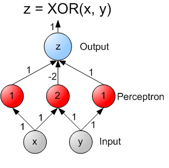

# Feed Forward Networks 

---

## Feedforward Neural Networks (FFNN)

- As we have seen earlier, single layer NNs can solve simple, linear problems

- To solve more complex problems (with non-leanear solutions) we need a more complex setup

- This is where **Feedforward Networks** come in

- Also known as
    - **Multi Layer Perceptrons (MLP)**
    - **Deep Feedforward Neural Networks (DFNN)**

---

## Feedforward Network Design 

- There are multiple layers 
- Each layer has many neurons 
- Each neuron is connected to neurons on previous layer 
- Information flows through ONE-WAY (no feedback loop)
- Composed of : Input, Output and Middle (Hidden) layers

<!-- {"left" : 3.09, "top" : 3.49, "height" : 3.73, "width" : 4.06} -->

---

## Hidden Layers 

- Layers between Input and Output are called **Hidden Layers**
- If there is more than one hidden layers, it is called **Deep Neural Network**

 &nbsp; &nbsp; &nbsp; <!-- {"left" : 0.9, "top" : 2.97, "height" : 3.53, "width" : 3.66} --><!-- {"left" : 5.28, "top" : 2.92, "height" : 3.62, "width" : 3.94} -->

---

## Non-Linearity

- Hidden layers can model 'non-linear' functions 
    - one hidden layer can model any continuous functions
    - two or more hidden layers can model discontinuous functions

- Remember the XOR problem?  We couldn't solve it using single layer perceptron.

- But using hidden layers, we can solve it very easily

 &nbsp;  &nbsp; <!-- {"left" : 0.83, "top" : 3.87, "height" : 3.32, "width" : 4.74} --><!-- {"left" : 6.07, "top" : 4.07, "height" : 3.32, "width" : 3.35} -->

---

# Playing with Hidden Layers

[DL-Playground.md](DL-Playground.md#Hidden Layers)

---

## Feedforward Network Sizing

 * Input Layer:
     - Size: Equal to Number of Input Dimensions
        - 2 dimensional inputs --> size=2
        - Possibly add one extra neuron for bias term.
     - What if we have thousands of sparse dimensions?
        * Consider Wide and Deep Neural Network

 * Output Layer:
     - Regression: 1 single neuron (continuous output)
     - Binomial Classification: 1 single neuron (binary output)
     - Multinomial Classification: Softmax Layer
        - Size: 1 node per class label
        - E.g. classifying digits (0 to 9) will need 10 neurons

 * Hidden Layer(s)
     - We will see this in the next section

Notes:

---

## Jump to 'DL-Concepts'

- To instructor : Cover 'DL-Concepts'

- And then do the labs in the next section

---

## Lab: Tensorflow MNist Example

<!-- {"left" : 7.45, "top" : 1, "height" : 3.25, "width" : 2.44} -->

 *  **Overview:**   
 In this lab, we will explore MNIST 

 *  **Approximate time:** 15-20 minutes

 *  **Lab Instructions:**

     - follow  **lowlevel/3.2-NoHidden.ipynb** file

