# Intro to Deep Learning

---

# Deep Learning Overview

---

## Resources

* [Neural networks and deep learning](https://learning.oreilly.com/library/view/neural-networks-and/9781492037354/)  
by  Aurélien Géron (ISBN: 9781492037347)

* [Hands-on Machine Learning with Scikit-Learn, Keras, and TensorFlow, 2nd Edition](https://learning.oreilly.com/library/view/hands-on-machine-learning/9781492032632/)  
by  Aurélien Géron (ISBN: 9781492032649)

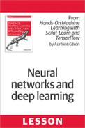
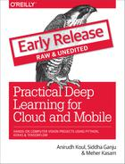

---

## Resources

* [Deep Learning](https://learning.oreilly.com/library/view/deep-learning/9781491924570/)  
by by Adam Gibson, Josh Patterson(ISBN: 9781491914250)

* [Practical Deep Learning for Cloud and Mobile](https://learning.oreilly.com/library/view/practical-deep-learning/9781492034858/)  
by Meher Kasam, Siddha Ganju, Anirudh Koul (ISBN: 9781492034841)

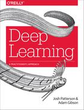

---
## Video: Why is Machine Learning Important

[Link](https://www.youtube.com/watch?v=HcqpanDadyQ)

Nice introduction to ML from Google.

Notes:

https://www.youtube.com/watch?v=HcqpanDadyQ

---

## AI / Machine Learning / Deep Learning

 <!-- {"left" : 3.07, "top" : 3.24, "height" : 4.11, "width" : 4.11} -->

 *  **Artificial Intelligence (AI):** Broader concept of machines being able to carry out 'smart' tasks

 *  **Machine Learning:** A type of AI that allows software to learn from data without explicitly programmed

 *  **Deep Learning:** Using Neural Networks to solve some hard problems

Notes:

http://www.teglor.com/b/deep-learning-libraries-language-cm569/

---
## Deep Learning

- **Deep Learning** is a special subset of Machine Learning that uses '**Neural Nets**' (loosely fashioned from neurons from human brain)

- Can do supervised and unsupervised learning

- Getting very popular due to availability of huge amount of data and vast compute power

Notes:

- https://www.quora.com/What-is-the-difference-between-deep-learning-and-usual-machine-learning
- https://www.wired.com/2016/06/deep-learning-isnt-dangerous-magic-genie-just-math/
- https://en.wikipedia.org/wiki/AlphaGo

---

## Hype Cycle

**Question for the class**  
Where do you think AI is in this cycle? :-)

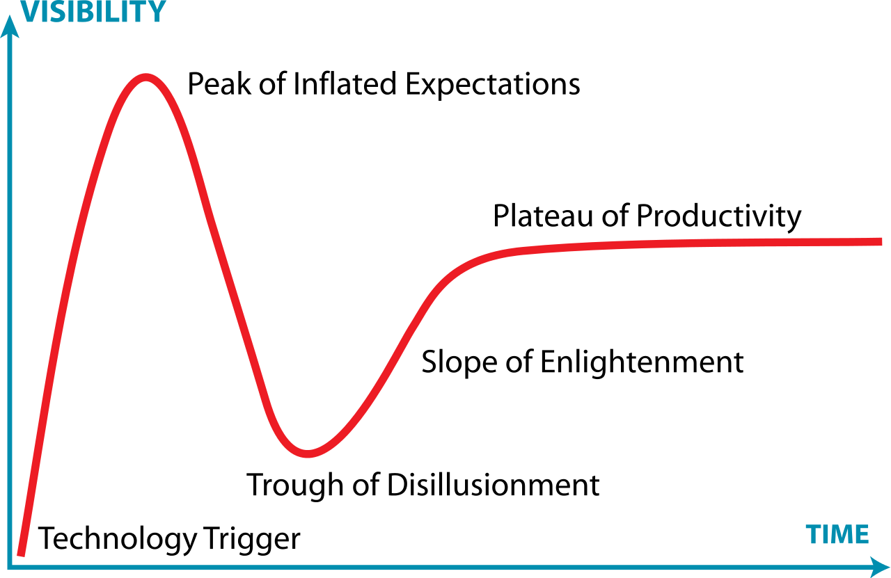

Notes:
- https://en.wikipedia.org/wiki/Hype_cycle

---

## Deep Learning Applications

- Self Driving Cars
     - ML system recognizes edge of the road, road sign and car in front

- Face recognition
     - Facebook images: System learns from images manually tagged and then automatically detects faces in uploaded photos

 <!-- {"left" : 0.55, "top" : 4.17, "height" : 2.97, "width" : 4.46} -->
 <!-- {"left" : 5.26, "top" : 4.17, "height" : 2.97, "width" : 4.44} -->

Notes:

- Image credit : Wikimedia : CCZero license : https://commons.wikimedia.org/wiki/File:Driver_free_car.jpg
- Image credit : WikiMedia : (Creative Commons) : https://commons.wikimedia.org/wiki/File:Face_detection.jpg

---
# Deep Learning History

---

## Early AI (1950s – 1980s):  Rule-Based Approaches

 * Early AI approaches were largely rule-based.

 * Example: Natural Language Processing:

     - Tended to follow grammatical/linguistic processing rules.

     - Problem: Natural Language proved very difficult to unambiguously interpret.

 * Predicate Logic / Rules Engines

     - Based on Mathematical Theorem provers  / Logic

     - Represent knowledge as declarative statements

     - Able to achieve success in very limited domains of knowledge.

Notes:

---
## Machine Learning

 * Machine Learning arose as an alternative to traditional AI

 * Focused initially on purely statistical approaches.

 * Able to achieve very good results on problems that were not easy to solve with rule-based approaches.

 * ML is a data-driven approach:

     - Making inferences from Data

Notes:

---
## Neural Networks

 * Neural Networks Have a long history in Machine Learning

 * 1980s-1990s: Neural Networks invented to pattern the human brain.

 * Early attempts to make a general-purpose learning algorithm largely failed.

 * Backpropagation training algorithm saw some success.

Notes:

---
## Neural Networks Timeline

Notes:
ref : https://beamandrew.github.io/deeplearning/2017/02/23/deep_learning_101_part1.html

---
## AI Winter (1980s / 1990s)

* In 1990s, Neural networks fell out of favor.
     - AI in general was perceived as pie-in-the-sky/academic
     - "Expert Systems" and "Rules Engines" found only niche applications.

* Neural Networks Received Criticism
     - Too hard to train
     - Resulting Model not transparent enough.
     - Not suitable for large datasets
     - “Toy Problems”

Notes:
- https://en.wikipedia.org/wiki/AI_winter
---

## AI Winter - Parallelization Challenges

- High Performance Computing (HPC) was all about parallelization

- NN considered hard to parallelize.

-  Compute Power was insufficient for the time

- Training Datasets were insufficiently sized for good results.

Notes:

---
## Surge of Statistical Machine Learning

 * Statistical Machine Learning became the method of choice

 * Well Understood (Applied Statistics)

 * Achieved impressive results compared to previous rule-based approaches

 * Ensemble Methods (Random Forests, Gradient Boosted Trees) gave impressive results.

 * Resultant Models often fairly transparent

     - Example: Credit scoring algorithms: Have to unambiguously show WHY the model gives the result it does.

Notes:

---
## Godfathers of Neural Networks

- [Geoffrey Hinton](https://en.wikipedia.org/wiki/Geoffrey_Hinton) @ Google, University of Toronto.  
Kept NN research going during 'AI Winter'

- [Yann LeCun](http://yann.lecun.com/) - Chief AI researcher @ Facebook, Professor @ University of New York

- [Yoshua Bengio](https://en.wikipedia.org/wiki/Yoshua_Bengio) - Professor @ University of Montreal

Notes:
- https://www.deeplearningitalia.com/godfather-2/
- https://torontolife.com/tech/ai-superstars-google-facebook-apple-studied-guy/
- https://www.nytimes.com/2016/12/14/magazine/the-great-ai-awakening.html

---
## Thawing of AI Winter (2008 + )

- 2012 Google created a neural network that can 'identify' cats from YouTube videos

Notes:
- https://torontolife.com/tech/ai-superstars-google-facebook-apple-studied-guy/

---
## Deep Learning Right Now

* In the modern era, Deep Learning has been successful.  The following factors made it possible

-  **'Big Data**' – now we have so much data to train our models

-  **'Big Data ecosystem**' – excellent big data platforms (Hadoop, Spark, NoSQL) are available as open source

-  **'Big Compute**'  -  **cloud**  platforms significantly lowered the barrier to massive compute power
    - $1 rents you a `16 core + 128 G + 10 Gigabit` machine for 1 hr on AWS! So running a 100 node cluster for 5 hrs $500

- **Advances in hardware** (see next slides)

- **Advances in Algorithms**

- **Availability of pre-trained models**

Notes:

---

## Hardware Advances: CPU & GPU

- Recently GPUs – Graphics Processing Units - have become popular (especially in Deep Learning)

- GPU cores are good at compute intensive calculations (math, matrix operations)

- Each GPU core is capable of executing small set instructions, but there are 1000s of core per GPU
Running in parallel

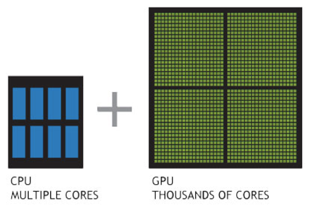

Notes:

---
## Hardware Advances - CPU

- Modern Intel Xeon CPUs (E5 or later) have vectorized linear algebra
    - Properly optimized, approaches speed of GPUs
    - And offers faster I/O performance for Big Data.

- [Intel Math Kernel Library](https://software.intel.com/en-us/mkl) : highly optimized, threaded, and vectorized math functions that maximize performance on each processor family

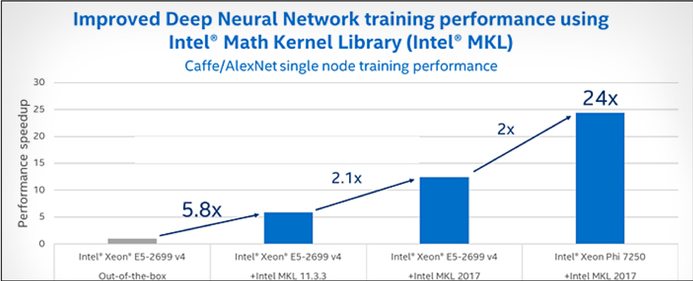

Notes:
- https://software.intel.com/en-us/mkl

---

## Hardware Advances - TPU

- A **Tensor processing unit (TPU)** is an AI accelerator application-specific integrated circuit (ASIC) developed by Google specifically for neural network machine learning

- More capable the CPUs / GPUs in certain tasks

- Designed / optimized  for Tensorflow

- Designed for high volume computes
    - A TPU can process 100 million photos a day

- Available in Google Cloud platform

Notes:
- https://cloud.google.com/tpu/
- https://en.wikipedia.org/wiki/Tensor_processing_unit

---

## Google Cloud TPU

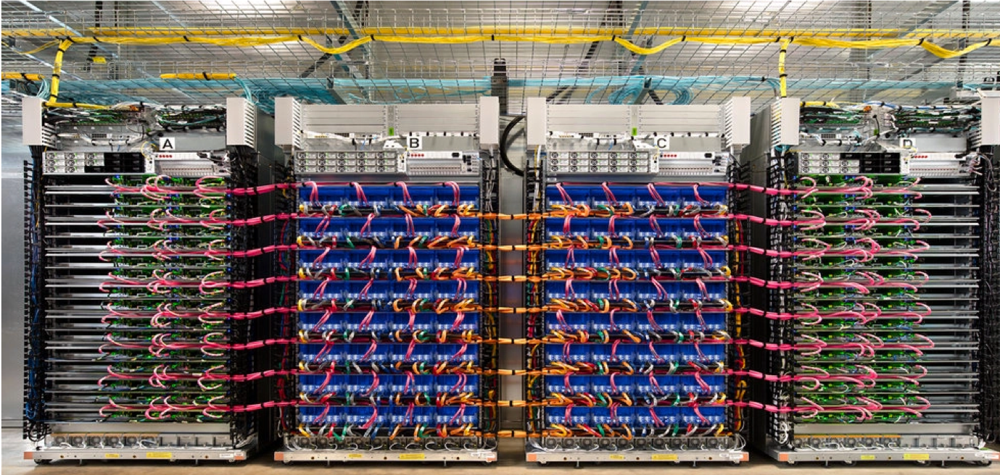

---

## Video: CPU vs. GPU

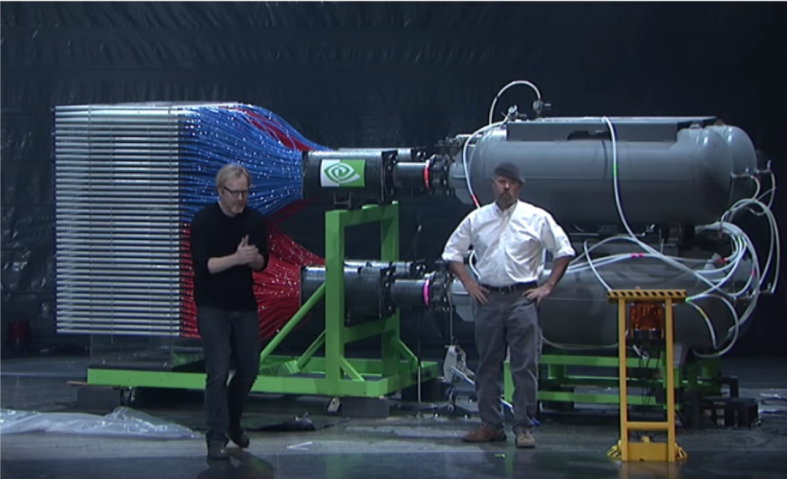

[Link](https://www.youtube.com/watch?v=-P28LKWTzrI)

From Myth Busters hosts!

Notes:

https://www.youtube.com/watch?v=-P28LKWTzrI

---

## Video: Nvidia Self Driving Car

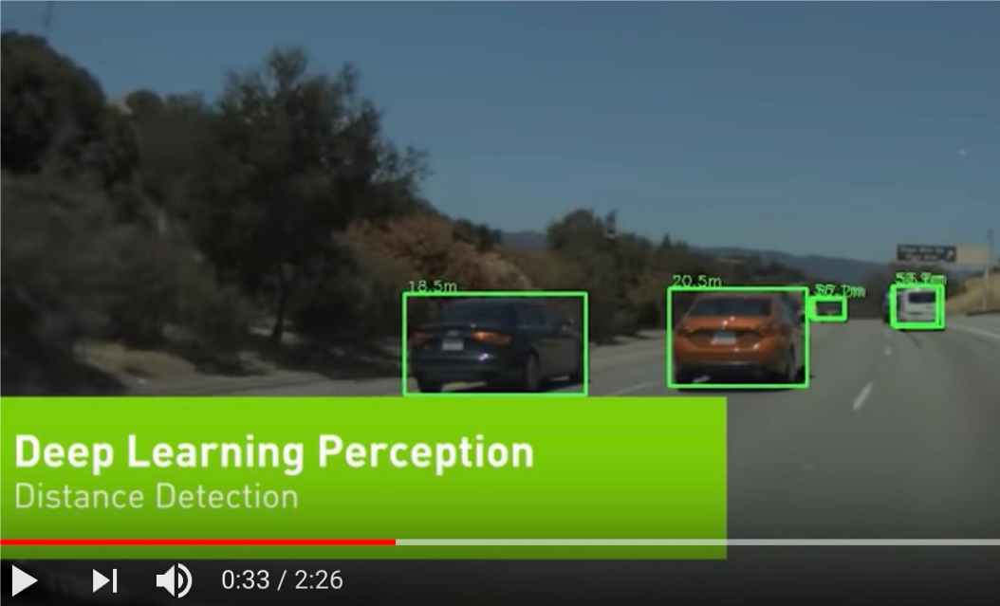

[Link](https://www.youtube.com/watch?v=0rc4RqYLtEU)

Nice video showing Deep Learning perceptions during self driving.

Notes:

https://www.youtube.com/watch?v=0rc4RqYLtEU

---

## Video: Audi Autonomous Driving

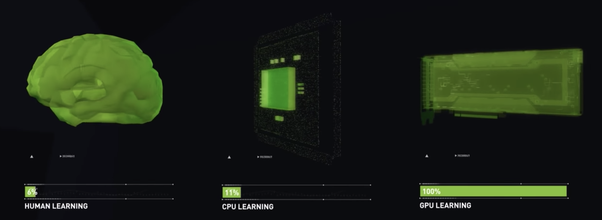

[Link](https://www.youtube.com/watch?v=DjAJnQoNdMA)

Audi's self driving car program explained.  
Good comparison of brain vs. CPU vs. GPU around 50 second mark.

Notes:

https://www.youtube.com/watch?v=DjAJnQoNdMA

---
## Video: Google TPU

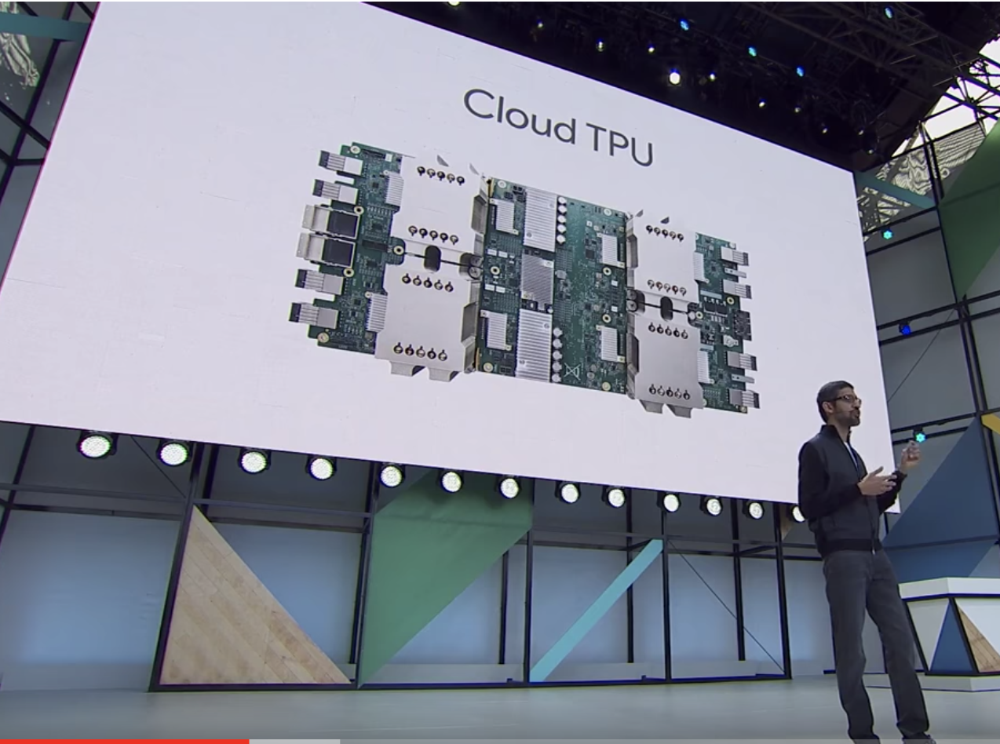

[Link](https://www.youtube.com/watch?v=UsDhVx6cOrw)

- Google CEO Sundar Pichai announces TPU @ Google I/O 2017
    - Training vs Inference performance @ 1:30
    - AutoML @ 4:25

Notes:

https://www.youtube.com/watch?v=UsDhVx6cOrw

---

## Advances in Deep Learning Research

- In recent years, lot of money is chasing Deep Learning

- Companies like Google / Facebook / Amazon are in an 'arms race' to hire the best talent in AI

- Lot of research going on in public / private sectors

- Organizations like OpenAI are fostering research in public domain

---
## Creating Deep Learning Models Have Become Easier

- Historically, neural network models had to be coded from scratch
    - Converting math into code, testing and debugging
    - This could take weeks or months

- **Now tooling and libraries have gotten so much better**
    - High level tools like Keras and efficient libraries like Tensorflow, allow us to code complex models very quickly

---
## Availability of Pre-Trained Models

> "If I have seen further it is by standing on the shoulders of giants"  
>  -- Isaac Newton

- Creating complex models takes lot of data and lot of training
    - this can take huge amount of compute power (days or weeks of training)

- Now, we don't have to start from scratch

- There are lot of high quality models that are open source.  We can start with them and tweak them to fit our needs

- _This is probably the biggest reason DL has become mainstream_

- See example on next slide

---

## Model Zoos

- Building and training complex models from scratch takes a lot of effort and compute

- Luckily, there are lot models available publicly  
    - Computer vision models : LeNet, AlexNet, ZFNet, GoogLeNet, VGGNet, Inception

- Available model zoos
    - [Tensorflow model zoo](https://github.com/tensorflow/models)
    - [Caffe model zoo](https://github.com/BVLC/caffe/wiki/Model-Zoo)

---

## Building on Other Models

- Say we want to develop a model that can classify people into male / female

- Rather than starting from scratch, we can start with a model that can recognize peopole

- And then train it more to classify them into male/female

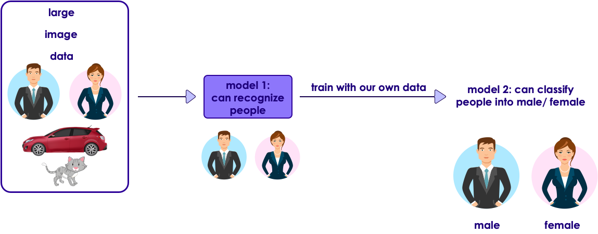

---

# Machine Learning vs. Deep Learning

---

## Structured Data vs. Unstructured Data

- Machine learning is usually used with 'structured data' (CSV files etc.)

- Deep learning can handle both structured (e.g. csv) and unstructured data (e.g. Image files, Video files)

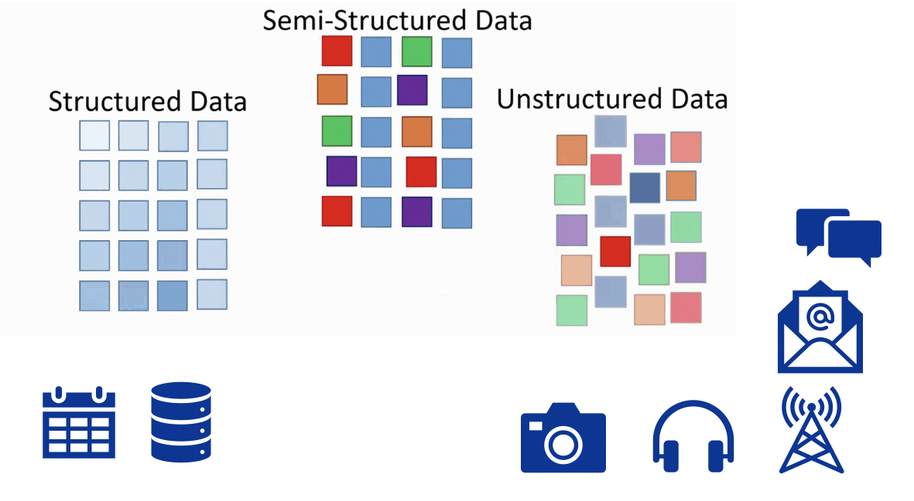

---

## Deep Learning Models Scale With Data

- DL algorithms scale better with data

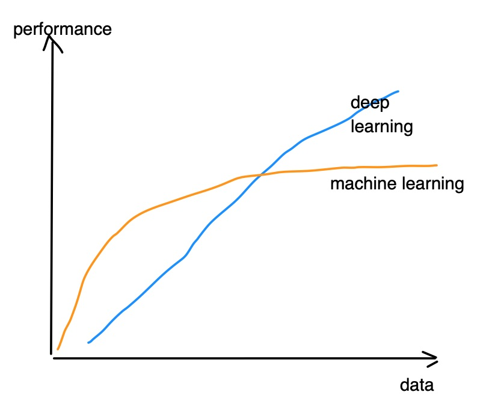

---

## Data & AI -- Historical Perspective

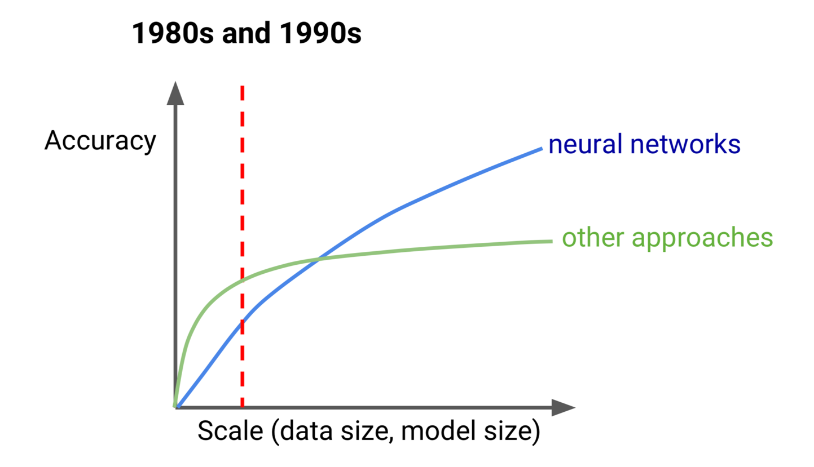

---
## Data & AI -- Historical Perspective

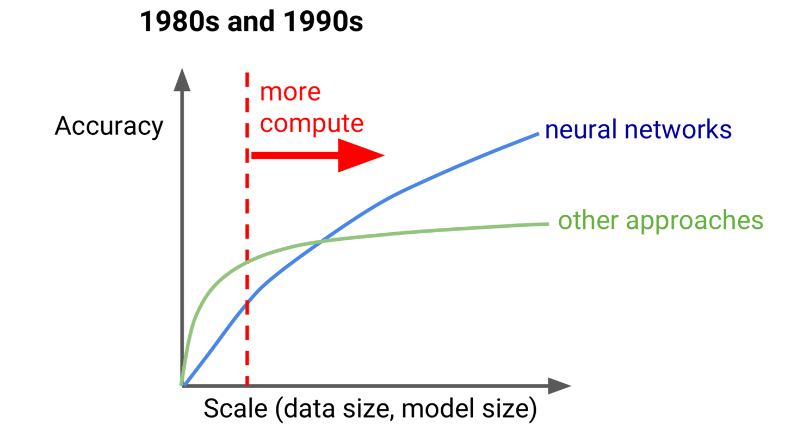

---

## Data & AI -- Historical Perspective

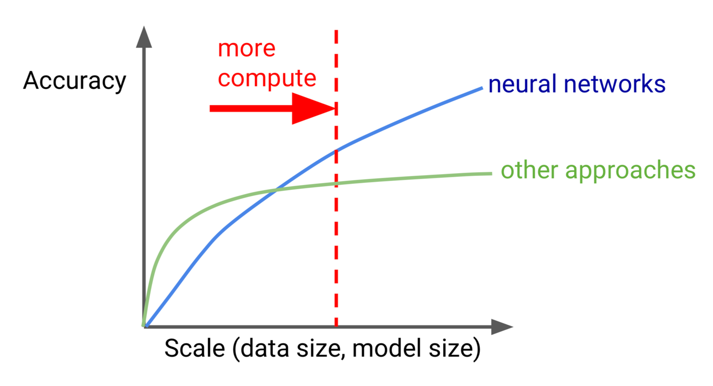

---

## Video: How Scale is Helping Deep Learning

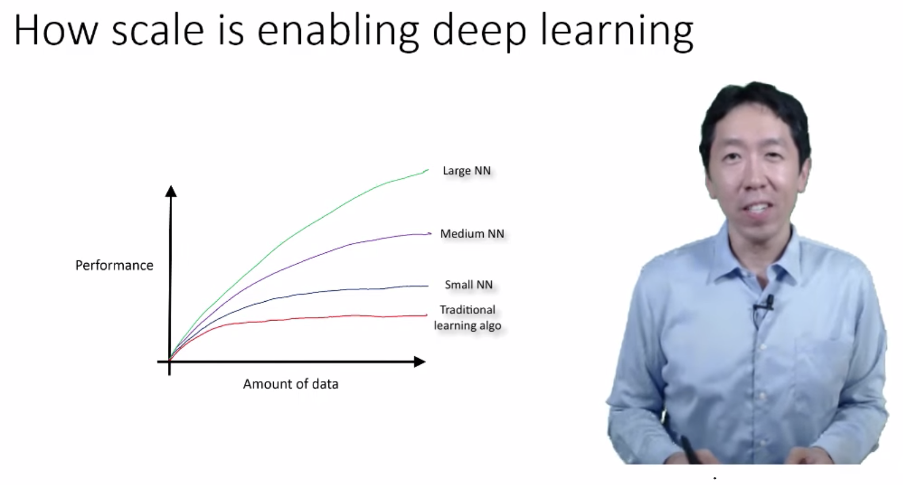

[Link](https://www.youtube.com/watch?v=LcfLo7YP8O4)

Andrew Ng explains how Deep Learning algorithms can scale better with data size.

Notes:

https://www.youtube.com/watch?v=LcfLo7YP8O4

---

# Deep Learning Software Ecosystem

---
## Deep Learning Libraries

- **Java**
    - [DL4J (Deep Learning 4J)](https://deeplearning4j.org/)
- **Python**
    - [TensorFlow](https://www.tensorflow.org/)
    - [Theano](http://deeplearning.net/software/theano/)
    - [Caffe2](https://caffe2.ai/)
    - [Keras](https://keras.io/)
- **R**
    - Deepnet
    - Darch
- **Mobile**
    - [CoreML](https://developer.apple.com/documentation/coreml) - by Apple
    - [Tensorflow Lite](https://www.tensorflow.org/lite) - by Google

---
## Deep Learning and Big Data

 * Until recently most of the machine learning is done on “single computer” (with lots of memory–100s of GBs)

 * Most R/Python/Java libraries are “single node based”

 * Now Big Data tools make it possible to run machine learning algorithms at massive scale–distributed across a cluster

 <!-- {"left" : 7.46, "top" : 0.99, "height" : 1.83, "width" : 2.03} -->

Notes:

---
## Deep Learning Software Ecosystem (Distributed)

- **Distributed**
    - Tensorflow
    - Spark
    - BigDL
- **Cloud Based**
    - [Amazon Machine Learning](https://aws.amazon.com/machine-learning/)
    - [Azure Machine Learning (Microsoft)](https://azure.microsoft.com/en-us/services/machine-learning-service/)
    - [Google Cloud AI](https://cloud.google.com/products/ai/)

Notes:
- http://www.kdnuggets.com/2016/04/top-15-frameworks-machine-learning-experts.html
- http://www.infoworld.com/article/2853707/machine-learning/11-open-source-tools-machine-learning.html

---
## Tools for Deep Learning - Tensorflow

 - [Tensorflow](https://www.tensorflow.org/) is an open source DL framework by Google

 - Became very popular in a very short period of time

 - Based on “data flow graphs”

 - Language support: Python, C++

 - Supports both CPU and GPU runtimes

 

Notes:

---
## Tools for Scalable Deep Learning - Spark

- Spark is very popular BigData processing platform (distributed compute engine)

- Massively scalable (100s of TBs to PB of data)

- Can cache data in memory for very fast iterations

- Spark ML now supports Tensorflow and Keras as backends

- Language support: Scala, Java, Python, R

---

## Tools for Scalable Deep Learning - BigDL

- BigDL is a scalable Deep Learning framework developed and open sourced by Intel

- Built on Spark, so is very scalable

- Can import models built with other frameworks (Torch, Caffe, TensorFlow)

- Uses [Intel MKL Libraries](https://software.intel.com/en-us/intel-mkl) for  high performance

- https://bigdl-project.github.io

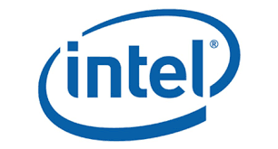

---
## Tools for Scalable Deep Learning - Cloud

- Popular Cloud platforms now offer 'Machine Learning as Service'

- Can provide huge scale

- Pay for use billing

- Offerings
    - Amazon Machine Learning
    - Azure ML Studio
    - Google Cloud ML

Notes:

---

## Image Recognition API Services

- [Clarifai](https://www.clarifai.com/) : winner of the 2013 ImageNet Large Scale Visual Recognition Challenge (ILSVRC) classification

- [Microsoft Cognitive Services](https://azure.microsoft.com/en-us/services/cognitive-services/) : Microsoft won seven tasks at the ImageNet Large Scale Visual Recognition Challenge (ILSVRC) in 2015 with ResNet-152 (a 152 layer network)

- [Google Cloud Vision](https://cloud.google.com/vision/) - Google won 2014 ImageNet Large Scale Visual Recognition Challenge (ILSVRC) with GoogLeNet (22 layers)

- [Amazon Rekognition](https://aws.amazon.com/rekognition/)

- [IBM Watson Visual Recognition](https://www.ibm.com/watson/services/visual-recognition/)

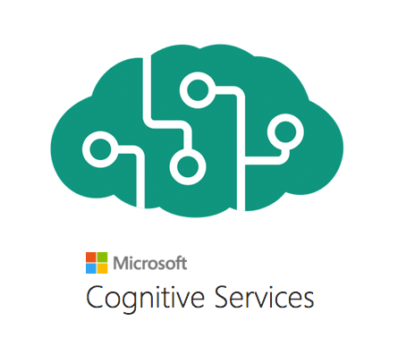

---
## Deep Learning in Mobile

- Why do DL on mobile?
- **Privacy** : so no data leaves the device.  This is important with PII (Personaly Identifiable Information) and Europe's GDPR (General Data Protection Regulation)
- **Reducing Cloud Cost** : By doing DL on the device and minimizing sending data to cloud, we can save time and money
- **Speed** : Sending data to cloud and getting an answer back can take several seconds
    - 10 seconds : user's keep their focus on a screen
    - 1 second : to keep workflow going
    - 0.1 second : users perceive system is working 'instantaneously'

---

## Deep Learning Mobile Libraries

- [CoreML](https://developer.apple.com/documentation/coreml) - by Apple
    - only supported on IOS (Apple) devices
    - supports models from  Keras, Caffe, XGBoost, Scikit-learn

- [Tensorflow Lite](https://www.tensorflow.org/lite) by Google
    - works on IOS and Android

- [MobileNets](https://arxiv.org/abs/1704.04861) - Optimized Convolutional Neural Networks for Mobile Vision Applications

Notes:  
- https://developer.apple.com/documentation/coreml
- https://www.tensorflow.org/lite

---

## Model Benchmarks

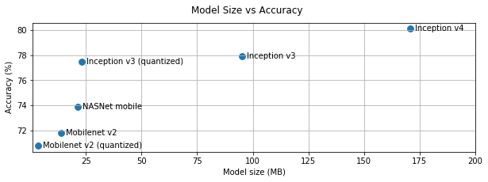

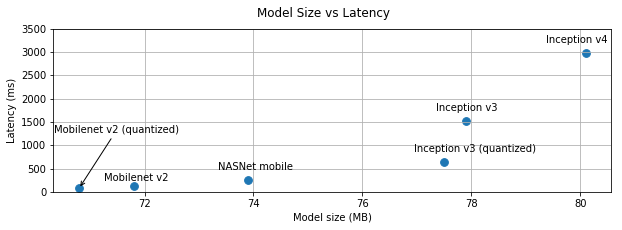

Notes:  
Source : https://www.tensorflow.org/lite/performance/best_practices

---

# Use Cases and Demos

---

## Use Case 1 : Uber driver verification

- To increase passenger safety, Uber drivers have to verify their identity before accepting rides

- Uber uses [Microsoft Cognitive Services](https://azure.microsoft.com/en-us/services/cognitive-services/) to recognize 7 million+ drivers in milli seconds

- [Link](https://venturebeat.com/wp-content/uploads/2016/09/uberids.gif?resize=343%2C600&strip=all)

---

## Use Case 2 : Photobucket

- [Photobucket](http://photobucket.com/) is a image / video hosting service

- They want to identify and tag NSFW (Not Safe For Work) images and offensive images

- Previously, their human moderation team was only able to monitor about 1% of content

- Now AI system (Using [Clarify](https://www.clarifai.com/)), screens images and tags them properly.  
Illegal images (child pornography ..etc) are flagged for law enforcement

- [Link](https://blog.clarifai.com/how-photobucket-uses-image-recognition-to-protect-its-community-from-unwanted-content)

Notes:  
- https://blog.clarifai.com/how-photobucket-uses-image-recognition-to-protect-its-community-from-unwanted-content

---

## Use Case 3 : Staples

- [Staples](https://www.staples.com) relies on organic search traffic to drive sales

- One way the ways to score high on search engine results is put meaningful ALT tags for each product images

- Doing it manually was an expensive proposition

- They use  [Clarify](https://www.clarifai.com/) to automatically tag images

- [Link](https://clarifai.com/customers/staples)

Notes:  
- https://clarifai.com/customers/staples

---

## Demo: Digit Recognition

- Simple NN to recognize hand-written digits

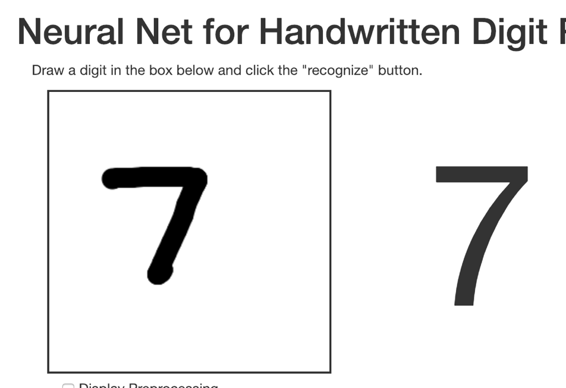

[Link](http://myselph.de/neuralNet.html)

Notes:

http://myselph.de/neuralNet.html

---

## Demo: Digit Recognition 2

- Cool visualization of signal path through NN

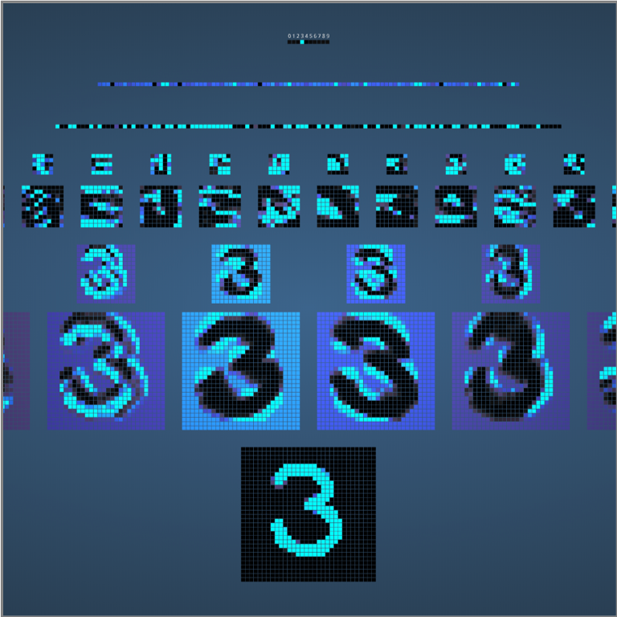

[Link](http://scs.ryerson.ca/~aharley/vis/conv/flat.html)

Notes:  
http://scs.ryerson.ca/~aharley/vis/conv/flat.html

---

## Clarifai Demo

- Go to : https://clarifai.com/demo

- Upload an image (or give a image URL)

- Examine the output.  
Have fun :-)

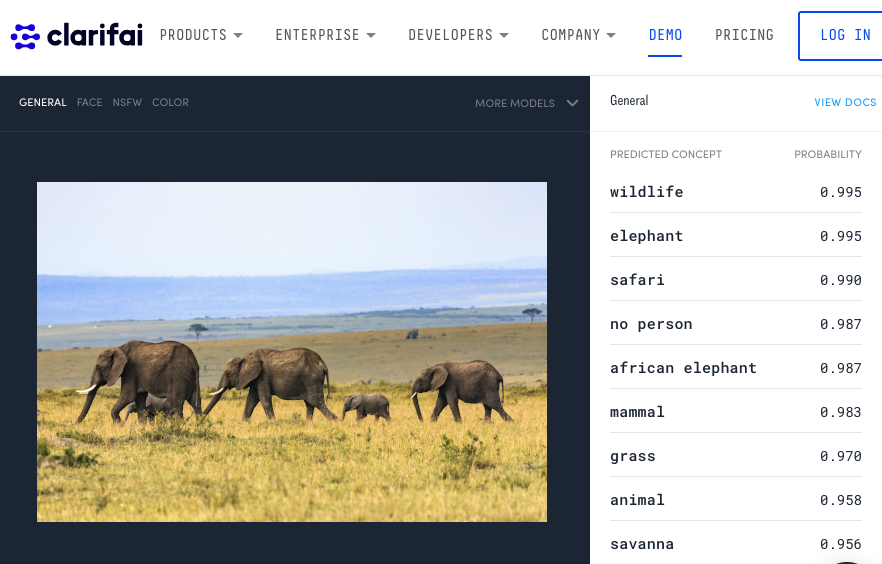

Notes:  
https://clarifai.com/demo

---

## Wrap up & Any Questions?

---
