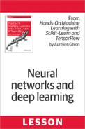
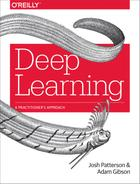

# Introduction to Deep Learning

---

# Deep Learning Overview

---

## Resources

* [Neural networks and deep learning](https://learning.oreilly.com/library/view/neural-networks-and/9781492037354/)  
by  Aurélien Géron (ISBN: 9781492037347)

* [Hands-on Machine Learning with Scikit-Learn, Keras, and TensorFlow, 2nd Edition](https://learning.oreilly.com/library/view/hands-on-machine-learning/9781492032632/)  
by  Aurélien Géron (ISBN: 9781492032649)

---

## Resources

* [Deep Learning](https://learning.oreilly.com/library/view/deep-learning/9781491924570/)  
by by Adam Gibson, Josh Patterson(ISBN: 9781491914250)

* [Practical Deep Learning for Cloud and Mobile](https://learning.oreilly.com/library/view/practical-deep-learning/9781492034858/)  
by Meher Kasam, Siddha Ganju, Anirudh Koul (ISBN: 9781492034841)

---
## Video: Why is Machine Learning Important

[Link](https://www.youtube.com/watch?v=HcqpanDadyQ)

Nice introduction to ML from Google.

Notes:

https://www.youtube.com/watch?v=HcqpanDadyQ

---

## Hype Cycle

**Question for the class**  
Where do you think AI is in this cycle? :-)

Notes:
- https://en.wikipedia.org/wiki/Hype_cycle

---

## AI / Machine Learning / Deep Learning

 <!-- {"left" : 3.07, "top" : 3.24, "height" : 4.11, "width" : 4.11} -->

 *  **Artificial Intelligence (AI):** Broader concept of machines being able to carry out 'smart' tasks

 *  **Machine Learning:** A type of AI that allows software to learn from data without explicitly programmed

 *  **Deep Learning:** Using Neural Networks to solve some hard problems

Notes:

http://www.teglor.com/b/deep-learning-libraries-language-cm569/

---
## Deep Learning

- **Deep Learning** is a special subset of Machine Learning that uses '**Neural Nets**' (loosely fashioned from neurons from human brain)

- Can do supervised and unsupervised learning

- Getting very popular due to availability of huge amount of data and vast compute power

Notes:

- https://www.quora.com/What-is-the-difference-between-deep-learning-and-usual-machine-learning
- https://www.wired.com/2016/06/deep-learning-isnt-dangerous-magic-genie-just-math/
- https://en.wikipedia.org/wiki/AlphaGo

---

## Deep Learning Applications

- Self Driving Cars
     - ML system recognizes edge of the road, road sign and car in front

- Face recognition
     - Facebook images: System learns from images manually tagged and then automatically detects faces in uploaded photos

 <!-- {"left" : 0.55, "top" : 4.17, "height" : 2.97, "width" : 4.46} -->
 <!-- {"left" : 5.26, "top" : 4.17, "height" : 2.97, "width" : 4.44} -->

Notes:

- Image credit : Wikimedia : CCZero license : https://commons.wikimedia.org/wiki/File:Driver_free_car.jpg
- Image credit : WikiMedia : (Creative Commons) : https://commons.wikimedia.org/wiki/File:Face_detection.jpg

---
# Deep Learning History

---

## Early AI (1950s - 1980s):  Rule-Based Approaches

 * Early AI approaches were largely rule-based.

 * Example: Natural Language Processing:

     - Tended to follow grammatical/linguistic processing rules.

     - Problem: Natural Language proved very difficult to unambiguously interpret.

 * Predicate Logic / Rules Engines

     - Based on Mathematical Theorem provers  / Logic

     - Represent knowledge as declarative statements

     - Able to achieve success in very limited domains of knowledge.

Notes:

---
## Machine Learning

 * Machine Learning arose as an alternative to traditional AI

 * Focused initially on purely statistical approaches.

 * Able to achieve very good results on problems that were not easy to solve with rule-based approaches.

 * ML is a data-driven approach:

     - Making inferences from Data

Notes:

---
## Neural Networks

 * Neural Networks Have a long history in Machine Learning

 * 1980s-1990s: Neural Networks invented to pattern the human brain.

 * Early attempts to make a general-purpose learning algorithm largely failed.

 * Backpropagation training algorithm saw some success.

Notes:

---
## Neural Networks Timeline

Notes:
ref : https://beamandrew.github.io/deeplearning/2017/02/23/deep_learning_101_part1.html

---
## AI Winter (1980s / 1990s)

* In 1990s, Neural networks fell out of favor.
     - AI in general was perceived as pie-in-the-sky/academic
     - "Expert Systems" and "Rules Engines" found only niche applications.

* Neural Networks Received Criticism
     - Too hard to train
     - Resulting Model not transparent enough.
     - Not suitable for large datasets
     - "Toy Problems"

Notes:
- https://en.wikipedia.org/wiki/AI_winter
---

## AI Winter - Parallelization Challenges

- High Performance Computing (HPC) was all about parallelization

- NN considered hard to parallelize.

-  Compute Power was insufficient for the time

- Training Datasets were insufficiently sized for good results.

Notes:

---
## Surge of Statistical Machine Learning

 * Statistical Machine Learning became the method of choice

 * Well Understood (Applied Statistics)

 * Achieved impressive results compared to previous rule-based approaches

 * Ensemble Methods (Random Forests, Gradient Boosted Trees) gave impressive results.

 * Resultant Models often fairly transparent

     - Example: Credit scoring algorithms: Have to unambiguously show WHY the model gives the result it does.

Notes:

---
## Godfathers of Neural Networks

- [Geoffrey Hinton](https://en.wikipedia.org/wiki/Geoffrey_Hinton) @ Google, University of Toronto.  
Kept NN research going during 'AI Winter'

- [Yann LeCun](http://yann.lecun.com/) - Chief AI researcher @ Facebook, Professor @ University of New York

- [Yoshua Bengio](https://en.wikipedia.org/wiki/Yoshua_Bengio) - Professor @ University of Montreal

- **These 3 won ACM Turing Award (Nobel price of computing) in 2019**

Notes:
- https://www.deeplearningitalia.com/godfather-2/
- https://torontolife.com/tech/ai-superstars-google-facebook-apple-studied-guy/
- https://www.nytimes.com/2016/12/14/magazine/the-great-ai-awakening.html
- https://www.wired.com/story/godfathers-ai-boom-win-computings-highest-honor/
- https://www.theverge.com/2019/3/27/18280665/ai-godfathers-turing-award-2018-yoshua-bengio-geoffrey-hinton-yann-lecun

---
## Thawing of AI Winter (2008 + )

- 2012 Google created a neural network that can 'identify' cats from YouTube videos
- Up until now, traditional machine learning algorithms are trained on labeled data.  
    - So to train an algorithm to distinguish between cats and dogs, we need thousands of images labeled as 'cat' and thousands of images labeled as 'dog'
    - labeling takes a lot of work, and not a lot of labeled data is available
- They built a huge neural network with **1 Billion+** connections and trained it on **16,000 CPU cores (distributed)**
- The network watched a lot of stills from YouTube videos and 'intuitively learned' to recognize cats
    - no one told the network what a cat looks like, it is 'self-taught'

- References : [1](https://googleblog.blogspot.com/2012/06/using-large-scale-brain-simulations-for.html),   [2](https://www.wired.com/2012/06/google-x-neural-network/)

Notes:

- References
    - ['Using large-scale brain simulations for machine learning and A.I.' - Google Blog](https://googleblog.blogspot.com/2012/06/using-large-scale-brain-simulations-for.html)
    - [Google AI learns to find cat videos -- Wired magazine](https://www.wired.com/2012/06/google-x-neural-network/)

---

# The Great AI Revival (2010 on)

[../../machine-learning/slides/AI-brief-history.md#The Great AI Revival](../../machine-learning/slides/AI-brief-history.md#The Great AI Revival)

---

# AI Vocabulary

[../../machine-learning/slides/AI-vocabulary.md](../../machine-learning/slides/AI-vocabulary.md)

---
# Machine Learning vs. Deep Learning

[../../machine-learning/slides/ML-vs-DL.md](../../machine-learning/slides/ML-vs-DL.md)

---

## Video: How Scale is Helping Deep Learning

[Link](https://www.youtube.com/watch?v=LcfLo7YP8O4)

Andrew Ng explains how Deep Learning algorithms can scale better with data size.

Notes:

https://www.youtube.com/watch?v=LcfLo7YP8O4

---

# Deep Learning Software Ecosystem

[DL-ecosystem.md](DL-ecosystem.md)

---

# Use Cases and Demos

---

## Use Case 1 : Uber driver verification

- To increase passenger safety, Uber drivers have to verify their identity before accepting rides

- Uber uses [Microsoft Cognitive Services](https://azure.microsoft.com/en-us/services/cognitive-services/) to recognize 7 million+ drivers in milli seconds

- [Link](https://venturebeat.com/wp-content/uploads/2016/09/uberids.gif?resize=343%2C600&strip=all)

---

## Use Case 2 : Photobucket

- [Photobucket](http://photobucket.com/) is a image / video hosting service

- They want to identify and tag NSFW (Not Safe For Work) images and offensive images

- Previously, their human moderation team was only able to monitor about 1% of content

- Now AI system (Using [Clarify](https://www.clarifai.com/)), screens images and tags them properly.  
Illegal images (child pornography ..etc) are flagged for law enforcement

- [Link](https://blog.clarifai.com/how-photobucket-uses-image-recognition-to-protect-its-community-from-unwanted-content)

Notes:  
- https://blog.clarifai.com/how-photobucket-uses-image-recognition-to-protect-its-community-from-unwanted-content

---

## Use Case 3 : Staples

- [Staples](https://www.staples.com) relies on organic search traffic to drive sales

- One way the ways to score high on search engine results is put meaningful ALT tags for each product images

- Doing it manually was an expensive proposition

- They use  [Clarify](https://www.clarifai.com/) to automatically tag images

- [Link](https://clarifai.com/customers/staples)

Notes:  
- https://clarifai.com/customers/staples

---

## Demo: Digit Recognition

- Simple NN to recognize hand-written digits

[Link](http://myselph.de/neuralNet.html)

Notes:

http://myselph.de/neuralNet.html

---

## Demo: Digit Recognition 2

- Cool visualization of signal path through NN

[Link](http://scs.ryerson.ca/~aharley/vis/conv/flat.html)

Notes:  
http://scs.ryerson.ca/~aharley/vis/conv/flat.html

---

## Clarifai Demo

- Go to : https://clarifai.com/demo

- Upload an image (or give a image URL)

- Examine the output.  
Have fun :-)

Notes:  
https://clarifai.com/demo

---

## Wrap up & Any Questions?

---
