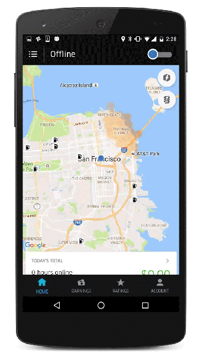

# Introduction to Deep Learning

---

# Deep Learning Overview

---

## Resources

* [Neural networks and deep learning](https://learning.oreilly.com/library/view/neural-networks-and/9781492037354/)  
by  Aurélien Géron (ISBN: 9781492037347)

* [Hands-on Machine Learning with Scikit-Learn, Keras, and TensorFlow, 2nd Edition](https://learning.oreilly.com/library/view/hands-on-machine-learning/9781492032632/)  
by  Aurélien Géron (ISBN: 9781492032649)

&nbsp;&nbsp;<!-- {"left" : 2.78, "top" : 3.75, "height" : 3.15, "width" : 2.09} -->
<!-- {"left" : 5.18, "top" : 3.75, "height" : 3.15, "width" : 2.4} -->

---

## Resources

* [Deep Learning](https://learning.oreilly.com/library/view/deep-learning/9781491924570/)  
by by Adam Gibson, Josh Patterson(ISBN: 9781491914250)

* [Practical Deep Learning for Cloud and Mobile](https://learning.oreilly.com/library/view/practical-deep-learning/9781492034858/)  
by Meher Kasam, Siddha Ganju, Anirudh Koul (ISBN: 9781492034841)


&nbsp;&nbsp;<!-- {"left" : 2.71, "top" : 3.67, "height" : 3.02, "width" : 2.3} -->
<!-- {"left" : 5.27, "top" : 3.67, "height" : 3.02, "width" : 2.31} -->


---

## Question for Audience

 * Think of something you did today / this week that is AI powered?

Notes:

---
## Demo - Gmail AI Helper

<!-- {"left" : 1.74, "top" : 1.59, "height" : 1.9, "width" : 6.78} -->


<!-- {"left" : 2.1, "top" : 3.64, "height" : 2.6, "width" : 6.06} -->


Notes:


---

## Why Machine Learning Matters?

<!-- {"left" : 1.02, "top" : 1.25, "height" : 4.27, "width" : 8.21} -->


[Link](https://www.youtube.com/watch?v=HcqpanDadyQ)

Notes:

https://www.youtube.com/watch?v=HcqpanDadyQ

---


## Hype Cycle

 * **Question for the class:**  
   - Where do you think AI is in this cycle? :-)

<!-- {"left" : 1.23, "top" : 2.07, "height" : 5.06, "width" : 7.8} -->


Notes:
- https://en.wikipedia.org/wiki/Hype_cycle

---

## What is  Machine Learning

<!-- {"left" : 8.18, "top" : 1.04, "height" : 2.61, "width" : 1.86} -->

* **"The field of study that gives computers the ability to learn without being explicitly programmed."** -- Arthur Samuel

* Example: Self-driving cars
    - Historical approach:  
    Write a massive program to instruct the car to handle all possible scenarios encountered while driving
        - This is immensely difficult

    - AI approach:  
        - Let AI learn by observing the scenery and your  reactions
        - Once it learnt enough, let the AI predict the next reaction for a scenary

Notes:


---

## Spam Detection - Traditional (Rule Based) Approach

 * Here is an example of spam detection rule engine

 * The rules are coded by developers

 * There could be 100s of 1000s of rules!

```java

if (email.from_ip.one_of("ip1", "ip2", "ip3")) {
  result = "no-spam"
}
else if ( email.text.contains ("free loans", "cheap degrees"))
{
  result = "spam"
}

```
<!-- {"left" : 0, "top" : 2.58, "height" : 2.13, "width" : 10.25} -->

Notes:


---

## Spam Detection - AI Approach


 * Show the algorithm with spam and non-spam emails

 * Algorithm 'learns' which attributes are indicative of spam

 * Then algorithm predicts spam/no-spam on new email

<!-- {"left" : 0.77, "top" : 2.66, "height" : 4.39, "width" : 8.78} -->

Notes:


---

## How is AI Different from Rule Based Systems


 * Rule based systems are static
    - They are programmed in
    - They don't learn from data

 * AI can learn from data
     - It gets better every day with more data it sees

<!-- {"left" : 1.02, "top" : 3.5, "height" : 3.09, "width" : 8.21} -->


Notes:

---

##  AI Applications

- Self Driving Cars
     - ML system recognizes edge of the road, road sign and car in front

- Face recognition
     - Facebook images: System learns from images manually tagged and then automatically detects faces in uploaded photos

 <!-- {"left" : 0.55, "top" : 4.17, "height" : 2.97, "width" : 4.46} -->
 <!-- {"left" : 5.26, "top" : 4.17, "height" : 2.97, "width" : 4.44} -->


Notes:

- Image credit : Wikimedia : CCZero license : https://commons.wikimedia.org/wiki/File:Driver_free_car.jpg
- Image credit : WikiMedia : (Creative Commons) : https://commons.wikimedia.org/wiki/File:Face_detection.jpg


---
# AI History

---


## Early AI (1950s - 1980s):  Rule-Based Approaches

 * Early AI approaches were largely rule-based.

 * Example: Natural Language Processing:

     - Tended to follow grammatical/linguistic processing rules.

     - Problem: Natural Language proved very difficult to unambiguously interpret.

 * Predicate Logic / Rules Engines

     - Based on Mathematical Theorem provers  / Logic

     - Represent knowledge as declarative statements

     - Able to achieve success in very limited domains of knowledge.

Notes:


---
## Machine Learning

 * Machine Learning arose as an alternative to traditional AI

 * Focused initially on purely statistical approaches.

 * Able to achieve very good results on problems that were not easy to solve with rule-based approaches.

 * ML is a data-driven approach:

     - Making inferences from Data

Notes:


---
## Neural Networks

 * Neural Networks Have a long history in Machine Learning

 * 1980s-1990s: Neural Networks invented to pattern the human brain.

 * Early attempts to make a general-purpose learning algorithm largely failed.

 * Backpropagation training algorithm saw some success.

Notes:

---
## Neural Networks Timeline

<!-- {"left" : 0.66, "top" : 1.89, "height" : 4.2, "width" : 8.93} -->


Notes:
ref : https://beamandrew.github.io/deeplearning/2017/02/23/deep_learning_101_part1.html


---
## AI Winter (1980s / 1990s)

* In 1990s, Neural networks fell out of favor.
     - AI in general was perceived as pie-in-the-sky/academic
     - "Expert Systems" and "Rules Engines" found only niche applications.

* Neural Networks Received Criticism
     - Too hard to train
     - Resulting Model not transparent enough.
     - Not suitable for large datasets
     - "Toy Problems"


Notes:
- https://en.wikipedia.org/wiki/AI_winter
---

## AI Winter - Parallelization Challenges

- High Performance Computing (HPC) was all about parallelization

- NN considered hard to parallelize.

-  Compute Power was insufficient for the time

- Training Datasets were insufficiently sized for good results.

Notes:


---
## Surge of Statistical Machine Learning

 * Statistical Machine Learning became the method of choice

 * Well Understood (Applied Statistics)

 * Achieved impressive results compared to previous rule-based approaches

 * Ensemble Methods (Random Forests, Gradient Boosted Trees) gave impressive results.

 * Resultant Models often fairly transparent

     - Example: Credit scoring algorithms: Have to unambiguously show WHY the model gives the result it does.

Notes:

---
## Godfathers of Neural Networks

 * [Geoffrey Hinton](https://en.wikipedia.org/wiki/Geoffrey_Hinton) @ Google, University of Toronto.  
Kept NN research going during 'AI Winter'

 * [Yann LeCun](http://yann.lecun.com/) - Chief AI researcher @ Facebook, Professor @ University of New York

 * [Yoshua Bengio](https://en.wikipedia.org/wiki/Yoshua_Bengio) - Professor @ University of Montreal

 * **These 3 won ACM Turing Award (Nobel price of computing) in 2019**

&nbsp;<!-- {"left" : 2.28, "top" : 5.46, "height" : 1.84, "width" : 1.38} -->
&nbsp;<!-- {"left" : 3.93, "top" : 5.46, "height" : 1.84, "width" : 1.8} -->
<!-- {"left" : 6.05, "top" : 5.46, "height" : 1.84, "width" : 1.58} -->

Notes:
- https://www.deeplearningitalia.com/godfather-2/
- https://torontolife.com/tech/ai-superstars-google-facebook-apple-studied-guy/
- https://www.nytimes.com/2016/12/14/magazine/the-great-ai-awakening.html
- https://www.wired.com/story/godfathers-ai-boom-win-computings-highest-honor/
- https://www.theverge.com/2019/3/27/18280665/ai-godfathers-turing-award-2018-yoshua-bengio-geoffrey-hinton-yann-lecun

---
## Thawing of AI Winter (2008 + )

- 2012 Google created a neural network that can 'identify' cats from YouTube videos

- Up until now, traditional machine learning algorithms are trained on labeled data.  
    - So to train an algorithm to distinguish between cats and dogs, we need thousands of images labeled as 'cat' and thousands of images labeled as 'dog'
    - labeling takes a lot of work, and not a lot of labeled data is available

<!-- {"left" : 8.11, "top" : 1.11, "height" : 1.62, "width" : 1.87} -->

Notes:


---
## Thawing of AI Winter (2008 + )

- They built a huge neural network with **1 Billion+** connections and trained it on **16,000 CPU cores (distributed)**

- The network watched a lot of stills from YouTube videos and 'intuitively learned' to recognize cats
    - no one told the network what a cat looks like, it is 'self-taught'

- References: 
    - [1](https://googleblog.blogspot.com/2012/06/using-large-scale-brain-simulations-for.html)
    - [2](https://www.wired.com/2012/06/google-x-neural-network/)


Notes:

- References
    - ['Using large-scale brain simulations for machine learning and A.I.' - Google Blog](https://googleblog.blogspot.com/2012/06/using-large-scale-brain-simulations-for.html)
    - [Google AI learns to find cat videos -- Wired magazine](https://www.wired.com/2012/06/google-x-neural-network/)

---

# The Great AI Revival (2010 on)

[../../machine-learning/generic/AI-brief-history.md#The Great AI Revival](../../machine-learning/generic/AI-brief-history.md#The Great AI Revival)

---

# AI Vocabulary

[../../machine-learning/generic/AI-vocabulary.md](../../machine-learning/generic/AI-vocabulary.md)

---
# Machine Learning vs. Deep Learning

[../../machine-learning/generic/ML-vs-DL.md](../../machine-learning/generic/ML-vs-DL.md)


---


## Video: How Scale is Helping Deep Learning

<!-- {"left" : 1.36, "top" : 1.11, "height" : 4.04, "width" : 7.52} -->


[Link](https://www.youtube.com/watch?v=LcfLo7YP8O4)

Andrew Ng explains how Deep Learning algorithms can scale better with data size.


Notes:

https://www.youtube.com/watch?v=LcfLo7YP8O4


---

# Deep Learning Software Ecosystem

[DL-ecosystem.md](DL-ecosystem.md)

---

# Use Cases and Demos


---

## Use Case 1: Uber driver verification

- To increase passenger safety, Uber drivers have to verify their identity before accepting rides

- Uber uses [Microsoft Cognitive Services](https://azure.microsoft.com/en-us/services/cognitive-services/) to recognize 7 million+ drivers in milli seconds

- [Link](https://venturebeat.com/wp-content/uploads/2016/09/uberids.gif?resize=343%2C600&strip=all)

&nbsp;&nbsp;<!-- {"left" : 1.59, "top" : 4.9, "height" : 1.42, "width" : 1.95} -->&nbsp;&nbsp;<!-- {"left" : 3.91, "top" : 4.78, "height" : 1.64, "width" : 2.93} --><!-- {"left" : 7.19, "top" : 4.33, "height" : 2.56, "width" : 1.46} -->


---

## Use Case 2: Photobucket

- [Photobucket](http://photobucket.com/) is a image / video hosting service

- They want to identify and tag NSFW (Not Safe For Work) images and offensive images

- Previously, their human moderation team was only able to monitor about 1% of content

- Now AI system (Using [Clarify](https://www.clarifai.com/)), screens images and tags them properly.  
Illegal images (child pornography ..etc) are flagged for law enforcement

- [Link](https://blog.clarifai.com/how-photobucket-uses-image-recognition-to-protect-its-community-from-unwanted-content)

 &nbsp; &nbsp; <!-- {"left" : 1.21, "top" : 5.95, "height" : 0.74, "width" : 3.9} --><!-- {"left" : 6.11, "top" : 6.01, "height" : 0.62, "width" : 2.93} -->


Notes:  
- https://blog.clarifai.com/how-photobucket-uses-image-recognition-to-protect-its-community-from-unwanted-content

---

## Use Case 3: Staples

- [Staples](https://www.staples.com) relies on organic search traffic to drive sales

- One way the ways to score high on search engine results is put meaningful ALT tags for each product images

- Doing it manually was an expensive proposition

- They use  [Clarify](https://www.clarifai.com/) to automatically tag images

- [Link](https://clarifai.com/customers/staples)

 &nbsp; &nbsp; <!-- {"left" : 1.48, "top" : 5.39, "height" : 0.58, "width" : 2.93} --><!-- {"left" : 5.84, "top" : 5.38, "height" : 0.62, "width" : 2.93} -->


Notes:  
- https://clarifai.com/customers/staples

---

## Demo: Digit Recognition

- Simple NN to recognize hand-written digits

<!-- {"left" : 2.2, "top" : 1.74, "height" : 4.02, "width" : 5.85} -->


[Link](http://myselph.de/neuralNet.html)


Notes:

http://myselph.de/neuralNet.html

---

## Demo: Digit Recognition 2

- Cool visualization of signal path through NN

<!-- {"left" : 3.18, "top" : 1.8, "height" : 3.9, "width" : 3.9} -->


[Link](http://scs.ryerson.ca/~aharley/vis/conv/flat.html)


Notes:  
http://scs.ryerson.ca/~aharley/vis/conv/flat.html

---

## Clarifai Demo

- Go to: https://clarifai.com/demo

- Upload an image (or give a image URL)

- Examine the output.  
Have fun :-)

<!-- {"left" : 1.83, "top" : 2.64, "height" : 4.21, "width" : 6.58} -->


Notes:  
https://clarifai.com/demo

---

## Wrap up & Any Questions?


