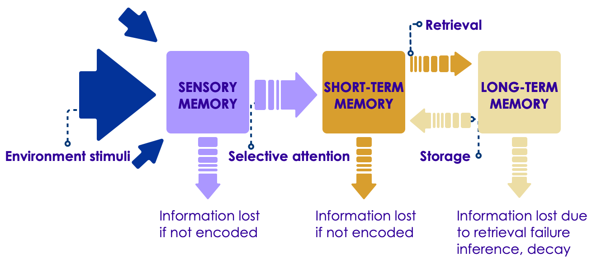
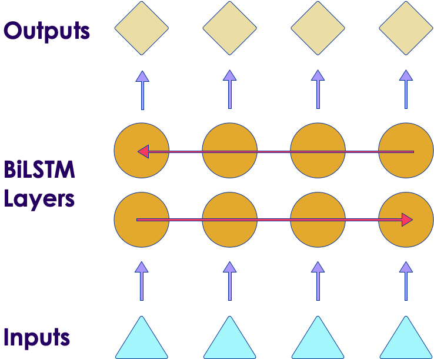
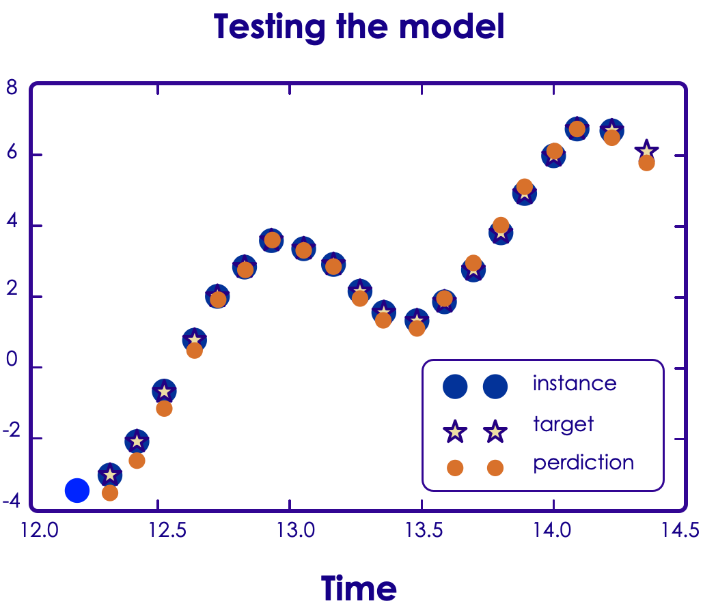

# Long Short Term Memory (LSTM) Neural Networks

---

## Lesson Objectives

* Learn about Long Short Term Memory (LSTM) Neural Networks

* Understand how to use LSTM

Notes:

---

## RNNs - Review

* In Feedforward Networks, data flows one way, it has **no state or memory**

* RNNs have a 'loop back' mechanism to pass the current state to the next iteration

* [Animation link](https://elephantscale-public.s3.amazonaws.com/media/machine-learning/rnn-3-animation.mp4)

<!-- {"left" : 3.54, "top" : 6.05, "height" : 4.56, "width" : 2.64} --><!-- {"left" : 7.65, "top" : 6.24, "height" : 4.19, "width" : 1.85} -->
<!-- {"left" : 10.97, "top" : 5.66, "height" : 4.77, "width" : 4.77} -->

---

## Issues With RNN: Long Training Time

* To train an RNN on long sequences, you will need to run it over many time steps

* making the unrolled RNN a very deep network

* Just like any deep neural network it may suffer from the vanishing/exploding gradients problem (discussed earlier) and take forever to train

* There are solutions (good parameter initialization, non saturating activation functions etc.) for this

* Large amount of inputs (100+) means the training time can still be long

Notes:

---

## Issues With RNNs: Short Term Memory

   <!-- {"left" : 10.24, "top" : 2.36, "height" : 3.69, "width" : 6.94} -->

* Memory of the first inputs (hidden state) gradually fades away over multiple steps

* In this diagram below, we can see the 'influence' of word **'what' (color black)** is diminishing with each step

  - And in the last step word **'?'** the color black is almost non-existing

* **RNNs suffer from short term memory**

* What this means is, RNNs can't remember / process 'long sequences' (e.g. long sentences)

* [Source](https://towardsdatascience.com/illustrated-guide-to-recurrent-neural-networks-79e5eb8049c9)

---

## Illustrating Short Term Memory Problem

* Consider the following word completion example

* `I lived in China, for most of my teenage years, so I speak fluent ____`

* The answer is **Mandarin**

* But which is the key to determining the answer?
  - Not the adjacent words : **my teenage years**
  - But : **lived in China** - from start of the sentence

* So to make the correct prediction, the network has to 'remember' early words (lived in China)

* RNN's short term memory makes it hard to do so

---

## Long-term vs. Short-term Memory

<!-- {"left" : 9.66, "top" : 2.09, "height" : 3.3, "width" : 7.68} -->
* Human Brains have two types of memory: short and long term

* Short-term memory holds data in the immediate context
  - Around 30 seconds or so
  - After this, data is erased

* Long-term Memory is indefinite
  - Data can be accessed if a path to the memory is found
  - Older data, however, may be " **forgotten**  ", the path is not found.

* For example, I remember what I had for breakfast this morning; I may not remember what I had for breakfast 2 days ago;  But I will certainly remember a nice brunch I had with friends last weekend!

Notes:

---

## LSTM Networks

* LSTM networks are the most commonly used variation of Recurrent Neural Networks (RNN)

* LSTM was introduced in 1997 by Sepp Hochreiter and Jürgen Schmidhuber ([paper](https://www.bioinf.jku.at/publications/older/2604.pdf))

* It was gradually improved over the years by several researchers, such as Alex Graves, Haşim Sak,4 Wojciech Zaremba

* It is designed to mimic selective memory and forgetfulness

Notes:

---

## LSTM Design

 <!-- {"left" : 9.1, "top" : 1.89, "height" : 3.35, "width" : 7.62} -->
 <!-- {"left" : 9.23, "top" : 6.48, "height" : 4.83, "width" : 7.36} -->

* Input Gate

* Output Gate

* Forget Gate

* Self-Recurrent Connection (memory)

* (See next slides for details)

---

## Components of the LSTM

 <!-- {"left" : 9.04, "top" : 2.11, "height" : 3.61, "width" : 8.21} -->

* **Input Gate**
  - Input Gate contains new information / input
  - Input can be user input or output of last LSTM layer

* **Output Gate**
  - Sent to next layer (another LSTM or Dense layer)
  - The memory cell value can be read as well.

---

## Components of the LSTM

 <!-- {"left" : 9.19, "top" : 1.89, "height" : 3.61, "width" : 8.21} -->

* **Forget Gate**
  - The forget gate is an example of *negative*  feedback
  - It tends to reduce the value of the neuron
  - Creates stability, prevents vanishing gradient

* **Self-Recurrent Connection (memory)**
  - Self Recurrence is the *memory*  part of LSTM
  - It means that the current value will be stored
  - The forget gate will cause the current memory to *decay*
  - Unless reinforced by the input gate.

Notes:

---

## Activation Functions in LSTM

 <!-- {"left" : 9.56, "top" : 1.88, "height" : 2.94, "width" : 7.8} -->

* Generally  **sigmoid**  or  **tanh** activations are used  (rather than ReLU as in CNN)

* Default activation is tanh.

* Previous State is applied with sigmoid (&sigma;)

 <!-- {"left" : 4.85, "top" : 6.39, "height" : 5.11, "width" : 7.8} -->

Notes:

---

# LSTM Variants

---

## Improvements on LSTM

* LSTM proved to be very popular architecture

* It solved few critical issues we had with RNNs
  - Not suspectable to vanishing / exploding gradients
  - Can remember longer sequences

* But LSTMs are also more complex
  - They take longer to train
  - They take up more resources during runtime (prediction)

* Since their introductions in 1997, many variants are created

---

## Gated Recurrent Units (GRU)

<!-- {"left" : 1.7, "top" : 6.96, "height" : 4.02, "width" : 5.7} -->
<!-- {"left" : 9.13, "top" : 6.61, "height" : 4.72, "width" : 6.67} -->

* Introduced by Kyungyun Cho (et al) in 2004 ([paper](https://arxiv.org/pdf/1406.1078v3.pdf))

* GRU has merged the forget gate with the output gate

* This means that GRU has fewer parameters than an LSTM
  - Quicker to train and uses fewer resources at runtime
  - Can be trained with less training data

Notes:

Image credits:

- <https://en.wikipedia.org/wiki/Gated_recurrent_unit#/media/File:Gated_Recurrent_Unit,_type_3.svg>
- ["Neural Networks and Deep Learning"](https://www.safaribooksonline.com/library/view/Neural+networks+and+deep+learning/9781492037354/ch04.html#idm139624956730336)

---

## Limitations of GRUs

* GRUs are less powerful than LSTMs because of the merging of the forget and output gates

* GRUs help fix the vanishing gradient problem by "gating" the "hidden state"

* However, GRUs cannot differentiate between short-term and long-term memory.

* They have *one* hidden state.

* This makes them perfect for shorter sequences.

* Performance wise: RNN <  GRU  < LSTM  

* Speed:  RNN >  GRU  > LSTM  

---

## biLSTM (Bidirectional LSTM)

 <!-- {"left" : 10.82, "top" : 1.89, "height" : 5.16, "width" : 6.24} -->

* LSTMs/RNNs look to past data to make decisions as they train

* Sometimes we need to 'look ahead' to make a decision
  - This is specially true for natural language processing (NLP)

* **biLSTM** is essentially two LSTMs stacked
  - Input is sent in one direction in one layer
  - and reversed in other layer

* Example of look ahead  
  - "I am learning ___ "
  - "I am learning ___  for my trip to Mexico"

---

## Peephole LSTM

* One popular LSTM variant, introduced by Gers & Schmidhuber (2000), is adding **"peephole connections"** ([Paper](ftp://ftp.idsia.ch/pub/juergen/TimeCount-IJCNN2000.pdf))

* Allow the current *state*  of the cell to be considered at the input

* Otherwise current state cannot be directly compared with the gated input

<!-- {"left" : 2.16, "top" : 5.35, "height" : 5.4, "width" : 13.18} -->

Notes:

---

# LSTM Applications

---

## LSTM Applications

* LSTMs are good at dealing with **sequence data**

* Natural Language Processing (NLP) tasks

* Generating sentences (e.g., character-level language models)

* Classifying time-series

* Speech recognition

* Handwriting recognition

Notes:

---

## Image / Video Captioning

 <!-- {"left" : 3.18, "top" : 1.89, "height" : 4.73, "width" : 11.14} -->

 

* <a href="https://github.com/handong1587/handong1587.github.io/blob/master/_posts/deep_learning/2015-10-09-captioning.md" > LM2Text Paper </a>
 
Notes:

---

## LSTMs and Natural Language

* NLP is also treated as a sequence.

* Each word is treated as a item in sequence.

* This is far more efficient than the massive sparse vector arrays.

* This allows us to move beyond the "bag of words" approach

* LSTMs are a great way to look at *semantic*  models.

* Example:
  - "The cat sat on the mat; then she climbed on the table; then jumped down"
  - where is the cat now?

Notes:

---

## Machine Translation Model

* Machine translation model is essentially a deep recurrent neural network

* The following example shows how this is done.

 <!-- {"left" : 4.19, "top" : 4.36, "height" : 6.06, "width" : 9.12} -->

Notes:

---

## Encoding an Output at Prediction Time

* The previous time step is fed in at the left.

* The next word in sequence is fed from the bottom, for example "go".

 <!-- {"left" : 2.99, "top" : 4.69, "height" : 5.33, "width" : 11.53} -->

Notes:

---

## Predicting Time Series data

 <!-- {"left" : 10.01, "top" : 2.16, "height" : 3.83, "width" : 7.21} -->

* How do we predict time-series data?

* We can view the SP500 index a series of timestamps and data
  - 2018-01-01 5:00pm  1200
  - 2018-01-02 5:00pm  1210

* So what's the *next*  day of S&P500 data?
  - and the next, and so on?

* Is this a Classification problem or Regression?

Notes:

---

## SP500 Example

* We are going to use a network something like this:

  - Input Layer (1 input)

  - 2 LSTM Layers

  - Fully Connected Layer

  - Output Layer with Linear Activation (1 output)

 <!-- {"left" : 1.82, "top" : 6.73, "height" : 1.49, "width" : 13.86} -->

Notes:

---

## Memory Cells

* We have 2 LSTM Layers:
  - One has 50 cells
  - The next has 100 cells

* How long a sequence can we *remember*?
  - The network is limited in how far into the future it can predict.
  - Sequences of 50 are good.

* We will *train*  with sequences of 50

* Then we will predict with sequences of 50
  - and predict the next 50 values after.

Notes:

---

## Training Sequences

<!-- {"left" : 10.98, "top" : 1.89, "height" : 6.12, "width" : 6.24} -->

* We are training with sequences of 50 prices of SP500.
  - 50 prices
  - No need for timestamps

* We then have a label of size 1 which is the 51st price in the sequence.

* We then make a new training sequence.

Notes:

---

## Feeding the Sequence

 <!-- {"left" : 1.71, "top" : 3.05, "height" : 6.29, "width" : 14.08} -->

Notes:

---

## Prediction

* Each Sequence is "fed" sequentially into the neural net (only 1 input)

* Each LSTM cell is connected sequentially with the next in a given layer

  - Layer 1: 50 cells

  - Layer 2: 100 cells

* We also predict with sequences of 50

* We sequentially go through with 50 prices, then predict another 50.

* We then compare the 50 predicted with the actual data.

Notes:

---

## Testing the Model

* We evaluate the model with the prediction

* Comparing predicted sequences with actual helps us to evaluate the model

* We can't just see if predicted and actual are the same.

* We have to take a window in time.

 <!-- {"left" : 11.23, "top" : 2.13, "height" : 5.41, "width" : 6.16} -->

Notes:

---

## Our Results

 <!-- {"left" : 13.26, "top" : 1.59, "height" : 3.66, "width" : 3.69} -->

* Does our model predict the future?

  - When the market crashes, does our model predict a downward movement?

  - When the market spikes, does our model predict an upward movement?

* The model is more "general"

  - Is the market tracking upward?

  - Is it tracking downward?

  - Is it flat?

* Warning: Don't try this at home with real money!

  - Real financial models will be far more complex.

Notes:

---

## LSTM Takeaways

* LSTMs are very sequential

* Limits parallelization opportunities

* Also LSTMs are resource intensive
  - Take longer to train
  - Need more training data
  - And take up more resources at runtime

* CNN variations may be more effective.

* Only use LSTMs when you *must.*

Notes:

---

## Further Reading

* [Good intro to LSTM](https://colah.github.io/posts/2015-08-Understanding-LSTMs/)

* ["Neural Networks and Deep Learning"](https://www.safaribooksonline.com/library/view/Neural+networks+and+deep+learning/9781492037354/ch04.html#idm139624956730336)
