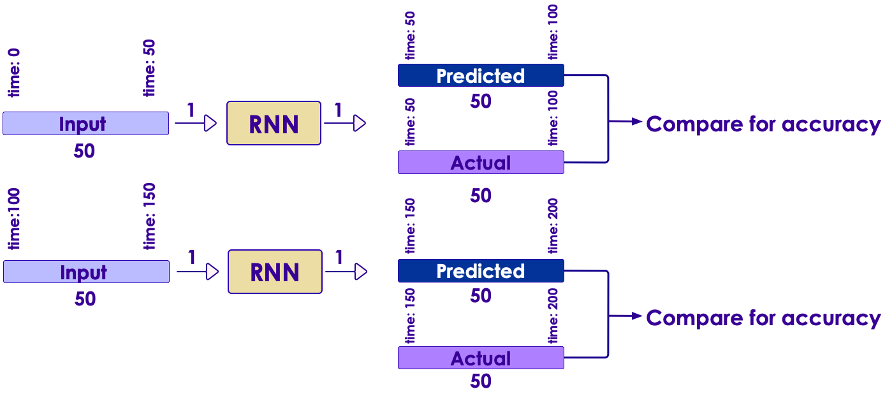

Long Short Term Memory (LSTM) Neural Networks 
======
## Lesson Objectives

 * Learn about Long Short Term Memory (LSTM) Neural Networks 

 * Understand how to use LSTM 

Notes: 

---
## Issues With RNN : Long Training Time

 * To train an RNN on long sequences, you will need to run it over many time steps

 * making the unrolled RNN a very deep network

 * Just like any deep neural network it may suffer from the vanishing/exploding gradients problem (discussed earlier) and take forever to train

 * There are solutions (good parameter initialization, non saturating activation functions etc.) for this

 * Large amount of inputs (100+) means the training time can still be long

Notes: 

---
## Issues With RNN : Memory

 * Memory of the first inputs gradually fades away

 * As data goes through when traversing an RNN, some information is lost after each time step

 * After a while, the RNN’s state contains virtually no trace of the first inputs

 * In some analysis we need to remember earlier inputs

 * Sentiment analysis of text data

Notes: 

---
## Vanishing Gradient Problem (again)

 *  As we train, our network becomes more and more ”hardened” to new stimulus

 *  “You can’t teach an old dog new tricks!”

     -  It means that new input data will have little impact

 *  Unfairly biases earlier inputs rather than later ones

Notes: 

---
## Forgetfulness

 *  Why do human brains forget?

     -  Is it because we can’t hold the information?

     -  No, when we “remember” something we realize the data was there all along.

     -  But we somehow de-emphasized it.

 *  Forgetfulness is actually a good thing

     -  New data is the most important.

     -  We want to respond to changing situations.

     -  Past data should be increasingly less important

 *  We do need “forgetfulness”  

 <!-- {"left" : 7.2, "top" : 4.91, "height" : 1.99, "width" : 2.82} -->

Notes: 

Image credit : https://pixabay.com/en/brain-turn-on-education-read-book-605603/

---
## Long-term versus Short-term Memory

 *  Human Brains have two types of memory: short and long term

 *  Short-term memory holds data in the immediate context

     -  Around 30 seconds or so

     -  After this, data is erased

 *  Long-term Memory is indefinite

     -  Data can be accessed if a path to the memory is found

     -  Older data, however, may be “ **forgotten**  ”, the path is not found.

 <!-- {"left" : 1.97, "top" : 4.5, "height" : 2.71, "width" : 6.31} -->

Notes: 

---
## LSTM Networks

 * LSTM networks are the most commonly used variation of Recurrent Neural Networks (RNN)

 * The Long Short-Term Memory (LSTM) cell was proposed in 1997 by Sepp Hochreiter and Jürgen Schmidhuber (Link to paper)

 * It was gradually improved over the years by several researchers, such as Alex Graves, Haşim Sak,4 Wojciech Zaremba

 * If we consider the LSTM cell as a black box, it can be used very much like a basic cell, except it will perform much better; training will converge faster and it will detect long-term dependencies in the data

Notes: 

1997 paper : https://goo.gl/j39AGv

https://www.safaribooksonline.com/library/view/Neural+networks+and+deep+learning/9781492037354/ch04.html#idm139624956730336

---
## LSTM Applications

 * LSTM offers

 * Better update equations

 * Better backpropagation

 * LSTM applications

 * Generating sentences (e.g., character-level language models)

 * Classifying time-series

 * Speech recognition

 * Handwriting recognition

Notes: 

---
## LSTM Applications : Image / Video Captioning

 <!-- {"left" : 0.81, "top" : 1.92, "height" : 3.67, "width" : 8.64} -->

Notes: 

LM2Text Paper : https://github.com/handong1587/handong1587.github.io/blob/master/_posts/deep_learning/2015-10-09-captioning.md

---
## LSTM: Long-Short-Term Memory

 *  LSTM contains a long-term memory, a “forget gate” and a short-term memory

 <!-- {"left" : 1.02, "top" : 2.18, "height" : 3.61, "width" : 8.21} -->

Notes: 

---
## Components of the LSTM

 *  Input Gate

 *  Output Gate

 *  Forget Gate

 *  Self-Recurrent Connection (memory)

 <!-- {"left" : 1.02, "top" : 3.16, "height" : 3.61, "width" : 8.21} -->

Notes: 

---
## LSTM Architecture

<!-- {"left" : 0.29, "top" : 1.77, "height" : 3.97, "width" : 9.68} -->

Notes:

---
## Input Gate

 * The Input Gate contains the new information

 * LSTM input can either be user input (training data) or output of the last LSTM layer.

 <!-- {"left" : 1.02, "top" : 2.18, "height" : 3.61, "width" : 8.21} -->

Notes: 

---
## Output Gate

 * The Output gate is sent on to the next layer

     - Possibly another LSTM layer

     - Possibly an FC layer

 * The memory cell value can be read as well.

 <!-- {"left" : 1.02, "top" : 3.07, "height" : 3.61, "width" : 8.21} -->

Notes: 

---
## Forget gate

 *  The forget gate is an example of *negative*  feedback

 *  It tends to reduce the value of the neuron

 *  Negative feedback is very commonly used in many contexts

     -  Creates stability

     -  Prevents vanishing gradient.

 <!-- {"left" : 1.02, "top" : 3.43, "height" : 3.61, "width" : 8.21} -->

Notes: 

---
## Self-Recurrence

 *  Self Recurrence is the *memory*  part of LSTM

 *  It means that the current value will be stored

 *  However, the forget gate will cause the current memory to *decay* 

     -  unless reinforced by the input gate.

 <!-- {"left" : 1.02, "top" : 3.28, "height" : 3.61, "width" : 8.21} -->

Notes: 

---
## Peepholes

 * One popular LSTM variant, introduced by Gers & Schmidhuber (2000), is adding “peephole connections.” 

 *  allow the current *state*  of the cell to be considered at the input

 *  Otherwise current state cannot be directly compared with the gated input.

Notes: 

Link to paper : ftp://ftp.idsia.ch/pub/juergen/TimeCount-IJCNN2000.pdf

Good intro to LSTM : https://colah.github.io/posts/2015-08-Understanding-LSTMs/

---
## Activation Functions

 * Generally  **sigmoid**  or  **tanh**  (rather than ReLU as in CNN)
   - Actually *both* are usually used.

 * Previous State is applied with sigmoid

 * Default activation is tanh.

 <!-- {"left" : 0.64, "top" : 3.16, "height" : 3.34, "width" : 8.97} -->

Notes: 

---
## Predicting Time Series data

 *  How do we predict time-series data?

 *  We can view the SP500 index a series of timestamps and data

     -  2018-01-01 5:00pm  1200

     -  2018-01-02 5:00pm  1210

 *  So what's the *next*  day of S&P500 data?

     -  and the next, and so on?

 *  Is this a Classification problem or Regression?

 <!-- {"left" : 2.5, "top" : 4.51, "height" : 2.78, "width" : 5.26} -->

Notes: 

---
## SP500 Example

 *  We are going to use a network something like this:

     -  Input Layer (1 input)

     -  2 LSTM Layers

     -  Fully Connected Layer

     -  Output Layer with Linear Activation (1 output)

 <!-- {"left" : 0.39, "top" : 3.93, "height" : 1.02, "width" : 9.48} -->

Notes: 

---
## Memory Cells

 *  We have 2 LSTM Layers:

     -  One has 50 cells

     -  The next has 100 cells

 *  How long a sequence can we *remember*  ?

     -  The network is limited in how far into the future it can predict.

     -  Sequences of 50 are good.

 *  We will *train*  with sequences of 50

 *  Then we will predict with sequences of 50

     -  and predict the next 50 values after.

Notes: 

---
## Training Sequences

 *  We are training with sequences of 50 prices of SP500.

     -  50 prices

     -  No need for timestamps

 *  We then have a label of size 1 which is the 51st price in the sequence.

 *  We then make a new training sequence.

 <!-- {"left" : 3.26, "top" : 3.64, "height" : 3.66, "width" : 3.73} -->

Notes: 

---
## Feeding the Sequence

 <!-- {"left" : 0.31, "top" : 1.6, "height" : 4.3, "width" : 9.63} -->

Notes: 

---
## Prediction

 *  Each Sequence is "fed" sequentially into the neural net (only 1 input)

 *  Each LSTM cell is connected sequentially with the next in a given layer

     -  Layer 1: 50 cells

     -  Layer 2: 100 cells 

 * We also predict with sequences of 50

 *  We sequentially go through with 50 prices, then predict another 50.

 *  We then compare the 50 predicted with the actual data.

Notes: 

---
## Testing the Model

 *  We evaluate the model with the prediction

 *  Comparing predicted sequences with actual helps us to evaluate the model

 *  We can't just see if predicted and actual are the same.

 *  We have to take a window in time.

 <!-- {"left" : 2.7, "top" : 3.16, "height" : 4.25, "width" : 4.84} -->

Notes: 

---
## Our Results?

 *  Does our model predict the future?

     -  When the market crashes, does our model predict a downward movement?

     -  When the market spikes, does our model predict an upward movement?

 *  The model is more "general"

     -  Is the market tracking upward?

     -  Is it tracking downward?

     -  Is it flat?

 *  Warning: Don't try this at home with real money!

     -  Real financial models will be far more complex.

 <!-- {"left" : 7.93, "top" : 4.12, "height" : 2.12, "width" : 2.13} -->

Notes:

---
## Lab: LSTM S&P 500 stock prediction

 *  **Overview**:

    - Implement LSTM based sequence detection.We will build sequences of 50, and then predict outcomes of 50.

 *  **Runtime**:

    - 30-45 minutes

 *  **Instructions**:

    - Follow the lab steps in the lab guide

Notes: 

---
## LSTMs and natural language

 *  NLP is also treated as a sequence.

 *  Each word is treated as a item in sequence.

 *  This is far more efficient than the massive sparse vector arrays.

 *  This allows us to move beyond the "bag of words" approach

 *  LSTMs are a great way to look at *semantic*  models.

Notes: 

---
## Machine Translation Model

 *  Machine translation model is essentially a deep recurrent neural network

 *  The following example shows how this is done.

 <!-- {"left" : 1.68, "top" : 2.54, "height" : 4.58, "width" : 6.9} -->

Notes: 

---
## Encoding an Output at Prediction Time

 *  The previous time step is fed in at the left.

 *  The next word in sequence is fed from the bottom, for example "go".

 <!-- {"left" : 0.67, "top" : 2.89, "height" : 4.12, "width" : 8.91} -->

Notes: 

---
## LSTM Take Aways

 *  LSTMs are very sequential

 *  Limits parallelization opportunities

 *  CNN variations may be more effective.

 *  Only use LSTMs when you *must*.

Notes: 

---

