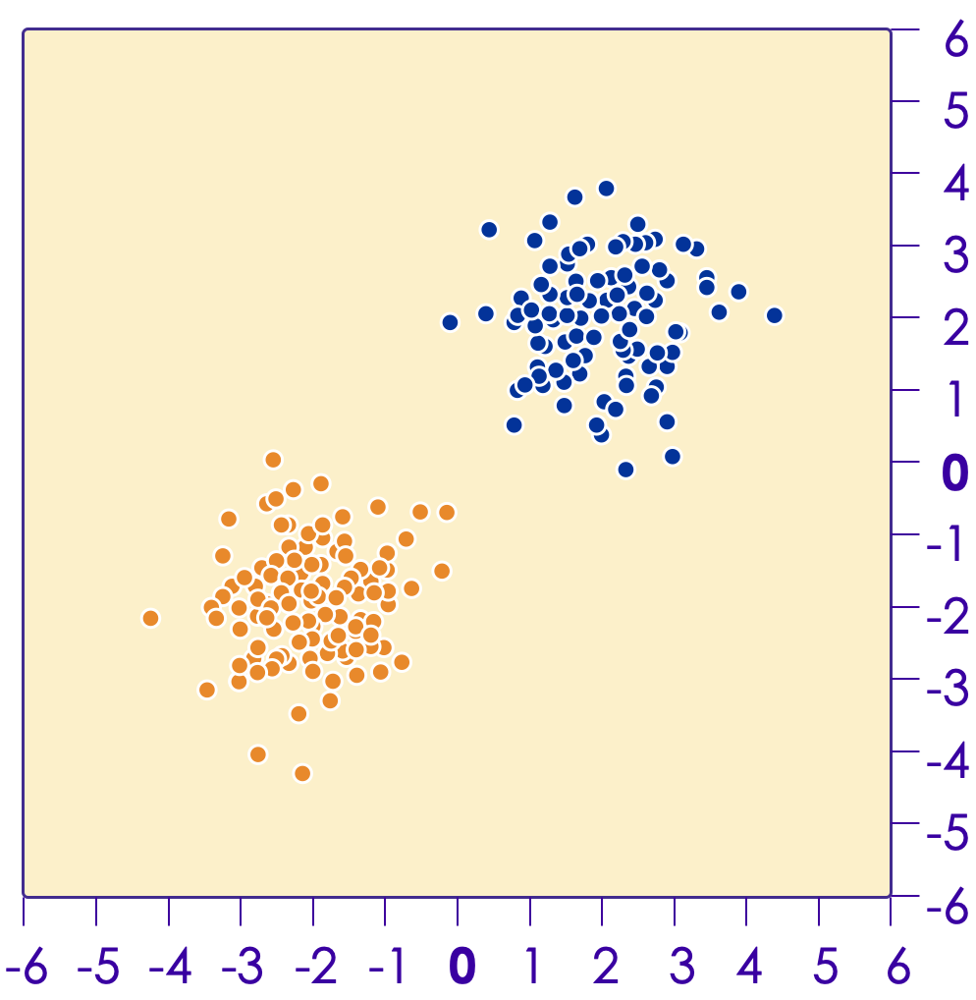
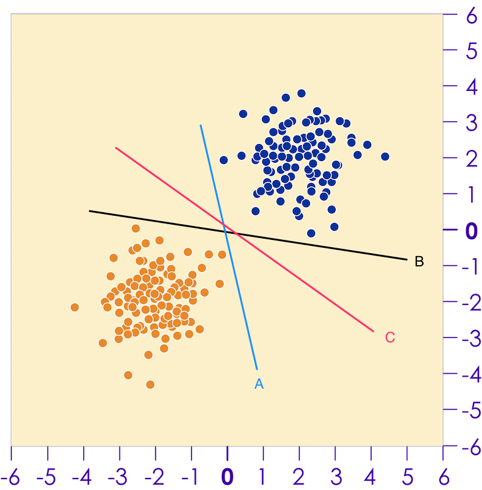
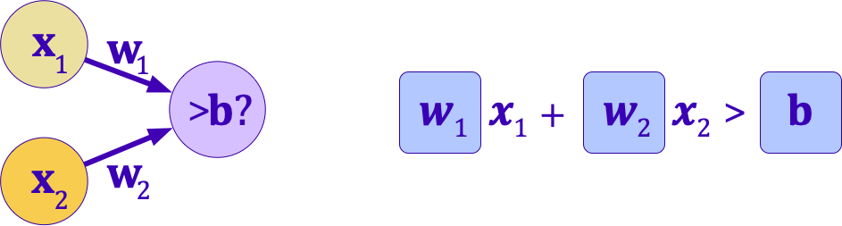

# Linear

---

## Lesson Objectives

 * Learn about simple perceptron classifiers

 * Understand how Gradient Descent and Backpropagation help us train.

Notes:

---
# Perceptrons

---

## Simple Perceptron Example

 * Design a perceptron that will decide if I should go to a concert, based on a few inputs
    - Inputs: Weather,  Close to public transit, if a friend can join
    - Assign weights to each of the above inputs
    - Output: YES / NO  
    If the final score is > 50, then the answer is YES, otherwise NO

<!-- {"left" : 0.91, "top" : 4.69, "height" : 2.77, "width" : 8.43} -->

---
## Simple Perceptron Example

 * What is the outcome if
    - Weather is good
    - And a friend can join?

 * What is the outcome if
    - You can go by public transit
    - And a friend can join

 * Please note, here the weights are assigned manually

<!-- {"left" : 1.07, "top" : 5.07, "height" : 2.66, "width" : 8.11} -->

---

## A Generalized Perceptron

 * Here we are adding more inputs (X1, X2, ... Xm)
 * Each input has their weights (W1, W2, ... Wm)
 * The inupt '1' and weight 'W0' is bias term

<!-- {"left" : 1.19, "top" : 3.83, "height" : 4.24, "width" : 7.86} -->

---
## Another Example

 * Find a divider to separate these two classes (blue / orange)

<!-- {"left" : 2.69, "top" : 2.33, "height" : 4.99, "width" : 4.88} -->

---

## Solution

<!-- {"left" : 5.95, "top" : 1.84, "height" : 4.1, "width" : 4.01} -->

 * We can draw line that separates these two classes;  Essentially  a linear model

 * There are many lines we can draw, which one to pick?

 * One Way:

     - Try to maximize the distance between the points on both sides and our line.

     - Lines of A,B,C  which one is better?

     - This is essentially what the [Support Vector Machine (SVM)](https://en.wikipedia.org/wiki/Support-vector_machine) does.

Notes:

---

## Single Layer Perceptron

 * Let's create the simplest neural network with one neuron:

 * This is a linear model.  Finding a line that will separate.

 * Two inputs : X1 and X2
    - Associated weights: W1 and W2

 * Output is binary

<!-- {"left" : 0.87, "top" : 4.65, "height" : 2.28, "width" : 8.51} -->

Notes:

---
## A Trained Perceptron Model

 * After we've trained our model, we've now have a linear model

 * During training the values for  weights w1, w2 have been figured out

<!-- {"left" : 3.18, "top" : 3.18, "height" : 3.96, "width" : 3.9} -->

Notes:

---

## How do We Train?

 * For a single perceptron with no hidden layers, we can train using Gradient Descent.

 * Gradient Descent is a popular optimization algorithm

 * It tweaks the values of parameters ( **coefficients** ) of  **target function** (f) that  **minimizes cost function**

Notes:

---

## Gradient Descent

<!-- {"left" : 6.14, "top" : 2.37, "height" : 3.78, "width" : 3.79} -->

 * Start with initial values of coefficients (zero or random value)
 *  **cost = cost_function(coefficients)**
 * Calculate 'derivative' (think calculus) to determinethe 'slope' or 'direction'
 * Update coefficients in the right'direction' and calculate cost again
 * **'learning rate parameter' (alpha)** determines how much coefficientscan change
 * Iterate  until you find minimum
 *  Algorithm will converge after multiple iterations

---
## Gradiant Descent

 * Here we are adjusting 2 coefficients, so the descent is a 'surface' (think 3D)

<!-- {"left" : 1.02, "top" : 2.99, "height" : 4.68, "width" : 8.21} -->

Notes:

---

## Sample Neural Network Visualizer

 * Go to [playground.tensorflow.org](https://playground.tensorflow.org/)

<!-- {"left" : 1.18, "top" : 2.72, "height" : 3.67, "width" : 7.89} -->

Notes:

---

## Perceptron Mini Lab-5 Mins

<!-- {"left" : 7.87, "top" : 1.15, "height" : 2.84, "width" : 2.13} -->

 * Try this at [playground.tensorflow.org](https://playground.tensorflow.org/)

 * Instructions
    - Select the Linearly Separable dataset as shown (on left)
    - Select x1 and x2 as features.
    - Select zero hidden layers
    - Press play to converge on a solution (as shown on right)

 &nbsp; &nbsp; <!-- {"left" : 2.6, "top" : 5.68, "height" : 2, "width" : 1.94} --> &nbsp; &nbsp; <!-- {"left" : 4.69, "top" : 6.24, "height" : 0.89, "width" : 0.89} --><!-- {"left" : 5.71, "top" : 5.68, "height" : 1.96, "width" : 1.94} -->

Notes:

---

# DL Playground: Introduction

[DL-Playground.md](DL-Playground.md#Introduction)

---

# DL Playground: Linear

[DL-Playground.md](DL-Playground.md#Playground Linear Regression)

---
## Lab Review

<!-- {"left" : 5.98, "top" : 2.4, "height" : 2.71, "width" : 4.06} -->

 * Why didn't we need hidden layers to converge on a solution?

 * What would happen if the dataset wasn't linearly separable?

Notes:

---
## Activation Functions

 * Once we have the output of neuron, what do we do it?

 * In our previous example, we defined a step function
     - If the output was greater than threshold b, `y = 1`,
     - Else, `y = 0`
     - Not Differentiable (can't use gradient descent to optimize)

 * We will see more complex **Activation functions** later.  
 Some examples:
   - None (just use raw output of neuron)
   - Linear (apply linear transformation)
   - Sigmoid
   - Tanh
   - Relu (Covered later)

Notes:

---
## Logistic Regression Redux?

 * What we've done so far is essentially create a logistic regression classifier.

 * In fact, with the Sigmoid activation function, we've done essentially exactly that.

 * So are neural networks just a implementation scheme for logistic regression?

    - Not really.

Notes:

---
## Mini Lab: Logistic Regression

<!-- {"left" : 7.13, "top" : 0.95, "height" : 3.34, "width" : 2.51} -->

 * In this lab, we will be implementing a logistic regression classifier using Neural Networks in Tensorflow.

 * The result will be a linear model (no hidden layer) with a Sigmoid output

Notes:

---

[DL-Playground.md](DL-Playground.md#Classification Examples 1)

---
## The XOR problem

 * What happens if we don't have linear separability?
 * For example, can we learn a function that does an exclusive or?
 * There is no line that can separate these.  
     - And so the single-layer perceptron will never converge.
     - This is known as the XOR problem (though many other datasets are not linearly separable).

 <!-- {"left" : 2.58, "top" : 4.57, "height" : 3.57, "width" : 5.08} -->

Notes:

