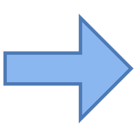

Linear
======
## Lesson Objectives

 * Learn about simple perceptron classifiers

 * Understand how Gradient Descent and Backpropagation help us train .

Notes:

---
# Perceptrons

---

## Simple Perceptron Example

- Design a perceptron that will decide if I should go to a concert, based on a few inputs
    - Inputs : Weather,  Close to public transit, if a friend can join
    - Assign weights to each of the above inputs
    - Output : YES / NO  
    If the final score is > 50, then the answer is YES, otherwise NO

---
## Simple Perceptron Example

- What is the outcome if
    - Weather is good
    - And a friend can join?

- What is the outcome if
    - You can go by public transit
    - And a friend can join

- Please note, here the weights are assigned manually

---

## A Generalized Perceptron

- Here we are adding more inputs (X1, X2, ... Xm)
- Each input has their weights (W1, W2, ... Wm)
- The inupt '1' and weight 'W0' is bias term

---
## Another Example

Find a divider to separate these two classes (blue / orange)

 <!-- {"left" : 2.58, "top" : 1.93, "height" : 5.16, "width" : 5.08} -->

---

## Solution

 <!-- {"left" : 2.58, "top" : 1.93, "height" : 5.16, "width" : 5.08} -->

 * We can draw line that separates these two classes;  Essentially  a linear model

 * There are many lines we can draw, which one to pick?

 * One Way:

     - Try to maximize the distance between the points on both sides and our line.

     - Lines of A,B,C  which one is better?

     - This is essentially what the [Support Vector Machine (SVM)](https://en.wikipedia.org/wiki/Support-vector_machine) does.

Notes:

---
## Single Layer Perceptron

 * Let’s create the simplest neural network with one neuron:

 * This is a linear model.  Finding a line that will separate.

 * Two inputs : X1 and X2
    - Associated weights : W1 and W2

 * Output is binary

 <!-- {"left" : 0.65, "top" : 3.44, "height" : 2.41, "width" : 8.96} -->

Notes:

---
## A Trained Perceptron Model

 * After we’ve trained our model, we’ve now have a linear model

 * During training the values for  weights w1, w2 have been figured out

  <!-- {"left" : 2.59, "top" : 1.96, "height" : 5.15, "width" : 5.07} -->

Notes:

---
## How do We Train?

 * For a single perceptron with no hidden layers, we can train using Gradient Descent.

  <!-- {"left" : 1.02, "top" : 2.33, "height" : 4.45, "width" : 8.21} -->

Notes:

---

## Sample Neural Network Visualizer

 * Go to [playground.tensorflow.org](https://playground.tensorflow.org/)

 <!-- {"left" : 0.71, "top" : 2.29, "height" : 4.11, "width" : 8.83} -->

Notes:

---
## Perceptron Mini Lab–5 Mins

 * Try this at [playground.tensorflow.org](https://playground.tensorflow.org/)

 * Instructions
    - Select the Linearly Separable dataset as shown (on left)
    - Select x1 and x2 as features.
    - Select zero hidden layers
    - Press play to converge on a solution (as shown on right)

 <!-- {"left" : 3.06, "top" : 3.04, "height" : 4.19, "width" : 4.13} -->

Notes:

---
## Lab Review

 * Why didn’t we need hidden layers to converge on a solution?

 * What would happen if the dataset wasn’t linearly separable?

Notes:

---
## Activation Functions (Review)

 * Once we have the output of neuron, what do we do it?

 * In our previous example, we defined a step function
     - If the output was greater than threshold b, `y = 1`,
     - Else, `y = 0`
     - Not Differentiable (can’t use gradient descent to optimize)

 * Activation Funtions
   - None (just use raw output of neuron)
   - Linear (apply linear transformation)
   - Sigmoid
   - Tanh
   - Relu (Covered later)

Notes:

---
## Logistic Regression Redux?

 * What we’ve done so far is essentially create a logistic regression classifier.

 * In fact, with the Sigmoid activation function, we’ve done essentially exactly that.

 * So are neural networks just a implementation scheme for logistic regression?

     - Not really.

Notes:

---
## Mini Lab: Logistic Regression

 * In this lab, we will be implementing a logistic regression classifier using Neural Networks in Tensorflow.

 * The result will be a linear model (no hidden layer) with a Sigmoid output

Notes:

---
## The XOR problem

 * What happens if we don’t have linear separability?

 * For example, can we learn a function that does an exclusive or?

 * There is no line that can separate these.  
     - And so the single-layer perceptron will never converge.
     - This is known as the XOR problem (though many other datasets are not linearly separable).

 <!-- {"left" : 2.63, "top" : 3.98, "height" : 3.49, "width" : 4.99} -->

Notes:

---

## Feedforward Network Sizing

 * Input Layer:
     - Size: Equal to Number of Input Dimensions
        - 2 dimensional inputs --> size=2
        - Possibly add one extra neuron for bias term.
     - What if we have thousands of sparse dimensions?
        * Consider Wide and Deep Neural Network

 * Output Layer:
     - Regression: 1 single neuron (continuous output)
     - Binomial Classification: 1 single neuron (binary output)
     - Multinomial Classification: Softmax Layer
        - Size: 1 node per class label
        - E.g. classifying digits (0 to 9) will need 10 neurons

 * Hidden Layer(s)
     - We will see this in the next section

Notes:

---
