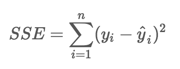
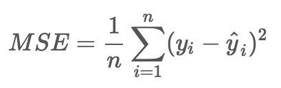
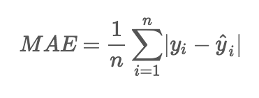
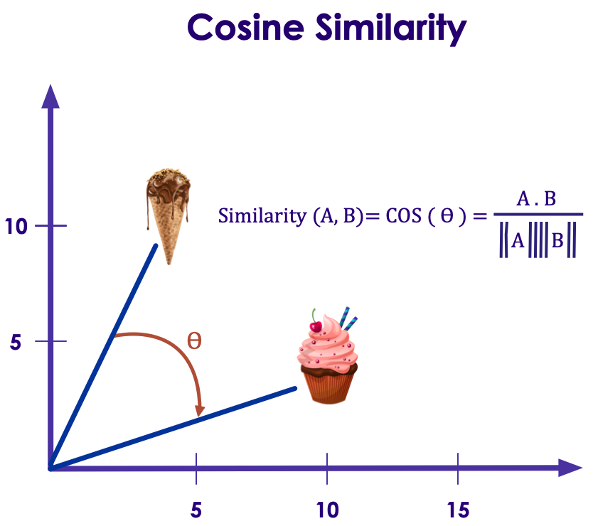
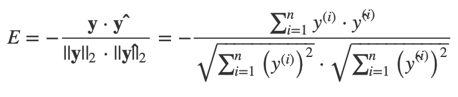

# Loss Functions

---

## Error

- Error is the difference (delta) between actual value and predicted value

- `Error = y  - ŷ`  
`y = actual value`  
`ŷ = predicted value`

- Let's do an example, we have a simple algorithm that predicts tip amounts in a restaurant.  Here is some sample data

| actual tip | predicted tip |
|------------|---------------|
| 10         | 8             |
| 3          | 4             |
| 5          | 6             |
| 20         | 17            |
| 7          | 10            |

---

## Error

| actual tip | predicted tip | Error ( = actual - predicted) |
|------------|---------------|-------------------------------|
| 10         | 8             | +2 ( = 10 - 8)                |
| 3          | 4             | -1 ( = 3 - 4)                 |
| 5          | 6             | -1 ( = 5 - 6)                 |
| 20         | 17            | +3 ( = 20 - 17)               |
| 7          | 10            | -3 ( = 7 - 10)                |

Total error  = `(+2) + (-1) + (-1) + (+3) + (-3) = 0`

---

## Loss Function

- The function that is used to compute the error is known as **Loss Function `J()`**

- Different loss functions will calculate different values for the same prediction errors

- In next few slides, we are going to examine some of the loss functions

---

## Loss Functions

| Regression                  | Classification          | Embedding      |
|-----------------------------|-------------------------|----------------|
| Sum of Squared Errors (SSE) | Binary Class Entrophy   | Cosine Error   |
| Mean Square Error (MSE)     | Negative Log Likelihood | L1 Hinge Error |
| Mean Absolute Error (MAE)   | Margin Classifier       |                |
|                             | Soft Margin Classifier  | &nbsp;         |

---
## Regression Loss Functions

**Summary**

- Sum of Squared Errors (SSE)

- Mean Square Error (MSE)  

- Mean Absolute Error (MAE)

---
##  Sum of Squared Errors (SSE)

- If we simply added up all the errors, we might get zero (positives and negatives cancel each other out)
    - By Squaring them we eliminate positives and negatives canceling each other

- `SSE = 4  + 1 + 1 + 9 + 9 = 24`

| actual | predicted         | Error ( = actual - predicted) | Error-Squared |
|--------|-------------------|-------------------------------|---------------|
| 10     | 8                 | +2                            | 4             |
| 3      | 4                 | -1                            | 1             |
| 5      | 6                 | -1                            | 1             |
| 20     | 17                | +3                            | 9             |
| 7      | 10                | -3                            | 9             |
|        | Total Error  ==>  | 0                             | 24            |

Notes:  
https://isaacchanghau.github.io/post/loss_functions/

---

## Sum of Squared Errors (SSE)

$$ SSE = \sum_{i=1}^{n}(y_i - \hat y_i)^2 $$

<!--  -->

- Also known as
    - **Residual Sum of Squares (RSS)**
    - **Sum of Squared Residuals (SSR)**

- SSE also 'amplifies' the errors (because of squaring)

---

## Mean Squared Error (MSE) (L2)

<!--  -->

$$  MSE = \frac{1}{n} \sum_{i=1}^{n}(y_i - \hat y_i)^2  $$

| actual | predicted         | Error | Error-Squared |
|--------|-------------------|-------|---------------|
| 10     | 8                 | +2    | 4             |
| 3      | 4                 | -1    | 1             |
| 5      | 6                 | -1    | 1             |
| 20     | 17                | +3    | 9             |
| 7      | 10                | -3    | 9             |
|        | Total Error  ==>  | 0     | 24            |

`MSE = (4  + 1 + 1 + 9 + 9)/5 = 24 / 5 = 4.2`

- Properties
    - Can be sensitive to outliers; predictions that deviate a lot from actual values are penalized heavily
    - Easy to calculate gradients (fast)

Notes:  
https://isaacchanghau.github.io/post/loss_functions/

---

## Mean Absolute Error (MAE) (L1)

<!--  -->

$$  MAE = \frac{1}{n} \sum_{i=1}^{n} \lvert y_i - \hat y_i \rvert  $$

`MAE = (2 + 1 + 1 + 3 + 3)/5 = 10/5 = 2`

| actual | predicted         | Error | Abs Error |
|--------|-------------------|-------|-----------|
| 10     | 8                 | +2    | 2         |
| 3      | 4                 | -1    | 1         |
| 5      | 6                 | -1    | 1         |
| 20     | 17                | +3    | 3         |
| 7      | 10                | -3    | 3         |
|        | Total Error  ==>  | 0     | 10        |

- Properties
    - More robust and is generally not affected by outliers
    - Use if 'outliers' are considered 'corrupt data' (or not critical part of data)

---

## Classification Loss Functions

**Summary**

- Binary Class Entrophy

- Negative Log Likelihood

- Margin Classifier

- Soft Margin Classifier

---

## Binary Class Entrophy

- Cross Entropy is used in binary classification scenarios (0 / 1)

- Measures the divergence of probability distributions between actual and predicted values

$$ E =-\frac{1}{n}\sum_{i=1}^{n}\big[y^{(i)}\log(\hat{y}^{(i)})+(1-y^{(i)})\log(1-\hat{y}^{(i)})\big]  $$

---

## Negative Logarithmic Likelihood

- Used when model outputs probability of each class  
(digit-1  : 10%,   digit-9 : 90%  ..etc)

$$ E = -\frac{1}{n}\sum_{i=1}^{n}\log(\hat{y}^{(i)})  $$

Notes:  
- https://quantivity.wordpress.com/2011/05/23/why-minimize-negative-log-likelihood/

---

## Poisson Loss Function

- Derived from [Poisson distribution](https://en.wikipedia.org/wiki/Poisson_regression) which is used for counting dat  a

$$ E =\frac{1}{n}\sum_{i=1}^{n}\big(\hat{y}^{(i)}-y^{(i)}\cdot\log(\hat{y}^{(i)})\big) $$

---

## Cosine Proximity

- Computes the cosine proximity between predicted value and actual value

- Based on [Cosine similarity](https://en.wikipedia.org/wiki/Cosine_similarity)
    - Vectors are 'similar' if they are parallel
    - Vectors are 'not similar' if they are perpendicular / orthogonal

$$ \mathbf{y} (actual) =\{y^{(1)},y^{(2)},\dots,y^{(n)}\}\in\mathbb{R}^{n} $$

$$ \mathbf{\hat{y}} (predicted)=\{\hat{y}^{(1)},\hat{y}^{(2)},\dots,\hat{y}^{(n)}\}\in\mathbb{R}^{n} $$

Notes:

$$ E =-\frac{\mathbf{y}\cdot\mathbf{\hat{y}}}{||\mathbf{y}||_{2}\cdot||\mathbf{\hat{y}}||_{2}}=-\frac{\sum_{i=1}^{n}y^{(i)}\cdot\hat{y}^{(i)}}{\sqrt{\sum_{i=1}^{n}\big(y^{(i)}\big)^{2}}\centerdot\sqrt{\sum_{i=1}^{n}\big(\hat{y}^{(i)}\big)^{2}}} $$

---

## Hinge Loss / Max Margin Loss

- From [Support Vector Machines (SVM)](https://en.wikipedia.org/wiki/Support_vector_machine)

- For binary output
$$ E=\frac{1}{n}\sum_{i=1}^{n}\max(0,1-y^{(i)}\cdot\hat{y}^{(i)}) $$

- For multi-class classifier
$$ E=\frac{1}{n}\sum_{i=1}^{n}\max(0,m-y^{(i)}\cdot\hat{y}^{(i)}) $$

Notes:  
- https://en.wikipedia.org/wiki/Hinge_loss

---

## Loss Functions : Resources

- https://heartbeat.fritz.ai/5-regression-loss-functions-all-machine-learners-should-know-4fb140e9d4b0

- https://rishy.github.io/ml/2015/07/28/l1-vs-l2-loss/

- https://isaacchanghau.github.io/post/loss_functions/

- https://ml-cheatsheet.readthedocs.io/en/latest/loss_functions.html

- https://towardsdatascience.com/common-loss-functions-in-machine-learning-46af0ffc4d23
