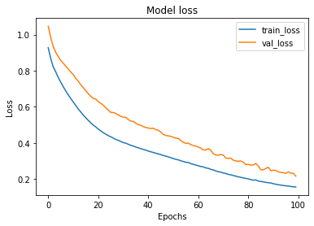
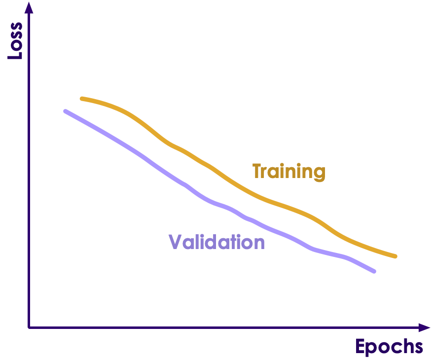
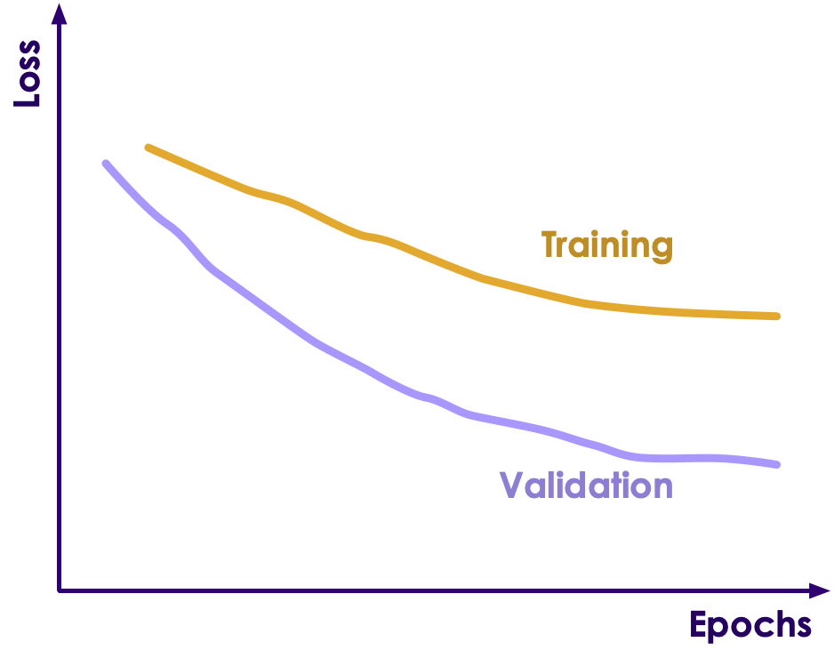

# Monitoring Training

---

## Monitoring Training

<!-- {"left" : 10.24, "top" : 1.89, "height" : 5.08, "width" : 7.05} -->

* During training phase, network trains on **training data** and verified on **validation data**

* We can monitor the training progress via Learning Curve

* The **Learning Curve** usually includes 2 plots
    - **Train Learning Curve**: tracks how well the model is learning from training data
    - **Validation Learning Curve**: tracks how well the model is generalizing on validation data

---

## Model Overfit / Underfit / Goodfit

* During training a model **underfit**, **overfit** or **goodfit**

* **Underfit** is the model is not learning enough

* **Overfit** the model is basically memorizing data, instead of learning from it

* **Goodfit** is what we want

* **To instructor**: If appropriate, go through **ML-Concepts # Model Evaluation** section

---

## Underfitting

 <!-- {"left" : 11.49, "top" : 2.19, "height" : 4.26, "width" : 5.49} -->

 <!-- {"left" : 11.49, "top" : 6.94, "height" : 4.16, "width" : 5.49} -->

* In this case the network isn't really learning much from training data

* In the top diagram, the loss is not decreasing.  
The network is no longer learning from training data

* In the bottom diagram, loss function is bouncing around; no improvement

* Causes:
    - The training data is too small; it is not providing enough information for the model to learn
    - The training dataset is not representative

* Possible fixes:
    - Get more training data, if possible
    - Try a more complex model

---

## Overfitting

 <!-- {"left" : 11.2, "top" : 1.89, "height" : 4.6, "width" : 5.91} -->

* In this scenario the model is 'memorizing' training data instead of learning from it.

* The model will do well in training data (training loss will be lower (better))

* But the model will not do well with validation data (loss will be higher (worse))

* Here we see training loss is significantly better/lower than validation loss (that is higher)

* This is usually a reliable indication of overfitting

---
## Overfitting

 <!-- {"left" : 11.21, "top" : 1.89, "height" : 4.59, "width" : 5.9} -->

* Causes:
    - Not enough training data

    - Not enough variety in  training data; the model doesn't have enough information to learn from; so it is simply memorizing it

    - The model is too complex

* Possible fixes:
    - Provide more training data

    - Increase the variety in training data

    - Simplify the model

    - Add a **dropout layer**

    - Add a **batch normalization layer**

---

## Preventing Overfitting

* **Instructor**: If time permits, review **DL-Concepts # Preventing Overfitting** section

---

## Goodfit

 <!-- {"left" : 10.72, "top" : 1.89, "height" : 4.99, "width" : 6.41} -->

* Here is a good example of **goodfit**

* Both training and validation losses are decreasing in tandem

* They are both smooth (no bouncing around); indicating a good convergence

* And there is no large gap between training/validation losses

---

##  Quiz: Evaluate Training

<!-- {"left" : 11.05, "top" : 1.89, "height" : 4.18, "width" : 6.27} -->

* What do you think of this training?

* Answer next slide

<!-- {"left" : 11.07, "top" : 6.7, "height" : 5.06, "width" : 6.07} -->

---
##  Answer: Evaluate Training

<!-- {"left" : 11.05, "top" : 1.89, "height" : 4.18, "width" : 6.27} -->

* Here both training and validation losses are improving steadily

* But we stopped the training prematurely

* We should add more epochs the model can keep learning

 <!-- {"left" : 11.72, "top" : 7.29, "height" : 4.1, "width" : 4.92} -->

---
##  Quiz: Evaluate Training

<!-- {"left" : 11.05, "top" : 1.89, "height" : 4.18, "width" : 6.27} -->

* What do you think of this training?

* Answer next slide

 <!-- {"left" : 11.33, "top" : 7, "height" : 4.45, "width" : 5.7} -->

---
##  Answer: Evaluate Training

<!-- {"left" : 11.05, "top" : 1.89, "height" : 4.18, "width" : 6.27} -->

* Here both training and validation losses are not improving steadily

* They are bouncing around a lot

* Model is not stable

 <!-- {"left" : 11.59, "top" : 7.4, "height" : 4.04, "width" : 5.18} -->

---
##  Quiz: Evaluate Training

<!-- {"left" : 11.05, "top" : 1.89, "height" : 4.18, "width" : 6.27} -->

* What do you think of this training?

* Validation is doing better than training!

* Answer next slide

 <!-- {"left" : 11.67, "top" : 7.34, "height" : 3.91, "width" : 5.02} -->

---

##  Answer: Evaluate Training

<!-- {"left" : 11.05, "top" : 1.89, "height" : 4.18, "width" : 6.27} -->

* We are seeing better results for validation than training

* Means, the validation dataset is 'too simple'; so the model is doing better there

* Fixes:
    - Need better validation set

 <!-- {"left" : 11.92, "top" : 7.17, "height" : 4.18, "width" : 5.36} -->

