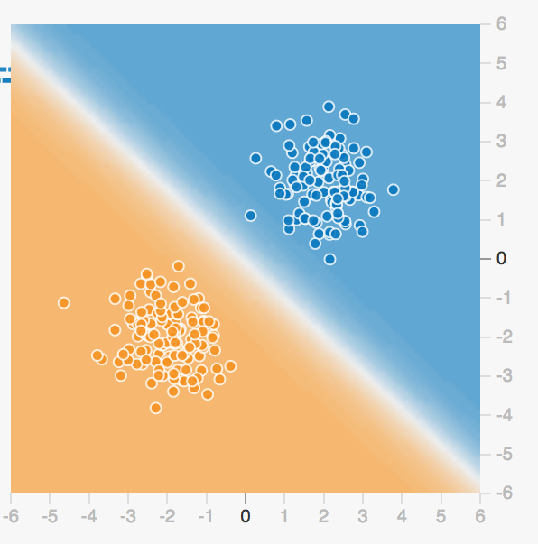

## Sample Neural Network Visualizer

 * Go to [playground.tensorflow.org](https://playground.tensorflow.org/)

<!-- {"left" : 1.18, "top" : 2.72, "height" : 3.67, "width" : 7.89} -->

Notes:

---

## Perceptron Mini Lab-5 Mins

<!-- {"left" : 7.87, "top" : 1.15, "height" : 2.84, "width" : 2.13} -->

 * Try this at [playground.tensorflow.org](https://playground.tensorflow.org/)

 * Instructions
    - Select the Linearly Separable dataset as shown (on left)
    - Select x1 and x2 as features.
    - Select zero hidden layers
    - Press play to converge on a solution (as shown on right)

 &nbsp; &nbsp; <!-- {"left" : 2.6, "top" : 5.68, "height" : 2, "width" : 1.94} --> &nbsp; &nbsp; <!-- {"left" : 4.69, "top" : 6.24, "height" : 0.89, "width" : 0.89} --><!-- {"left" : 5.71, "top" : 5.68, "height" : 1.96, "width" : 1.94} -->

Notes:

---

## Logistic Regression Redux?

 * What we've done so far is essentially create a logistic regression classifier.

 * In fact, with the Sigmoid activation function, we've done essentially exactly that.

 * So are neural networks just a implementation scheme for logistic regression?
    - Not really.

Notes:

---
## Mini Lab: Logistic Regression

<!-- {"left" : 7.13, "top" : 0.95, "height" : 3.34, "width" : 2.51} -->

 * In this lab, we will be implementing a logistic regression classifier using Neural Networks in Tensorflow.

 * The result will be a linear model (no hidden layer) with a Sigmoid output

Notes:

---
