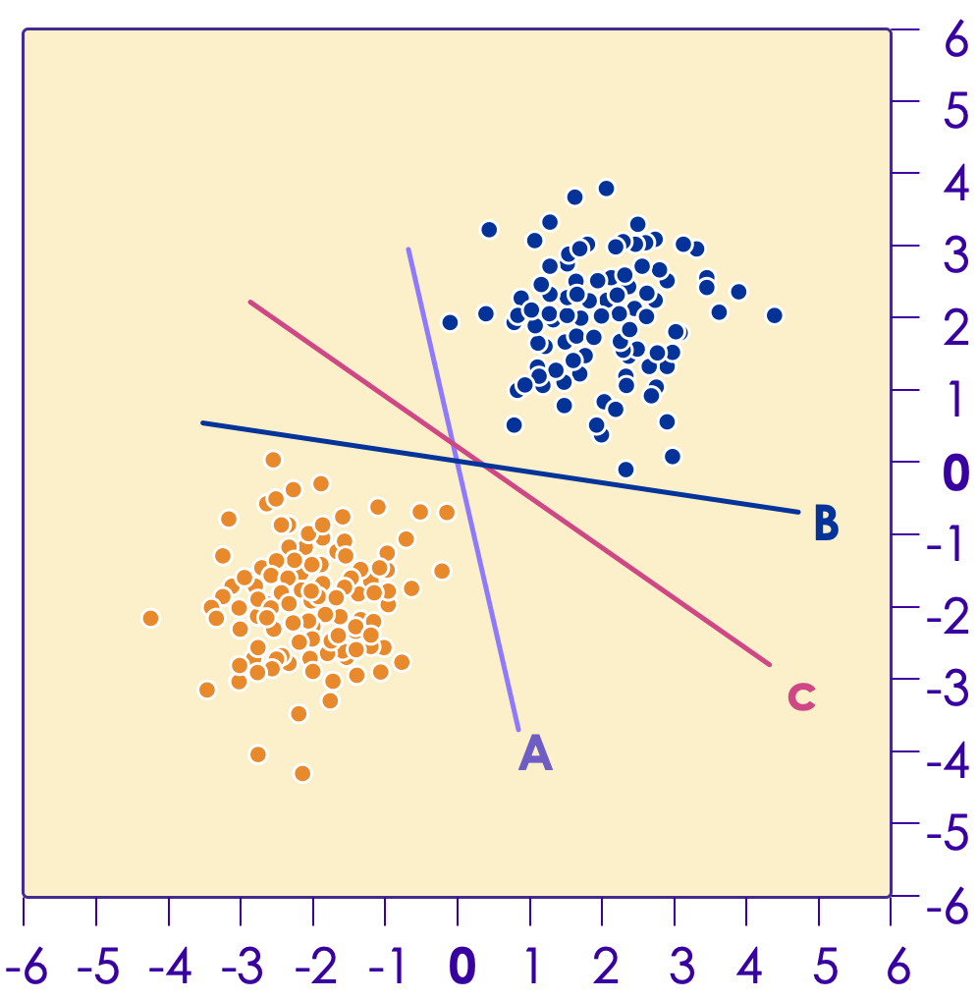
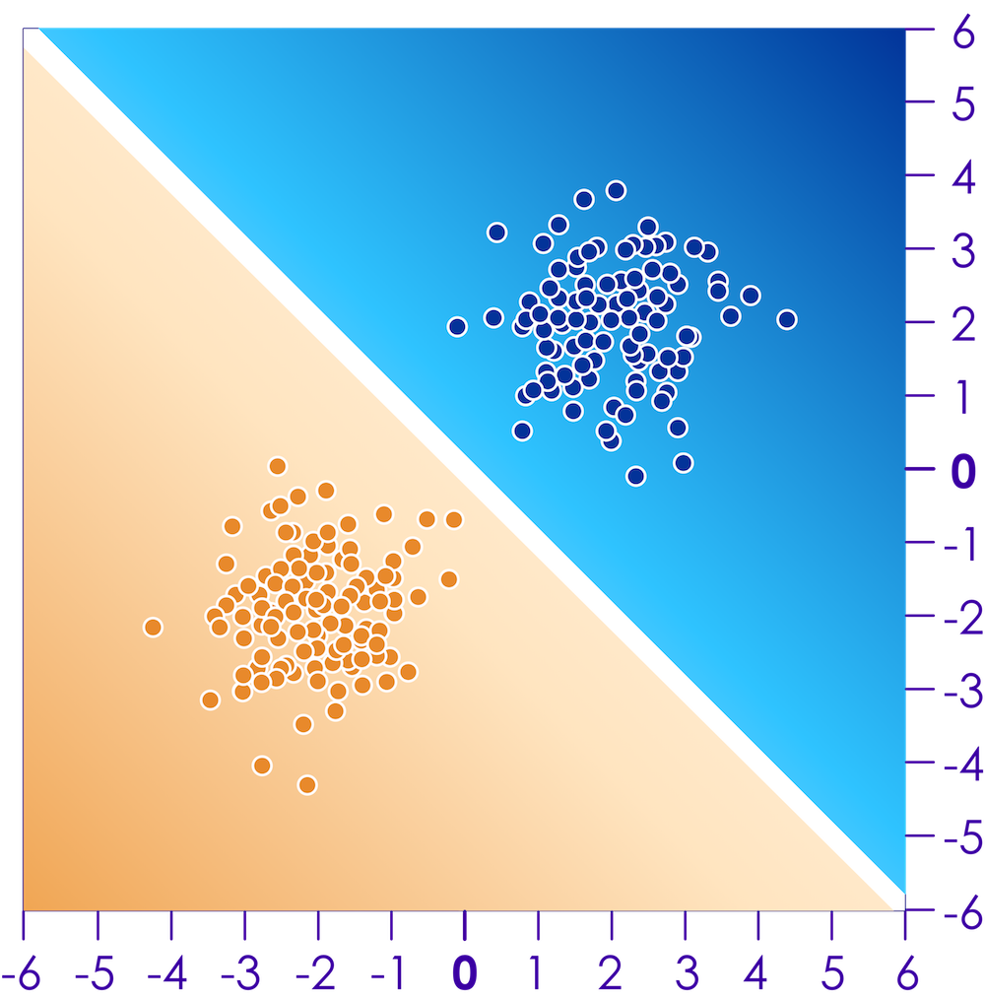

# Introduction to Neural Networks
---

## Lesson Objectives

- Understand neural network architectures

- How to size and build neural networks

Notes:

---
# Perceptrons

---

## Simple Perceptron Example

 * Design a perceptron that will decide if I should go to a concert, based on a few inputs
    - Inputs: Weather,  Close to public transit, if a friend can join
    - Assign weights to each of the above inputs
    - Output: YES / NO  
    If the final score is > 50, then the answer is YES, otherwise NO

<!-- {"left" : 0.91, "top" : 4.69, "height" : 2.77, "width" : 8.43} -->

---
## Simple Perceptron Example

 * What is the outcome if
    - Weather is good
    - And a friend can join?

 * What is the outcome if
    - You can go by public transit
    - And a friend can join

 * Please note, here the weights are assigned manually

<!-- {"left" : 1.07, "top" : 5.07, "height" : 2.66, "width" : 8.11} -->

---

## A Generalized Perceptron

 * Here we are adding more inputs (X1, X2, ... Xm)
 * Each input has their weights (W1, W2, ... Wm)
 * The input '1' and weight 'W0' is bias term

<!-- {"left" : 1.19, "top" : 3.83, "height" : 4.24, "width" : 7.86} -->

---
## Another Example (Classification)

 * Find a divider to separate these two classes (blue / orange)

<!-- {"left" : 2.69, "top" : 2.33, "height" : 4.99, "width" : 4.88} -->

---

## Solution

<!-- {"left" : 5.95, "top" : 1.84, "height" : 4.1, "width" : 4.01} -->

 * We can draw line that separates these two classes;  Essentially  a linear model

 * There are many lines we can draw, which one to pick?

 * One Way:

     - Try to maximize the distance between the points on both sides and our line.

     - Lines of A,B,C  which one is better?

     - This is essentially what the [Support Vector Machine (SVM)](https://en.wikipedia.org/wiki/Support-vector_machine) does.

Notes:

---
## Single Layer Perceptron

 * Let's create the simplest neural network with one neuron:

 * This is a linear model.  Finding a line that will separate.

 * Two inputs : X1 and X2
    - Associated weights: W1 and W2

 * Output is binary

<!-- {"left" : 0.87, "top" : 4.65, "height" : 2.28, "width" : 8.51} -->

Notes:

---
## A Trained Perceptron Model

 * After we've trained our model, we've now have a linear model

 * During training the values for  weights w1, w2 have been figured out

<!-- {"left" : 3.18, "top" : 3.18, "height" : 3.96, "width" : 3.9} -->

Notes:

---

## How do We Train?

 * For a single perceptron with no hidden layers, we can train using Gradient Descent.

 * Gradient Descent is a popular optimization algorithm

 * It tweaks the values of parameters ( **coefficients** ) of  **target function** (f) that  **minimizes cost function**

Notes:

---

## Gradient Descent

[../../machine-learning/generic/Gradient-Descent.md](../../machine-learning/generic/Gradient-Descent.md)

---

## Sample Neural Network Visualizer

 * Go to [playground.tensorflow.org](https://playground.tensorflow.org/)

<!-- {"left" : 1.18, "top" : 2.72, "height" : 3.67, "width" : 7.89} -->

Notes:

---

## Perceptron Mini Lab-5 Mins

<!-- {"left" : 7.87, "top" : 1.15, "height" : 2.84, "width" : 2.13} -->

 * Try this at [playground.tensorflow.org](https://playground.tensorflow.org/)

 * Instructions
    - Select the Linearly Separable dataset as shown (on left)
    - Select x1 and x2 as features.
    - Select zero hidden layers
    - Press play to converge on a solution (as shown on right)

 &nbsp; &nbsp; <!-- {"left" : 2.6, "top" : 5.68, "height" : 2, "width" : 1.94} --> &nbsp; &nbsp; <!-- {"left" : 4.69, "top" : 6.24, "height" : 0.89, "width" : 0.89} --><!-- {"left" : 5.71, "top" : 5.68, "height" : 1.96, "width" : 1.94} -->

Notes:

---

# DL Playground: Introduction

[DL-Playground.md](DL-Playground.md#Introduction)

---

# DL Playground: Linear

[DL-Playground.md](DL-Playground.md#Playground Linear Regression)

---
## Lab Review

<!-- {"left" : 5.98, "top" : 2.4, "height" : 2.71, "width" : 4.06} -->

 * Why didn't we need hidden layers to converge on a solution?

 * What would happen if the dataset wasn't linearly separable?

Notes:

---

## Logistic Regression Redux?

 * What we've done so far is essentially create a logistic regression classifier.

 * In fact, with the Sigmoid activation function, we've done essentially exactly that.

 * So are neural networks just a implementation scheme for logistic regression?
    - Not really.

Notes:

---
## Mini Lab: Logistic Regression

<!-- {"left" : 7.13, "top" : 0.95, "height" : 3.34, "width" : 2.51} -->

 * In this lab, we will be implementing a logistic regression classifier using Neural Networks in Tensorflow.

 * The result will be a linear model (no hidden layer) with a Sigmoid output

Notes:

---

## Playground : Classification

[DL-Playground.md](DL-Playground.md#Classification Examples 1)

---
## The XOR problem

 <!-- {"left" : 5.88, "top" : 1.74, "height" : 2.94, "width" : 4.18} -->

 * What happens if we don't have linear separability?

 * For example, can we learn a function that does an exclusive or?

 * There is no line that can separate these.  
     - And so the single-layer perceptron will never converge.
     - This is known as the XOR problem (though many other datasets are not linearly separable).

 * Solution : We need __hidden layers__

Notes:

---

## The Solution: a Hidden Layer

 * Our problem is that our solution to a single layer neural network is linear.  
     - We call the solution the "decision boundary"
     - What if we could create a nonlinear decision boundary?
     - How would we do that?
 * What if we add a new layer to our network?

<!-- {"left" : 3.29, "top" : 3.78, "height" : 3.52, "width" : 3.66} -->

Notes:

---

## Why Hidden Layers

 * Hidden Layers allow us to solve the "XOR" problem
     - Creating a nonlinear decision boundary

 * How Many Hidden Layers?
     - Most nonlinear problems solvable with one hidden layer.
     - Multiple Hidden Layers allow for more complex decision boundaries

 * One Hidden Layer is Enough
     - It has been proven that any function can be represented by a sufficiently large neural network with one hidden layer
     - Training that network may be difficult, however.

 * But it's not enough
     - Current training methods mean that more than one layer is required in many cases.

Notes:

---

## Circle Dataset With Hidden Layers

<!-- {"left" : 6.01, "top" : 1.26, "height" : 4.02, "width" : 4} -->

 * Select the circle dataset:

 * Try this at http://playground.tensorflow.org

 * Select the Spiral dataset as shown.

 * Select some features

 * You will need hidden layers.  Experiment to see your results.

 * Press play to converge on a solution.

Notes:

---

## Lab Review

 * What's the minimum number of hidden layers required to correctly classify all the test data?

 * Does adding any additional features help at all?

 * Do we necessarily get better results with more neurons and/or hidden layers?

Notes:

---

# Neural Network Design

---

## Popular Neural Network Architectures

- Feedforward neural network (FFNN)

- Convolutional  neural network  (CNN)

- Recurrent neural network (RNN)

- We will cover these in detail in the upcoming sections

---

# Feed Forward Neural Networks

---

## Feedforward Neural Networks (FFNN)

- As we have seen earlier, single layer NNs can solve simple, linear problems

- To solve more complex problems (with non-linear solutions) we need a more complex setup

- This is where **Feedforward Networks** come in

- Also known as
    - **Multi Layer Perceptrons (MLP)**
    - **Deep Feedforward Neural Networks (DFNN)**

---

## Feedforward Network Design

- There are multiple layers
- Each layer has many neurons
- Each neuron is connected to neurons on previous layer
- Information flows through ONE-WAY (no feedback loop)
- Composed of : Input, Output and Middle (Hidden) layers

<!-- {"left" : 3.09, "top" : 4.13, "height" : 3.73, "width" : 4.06} -->

---

## Hidden Layers

- Layers between Input and Output are called **Hidden Layers**
- If there is more than one hidden layers, it is called **Deep Neural Network**

 &nbsp; &nbsp; &nbsp; <!-- {"left" : 0.9, "top" : 3.4, "height" : 3.53, "width" : 3.66} --><!-- {"left" : 5.28, "top" : 3.35, "height" : 3.62, "width" : 3.94} -->

---

## Non-Linearity

- Hidden layers can model 'non-linear' functions
    - one hidden layer can model any continuous functions
    - two or more hidden layers can model discontinuous functions

- Remember the XOR problem?  We couldn't solve it using single layer perceptron.

- But using hidden layers, we can solve it very easily

 &nbsp;  &nbsp; <!-- {"left" : 0.83, "top" : 4.35, "height" : 3.32, "width" : 4.74} --><!-- {"left" : 6.07, "top" : 4.55, "height" : 3.32, "width" : 3.35} -->

---

## Playing with Hidden Layers

[DL-Playground.md](DL-Playground.md#Hidden Layers)

---

## The single-layer network

 * We can combine perceptron inputs to a feedforward neural network.

 * We have an input-layer and an output layer

     - Why do we call it single layer? (When there is input + output)

     - Because the input layer only passes through the inputs.

 * What is the size of the input and output layers?

     - Input: number of features variables from input

     - Output: 1 neuron (unless we use a softmax output layer)

Notes:

---

## Multi-class (non-binary) Outputs

 * So far, our neural networks have had exactly one output neuron.

     - For regression problems, the output neuron generates the response variable (a continuous value).

     - For classification problems, the output is binary

 * What about multi-class classification? (non-binary)

     - We need more than one output neuron.

     - Exactly one neuron for each class in classification.

 * How do we generate the output classes?

     - We can use a function called Softmax

Notes:

---

## Softmax output

 * The Softmax function converts an array of values to an array of probabilities.

     - For example `[1, 2, 3, 4, 1, 2, 3] => [.024, .064, .175, .475, .024, .064, .175]`

     - The resultant array must add up to 1, because the output enumerates all probabilities

 * We can implement the softmax function on the output, where we have k neurons indicating that we expect to see k number of output classes.

Notes:

---

## Softmax Function

<!-- {"left" : 0.38, "top" : 1.5, "height" : 4.5, "width" : 9.48} -->

Notes:

---

## Feedforward Network Sizing

 * Input Layer:
     - Size: Equal to Number of Input Dimensions
        * Possibly add one extra neuron for bias term.
     - What if we have thousands of sparse dimensions?
        * Consider Wide and Deep Neural Network

 * Hidden Layer(s)
     - Deep Learning=  Multiple Hidden Layer (more than 2)
     - Size depends on training sample, input features, outputs

 * Output Layer:
     - Regression: 1 single neuron (continuous output)
     - Binomial Classification: 1 single neuron (binary output)
     - Multinomial Classification: Softmax Layer
        * Size: 1 node per class label

Notes:

---

## Lab: Iris Dataset

 * In this lab, we will be using the Iris dataset.

 * We will be training a multi-layer perceptron feedforward neural network.

Notes:
