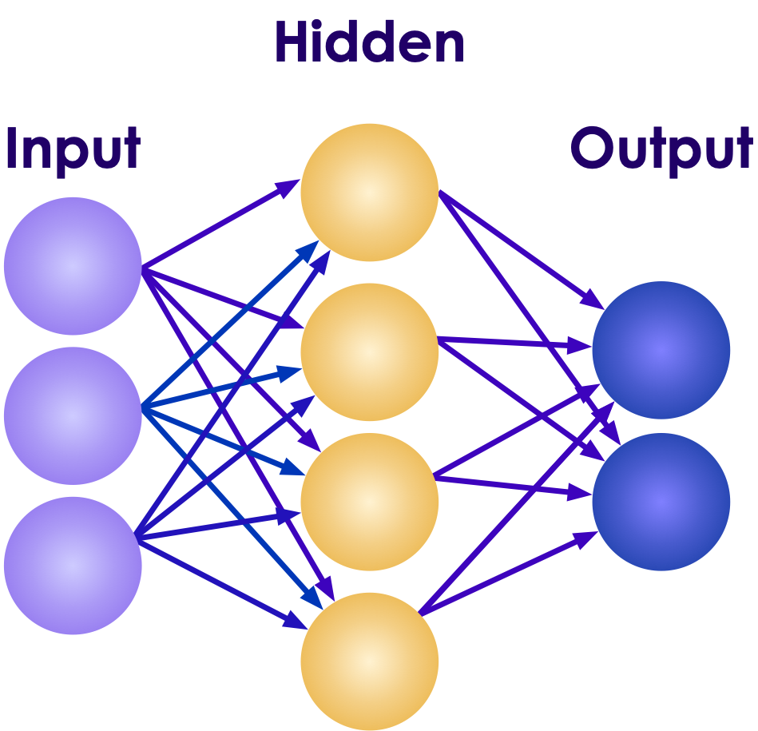
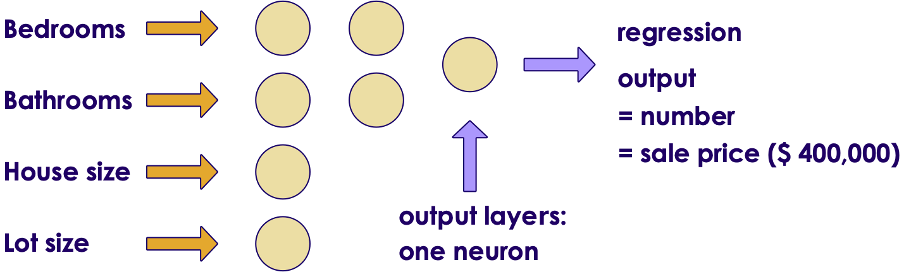
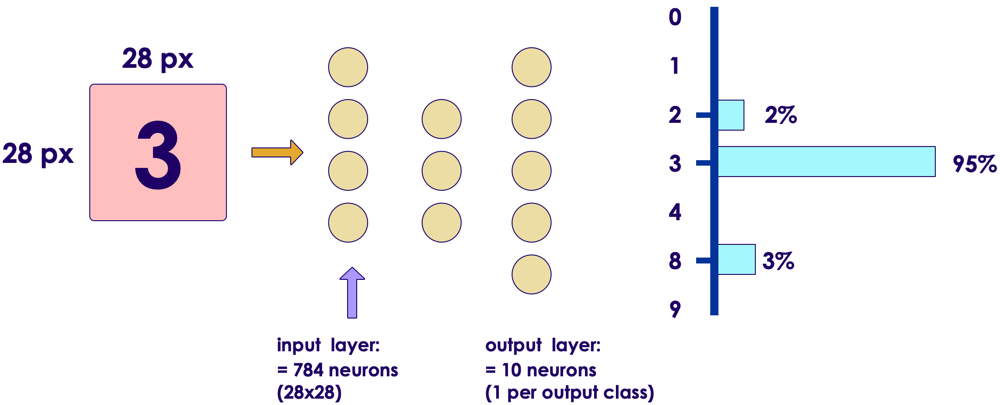
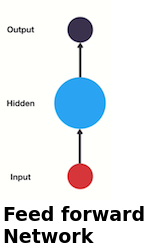
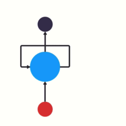
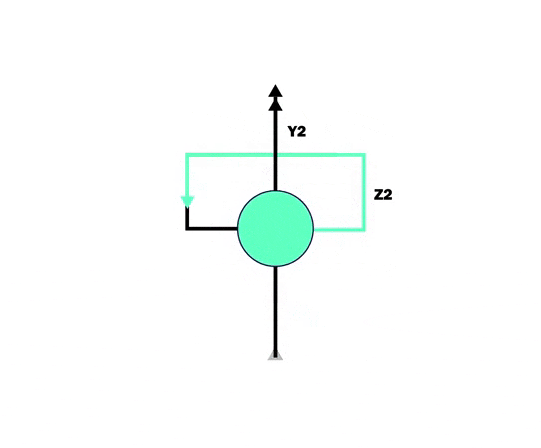

# Introduction to Neural Networks

<!-- TODO shiva -->

---

## Lesson Objectives

<!-- TODO shiva -->

- Understand neural network architectures

- How to size and build neural networks

Notes:

---

# Artificial Neural Networks (ANN)

---

## Artificial Neural Networks (ANN)

 * ANNs are at the core of Deep Learning
    - they are powerful, scalable and can solve complex problems like classifying billions of images (Google Images)

 * ANNs were inspired by neurons in human brain

 * How ever ANNs have evolved quite a bit from their original inception.  
For example planes are inspired by birds first, but now modern planes have evolved a lot from their original designs

<!-- {"left" : 1.84, "top" : 5.09, "height" : 3.45, "width" : 6.58} -->

Notes:  
- https://en.wikipedia.org/wiki/Artificial_neuron

---

## Neural Networks History

 * 1943: McCulloch Pitts Neural model

 * 1962: Frank Rosenblatt invented the Perceptron:

 * 1969: Marvin Minsky's paper threw cold water on ANNs.  
He demonstrated the ANNs can't solve a simple XOR problem

 * 1970s: First AI Winter

 * 1980s: some revival in ANNs  (new models + training techniques)

 * 1986: D. E. Rumelhart et al. published a [groundbreaking paper](https://scholar.google.com/scholar?q=Learning+Internal+Representations+by+Error+Propagation) introducing the backpropagation training algorithm.

 * 1990s: Second AI winter (Methods like SVMs were producing better results)

 * 2010s: huge revival in AI after some promising results

 * Now: The race is on!

 * References :  [1](https://en.wikipedia.org/wiki/Artificial_neuron)  ,   [2](https://medium.com/@jayeshbahire/the-xor-problem-in-neural-networks-50006411840b)

Notes:  

---

## 1943: McCulloch Pitts Neural Model

 <!-- {"left" : 5.98, "top" : 1.27, "height" : 1.81, "width" : 4.11} -->

 * McCulloch and Pitts defined a simple model of a Neuron ([paper](https://scholar.google.com/scholar?q=A+Logical+Calculus+of+Ideas+Immanent+in+Nervous+Activity))

 * It consisted of N inputs In and N Weights

 * Inputs are **binary (on/off)**

 * Inputs and weights are summed up and a threshold function produces output

 * Limitations:

     - Binary input / output

     - Weights (Wn) were set manually; No way to automatically train weights

Notes:  
- https://scholar.google.com/scholar?q=A+Logical+Calculus+of+Ideas+Immanent+in+Nervous+Activity
- https://towardsdatascience.com/mcculloch-pitts-model-5fdf65ac5dd1

---

## 1962: The Perceptron

* Frank Rosenblatt invented the Perceptron

* Inputs are **numbers (not binary as before)**

* Simplest type of Feedforward neural network

 &nbsp;<!-- {"left" : 0.61, "top" : 3.53, "height" : 2.89, "width" : 5.57} --> <!-- {"left" : 6.68, "top" : 3.18, "height" : 3.59, "width" : 2.93} -->

Notes:  
Mark I Perceptron at the Cornell Aeronautical Laboratory', hardware implementation of the first Perceptron (Source: Wikipedia)

---

## Simple Perceptron Example

* Design a perceptron that will decide if I should go to a concert, based on a few inputs
* Inputs: **`1) Weather,  2) Close to public transit, 3) friend can join`**
* Assign weights to each of the above inputs
* Output: YES / NO
  - If the final score is > 50, then the answer is YES, otherwise NO

<!-- {"left" : 0.91, "top" : 4.69, "height" : 2.77, "width" : 8.43} -->

---
## Simple Perceptron Example

 * What is the outcome if
    - Weather is good
    - And a friend can join?

 * What is the outcome if
    - You can go by public transit
    - And a friend can join

 * Please note, here the weights are assigned manually

<!-- {"left" : 1.07, "top" : 5.07, "height" : 2.66, "width" : 8.11} -->

---

## A Generalized Perceptron

 * Here we are adding more inputs (X1, X2, ... Xm)
 * Each input has their weights (W1, W2, ... Wm)
 * The input '1' and weight 'W0' is bias term

<!-- {"left" : 1.19, "top" : 3.83, "height" : 4.24, "width" : 7.86} -->

---

## Perceptron Operations

<!-- {"left" : 5.58, "top" : 1.5, "height" : 2.24, "width" : 4.16} -->

* Step 1: Calculate sum of inputs and weights  
__`z = w0 + w1.x1 + w2.x2 + ... + wn.xn`__

* In matrix operations this is:  
__`wT · x`__

* Step 2: Apply Step function to the sum  
__`hw(x) = step (z)`__  
__`hw(x) = step (wT · x)`__

* Simple step function
  - if sum is positive (`z >= 0`) --> output is 1
  - otherwise, output is 0

---

## Quiz: Guessing the Weights

<!-- {"left" : 5.67, "top" : 1.35, "height" : 1.44, "width" : 4.29} -->

- Let's revisit our 'concert going' perceptron.  
- Here is some new training data.
- Can you guess the weights w1 / w2 / w3  to match the training data?
- (Threshold is now changed to 60)

 

| Weather | Public Transit | Friend Can Join | Outcome (0 / 1) |
|---------|----------------|-----------------|-----------------|
| 1       | 1              | 1               | 1               |
| 1       | 0              | 1               | 1               |
| 1       | 0              | 0               | 0               |
| 1       | 1              | 0               | 0               |
| 0       | 1              | 1               | 0               |
| 0       | 1              | 0               | 0               |
| 0       | 0              | 1               | 0               |

<!-- {"left" : 3.45, "top" : 5.09, "height" : 3.73, "width" : 6.8, "columnwidth" : [1.25, 1.61, 1.81, 2.13]} -->

---

## Quiz: Guessing the Weights

<!-- {"left" : 5.37, "top" : 1.03, "height" : 1.59, "width" : 4.74} -->

- Let's start with equal weights for all inputs:  
weather = 33, public transit = 33, friend = 33
- We got 2 wrong!
- Can we do better?

 

| Weather | Public Transit | Friend Can Join | Total | Predicted (> 60) | Actual |
|---------|----------------|-----------------|-------|------------------|--------|
| 1 * 33  | 1 * 33         | 1 * 33          | 99    | 1 - ok           | 1      |
| 1 * 33  | 0 * 33         | 1 * 33          | 66    | 1 - ok           | 1      |
| 1 * 33  | 0  * 33        | 0  * 33         | 33    | 0 - ok           | 0      |
| 1 * 33  | 1 * 33         | 0 * 33          | 66    | 1 - wrong        | 0      |
| 0 * 33  | 1  * 33        | 1 * 33          | 66    | 1 - wrong        | 0      |
| 0 * 33  | 1 * 33         | 0 * 33          | 33    | 0 - ok           | 0      |
| 0 * 33  | 0  * 33        | 1 * 33          | 33    | 0 - ok           | 0      |

<!-- {"left" : 2.48, "top" : 4.62, "height" : 3.95, "width" : 7.57, "columnwidth" : [1.25, 1.17, 1.58, 1, 1.47, 1.1]} -->

---

## Quiz: Guessing the Weights

<!-- {"left" : 5.76, "top" : 1.28, "height" : 1.45, "width" : 4.33} -->

- Looks like 'public transit' isn't as important as 'friend'
- And 'weather' seems important
- Let's adjust the weights to reflect this
- weather = 35, public transit = 20, friend = 30
- __we got all right !!__

 

| Weather | Public Transit | Friend Can Join | Total | Predicted (> 60) | Actual |
|---------|----------------|-----------------|-------|------------------|--------|
| 1 * 35  | 1 * 20         | 1 * 30          | 85    | 1 - ok           | 1      |
| 1 * 35  | 0 * 20         | 1 * 30          | 65    | 1 - ok           | 1      |
| 1 * 35  | 0  * 20        | 0  * 30         | 35    | 0 - ok           | 0      |
| 1 * 35  | 1 * 20         | 0 * 30          | 55    | 0 - ok           | 0      |
| 0 * 35  | 1 * 20         | 1 * 30          | 50    | 0 - ok           | 0      |
| 0 * 35  | 1 * 20         | 0 * 30          | 20    | 0 - ok           | 0      |
| 0 * 35  | 0  * 20        | 1 * 30          | 30    | 0 - ok           | 0      |

<!-- {"left" : 3.85, "top" : 4.65, "height" : 3.91, "width" : 6.41, "columnwidth" : [1.26, 1.14, 1.06, 0.9, 0.98, 1.06]} -->

Notes: 

Here are some possible solutions:

- 50, 1, 49
- 50, 0, 5
- 40, 0, 20
- 40, 10, 20

---

## How do We Train?

* In the last example, we lucked out by guessing the weights in 2 rounds (2 iterations)

* But for large complex datasets, we need a more systamatic way of calculating and adjusting weights

* We use a technique called **back propagation**

Notes:

---

## Backpropagation Demos

<!-- TODO shiva -->

 * **Animation (Regression)** : [link-youtube](https://youtu.be/krTFCDCbkZg), [link-S3](https://elephantscale-public.s3.amazonaws.com/media/machine-learning/backpropagation-5.mp4)

<!-- {"left" : 1.5, "top" : 4.53, "height" : 3.62, "width" : 7.24} -->

 * **Animation (Classification)** :
  [link-youtube](https://youtu.be/sLsCN9ZL9RI), [link-S3](https://elephantscale-public.s3.amazonaws.com/media/machine-learning/neural-networks-animation-1.mp4)

<!-- {"left" : 1.5, "top" : 4.53, "height" : 3.62, "width" : 7.24} -->

---

## Tensorflow Playground

* For Instructor:
  - Go over the following section as needed and if time permits

---

# DL Playground: Introduction

[DL-Playground.md](DL-Playground.md#Introduction to Tensorflow Playground)

---

# DL Playground: Linear

[DL-Playground.md](DL-Playground.md#Playground Linear Regression)

---

## Playground: Classification

[DL-Playground.md](DL-Playground.md#Classification Examples 1)

---

# Hidden Layers

---
## The XOR problem

 <!-- {"left" : 5.88, "top" : 1.74, "height" : 2.94, "width" : 4.18} -->

 * What happens if we don't have linear separability?

 * For example, can we learn a function that does an exclusive or?

 * There is no line that can separate these.  
     - And so the single-layer perceptron will never converge.
     - This is known as the XOR problem (though many other datasets are not linearly separable).

 * Solution : We need __hidden layers__

Notes:

---

## The Solution: a Hidden Layer

 * Our problem is that our solution to a single layer neural network is linear.  
     - We call the solution the "decision boundary"
     - What if we could create a nonlinear decision boundary?
     - How would we do that?
 * What if we add a new layer to our network?

<!-- {"left" : 3.29, "top" : 3.78, "height" : 3.52, "width" : 3.66} -->

Notes:

---

## Why Hidden Layers

 * Hidden Layers allow us to solve the "XOR" problem
     - Creating a nonlinear decision boundary

 * How Many Hidden Layers?
     - Most nonlinear problems solvable with one hidden layer.
     - Multiple Hidden Layers allow for more complex decision boundaries

 * One Hidden Layer is Enough
     - It has been proven that any function can be represented by a sufficiently large neural network with one hidden layer
     - Training that network may be difficult, however.

 * But it's not enough
     - Current training methods mean that more than one layer is required in many cases.

Notes:

---

## Playground : Hidden Layers

[DL-Playground.md#Classification Examples 2](DL-Playground.md#Classification Examples 2)

---

# Neural Network Design

---

## Popular Neural Network Architectures

- Feedforward neural network (FFNN)

- Convolutional  neural network  (CNN)

- Recurrent neural network (RNN)

- We will cover these in detail in the upcoming sections

---

# Feed Forward Neural Networks

---

## Feedforward Neural Networks (FFNN)

* As we have seen earlier, single layer NNs can solve simple, linear problems

* To solve more complex problems (with non-linear solutions) we need a more complex setup

* This is where **Feedforward Networks** come in

* Also known as
  - **Multi Layer Perceptrons (MLP)**
  - **Deep Feedforward Neural Networks (DFNN)**

---

## Feedforward Network Design

- There are multiple layers
- Each layer has many neurons
- Each neuron is connected to neurons on previous layer
- Information flows through ONE-WAY (no feedback loop)
- Composed of : Input, Output and Middle (Hidden) layers

<!-- {"left" : 3.09, "top" : 4.13, "height" : 3.73, "width" : 4.06} -->

---

## Hidden Layers

- Layers between Input and Output are called **Hidden Layers**
- If there is more than one hidden layers, it is called **Deep Neural Network**

 &nbsp; &nbsp; &nbsp; <!-- {"left" : 0.9, "top" : 3.4, "height" : 3.53, "width" : 3.66} --><!-- {"left" : 5.28, "top" : 3.35, "height" : 3.62, "width" : 3.94} -->

---

## Non-Linearity

- Hidden layers can model 'non-linear' functions
    - one hidden layer can model any continuous functions
    - two or more hidden layers can model discontinuous functions

- Remember the XOR problem?  We couldn't solve it using single layer perceptron.

- But using hidden layers, we can solve it very easily

 &nbsp;  &nbsp; <!-- {"left" : 0.83, "top" : 4.35, "height" : 3.32, "width" : 4.74} --><!-- {"left" : 6.07, "top" : 4.55, "height" : 3.32, "width" : 3.35} -->

---

# Sizing Neural Networks

---
## Sizing a Regression  Network

| Bedrooms (input 1 | Bathrooms (input 2) | House Size (input 3) | Lot Size (input 4) | Sale Price (in thousands) (OUTPUT) |
|-------------------|---------------------|----------------------|--------------------|---------------------------|
| 2                 | 1                   | 1200                 | 2000               | 229                       |
| 3                 | 1                   | 1500                 | 3500               | 319                       |
| 4                 | 2                   | 2300                 | 5000               | 599                       |

<!-- {"left" : 0.25, "top" : 1.01, "height" : 2.19, "width" : 9.75} -->

 

<!-- {"left" : 5.78, "top" : 3.48, "height" : 1.46, "width" : 4.34} -->

- Input layer sizing:
  - Match the number of input dimensions = 4 (bedrooms, bathrooms, house size, lot size)
- Output layer sizing:
  - Only one neuron
  - As we are predicting a number (sale price)
- Hidden layer sizing:
  - flexible

---

## Sizing Binary Classification Network

| Income (input 1) | Credit Score (input 2) | Current Debt (input 3) | Loan Approved (output) |
|------------------|------------------------|------------------------|------------------------|
| 40,000           | 620                    | 0                      | 0                      |
| 80,000           | 750                    | 100,000                | 1                      |
| 100,000          | 800                    | 50,000                 | 1                      |

<!-- {"left" : 0.26, "top" : 1, "height" : 2.19, "width" : 9.75} -->

<!-- {"left" : 5.49, "top" : 3.83, "height" : 1.4, "width" : 4.48} -->

- Input layer sizing
  -  Same as input dimensions = 3 (input, credit score, debt)

- Output layer sizing
    - one neuron for 0/1 output

- Hidden layer sizing
  - flexible

---

## Sizing Multi Classification Network

<!-- {"left" : 7.38, "top" : 1.05, "height" : 1.81, "width" : 2.73} -->

<!-- {"left" : 5.87, "top" : 3.63, "height" : 1.63, "width" : 4.22} -->

- Input layer sizing
  - Match input dimensions
  - 784 = 28 x 28 pixels

- Output layer sizing
  - Softmax layer
  - one neuron per output class
  - 10 (one for each digit; 0, 1, ..8,9)

- Hidden layer sizing
  - flexible

---

## Softmax Output

| Output Class | 0 | 1 | 2 | 3 | 4 | 5 | 6 | 7 | 8 | 9 |
|-------------------------------|-----|-----|------|------|-----|-----|-----|-----|------|-----|
| Probability   (Total 1.0) | 0.0 | 0.0 | 0.02 | 0.95 | 0.0 | 0.0 | 0.0 | 0.0 | 0.03 | 0.0 |

<!-- {"left" : 0.55, "top" : 1.1, "height" : 1.19, "width" : 9.75, "columnwidth" : [1.76, 0.74, 0.74, 0.74, 0.74, 0.74,0.74,0.74,0.74,0.74,0.74]} -->

- The Softmax function produces probabilities for output values.

- Here output is predicted as '3' as it has the highest probability (95%)

- The resultant array must add up to 1, because the output enumerates all probabilities

Notes:

---

## Feedforward Network Sizing Summary

* __Input Layer__
   - Size: Equal to Number of Input Dimensions
   -  Possibly add one extra neuron for bias term.
   - What if we have thousands of sparse dimensions?
   - Consider Wide and Deep Neural Network
* __Hidden Layer(s)__
   - Deep Learning=  Multiple Hidden Layer (more than 2)
   - Size depends on training sample, input features, outputs
* __Output Layer__
   - Regression: 1 single neuron (continuous output)
   - Binary Classification: 1 single neuron (binary output)
   - Multi-class Classification: Softmax Layer
     - Size: 1 node per class label

Notes:

---

## Quiz: Design Neural Networks

<!-- {"left" : 6.53, "top" : 2.66, "height" : 2.52, "width" : 3.79} -->

* **Scenario 1: - We want to predict stock market index  (e.g.  DOW)**

* Inputs: 30 features

* Output: price of index (single value - numeric)

* **Is this a classification or regression?**

* **Design Input/Output layers of NN**

<!-- {"left" : 6.53, "top" : 2.66, "height" : 2.52, "width" : 3.79} -->

---

## Quiz: Design Neural Networks

<!-- {"left" : 6.53, "top" : 2.66, "height" : 2.52, "width" : 3.79} -->

* **Scenario 2: - We want to analyze customer tickets and assign priority**

* Inputs: 10 features selected from 25 total features of a ticket (e.g. ticket topic, keywords ..etc)

* Output: Ticket priority: High / Medium / Low

* **Is this a classification or regression?**

* **Design Input/Output layers of NN**

<!-- {"left" : 6.53, "top" : 2.66, "height" : 2.52, "width" : 3.79} -->

---

# Convolutional Neural Networks (CNN)

---

## Convolutional Neural Networks (CNN)

* CNNs are designed specially to handle images

* Convolution layer neurons scan a particular area of image (their 'field of vision')
  - And they pick up patterns in images (e.g. eyes, wheels)

 <!-- {"left" : 0.48, "top" : 5.45, "height" : 1.85, "width" : 1.91} --> &nbsp; &nbsp;  <!-- {"left" : 2.98, "top" : 5.45, "height" : 1.85, "width" : 1.8} --> &nbsp; &nbsp;  <!-- {"left" : 5.49, "top" : 5.45, "height" : 1.85, "width" : 1.79} --> &nbsp; &nbsp; <!-- {"left" : 7.98, "top" : 5.45, "height" : 1.85, "width" : 1.79} -->

---

## CNNs

 <!-- {"left" : 6.23, "top" : 1.1, "height" : 5.04, "width" : 3.81} -->

- Each layer builds on previous layer's work

- First layer detects simple shapes - horizontal lines, slanted lines ..etc

- Second layer recognizes more complex features: eyes / nose ..etc

- Third layer recognizes faces

---

## CNN Use Cases

* CNNs are heavily used in **computer vision** applications

<!-- {"left" : 1.02, "top" : 3.62, "height" : 3.94, "width" : 8.21} -->

---

# Recurrent Neural Networks (RNN)

---

## Time Series Data

* To predict time series data, we need to know the past behavior

* For example, what is the stock price in time t2?

   <!-- {"left" : 0.18, "top" : 3.26, "height" : 2.56, "width" : 4.85} -->
   <!-- {"left" : 5.22, "top" : 3.26, "height" : 2.56, "width" : 4.85} -->

---

## Problems with Feedforward Networks

* Feedforward Neural Networks can model any relationship between input and output.
* However they can't keep/remember **state**
  -  The only state retained is weight values from training.
  - They don't remember previous input!
  - For example, in this example, the network doesn't remember the 'previous input' (cat) when predicting the current input
* **Animation** below: [link-youtube](https://youtu.be/sLsCN9ZL9RI) | [link-S3](https://elephantscale-public.s3.amazonaws.com/media/machine-learning/neural-networks-animation-1.mp4) 

<!-- TODO shiva -->
<!-- {"left" : 0.97, "top" : 5.51, "height" : 1.96, "width" : 8.31} -->

Notes:

---

## Recurrent Neural Network (RNN)

* In Feedforward Networks, data flows one way, it has **no state or memory**

* RNNs have a 'loop back' mechanism to pass the current state to the next iteration

<!-- {"left" : 0.4, "top" : 4.27, "height" : 3.47, "width" : 2.01} -->
<!-- {"left" : 3.63, "top" : 4.27, "height" : 3.47, "width" : 1.53} -->
<!-- {"left" : 6.38, "top" : 4.27, "height" : 3.47, "width" : 3.47} -->

[Animation link](https://elephantscale-public.s3.amazonaws.com/media/machine-learning/rnn-3-animation.mp4)

---

## RNN Animation

<!-- {"left" : 2.64, "top" : 1.21, "height" : 4.12, "width" : 4.98} -->

* **Animation**: [Link-YouTube](https://www.youtube.com/watch?v=zt18u6BgdK8) | [Link-S3](https://elephantscale-public.s3.amazonaws.com/media/machine-learning/rnn-4-animation.mp4)

---

## RNN Implementations

* **RNN (Recurrent Neural Network)** is basic design
  - It implements state
  - But suffers from 'short term memory' problem

* **LSTM (Long Short Term Memory)** improves on this
  - They can remember 'longer memory sequences'
  - But tend to be more complex, and require more time to train

* **GRU (Gated Recurrent Unit)** is an updated implementation
  - It simplifies LSTM, easier to train

---

## RNN Use Cases

* RNNs are used for any data where sequence matters

* Time series data (like stock quotes)

* NLP (Natural Language Processing)
  - Order of words matter in language
  - Language translation tasks

---

## Review and Q&A

<!-- {"left" : 8.56, "top" : 1.21, "height" : 1.15, "width" : 1.55} -->
<!-- {"left" : 6.53, "top" : 2.66, "height" : 2.52, "width" : 3.79} -->

* Let's go over what we have covered so far

* **Questions**
