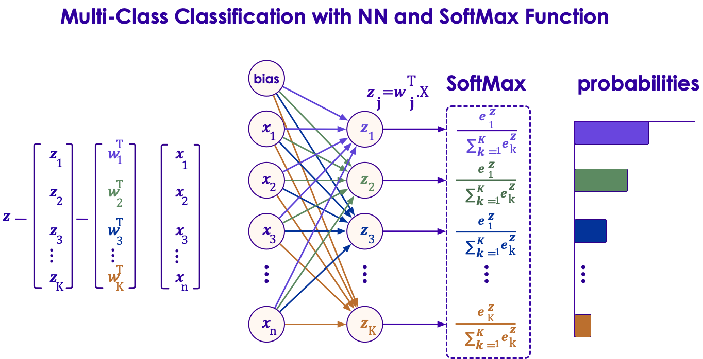

Introduction to Neural Networks.
======
## Lesson Objectives

 * Learn about MultiLayer Perceptron

 * Understand how Gradient Descent and Backpropagation help us train neural networks.

 * Understand Convolutional Networks help solve certain hard problems.

Notes:

---
# Perceptrons

## Activation Functions

 * Once we have the output of neuron, what do we do it?

 * In our previous example, we defined a step function

     - If the output was greater than threshold b, `y = 1`,

     - Else, `y = 0`

     - Not Differentiable (can't use gradient descent to optimize)

 * Possible Activation Funtions
   - None (just use raw output of neuron)
   - Linear (apply linear transformation)
   - Sigmoid
   - Tanh
   - Relu (Covered later)

Notes:

---
## Linear Activation Function

   * `Output * weight + constant`
   * Commonly used for **Regresssion**
   * Linear Regression:
     - Single Layer (Linear)
     - Linear Activation Function
   * Differentiable
     - So we *can* use gradient descent

Notes:

---
## Sigmoid

   * Comes from Logistic Regression
   * Solve for the "log-odds-ratio"
   * Logistic Regression:
     - Single Layer (Linear)
     - Sigmoid Activation Function

 <!-- {"left" : 1.72, "top" : 3.21, "height" : 3.86, "width" : 6.81} -->

Notes:

---
## Tanh Activation

 * Tanh is more popular, rather than Sigmoid.

 * The two are closely related, as tanh is a "stretched" Sigmoid

     - `Tanh(x) = 2 * logistic(2x) – 1`

 * Tanh is symmetric around zero.

 <!-- {"left" : 0.77, "top" : 3.3, "height" : 3.24, "width" : 8.71} -->

Notes:

---
## Vanishing Gradient Problem

 * Sigmoid and Tanh both suffer from the Vanishing Gradient Problem.

     - The derivative of a Sigmoid is less than .25

     - As we propagate that through many layers, that gradient becomes much less.

 * This means that they suffer from difficult convergence as one gets away from the center.

 * One way is to fix the vanishing gradient problem is repeated scaling.

 * However, there is another way.

Notes:

---
## Rectified Linear Unit (ReLU) Activation

 * In real-life, we normally use Rectified Linear Unit Activation.

 * ReLU = Rectified Linear Unit

 * ReLU is Linear when greater than zero, and constant (zero) less than zero

 <!-- {"left" : 0.58, "top" : 3.26, "height" : 3.57, "width" : 9.09} -->

Notes:

---
## Why ReLU?

 * Isn't ReLU not differentiable?

     - It is not differentiable at zero

     - But we can overcome that limitation.

 * Why do we use ReLU?

     - Simple
     – very easy understand
     - Fast – computationally very cheap
     - No Vanishing gradient problem
     - No Exploding Gradient problem

 * This is an example where simpler is actually better!

Notes:

---
## The single-layer network

 * We can combine perceptron inputs to a feedforward neural network.

 * We have an input-layer and an output layer

     - Why do we call it single layer? (When there is input + output)

     - Because the input layer only passes through the inputs.

 * What is the size of the input and output layers?

     - Input: number of features variables from input

     - Output: 1 neuron (unless we use a softmax output layer)

Notes:

---
## Multi-class (non-binary) Outputs

 * So far, our neural networks have had exactly one output neuron.

     - For regression problems, the output neuron generates the response variable (a continuous value).

     - For classification problems, the output is binary

 * What about multi-class classification? (non-binary)

     - We need more than one output neuron.

     - Exactly one neuron for each class in classification.

 * How do we generate the output classes?

     - We can use a function called Softmax

Notes:

---
## Softmax output

 * The Softmax function converts an array of values to an array of probabilities.

     - For example `[1, 2, 3, 4, 1, 2, 3] => [.024, .064, .175, .475, .024, .064, .175]`

     - The resultant array must add up to 1, because the output enumerates all probabilities

 * We can implement the softmax function on the output, where we have k neurons indicating that we expect to see k number of output classes.

Notes:

---
## Softmax Function

 <!-- {"left" : 0.38, "top" : 1.5, "height" : 4.5, "width" : 9.48} -->

Notes:

---
## Logistic Regression Redux?

 * What we've done so far is essentially create a logistic regression classifier.

 * In fact, with the Sigmoid activation function, we've done essentially exactly that.

 * So are neural networks just a implementation scheme for logistic regression?

     - Not really.

Notes:

---
## Lab: Logistic Regression

 * In this lab, we will be implementing a logistic regression classifier using Neural Networks in Tensorflow.

 * The result will be a linear model (no hidden layer) with a Sigmoid output

Notes:

---
## The XOR problem

 * What happens if we don't have linear separability?

 * For example, can we learn a function that does an exclusive or?

 * There is no line that can separate these.  

     - And so the single-layer perceptron will never converge.

     - This is known as the XOR problem (though many other datasets are not linearly separable).

 <!-- {"left" : 2.63, "top" : 3.98, "height" : 3.49, "width" : 4.99} -->

Notes:

---
## The solution: a Hidden Layer

 * Our problem is that our solution to a single layer neural network is linear.  

     - We call the solution the "decision boundary"

     - What if we could create a nonlinear decision boundary?

     - How would we do that?

 * What if we add a new layer to our network?

 <!-- {"left" : 3.29, "top" : 3.78, "height" : 3.52, "width" : 3.66} -->

Notes:

---
## Why Hidden Layers

 * Hidden Layers allow us to solve the "XOR" problem

     - Creating a nonlinear decision boundary

 * How Many Hidden Layers?

     - Most nonlinear problems solvable with one hidden layer.

     - Multiple Hidden Layers allow for more complex decision boundaries

 * One Hidden Layer is Enough

     - It has been proven that any function can be represented by a sufficiently large neural network with one hidden layer

     - Training that network may be difficult, however.

 * But it's not enough

     - Current training methods mean that more than one layer is required in many cases.

Notes:

---
## Perceptron Spiral Mini Lab–5 Mins

 * Try this at http://playground.tensorflow.org
 * Select the Spiral dataset as shown.
 * Select some features
 * You will need hidden layers.  Experiment to see your results.
 * Press play to converge on a solution.

 <!-- {"left" : 3.18, "top" : 3.55, "height" : 3.72, "width" : 3.9} -->

Notes:

---
## Lab Review

 * What's the minimum number of hidden layers required to correctly classify all the test data?

 * Does adding any additional features help at all?

 * Do we necessarily get better results with more neurons and/or hidden layers?

Notes:

---
## Training the Model

 * Rosenblatt's original algorithm for training was simple:

     - Iterate through weights and look at the output error

     - Adjust weights until output error was zero.

     - Will converge only if the outputs are linearly separable.

 * The Problem:

     - With hidden layers, we now have a much greater number of weights to try.

     - This kind of "brute force" method will take too long to train.

Notes:

---
## Calculating the Error

 * When we randomly initialize the weights, our first pass outputs of our network will almost certainly be wrong!

     - We have training data, so we know the "right" answer

 * How do we calculate how wrong we are?

 * We consider this the  **Error** or **Loss** .  But what is the error?

 * The error is the  **distance**  between the training output vector and the current output.

 * But what is the meaning of  **distance** ?

     - Simplest: Euclidean distance, the distance in Euclidean space.

     - But this is not what we usually use.

     - For classification, we normally use  **cross entropy** to calculate loss.

Notes:

---
## Gradient Descent

 * We want to optimize our model so error is  **minimized**

 * Gradient Descent is a common optimization algorithm.

 * Imagine a snowboarder going down the slope of a mountain

     - The snowboarder descends because the slope is steep.

     - Descent slows as she approaches the bottom, because the slope is less.

     - At the bottom of the hill, the slope is zero, so the snowboarder stops. This is the minimum.

     -  There may, however, be parts of the run with a zero slope that are NOT the bottom (local minima).  

  <!-- {"left" : 6.33, "top" : 4.79, "height" : 2.49, "width" : 3.44} -->

Notes:

---
## Backpropagation

 * We can complete our training by backpropagating the errors to the hidden nodes and continuing to use gradient descent to optimize.

 * This means that we take the errors output, and simply adjust the weights in the network to account for the errors.

Notes:

---
## Feedforward Network Sizing

 * Input Layer:

     - Size: Equal to Number of Input Dimensions

        * Possibly add one extra neuron for bias term.

     - What if we have thousands of sparse dimensions?

        * Consider Wide and Deep Neural Network

 * Hidden Layer(s)

     - Deep Learning =  Multiple Hidden Layer (more than 2)

     - Size depends on training sample, input features, outputs

 * Output Layer:

     - Regression: 1 single neuron (continuous output)

     - Binomial Classification: 1 single neuron (binary output)

     - Multinomial Classification: Softmax Layer

        * Size: 1 node per class label

Notes:

---
## Lab: Iris Dataset

 * In this lab, we will be using the Iris dataset.

 * We will be training a multi-layer perceptron feedforward neural network.

Notes:

---
