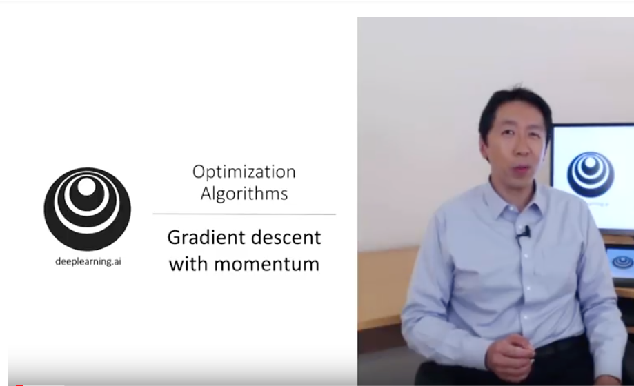

# Optimizers

---

## Optimizers Overview

- Gradient Descent

- Momentum Optimizer

- Nesterov Accelerated Gradient

- AdaGrad

- RMSProp

---

## Gradient Descent


- Gradient Descent is a popular optimization algorithm
- Basic idea:
    - Start with initial values of coefficients (zero or random value)
    - `cost = evaluate (f(coefficients)`
    - Calculate 'derivative'  to determine the 'slope' or 'direction'
    - Update coefficients in the right 'direction' and calculate cost again
    - 'learning rate parameter' (alpha, ⍺) determines how much coefficients can change
    - Iterate  until you find global minimum
- Algorithm will converge after multiple iterations
- As it gets closer to convergence the 'steps' gets smaller

---

## Gradient Descent Demo


[Animation 1](https://s3.amazonaws.com/elephantscale-public/media/gradient-descent-animation-1.gif)

[Animation 2](https://s3.amazonaws.com/elephantscale-public/media/gradient-descent-animation-3.gif)

---

## Gradient Descent in 3D

Imagine you are a skier standing on top of the hill.  
You need to find the bottom, just using the 'feel under your feet'.  
Here we are changing `a` and `b` trying to find the lowest point.


---

## Stochastic Gradient Descent (SGD)

- Classic Gradient Descent can be slow on large datasets (each iteration requires calculation over millions of data points)

- SGD updates coefficients for each training instance, rather than at the end of the batch of instances

- Also randomizes training set to
    - Reduce coefficients jumping all over the place
    - And to avoid 'getting stuck' at local minima

- Features
    - Very effective for large datasets
    - Requires very few passes (usually 10-20) to converge

---

## Momentum Optimization


- Imagine a ball rolling down a smooth surface;  it will start slowly, but keep accelerating and quickly picking up momentum until it reaches terminal velocity

- This is the idea behind **Momentum Optimization** ([paper by Boris Polyak, 1964](https://www.researchgate.net/publication/243648538_Some_methods_of_speeding_up_the_convergence_of_iteration_methods))
    - Regular Gradient Descent will get there too, but will take many steps and take longer

- Regular Gradient Descent updates the new weights using learning rate (always constant).  if the local gradient is very small, the updates are small too  
$$\theta  = \theta -  \alpha  \nabla _\theta J(\theta)$$

- Here
    - θ: is current weights
    - ⍺ : learning rate
    - J(θ) : cost
    - ∇(θ) : is derivative

---

## Momentum Optimizer

- Momentum takes into account of what previous gradients were

- Calculates the momentum and adds it to the next weight updates
    - so it accelerates the updates

$$ m =  \beta m  - \alpha \nabla _\theta J(\theta) $$
$$ \theta  = \theta + m $$

- Hyperparameter β, is called the momentum; ranges between 0 (high friction) and 1 (no friction). A typical momentum value is 0.9.

- Features
    - Could be 10x faster than Gradient Descent
    - Also doesn't get trapped in local minima


---

## Momentum Video Tutorial



[Link](https://www.youtube.com/watch?v=k8fTYJPd3_I)

---

## Momentum Implementation

#### Tensorflow

```python
optimizer = tf.train.MomentumOptimizer(learning_rate=?,
                                       momentum=0.9)
```

#### Keras
```python
sgd = optimizers.SGD(lr=0.01, decay=1e-6, momentum=0.9, nesterov=True)
```

---
## Nesterov Accelerated Gradient

- This is an update to Momentum Descent ([Paper by Yurii Nesterov in 1983](https://scholar.google.com/citations?view_op=view_citation&citation_for_view=DJ8Ep8YAAAAJ:hkOj_22Ku90C))

- **Nesterov Accelerated Gradient (NAG)** measures the gradient of the cost function not at the local position but slightly ahead in the direction of the momentum

$$ m =  \beta m  - \alpha \nabla _\theta J(\theta + \beta m) $$
$$ \theta  = \theta + m $$


Notes:  
Image credit : AZQuotes

---

## Nestrov Accelerated Momentum

Here you see Nestrov approach is slightly closer to optimum


---

## Nestrov Implementation

#### Tensorflow

```python
optimizer = tf.train.MomentumOptimizer(learning_rate=?,
                                       momentum=0.9,
                                       use_nesterov=True) # <-- here
```

#### Keras
```python
sgd = optimizers.SGD(lr=0.01, decay=1e-6, momentum=0.9, nesterov=True)
```
---

## Adagrad

- In Gradient Descent animation algorithm takes 'smaller steps' when going down 'valleys'

- Adagrad ([paper](http://www.jmlr.org/papers/volume12/duchi11a/duchi11a.pdf)) adjusts the direction and velocity by scaling the direction vector
    - 'points in the right direction (gloabl minimum)' better :-)


---

## RMS Prop

- Adagrad might slow down too fast, taking longer to reach the global minimum

- RMSProp fixes this by accumulating only the gradients from the most recent iterations (as opposed to all the gradients since the beginning of training)
    - Uses exponential decay

- Decay rate β is between 0 and 1.0; typically set to 0.9 - that works well in most scenarios

- Properties
    - Outperforms Adagrad most of the times
    - Was the default choice until 'Adam Optimizer' was devised


Notes:  
- http://www.cs.toronto.edu/~tijmen/csc321/slides/lecture_slides_lec6.pdf
- [Video by Geoffrey Hinton](https://www.youtube.com/watch?v=defQQqkXEfE&list=PLoRl3Ht4JOcdU872GhiYWf6jwrk_SNhz9&index=29)

---

## RMS Prop Video Tutorial 1


[Link](https://www.youtube.com/watch?v=defQQqkXEfE&list=PLoRl3Ht4JOcdU872GhiYWf6jwrk_SNhz9&index=29)

---

## RMS Prop Video Tutorial 2


[Link](https://www.youtube.com/watch?v=_e-LFe_igno)

---

## Adam Optimizer  

- Adam ((Adaptive Moment Estimation) Optimizer ([paper](https://arxiv.org/pdf/1412.6980v8.pdf)) combines the ideas of Momentum optimization and RMSProp

- Features
    - Currently, the go-to optimizer
    - Since Adam is adaptive, there is very little tuning.  
      Start with learning_rate = 0.001

Notes:  
- https://arxiv.org/pdf/1412.6980v8.pdf

---
## Adam Math (Reference Only)


---

## Adam Math (Reference Only)

- Step 1 computes an exponentially decaying average rather than an exponentially decaying sum,

- Hyperparameters
    - β1 is typically initialized to 0.9
    - β2  - scaling decay hyperparameter -  is often initialized to 0.999
    -  ϵ - the smoothing term -  is usually initialized to a tiny number such as 10e-8

---

## Adam Optimizer Implementation

#### Tensorflow

```python
optimizer = tf.train.AdamOptimizer(learning_rate=?)
```

#### Keras
```python
keras.optimizers.Adam(lr=0.001, beta_1=0.9, beta_2=0.999, epsilon=None, decay=0.0, amsgrad=False)
```

---
## Animations of Various Optimizers

#### Long valley
"Algos without scaling based on gradient information really struggle to break symmetry here - SGD gets no where and Nesterov Accelerated Gradient / Momentum exhibits oscillations until they build up velocity in the optimization direction. Algos that scale step size based on the gradient quickly break symmetry and begin descending quickly"


[Link for animation](https://s3.amazonaws.com/elephantscale-public/media/optimizer-animation-2-long-valley.gif)

Notes:  
- Animations credit to Alec Radford
- http://www.denizyuret.com/2015/03/alec-radfords-animations-for.html
- https://imgur.com/a/Hqolp

---

## Animations of Various Optimizers

#### Saddle Point
"Behavior around a saddle point. NAG/Momentum again like to explore around, almost taking a different path. Adadelta/Adagrad/RMSProp proceed like accelerated SGD."


[Link for animation](https://s3.amazonaws.com/elephantscale-public/media/optimizers-animation-3-saddle-point.gif)

Notes:  
- Animations credit to Alec Radford
- http://www.denizyuret.com/2015/03/alec-radfords-animations-for.html
- https://imgur.com/a/Hqolp

---

## Optimizers : Resources

- http://ruder.io/optimizing-gradient-descent/

- [Momentum video tutorial by Andrew Ng](https://www.youtube.com/watch?v=k8fTYJPd3_I)

- [RMSProp video tutorial by Andew Ng](https://www.youtube.com/watch?v=_e-LFe_igno)

- [Animations of various optimizers](http://www.denizyuret.com/2015/03/alec-radfords-animations-for.html)
