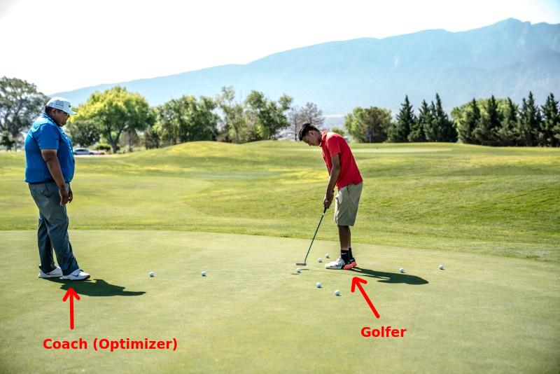

# Optimizers

---

## Optimizers Overview

- Gradient Descent

- Momentum Optimizer

- Nesterov Accelerated Gradient

- AdaGrad

- RMSProp

---


## Understanding Optimzers: A Golf Game Analogy  :-)

<!-- {"left" : 5.52, "top" : 1.54, "height" : 3, "width" : 4.5} -->


- Imagine a golfer is trying to get the ball in the hole

- He is getting help from a coach

- Coach is giving him feedback after each shot

---

## Optimizing a Golf Game

- First swing is off to the right a little
- Error is measured by __loss function__  (_error-1_)
- Optimizer ('golf coach') gives feedback on first shot
    - _"swing a little to left"_

<!-- {"left" : 1.17, "top" : 3.38, "height" : 4.84, "width" : 2.85} --> &nbsp;
<!-- {"left" : 5.3, "top" : 3.38, "height" : 4.84, "width" : 4.55} -->


---

## Optimizing a Golf Game

- Second shot is aimed at the hole, but stops a little short (_error-2_)
- Optimizer corrects the swing again
    - _"give it little more power"_
- And the third swing makes the hole!

<!-- {"left" : 0.78, "top" : 3.81, "height" : 4.34, "width" : 3.98} --> &nbsp;
<!-- {"left" : 5.49, "top" : 3.81, "height" : 4.34, "width" : 3.98} -->


---

## Optimizing a Golf Game - Summary

<!-- {"left" : 0.15, "top" : 3.33, "height" : 2.95, "width" : 1.74} --> &nbsp; &nbsp;
<!-- {"left" : 1.95, "top" : 3.35, "height" : 2.95, "width" : 2.78} --> &nbsp; &nbsp; <!-- {"left" : 4.8, "top" : 3.33, "height" : 2.95, "width" : 2.71} -->
 &nbsp; &nbsp; <!-- {"left" : 7.36, "top" : 3.35, "height" : 2.95, "width" : 2.71} -->


---

## Gradient Descent

[../../machine-learning/generic/Gradient-Descent.md](../../machine-learning/generic/Gradient-Descent.md)

---
## Momentum Optimization

<!-- {"left" : 5.88, "top" : 2.19, "height" : 2.61, "width" : 4.15} -->

- Imagine a ball rolling down a smooth surface;  it will start slowly, but keep accelerating and quickly picking up momentum until it reaches terminal velocity

- This is the idea behind **Momentum Optimization** ([paper by Boris Polyak, 1964](https://www.researchgate.net/publication/243648538_Some_methods_of_speeding_up_the_convergence_of_iteration_methods))
    - Regular Gradient Descent will get there too, but will take many steps and take longer


---

## Momentum Optimization

- Regular Gradient Descent updates the new weights using learning rate (always constant).  if the local gradient is very small, the updates are small too  

<!-- {"left" : 3.13, "top" : 2.6, "height" : 1.08, "width" : 3.98} -->


- Here
    - θ: is current weights
    - ⍺: learning rate
    - J(θ): cost
    - ∇(θ): is derivative


Notes:


---

## Momentum Optimizer

<!-- {"left" : 6.87, "top" : 2.12, "height" : 0.74, "width" : 3.32} -->

<!-- {"left" : 7.6, "top" : 2.97, "height" : 0.91, "width" : 2.46} -->

- Momentum takes into account of what previous gradients were

- Calculates the momentum and adds it to the next weight updates
    - so it accelerates the updates


- Hyperparameter β, is called the momentum; ranges between 0 (high friction) and 1 (no friction). A typical momentum value is 0.9.

- Features
    - Could be 10x faster than Gradient Descent
    - Also doesn't get trapped in local minima

Notes:

---

## Momentum Video Tutorial

<!-- {"left" : 1.34, "top" : 1.12, "height" : 4.61, "width" : 7.57} -->

[Link](https://www.youtube.com/watch?v=k8fTYJPd3_I)

---

## Momentum Implementation

* **Tensorflow**

<br/>

```python
optimizer = tf.train.MomentumOptimizer(learning_rate=?,
                                       momentum=0.9)
```
<!-- {"left" : 0, "top" : 1.63, "height" : 0.98, "width" : 10.25} -->


* **Keras**

```python
sgd = optimizers.SGD(lr=0.01, decay=1e-6, momentum=0.9, nesterov=True)
```
<!-- {"left" : 0, "top" : 4.02, "height" : 0.45, "width" : 10.25} -->

---
## Nesterov Accelerated Gradient

<!-- {"left" : 3.13, "top" : 1.27, "height" : 0.73, "width" : 3.99} -->

<!-- {"left" : 4.16, "top" : 2.36, "height" : 0.71, "width" : 1.92} -->


 <!-- {"left" : 5.62, "top" : 3.47, "height" : 2.13, "width" : 4.38} -->

- This is an update to Momentum Descent ([Paper by Yurii Nesterov in 1983](https://scholar.google.com/citations?view_op=view_citation&citation_for_view=DJ8Ep8YAAAAJ:hkOj_22Ku90C))

- **Nesterov Accelerated Gradient (NAG)** measures the gradient of the cost function not at the local position but slightly ahead in the direction of the momentum


Notes:  

---

## Nesterov Accelerated Momentum

- Here you see Nesterov approach is slightly closer to optimum

<!-- {"left" : 2.9, "top" : 2.61, "height" : 5.1, "width" : 4.44} -->


---

## Nesterov Implementation

* **Tensorflow**


```python
optimizer = tf.train.MomentumOptimizer(learning_rate=?,
                                       momentum=0.9,
                                       use_nesterov=True) # <-- here
```
<!-- {"left" : 0, "top" : 1.63, "height" : 0.98, "width" : 10.25} -->


* **Keras**

```python
sgd = optimizers.SGD(lr=0.01, decay=1e-6, momentum=0.9, nesterov=True)
```
<!-- {"left" : 0, "top" : 4.02, "height" : 0.47, "width" : 10.25} -->

---

## Adagrad

- In Gradient Descent animation algorithm takes 'smaller steps' when going down 'valleys'

- Adagrad ([paper](http://www.jmlr.org/papers/volume12/duchi11a/duchi11a.pdf)) adjusts the direction and velocity by scaling the direction vector
    - 'points in the right direction (global minimum)' better :-)

<!-- {"left" : 2.2, "top" : 4.46, "height" : 3.14, "width" : 5.85} -->


---

## RMS Prop

- Adagrad might slow down too fast, taking longer to reach the global minimum

- RMSProp fixes this by accumulating only the gradients from the most recent iterations (as opposed to all the gradients since the beginning of training)
    - Uses exponential decay

- Decay rate β is between 0 and 1.0; typically set to 0.9 - that works well in most scenarios

- Properties
    - Outperforms Adagrad most of the times
    - Was the default choice until 'Adam Optimizer' was devised

<!-- {"left" : 1.71, "top" : 6.65, "height" : 1.13, "width" : 6.82} -->


Notes:  
- http://www.cs.toronto.edu/~tijmen/csc321/slides/lecture_slides_lec6.pdf
- [Video by Geoffrey Hinton](https://www.youtube.com/watch?v=defQQqkXEfE&list=PLoRl3Ht4JOcdU872GhiYWf6jwrk_SNhz9&index=29)

---

## RMS Prop Video Tutorial 1

<!-- {"left" : 1.17, "top" : 1.28, "height" : 4.26, "width" : 7.91} -->


[Link](https://www.youtube.com/watch?v=defQQqkXEfE&list=PLoRl3Ht4JOcdU872GhiYWf6jwrk_SNhz9&index=29)

---

## RMS Prop Video Tutorial 2

<!-- {"left" : 1.31, "top" : 1.2, "height" : 4.29, "width" : 7.63} -->


[Link](https://www.youtube.com/watch?v=_e-LFe_igno)

---

## Adam Optimizer  

- Adam (Adaptive Moment Estimation) Optimizer ([paper](https://arxiv.org/pdf/1412.6980v8.pdf)) combines the ideas of Momentum optimization and RMSProp

- Features
    - Currently, the go-to optimizer
    - Since Adam is adaptive, there is very little tuning.  
      Start with learning_rate = 0.001

Notes:  
- https://arxiv.org/pdf/1412.6980v8.pdf

---
## Adam Math (Reference Only)

<!-- {"left" : 1.15, "top" : 2.7, "height" : 4.24, "width" : 7.96} -->


---

## Adam Math (Reference Only)

- Step 1 computes an exponentially decaying average rather than an exponentially decaying sum,

- Hyperparameters
    - β1 is typically initialized to 0.9
    - β2  - scaling decay hyperparameter -  is often initialized to 0.999
    -  ϵ - the smoothing term -  is usually initialized to a tiny number such as 10e-8

---

## Adam Optimizer Implementation

* **Tensorflow**

```python
optimizer = tf.train.AdamOptimizer(learning_rate=?)
```
<!-- {"left" : 0, "top" : 1.87, "height" : 0.83, "width" : 9.48} -->

<br/>

* **Keras**

```python
keras.optimizers.Adam(lr=0.001, beta_1=0.9, beta_2=0.999, epsilon=None, decay=0.0, amsgrad=False)
```
<!-- {"left" : 0, "top" : 4, "height" : 0.45, "width" : 10.25} -->


---
## Animations of Various Optimizers - Long valley

<!-- {"left" : 6.04, "top" : 1.37, "height" : 3.04, "width" : 3.94} -->

* "Algos without scaling based on gradient information really struggle to break symmetry here - SGD gets no where and Nesterov Accelerated Gradient / Momentum exhibits oscillations until they build up velocity in the optimization direction. Algos that scale step size based on the gradient quickly break symmetry and begin descending quickly"


[Link for animation](https://s3.amazonaws.com/elephantscale-public/media/optimizer-animation-2-long-valley.gif)

---
## Animations of Various Optimizers -  Saddle Point

<!-- {"left" : 5.89, "top" : 1.37, "height" : 3.16, "width" : 4.07} -->

* "Behavior around a saddle point. NAG/Momentum again like to explore around, almost taking a different path. Adadelta/Adagrad/RMSProp proceed like accelerated SGD."

[Link for animation](https://s3.amazonaws.com/elephantscale-public/media/optimizers-animation-3-saddle-point.gif)


Notes:  
- Animations credit to Alec Radford
- http://www.denizyuret.com/2015/03/alec-radfords-animations-for.html
- https://imgur.com/a/Hqolp

---
## Optimizers - Takeaway

- __RMSProp__ and __Adam__ are the 'go to' optimizers now

- __RMSprop__ optimization algorithm is preferable to stochastic gradient descent (SGD), because RMSprop automates learning-rate tuning for us

- __Adam__ and __Adagrad__ optimizers also automatically adapt the learning rate during training

- No need to fiddle with learning rates!
---

## Optimizers: Resources

- http://ruder.io/optimizing-gradient-descent/

- [Momentum video tutorial by Andrew Ng](https://www.youtube.com/watch?v=k8fTYJPd3_I)

- [RMSProp video tutorial by Andew Ng](https://www.youtube.com/watch?v=_e-LFe_igno)

- [Animations of various optimizers](http://www.denizyuret.com/2015/03/alec-radfords-animations-for.html)
