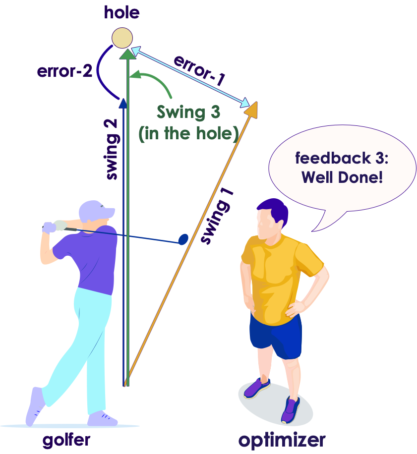
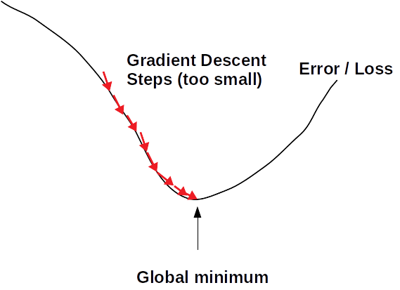
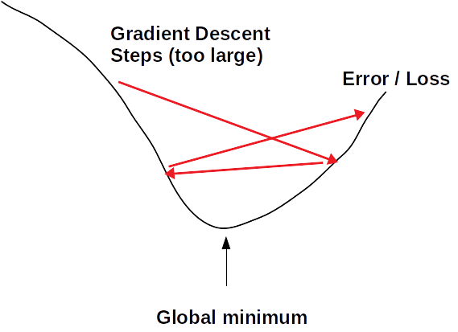
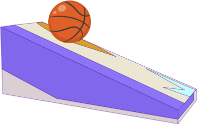
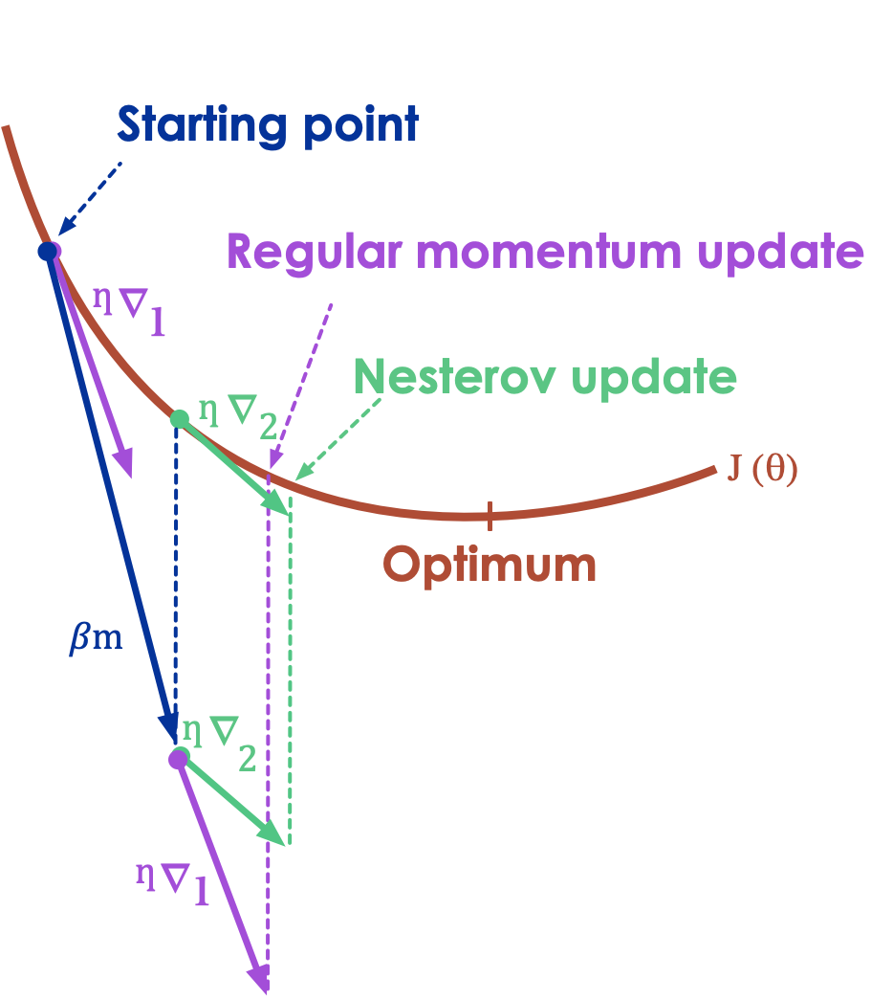

# Optimizers

---

## Optimizers Overview

<!-- todo shiva -->
<!-- {"left" : 5.52, "top" : 1.54, "height" : 3, "width" : 4.5} -->

- **Optimizers** help determine weights during training phase

- Various optimizers
    - Gradient Descent
    - Momentum Optimizer
    - Nesterov Accelerated Gradient
    - AdaGrad
    - RMSProp
    - Adam

* References:
  - [Various optimziers compared](https://towardsdatascience.com/optimizers-for-training-neural-network-59450d71caf6)


---

## About This Section

* The first part covers popular optimizers and how to use them

* The math for optimizers can be found in the 'appendix' section (provided as reference; not covered in class)

---
## Understanding Optimizers: A Golf Game Analogy  :-)

<!-- {"left" : 5.52, "top" : 1.54, "height" : 3, "width" : 4.5} -->


- Imagine a golfer is trying to get the ball in the hole

- He is getting help from a coach

- Coach is giving him feedback after each shot

---

## Optimizing a Golf Game

- First swing is off to the right a little
- Error is measured by __loss function__  (_error-1_)
- Optimizer ('golf coach') gives feedback on first shot
    - _"swing a little to left"_

<!-- {"left" : 1.17, "top" : 3.38, "height" : 4.84, "width" : 2.85} --> &nbsp;
<!-- {"left" : 5.3, "top" : 3.38, "height" : 4.84, "width" : 4.55} -->


---

## Optimizing a Golf Game

- Second shot is aimed at the hole, but stops a little short (_error-2_)
- Optimizer corrects the swing again
    - _"give it little more power"_
- And the third swing makes the hole!

<!-- {"left" : 0.78, "top" : 3.81, "height" : 4.34, "width" : 3.98} --> &nbsp;
<!-- {"left" : 5.49, "top" : 3.81, "height" : 4.34, "width" : 3.98} -->


---

## Optimizing a Golf Game - Summary

<!-- {"left" : 0.15, "top" : 3.33, "height" : 2.95, "width" : 1.74} --> &nbsp; &nbsp;
<!-- {"left" : 1.95, "top" : 3.35, "height" : 2.95, "width" : 2.78} --> &nbsp; &nbsp; <!-- {"left" : 4.8, "top" : 3.33, "height" : 2.95, "width" : 2.71} -->
 &nbsp; &nbsp; <!-- {"left" : 7.36, "top" : 3.35, "height" : 2.95, "width" : 2.71} -->

---

## Popular Optimziers

<!-- {"left" : 5.52, "top" : 1.54, "height" : 3, "width" : 4.5} -->

* There are various optimizer implementations;  We will focus on 3 most popular ones

* **Stochastic Gradient Descent (SGD)** is the original implementation, and still heavily used

* **RMSProp** is one of the 'go to' optimizers now.  It features 'adaptive learning'

* **Adam** is also one of the 'go to' optimizers now.  It features 'adaptive learning'

---

## Gradient Descent

[../../machine-learning/generic/Gradient-Descent.md](../../machine-learning/generic/Gradient-Descent.md)

---

## Adaptive Learning

* As we saw before, learning rate affects the convergence of SGD
  - Too small, might take too many steps and take long to converge
  - Too large, might not converge at all

* We figure out the optimial learning rate by trial-and-error runs (e.g. hyper parameter tuning)

* The latest optimizers, such as **Adam** and **RMSProp**, can adjust the learning rate automatically; called **adaptive optimizers**

<!-- TODO shiva -->
<!-- {"left" : 6.76, "top" : 1.92, "height" : 3.66, "width" : 2.75} -->
<!-- {"left" : 6.76, "top" : 1.92, "height" : 3.66, "width" : 2.75} -->
<!-- {"left" : 6.76, "top" : 1.92, "height" : 3.66, "width" : 2.75} -->

---

## RMS Prop

* Developed by Professor Geoffrey Hinton in his [neural nets class](http://www.cs.toronto.edu/~tijmen/csc321/slides/lecture_slides_lec6.pdf)

- RMSProp uses **expolonetial delay** to  accumulate only the gradients from the most recent iterations (as opposed to all the gradients since the beginning of training)


- Properties
    - Outperforms Adagrad most of the times
    - Was the default choice until 'Adam Optimizer' was devised

* See Appendix for more details and math behind it


Notes:  

---

## RMS Prop Reference

* [Lecture by Geoffrey Hinton](https://www.youtube.com/watch?v=defQQqkXEfE&list=PLoRl3Ht4JOcdU872GhiYWf6jwrk_SNhz9&index=29)

* [Lecture by Andrew Ng](https://www.youtube.com/watch?v=_e-LFe_igno)

- References:
  - [Class notes for 'lecture 6'](http://www.cs.toronto.edu/~tijmen/csc321/slides/lecture_slides_lec6.pdf)
  - [A Look at Gradient Descent and RMSprop Optimizers](https://towardsdatascience.com/a-look-at-gradient-descent-and-rmsprop-optimizers-f77d483ef08b)


<!-- {"left" : 1.17, "top" : 1.28, "height" : 4.26, "width" : 7.91} --> &nbsp; &nbsp;
<!-- {"left" : 1.31, "top" : 1.2, "height" : 4.29, "width" : 7.63} -->


---

## Using RMSProp

* **Tensorflow v2**

<!-- TODO shiva -->
```python
from tf.keras.optimizers import RMSprop

# We can use the default values
model.compile (optimizer='rmsprop', loss='...')


# or we can customize
opt = RMSprop(learning_rate=0.1)  # <-- initialize the class and provide arguments

# model = ... build model ...

model.compile (optimizer=opt, loss='...')
```


---

## Adam Optimizer  

- Adam (Adaptive Moment Estimation) Optimizer ([paper](https://arxiv.org/pdf/1412.6980v8.pdf)) combines the ideas of Momentum optimization and RMSProp

- Features
    - Currently, the go-to optimizer
    - Since Adam is adaptive, there is very little tuning.  
      Start with learning_rate = 0.001

- References:
    - [Paper: 'ADAM: A Method for Stochastic Optimization'](https://arxiv.org/pdf/1412.6980v8.pdf)

Notes:  

---

## Using Adam Optimizer

* **Tensorflow v2**

<!-- TODO shiva -->
```python
from tf.keras.optimizers import Adam

# We can use the default values
model.compile (optimizer='adam', loss='...')


# or we can customize
opt = Adam(learning_rate=0.1)  # <-- initialize the class and provide arguments

# model = ... build model ...

model.compile (optimizer=opt, loss='...')
```


---
## Comparing Optimizers - Long Valley

<!-- {"left" : 6.04, "top" : 1.37, "height" : 3.04, "width" : 3.94} -->

* "Algos without scaling based on gradient information really struggle to break symmetry here - SGD gets no where and Nesterov Accelerated Gradient / Momentum exhibits oscillations until they build up velocity in the optimization direction. Algos that scale step size based on the gradient quickly break symmetry and begin descending quickly"


* [Animation](https://s3.amazonaws.com/elephantscale-public/media/machine-learning/optimizer-animation-2-long-valley.mp4)

* [Source](http://www.denizyuret.com/2015/03/alec-radfords-animations-for.html)

---
## Comparing Optimizers -  Saddle Point

<!-- {"left" : 5.89, "top" : 1.37, "height" : 3.16, "width" : 4.07} -->

* "Behavior around a saddle point. NAG/Momentum again like to explore around, almost taking a different path. Adadelta/Adagrad/RMSProp proceed like accelerated SGD."

* [Animation](https://s3.amazonaws.com/elephantscale-public/media/machine-learning/optimizers-animation-3-saddle-point.mp4)


* [Source](http://www.denizyuret.com/2015/03/alec-radfords-animations-for.html)


Notes:  
- Animations credit to Alec Radford
- http://www.denizyuret.com/2015/03/alec-radfords-animations-for.html
- https://imgur.com/a/Hqolp

---

## Optimizers - Takeaway

<!-- TODO shiva -->
<!-- {"left" : 5.52, "top" : 1.54, "height" : 3, "width" : 4.5} -->

- Here we see the progress of our algorithm accuracy (climbing towards 1.0 or 100%)

- SGD's progress is 'bumpy'; While rmsprop and adam are progressing smoothly

- __RMSProp__ and __Adam__ are the 'go to' optimizers now

- These are **adaptive** algorithms, that adjust learning rate as training progresses.

- No need to fiddle with learning rates!

- Reference: [Machine Learning Mastery - Learning rate](https://machinelearningmastery.com/understand-the-dynamics-of-learning-rate-on-deep-learning-neural-networks/)


---

# Appendix-Optimizers

---

## Momentum Optimization

<!-- {"left" : 5.88, "top" : 2.19, "height" : 2.61, "width" : 4.15} -->

- Imagine a ball rolling down a smooth surface;  it will start slowly, but keep accelerating and quickly picking up momentum until it reaches terminal velocity

- This is the idea behind **Momentum Optimization** ([paper by Boris Polyak, 1964](https://www.researchgate.net/publication/243648538_Some_methods_of_speeding_up_the_convergence_of_iteration_methods))

- Regular Gradient Descent will get there too, but will take many steps and take longer

---

## Momentum Video Tutorial

<!-- {"left" : 1.34, "top" : 1.12, "height" : 4.61, "width" : 7.57} -->

* [Link](https://www.youtube.com/watch?v=k8fTYJPd3_I)

---

## Using Momentum Optimizer

* **Tensorflow v2** ([Documentation](https://www.tensorflow.org/api_docs/python/tf/keras/optimizers/SGD))

<br/>

<!-- TODO shiva -->
```python
from tf.keras.optimizers import SGD

opt = SGD(learning_rate=0.01,
          momentum=0.9) # <-- specify momentum here
# momentum = 0.0 (default value) is plain SGD

# model = ... build model ...

model.compile (optimizer=opt, loss='...')
```
<!-- {"left" : 0, "top" : 4.02, "height" : 0.45, "width" : 10.25} -->

---

## Nesterov Accelerated Gradient


 <!-- {"left" : 5.62, "top" : 3.47, "height" : 2.13, "width" : 4.38} -->

- This is an update to Momentum Descent

- **Nesterov Accelerated Gradient (NAG)** measures the gradient of the cost function not at the local position but slightly ahead in the direction of the momentum

- References:
    - [Paper by Yurii Nesterov in 1983](https://scholar.google.com/citations?view_op=view_citation&citation_for_view=DJ8Ep8YAAAAJ:hkOj_22Ku90C)
    - [Sutskever et al., 2013](http://jmlr.org/proceedings/papers/v28/sutskever13.pdf)


Notes:  

---

## Using Nesterov

* **Tensorflow v2**

<!-- TODO shiva -->
```python
from tf.keras.optimizers import SGD

opt = SGD(learning_rate=0.01,
          momentum=0.9,
          nesterov = True) # <-- Apply Nesterov algorithm
# by default nesterov=False

# model = ... build model ...

model.compile (optimizer=opt, loss='...')
```

---

## Adagrad

- In Gradient Descent animation algorithm takes 'smaller steps' when going down 'valleys'

- Adagrad ([paper](http://www.jmlr.org/papers/volume12/duchi11a/duchi11a.pdf)) adjusts the direction and velocity by scaling the direction vector
    - 'points in the right direction (global minimum)' better :-)

<!-- {"left" : 2.2, "top" : 4.46, "height" : 3.14, "width" : 5.85} -->


---

## Momentum Optimization Theory

- Regular Gradient Descent updates the new weights using learning rate (always constant).  if the local gradient is very small, the updates are small too  

<!-- {"left" : 3.13, "top" : 2.6, "height" : 1.08, "width" : 3.98} -->


- Here
    - θ: is current weights
    - ⍺: learning rate
    - J(θ): cost
    - ∇(θ): is derivative


Notes:


---

## Momentum Optimizer

<!-- {"left" : 6.87, "top" : 1.09, "height" : 0.74, "width" : 3.32} -->

<!-- {"left" : 7.6, "top" : 2, "height" : 0.91, "width" : 2.46} -->

- Momentum takes into account of what previous gradients were

- Calculates the momentum and adds it to the next weight updates
    - so it accelerates the updates


- Hyperparameter β, is called the momentum; ranges between 0 (high friction) and 1 (no friction). A typical momentum value is 0.9.

- Features
    - Could be 10x faster than Gradient Descent
    - Also doesn't get trapped in local minima

Notes:

---

## Nesterov Accelerated Gradient

<!-- {"left" : 3.13, "top" : 1.27, "height" : 0.73, "width" : 3.99} -->

<!-- {"left" : 4.16, "top" : 2.36, "height" : 0.71, "width" : 1.92} -->

---

## Nesterov Accelerated Momentum

- Here you see Nesterov approach is slightly closer to optimum

<!-- {"left" : 2.9, "top" : 2.61, "height" : 5.1, "width" : 4.44} -->

---

## RMSProp Math

- Decay rate β is between 0 and 1.0; typically set to 0.9 - that works well in most scenarios

<!-- {"left" : 1.71, "top" : 6.65, "height" : 1.13, "width" : 6.82} -->

---


## Adam Math (Reference Only)

<!-- {"left" : 1.15, "top" : 2.7, "height" : 4.24, "width" : 7.96} -->


---

## Adam Math (Reference Only)

- Step 1 computes an exponentially decaying average rather than an exponentially decaying sum,

- Hyperparameters
    - β1 is typically initialized to 0.9
    - β2  - scaling decay hyperparameter -  is often initialized to 0.999
    -  ϵ - the smoothing term -  is usually initialized to a tiny number such as 10e-8

---

## Optimizers: Resources

- http://ruder.io/optimizing-gradient-descent/

- [Momentum video tutorial by Andrew Ng](https://www.youtube.com/watch?v=k8fTYJPd3_I)

- [RMSProp video tutorial by Andew Ng](https://www.youtube.com/watch?v=_e-LFe_igno)

- [Animations of various optimizers](http://www.denizyuret.com/2015/03/alec-radfords-animations-for.html)

