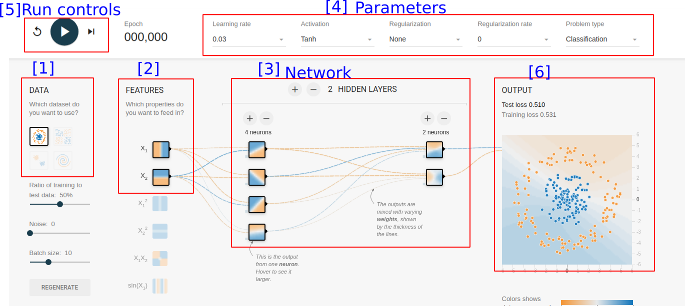
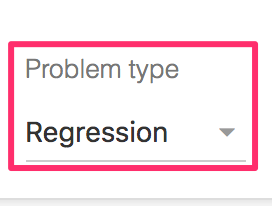
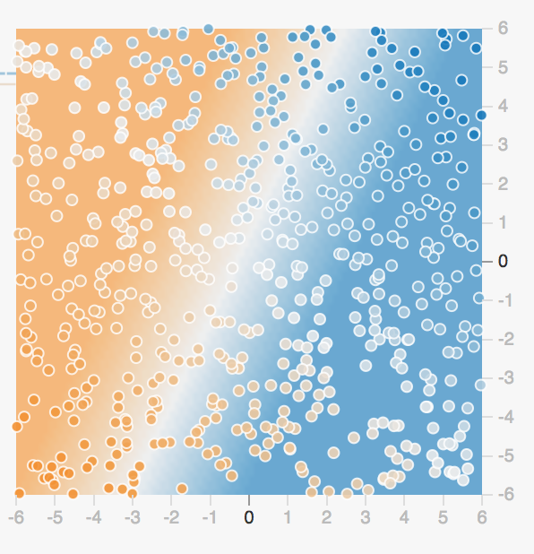
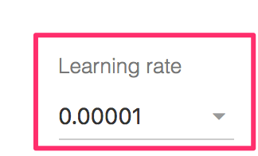

# Tensorflow Playground

Reference Only.    
Specific Sections are covered in other slides.

---

# Introduction to Tensorflow Playground

---

## Introducing the Playground

  * Navigate in your browser to http://playground.tensorflow.org
  * This is a playground that we will use to play with some concepts
  * It will be fun!
  * When you start, you should see this

<!-- {"left" : 2.45, "top" : 4.04, "height" : 3.53, "width" : 5.35} -->

Notes:

---
## Playground Overview

- Step 1: Select data
- Step 2: Select features
- Step 3: Design neural network
- Step 4: Adjust parameters
- Step 5: Run
- Step 6: Inspect the results

<!-- {"left" : 1.59, "top" : 4.56, "height" : 3.17, "width" : 7.08} -->

Notes:

---
## Hidden Layers
  * We will start out with **no** hidden layers
  * Click the "minus" icon to get to no hidden layers

<!-- {"left" : 1.12, "top" : 3.14, "height" : 4.15, "width" : 8.01} -->

Notes:

---
# Playground Linear Regression

---

## Linear Regression: Setup

  * Click on the dropdown at the upper right, select 'Regression'

<!-- {"left" : 4.18, "top" : 1.85, "height" : 1.13, "width" : 1.89} -->

  * Select the dataset in lower left

<!-- {"left" : 4.09, "top" : 4.05, "height" : 2.14, "width" : 2.06} -->

  * Select the **lowest** setting of Learning Rate

<!-- {"left" : 4, "top" : 7.25, "height" : 1.21, "width" : 2.26} -->

Notes:

---
## Linear Regression: Parameters

<!-- {"left" : 0.7, "top" : 1.22, "height" : 0.82, "width" : 8.85} -->

  * Learning Rate
    - This is the "step size" we use for Gradient Descent

  * Activation Function
    - This is what we do to the output of the neuron
    - More on this later.

  * Regularization  / Regularization Rate
    - L1 / L2 are penalties to help reduce overfitting
    - How much to add

Notes:

---
## Linear Regression: Run!

<!-- TODO shiva -->

<!-- {"left" : 6.97, "top" : 1.22, "height" : 1.63, "width" : 2.54} --><!-- {"left" : 6.15, "top" : 3.43, "height" : 1.29, "width" : 3.86} -->

  * Let's try pressing the PLAY Button

  * Look at the "Output" curve:

  * TOO **SLOW**!!!  (Why??)
    - How long (how many epochs) does it converge?
    - Do you ever get to loss = 0.0?

  * What is the meaning of "loss?"
    - It's another way of saying "error"
    - In this case, it's the RMSE (Root Mean Squared Error)

  * Is this dataset linearly separable?
    - Is it **possible** to get to zero loss?

Notes:

---
## Linear Regression: Adjust the Learning Rate

<!-- TODO shiva -->

<!-- {"left" : 8.22, "top" : 0.98, "height" : 1.14, "width" : 1.78} -->
<!-- {"left" : 7.22, "top" : 3.28, "height" : 1.37, "width" : 2.77} -->

  * Hit the reset button to the left of "play"

  * Adjust the learning rate dropdown to something higher.

  * Try hitting play again.

  * What happens if you set a really **big** rate?
    - Note the loss is NaN (Not a Number)
    - The data is only `-6.0` to  `+6.0`.
    - A "big" value causes overshoot

  * Challenge: What is the "optimal" learning rate?
    - Get to zero loss in the fewest epochs.

Notes:

---

## Lab Review

<!-- {"left" : 5.98, "top" : 2.4, "height" : 2.71, "width" : 4.06} -->

 * What is the impact of __'learning rate'__
    - how does it affect convergence

Notes:

---

# Classification Examples 1

---

## Linear Classification: Setup

<!-- {"left" : 0.32, "top" : 1.55, "height" : 1.09, "width" : 9.61} -->

<!-- TODO shiva -->

<!-- {"left" : 6.43, "top" : 4.17, "height" : 3.34, "width" : 3.25} -->

  * Parameters
    - Select 'Classification' on the dropdown at the upper right
    - Activation : Tanh
    - Learning Rate: 0.01

  * Select the Two-Blob Datasets

  * Is this dataset linearly separable?

Notes:

---
## Linear Classification: Run

<!-- TODO shiva -->

  <!-- {"left" : 3.22, "top" : 3.78, "height" : 3.86, "width" : 3.82} -->

  * The separated dataset might look like below

  * You may not get zero loss, especially if you introduce noise

  * Challenge: Adjust the learning rate to get to minimum loss in as few epochs as possible.

Notes:

---

## Lab Review

<!-- {"left" : 5.98, "top" : 2.4, "height" : 2.71, "width" : 4.06} -->

 * Why didn't we need hidden layers to converge on a solution?

 * What would happen if the dataset wasn't linearly separable?

Notes:

---

# Classification Examples 2

---
## Circle Dataset Overview

<!-- TODO shiva -->

<!-- {"left" : 0.77, "top" : 1.67, "height" : 3.1, "width" : 3.08} -->

  * Select the circle dataset:

  * Can we linearly separate this dataset?

  * Try it!
    - What loss do you get to?
    - Does changing the learning rate help?

Notes:

---
## Adding Features

<!-- TODO shiva -->

<!-- {"left" : 3.28, "top" : 4.32, "height" : 3.72, "width" : 3.69} -->

  * No amount of fiddling with learning rate will help!
    - It's not linearly separable.
    - Is it impossible?

  * So far, we have input just x1,x2 as features.
    - What if we include other terms?
    - x1² or x2² ?

Notes:

---
## Including Features

* Include these terms:

<!-- {"left" : 1.02, "top" : 2.31, "height" : 5.03, "width" : 8.21} -->

Notes:

---
## Experimenting with Features

<!-- TODO shiva -->

<!-- {"left" : 7, "top" : 1.73, "height" : 6.19, "width" : 1.91} -->

  * Experiment with adding features
  *  What terms converge to a solution?
  * Which do not converge?
  * Why?

Notes:

---
## Four Square Dataset Overview

<!-- TODO shiva -->

<!-- {"left" : 0.77, "top" : 1.62, "height" : 3.58, "width" : 3.59} -->

* Set the Four-Square dataset:

* Check to see if it will converge with just X0 and X1

* No??

* Are there any other features that can help?

Notes:

---
## Spiral Dataset

<!-- TODO shiva -->

<!-- {"left" : 0.77, "top" : 1.67, "height" : 4.06, "width" : 4.02} -->

* Set the Spiral dataset:

* Check to see if you can converge?

* Can you do it with no hidden layers?

Notes:

---

# Playground Hidden Layers

---

## Circle Dataset With Hidden Layers

<!-- TODO shiva -->

<!-- {"left" : 2.52, "top" : 2.2, "height" : 5.24, "width" : 5.21} -->
<!-- {"left" : 2.33, "top" : 3.31, "height" : 4.18, "width" : 5.59} -->

 * Select the circle dataset:

* Select only X1 and X2 as features

* Add a Hidden Layer

* Can you get a solution with 1 hidden Layer

- You can add more neurons to the hidden layer

- Can you solve it with only one hidden layer?

- If not, add another hidden layer

Notes:

---

## Four Square Dataset Hidden Layers

<!-- TODO shiva -->

<!-- {"left" : 0.82, "top" : 1.79, "height" : 3.41, "width" : 3.42} -->  &nbsp;  &nbsp;
<!-- {"left" : 6.61, "top" : 5.31, "height" : 2.23, "width" : 2.99} -->

   * Set the Four-Square dataset:

   * Can you solve it with hidden layers?

Notes:

---
## Spiral

<!-- TODO shiva -->
<!-- {"left" : 0.77, "top" : 1.65, "height" : 3.1, "width" : 3.07} -->

* Set the Spiral dataset:

* This one is really tricky!

* Can you do it?

* Don't be afraid to add new features!

* Multiple Hidden Layers?

Notes:

---
## Spiral Solution

<!-- TODO shiva -->

<!-- {"left" : 2.94, "top" : 2.05, "height" : 5.55, "width" : 4.37} -->

   * Can you get this result?

---

## Lab Review

<!-- {"left" : 5.98, "top" : 2.4, "height" : 2.71, "width" : 4.06} -->

* What's the minimum number of hidden layers required to correctly classify all the test data?

 * Does adding any additional features help at all?

 * Do we necessarily get better results with more neurons and/or hidden layers?

Notes:
