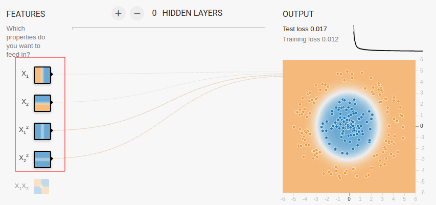
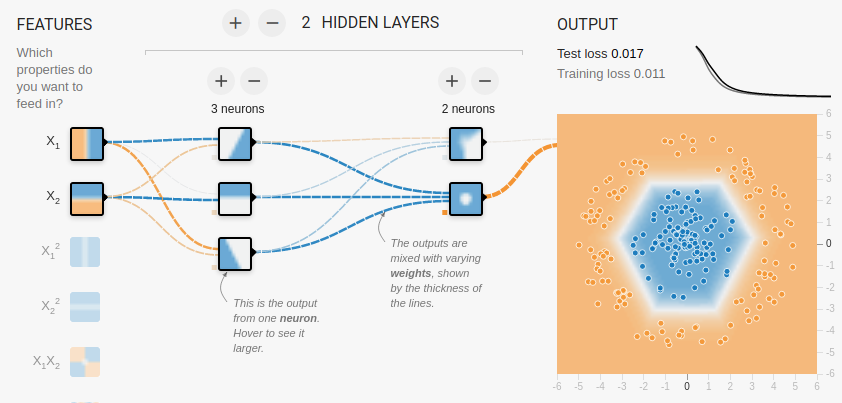
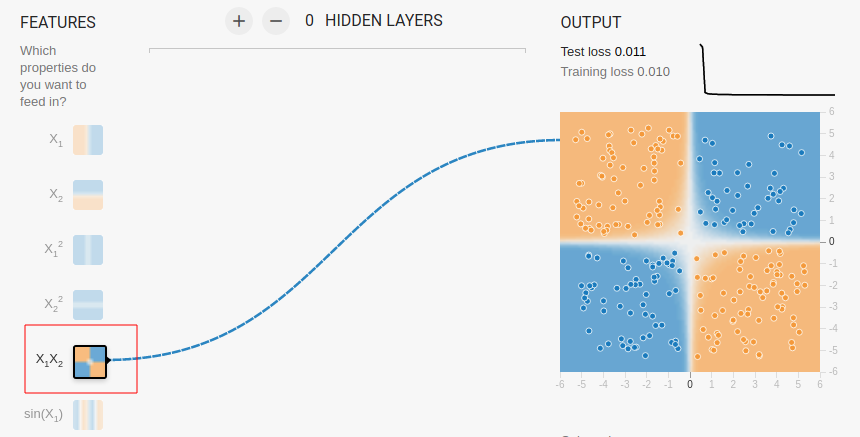

# Tensorflow Playground

Reference Only.    
Specific Sections are covered in other slides.

---

# Introduction to Tensorflow Playground

---

## Introducing the Playground

  * Navigate in your browser to http://playground.tensorflow.org
  * This is a playground that we will use to play with some concepts
  * It will be fun!
  * When you start, you should see this

<!-- {"left" : 5, "top" : 5.67, "height" : 4.95, "width" : 7.5} -->

Notes:

---
## Playground Overview

- Step 1: Select data
- Step 2: Select features
- Step 3: Design neural network
- Step 4: Adjust parameters
- Step 5: Run
- Step 6: Inspect the results

<!-- {"left" : 4.07, "top" : 6.67, "height" : 4.19, "width" : 9.36} -->

Notes:

---
## Hidden Layers
  * We will start out with **no** hidden layers
  * Click the "minus" icon to get to no hidden layers

<!-- {"left" : 4.01, "top" : 5.05, "height" : 4.91, "width" : 9.48} -->

Notes:

---
# Playground Linear Regression

---

## Linear Regression: Setup

<!-- {"left" : 13.38, "top" : 1.95, "height" : 2.25, "width" : 3.76} -->

  * Click on the dropdown at the upper right, select 'Regression'

 

<!-- {"left" : 13.7, "top" : 4.62, "height" : 3.25, "width" : 3.13} -->

  * Select the dataset in lower left

 

<!-- {"left" : 13.09, "top" : 8.01, "height" : 2.02, "width" : 3.76} -->

  * Select the **lowest** setting of Learning Rate

Notes:

---
## Linear Regression: Parameters

<!-- {"left" : 2.11, "top" : 1.89, "height" : 1.23, "width" : 13.28} -->

  * Learning Rate
    - This is the "step size" we use for Gradient Descent

  * Activation Function
    - This is what we do to the output of the neuron
    - More on this later.

  * Regularization  / Regularization Rate
    - L1 / L2 are penalties to help reduce overfitting
    - How much to add

Notes:

---
## Linear Regression: Run!

<!-- {"left" : 13.18, "top" : 1.89, "height" : 2.53, "width" : 3.94} -->

<!-- {"left" : 12.15, "top" : 4.39, "height" : 1.66, "width" : 4.99} -->

  * Let's try pressing the PLAY Button

  * Look at the "Output" curve:

  * TOO **SLOW**!!!  (Why??)
    - How long (how many epochs) does it converge?
    - Do you ever get to loss = 0.0?

  * What is the meaning of "loss?"
    - It's another way of saying "error"
    - In this case, it's the RMSE (Root Mean Squared Error)

  * Is this dataset linearly separable?
    - Is it **possible** to get to zero loss?

Notes:

---
## Linear Regression: Adjust the Learning Rate

<!-- {"left" : 13.19, "top" : 1.89, "height" : 2.65, "width" : 4.13} -->

<!-- {"left" : 13.06, "top" : 4.77, "height" : 2.04, "width" : 4.13} -->

  * Hit the reset button to the left of "play"

  * Adjust the learning rate dropdown to something higher.

  * Try hitting play again.

  * What happens if you set a really **big** rate?
    - Note the loss is NaN (Not a Number)
    - The data is only `-6.0` to  `+6.0`.
    - A "big" value causes overshoot

  * Challenge: What is the "optimal" learning rate?
    - Get to zero loss in the fewest epochs.

Notes:

---

## Lab Review

<!-- {"left" : 11.15, "top" : 1.89, "height" : 4.18, "width" : 6.26} -->

 * What is the impact of __'learning rate'__
    - how does it affect convergence

Notes:

---

# Classification Examples 1

---

## Linear Classification: Setup

<!-- {"left" : 1.25, "top" : 2.05, "height" : 1.7, "width" : 14.99} -->

<!-- {"left" : 12.64, "top" : 4.2, "height" : 4.59, "width" : 4.47} -->

  * Parameters
    - Select 'Classification' on the dropdown at the upper right
    - Activation : Tanh
    - Learning Rate: 0.01

  * Select the Two-Blob Datasets

  * Is this dataset linearly separable?

Notes:

---
## Linear Classification: Run

  <!-- {"left" : 12.1, "top" : 1.89, "height" : 4.97, "width" : 4.92} -->

  * The separated dataset might look like below

  * You may not get zero loss, especially if you introduce noise

  * Challenge: Adjust the learning rate to get to minimum loss in as few epochs as possible.

Notes:

---

## Lab Review

<!-- {"left" : 11.47, "top" : 1.89, "height" : 3.96, "width" : 5.93} -->

 * Why didn't we need hidden layers to converge on a solution?

 * What would happen if the dataset wasn't linearly separable?

Notes:

---

# Classification Examples 2

---

## Circle Dataset

 <!-- {"left" : 12.36, "top" : 1.65, "height" : 4.73, "width" : 4.7} -->

* Select the circle dataset

* Can we linearly separate this dataset?
    - No amount of fiddling with learning rate will help!
    - It's not linearly separable.

* Solution-1: Include other features 
    - **`x1 + x2 + x1² +  x2²`**

 <!-- {"left" : 11, "top" : 6.89, "height" : 2.85, "width" : 6.06} -->

Notes:

---

## Circle Dataset With Hidden Layers

<!-- {"left" : 12.36, "top" : 1.65, "height" : 4.73, "width" : 4.7} -->

* Select the circle dataset
* Select only **`X1 and X2`** as features
* Add a Hidden Layer
* Can you get a solution with 1 hidden Layer
- You can add more neurons to the hidden layer
- Can you solve it with only one hidden layer?
- If not, add another hidden layer

 <!-- {"left" : 11, "top" : 6.89, "height" : 2.85, "width" : 6.06} -->

Notes:

---

## Four Square Dataset

<!-- {"left" : 12.13, "top" : 1.89, "height" : 4.76, "width" : 4.77} -->

* Set the Four-Square dataset

* Try setting the input to **`X1 . X2`** with no hidden layers

<!-- {"left" : 10.19, "top" : 6.94, "height" : 3.41, "width" : 6.71} -->

---

## Four Square Dataset With Hidden Layers

<!-- {"left" : 11.9, "top" : 1.89, "height" : 5.14, "width" : 5.15} -->

* Solve the **Four Square** using hidden layers

* Set the inputs to **`X1 and X2`**

* Try adding 1 or 2 hidden layers

* **Instructor** : Offer hints from the notes section

Notes:

Possible solutions:

- input  = X1, X2 + hidden 1 (4 neurons) + hidden 2 (2 neurons)  + lr = 0.1
- input = X1 , X2, X1^2, X2^2 + one hidden layer (4 neurons)

---

## Spiral Dataset

 <!-- {"left" : 12.78, "top" : 7.3, "height" : 4.41, "width" : 4.37} -->
 <!-- {"left" : 12.78, "top" : 1.61, "height" : 5.55, "width" : 4.37} -->

* Set the Spiral dataset

* This is a **challenging dataset**

* Try 
    - multiple features
    - multiple hidden layers

* Can you get this result?

* **Instructor:** Offer hints from the notes section

Notes:

Try these

- input = X1, X2 +  lr=0.01 + activation=tanh + 5, 5, 5, 5 neurons
- input = X1, X2 +  lr=0.01 + activation=relu + 5, 5, 5, 5 neurons

---

## Lab Review

<!-- {"left" : 10.5, "top" : 1.89, "height" : 4.54, "width" : 6.8} -->

* What's the minimum number of hidden layers required to correctly classify all the test data?

* Does adding any additional features help at all?

* Do we necessarily get better results with more neurons and/or hidden layers?

Notes:
