# Tensorflow Playground

---

# Introduction

---

## Introducing the playground

  * Navigate in your browser to http://playground.tensorflow.org
  * This is a playground that we will use to play with some concepts
  * It will be fun!
  * When you start, you should see this

<!-- {"left" : 1.02, "top" : 1.6, "height" : 5.41, "width" : 8.21} -->

Notes:

---
## Playground Overview

  * Run Controls

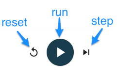 <!-- {"left" : 3.35, "top" : 1.96, "height" : 3.58, "width" : 3.56} -->

  * Data

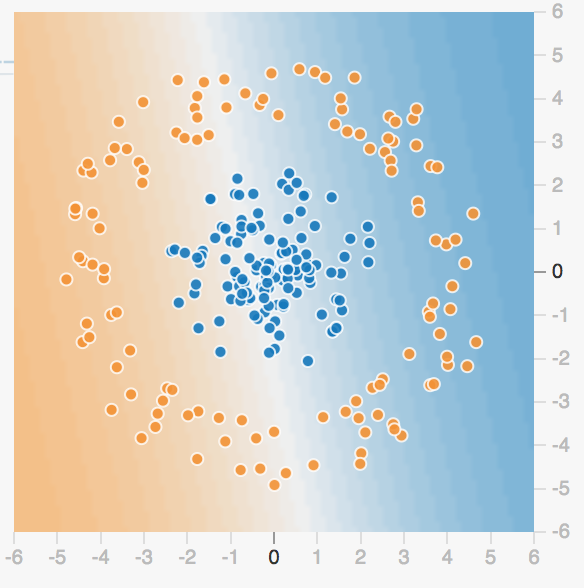 <!-- {"left" : 3.35, "top" : 1.96, "height" : 3.58, "width" : 3.56} -->

  * Parameters:

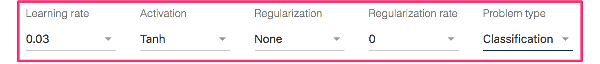 <!-- {"left" : 0.33, "top" : 6.1, "height" : 1.08, "width" : 9.58} -->

Notes:

---
## Hidden Layers
  * We will start out with **no** hidden layers
  * Click the "minus" icon to get to no hidden layers

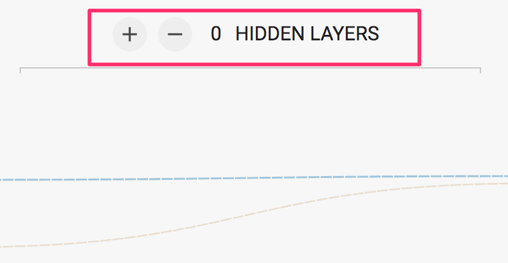<!-- {"left" : 1.12, "top" : 2.51, "height" : 4.15, "width" : 8.01} -->

Notes:

---
# Playground Linear Regression

---

## Linear Regression: Setup

  * Click on the dropdown at the upper right, select 'Regression'
  * Select the dataset in lower left
  * Select the **lowest** setting of Learning Rate

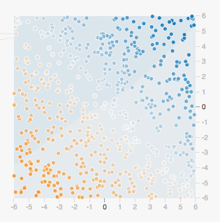 <!-- {"left" : 0.77, "top" : 3.78, "height" : 2.14, "width" : 2.06} -->

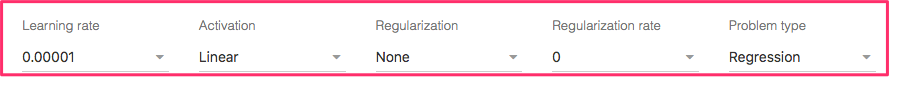 <!-- {"left" : 0.33, "top" : 6.1, "height" : 1.08, "width" : 9.58} -->

Notes:

---
## Linear Regression: Parameters

<!-- {"left" : 0.64, "top" : 1.75, "height" : 1.01, "width" : 8.97} -->

  * Learning Rate
    - This is the "step size" we use for Gradient Descent

  * Activation Function
    - This is what we do to the output of the neuron
    - More on this later.

  * Regularization  / Regularization Rate
    - L1 / L2 are penalties to help reduce overfitting
    - How much to add

Notes:

---
## Linear Regression: Run!

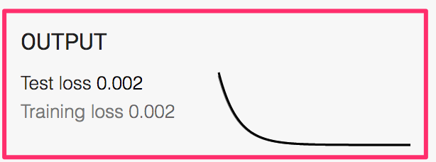 <!-- {"left" : 5.93, "top" : 1.42, "height" : 1.21, "width" : 3.63} -->

  * Let's try pressing the PLAY Button
  * Look at the "Output" curve:
  * TOO **SLOW**!!!  (Why??)
    - How long (how many epochs) does it converge?
    - Do you ever get to loss = 0.0?
  * What is the meaning of "loss?"
    - It's another way of saying "error"
    - In this case, it's the RMSE (Root Mean Squared Error)
  * Is this dataset linearly separable?
    - Is it **possible** to get to zero loss?

Notes:

---
## Linear Regression: Adjust the learning rate

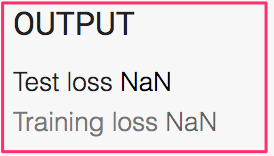<!-- {"left" : 6.49, "top" : 3.41, "height" : 1.55, "width" : 3.12} -->

  * Hit the reset button to the left of "play"
  * Adjust the learning rate dropdown to something higher.
  * Try hitting play again.
  * What happens if you set a really **big** rate?
    - Note the loss is NaN (Not a Number)
    - The data is only `-6.0` to  `+6.0`.
    - A "big" value causes overshoot
  * Challenge: What is the "optimal" learning rate?
    - Get to zero loss in the fewest epochs.

Notes:

---

# Classification Examples 1

---

## Linear Classification: Setup

  * Parameters
    - Select 'Classification' on the dropdown at the upper right
    - Activation : Tanh
    - Learning Rate: 0.01
  * Select the Two-Blob Datasets
  * Is this dataset linearly separable?

Notes:

---
## Linear Classification: Run

  * The seperated dataset might look like below

  * You may not get zero loss, especially if you introduce noise

  * Challenge: Adjust the learning rate to get to minimum loss in as few epochs as possible.

  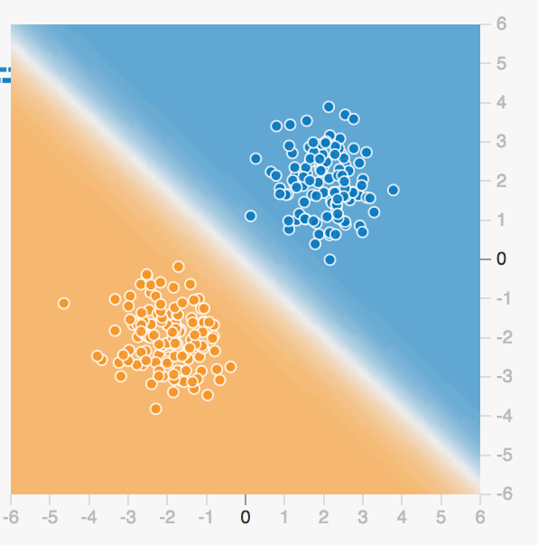

Notes:

---

# Classification Examples 2

---
## Circle Dataset Overview
  * Select the circle dataset:

   <!-- {"left" : 6.2, "top" : 0.86, "height" : 3.65, "width" : 3.63} -->

  * Can we linearly separate this dataset?
  * Try it!
    - What loss do you get to?
    - Does changing the learning rate help?

Notes:

---
## Adding Features
   <!-- {"left" : 6.2, "top" : 0.86, "height" : 3.65, "width" : 3.63} -->

  * No amount of fiddling with learning rate will help!
    - It's not linearly separable.
    - Is it impossible?
  * So far, we have input just x1,x2 as features.
    - What if we include other terms?
    - x1² or x2² ?

Notes:

---
## Including Features
  * Include these terms:

  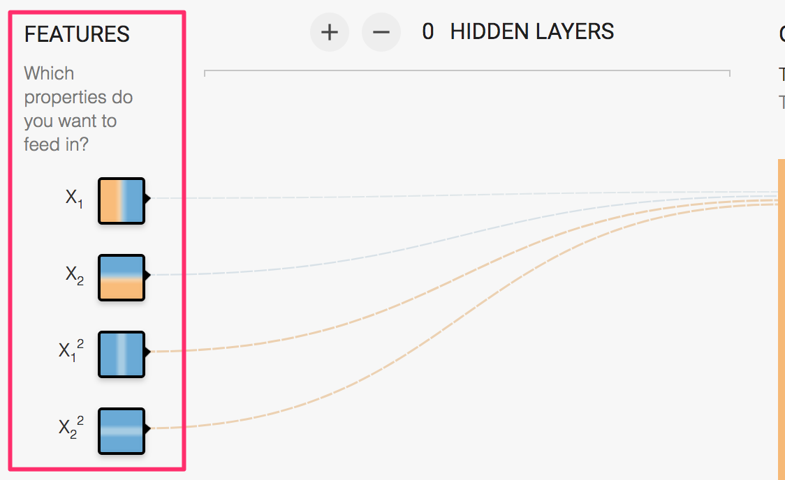<!-- {"left" : 0.71, "top" : 1.53, "height" : 5.4, "width" : 8.83} -->

Notes:

---
## Experimenting with Features

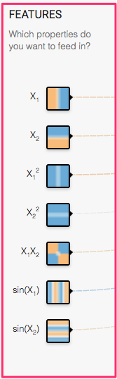

  * Experiment with adding features
    - What terms converge to a solution?
    - Which do not converge?
    - Why?

Notes:

---
## Four Square Dataset Overview
   * Set the Four-Square dataset:

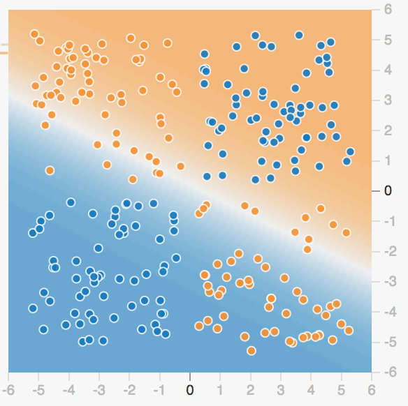 <!-- {"left" : 5.85, "top" : 1.03, "height" : 3.98, "width" : 3.99} -->

   * Check to see if it will converge with just X1 and X2
   * No??
   * Are there any other features that can help?

Notes:

---
## Spiral Dataset
   * Set the Spiral dataset:

 <!-- {"left" : 4.94, "top" : 0.95, "height" : 4.57, "width" : 4.53} -->

   * Check to see if you can converge?
   * Can you do it with no hidden layers?

Notes:

---
# Hidden Layers

---

## Hidden Layers
  * Feature selection can help us
    - Can model non-linear decision boundary
  * Add a hidden layer

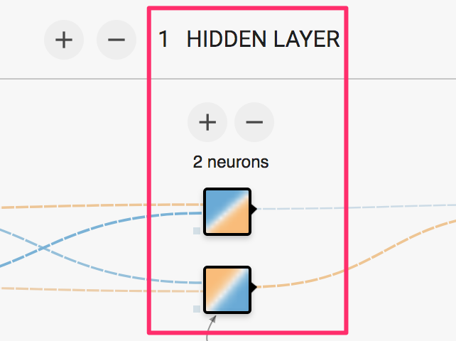 <!-- {"left" : 2.04, "top" : 2.62, "height" : 4.62, "width" : 6.18} -->

Notes:

---
## Circle Dataset With Hidden Layers
  * Select the circle dataset:

   <!-- {"left" : 2.64, "top" : 1.75, "height" : 4.99, "width" : 4.97} -->

---

## Circle Dataset With Hidden Layers

  * Select only X1 and X2 as features
  * Add a Hidden Layer

 <!-- {"left" : 6.13, "top" : 0.96, "height" : 2.57, "width" : 3.72} -->

  * Can you get a solution with 1 hidden Layer
    - You can add neurons.

Notes:

---
## Four Square Dataset Hidden Layers
   * Set the Four-Square dataset:
   * Can you solve it with hidden layers?

 <!-- {"left" : 0.77, "top" : 1.38, "height" : 4.06, "width" : 4.07} -->
 <!-- {"left" : 6.67, "top" : 5.09, "height" : 2.13, "width" : 2.85} -->

Notes:

---
## Spiral

  <!-- {"left" : 6.08, "top" : 1.09, "height" : 3.65, "width" : 3.61} -->

   * Set the Spiral dataset:
   * This one is really tricky!
   * Can you do it?
   * Don't be afraid to add new features!
   * Multiple Hidden Layers?

Notes:

---
## Spiral Solution
   * Can you get this result?

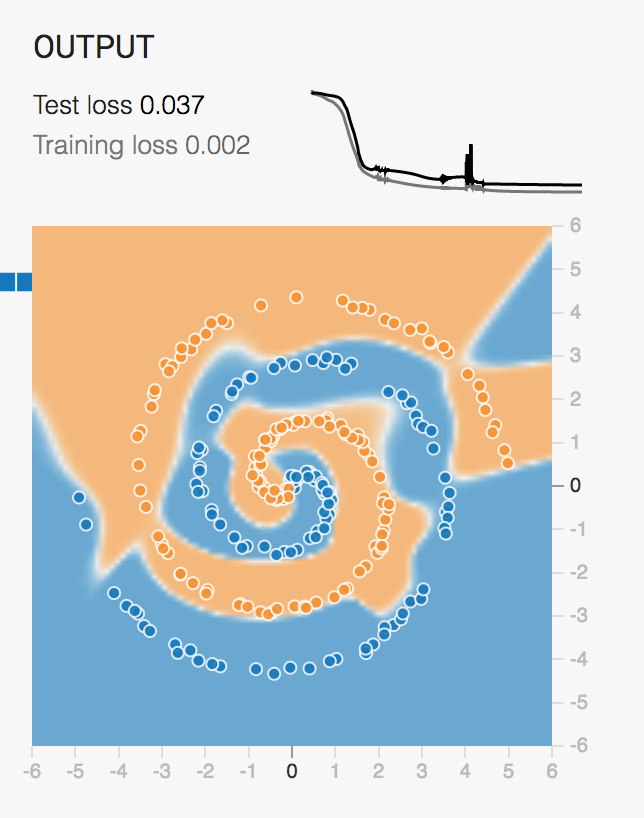 <!-- {"left" : 4.94, "top" : 0.97, "height" : 6.41, "width" : 5.05} -->

Notes:
