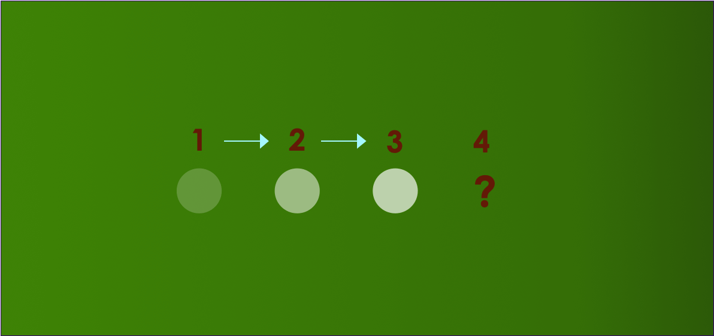
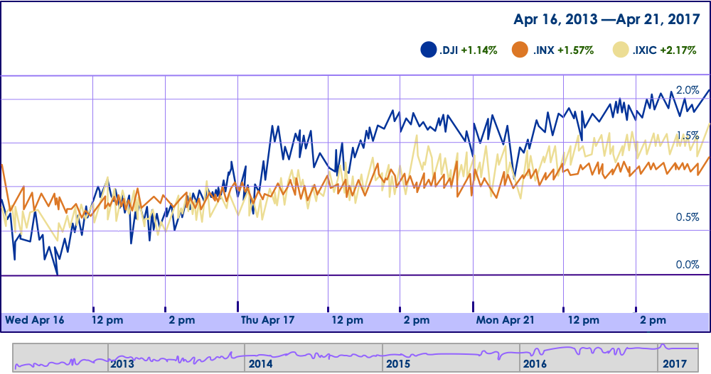
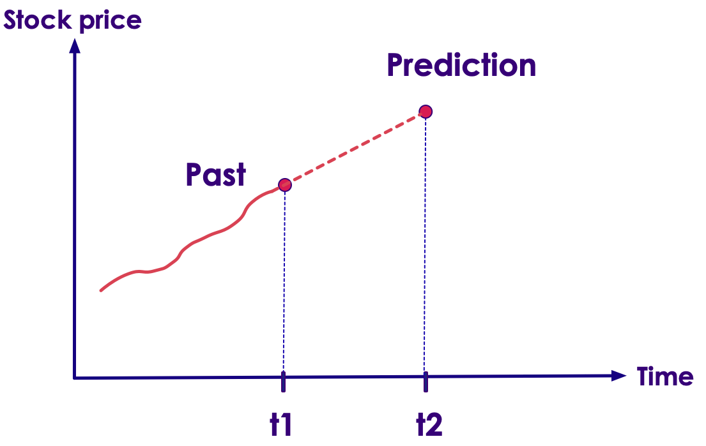
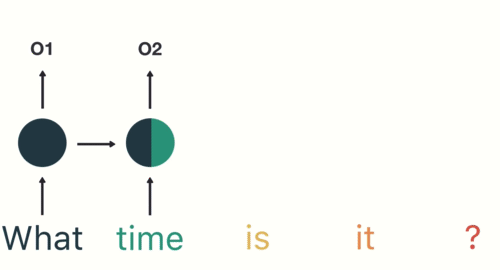
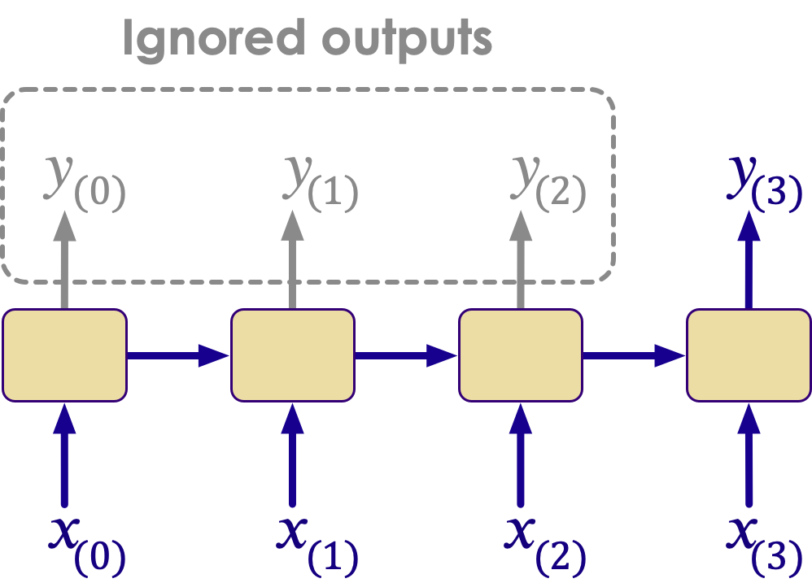

# Recurrent Neural Networks (RNN)

---

## Lesson Objectives

 * Understand RNNs

 * See how RNNs can help us solve time-series problems.

 * Understand Sequence prediction


Notes:

---

## Sometimes to Predict the Future, We Need to Know the Past

* Can you predict the next position of the ball?

<!-- {"left" : 1.02, "top" : 2.42, "height" : 4.8, "width" : 8.21} -->


---
## Sometimes to Predict the Future, We Need to Know the Past

* Can you predict the next position of the ball?

<!-- {"left" : 1.02, "top" : 2.6, "height" : 3.87, "width" : 8.21} -->


---

## Time Series Data

* Sensor Data (thermostats, weather stations, buoys)

* Stock ticks

* Other cases where the data changes on temporal basis

   <!-- {"left" : 0.74, "top" : 3.47, "height" : 4.63, "width" : 8.77} -->


Notes:

Source: Wikipedia

---

## To Predict Time Series Data, We Need to Know the Past Behavior

* For example, what is the stock price in time t2?

   <!-- {"left" : 0.18, "top" : 3.26, "height" : 2.56, "width" : 4.85} -->
   <!-- {"left" : 5.22, "top" : 3.26, "height" : 2.56, "width" : 4.85} -->

---
## Time Series Data

* In Time Series data, the value reflects a change over Time

* So one value isn't so important by itself

* It is the change in the value over time that matters.

<!-- {"left" : 1.43, "top" : 3.94, "height" : 3.9, "width" : 7.39} -->


Notes:


---
## Natural Language Processing Example


* In NLP, we often need context (history) to determine reference.

<br/>

```text
I was talking with **my** mother about politics.
"I voted for Hillary Clinton because **she** was most
aligned with **my** values," **she** said.

```
<!-- {"left" : 0, "top" : 2.12, "height" : 1.14, "width" : 10.25} -->

 * Who does the first "she" refer to?

 * Who does the "my" refer to?

 * We need  **state** to be able to figure this out!

Notes:


---

## Problems with Feedforward Neural Networks


 *  Feedforward Neural Networks can model any relationship between input and output.
 *  However they can't keep/remember **state**
     -  The only state retained is weight values from training.
     - They don't remember previous input!
     -  Impossible to maintain state in sequence
     - For example, in this example, the network doesn't remember the 'previous input' (cat) when predicting the current input

<!-- {"left" : 0.97, "top" : 5.51, "height" : 1.96, "width" : 8.31} -->


Notes:

---


## Recurrent Neural Network (RNN)

* In Feedforward Networks, data flows one way, it has **no state or memory**

* RNNs have a 'loop back' mechanism to pass the current state to the next iteration

<!-- {"left" : 0.4, "top" : 4.27, "height" : 3.47, "width" : 2.01} -->
<!-- {"left" : 3.63, "top" : 4.27, "height" : 3.47, "width" : 1.53} -->
<!-- {"left" : 6.38, "top" : 4.27, "height" : 3.47, "width" : 3.47} -->

[RNN animation link](TODO#)

---

## RNN Animation


[Animation link](TODO#)

---

## RNN Unrolling Through Time

<!-- {"left" : 1.85, "top" : 1.14, "height" : 3.68, "width" : 6.55} -->

<br/>


[Source](https://towardsdatascience.com/illustrated-guide-to-recurrent-neural-networks-79e5eb8049c9)  and  [Link to animation](https://miro.medium.com/max/960/1*TqcA9EIUF-DGGTBhIx_qbQ.gif)


---
## Unrolling Through Time

 * A recurrent connection now has a time dimension
 * Every output from the neuron goes back to the input at the next time.
 * One way to picture this is called unrolling through time
    - Like taking a picture/snapshot of the network for each time frame
 * This means that each neuron is like a chain of neurons, one for each time slice.

<!-- {"left" : 1.34, "top" : 4.54, "height" : 3.73, "width" : 7.56} -->


Notes:

---

## Unrolling Through Time


---
## Backpropagation Through Time

 * We can use Gradient Descent / Backpropagation to train a recurrent network.
 * But now, we have to maintain backpropagation through time.
 * For unrolling, we can treat each time step as a new layer.
     -  It's really not any different than conventional backpropagation once unrolled.

 <!-- {"left" : 2.02, "top" : 3.95, "height" : 4.43, "width" : 6.22} -->


Notes:


---
## Analogy: Hardware Combinatorial Logic


 *  In Computer Hardware, we can model logic functions with **gates**  :
     -  AND, OR, NOR, NAND, etc
     -  These can in theory produce any binary output desired from inputs.
     -  This is similar to feedforward neural network.
 *  However, Combinational Logic cannot maintain state.

 &nbsp; &nbsp; &nbsp; &nbsp; <!-- {"left" : 3.34, "top" : 4.89, "height" : 1.5, "width" : 3.57} -->   <!-- {"left" : 2.33, "top" : 6.7, "height" : 1.82, "width" : 5.58} -->


Notes:

Image credit : (creative commons license)  :  https://commons.wikimedia.org/wiki/File:Logic-gate-and-us.png

---
## Feedback Circuits to Maintain State

 * To maintain state, we need some kind of memory unit.
 * Memory is maintained using feedback, feeding the outputs back into the input.
 * By introducing feedback, we can maintain state.
 * Note the feedback loops!
 * This is a computer hardware memory cell.

  <!-- {"left" : 2.53, "top" : 4.65, "height" : 3.49, "width" : 4.77} -->


Notes:


---
## Feedback in RNNs


 * RNNs have Feedback

     -  The output of some layers feeds back to the input of others

 *  The Human Brain is a RNN

     -  Your brain loops and cycles connections, and allows for state management

 *  Problem: cycles introduce instability

     -  Very hard to train a model with random types of cycles

     -  Easily can lead to unpredictable results

     -  Positive feedback can lead to instability

     -  RNNs are *essentially*  positive feedback

Notes:

---

## Understanding RNNs

* [Great explainer video](https://www.youtube.com/watch?v=LHXXI4-IEns) by Mikael Phi

* And [accompanying writeup](https://towardsdatascience.com/illustrated-guide-to-recurrent-neural-networks-79e5eb8049c9)

* We will discuss a use case starting at 3:50 in the video

   <!-- {"left" : 1.97, "top" : 3.95, "height" : 3.64, "width" : 6.32} -->


---

## Activation Functions for RNNs


*  ReLU and Linear functions have a problem of being unbounded.
     -  If we have a self-recurrent loop, they tend to self-reinforce.
     - Think of 'mic amplification feedback'

*  Sigmoid is *always*  positive (between 0 and 1) which also tends to self-reinforce.

*  Tanh is zero centered (between -1 and +1), which is better

*  Tanh is the most commonly used in RNNs.

 &nbsp;  <!-- {"left" : 2.36, "top" : 4.55, "height" : 2.16, "width" : 5.51} -->  &nbsp;  &nbsp;<!-- {"left" : 2.22, "top" : 6.73, "height" : 2.16, "width" : 5.82} -->


Notes:

---

## RNN Use Cases

* RNNs are used to analyze sequence data

* RNNs can be used to analyze time series data
    - Stock prices
    - Sensor data

* RNNs can used for text analysis
    - Language translation
    - Understanding natural text


---

## Text Understanding


 <!-- {"left" : 1.02, "top" : 2.91, "height" : 3.83, "width" : 8.21} -->


---

## Use Case: Text Processing with RNNs

* This is a usecase illustrated in the [explainer video](https://www.youtube.com/watch?v=LHXXI4-IEns) (time 3:50)
    - Adopted with thanks!

* We ask a smart speaker (e.g. Alexa) for time  
    - **"What time is it?"**

* First we break the sentence into words

* [Source](https://towardsdatascience.com/illustrated-guide-to-recurrent-neural-networks-79e5eb8049c9) | [Animation link](https://miro.medium.com/max/1000/1*G7T4sFO-1ByMepsa5OilsQ.gif)

  <!-- {"left" : 2.13, "top" : 4.33, "height" : 3.53, "width" : 5.99} -->


---

## Use Case: Text Processing with RNNs

* Now we feed the sequence of words into RNN

* First word **What** is encoded as a number(vector) **01**

* [Source](https://towardsdatascience.com/illustrated-guide-to-recurrent-neural-networks-79e5eb8049c9) | [Animation link](https://miro.medium.com/max/1000/1*Qx6OiQnskfyCEzb8aZDgaA.gif)

  <!-- {"left" : 2.13, "top" : 4.33, "height" : 3.53, "width" : 5.99} -->


---

## Use Case: Text Processing with RNNs

* Then the next word **time** is fed

* Also the **hidden output** from previous input word **what** is also used

* These two inputs result in the output number **02**

* [Source](https://towardsdatascience.com/illustrated-guide-to-recurrent-neural-networks-79e5eb8049c9) | [Animation link](https://miro.medium.com/max/1000/1*5byMk-6ni-dst7l9WKIj5g.gif)


  <!-- {"left" : 2.13, "top" : 4.33, "height" : 3.53, "width" : 5.99} -->

---

## Use Case: Text Processing with RNNs

* The words are fed into sequence

* You can see the color coding of previous outputs influencing the current output

* The final number is **05**

* [Source](https://towardsdatascience.com/illustrated-guide-to-recurrent-neural-networks-79e5eb8049c9) | [Animation link](https://miro.medium.com/max/1000/1*d_POV7c8fzHbKuTgJzCxtA.gif)


  <!-- {"left" : 2.13, "top" : 4.33, "height" : 3.53, "width" : 5.99} -->

---

## Use Case: Text Processing with RNNs

* So the text **"What time is it?"** is encoded as **05**
* So if the RNN produces number/vector **05** we know the user asked for time
* If the sequence is changed in anyway (different words and different order)  then we wouldn't get **05** as final output
* For example, if the input text is **"What is the time?"** (notice the order is different), the output will definitely NOT be **05**
* [Source](https://towardsdatascience.com/illustrated-guide-to-recurrent-neural-networks-79e5eb8049c9) | [Animation link](https://miro.medium.com/max/1000/1*3bKRTcqSbto3CXfwshVwmQ.gif)

  <!-- {"left" : 2.13, "top" : 4.95, "height" : 3.53, "width" : 5.99} -->

---

## RNN Architectures

* These are the common designs of RNNs

* Sequence to Vector
    - Language processing

* Sequence to Sequence
    - Language translation

* Vector to Sequence


---

## Sequence to Vector

* In the previous example, RNN took sequence as an input (e.g. a sentence) and produced a *vector*  as an output

*  Natural Language vectorizers can be implemented this way

<!-- {"left" : 2.23, "top" : 3.55, "height" : 4.12, "width" : 5.79} -->


Notes:

---

## Sequence to Sequence

*  An RNN can input a sequence and predict a sequence.

*  For example: stock market data

    -  The input would be a sequence of stock prices

    -  The output would be a prediction of what the next step *would*  be

* And language translation (more on this later)

  <!-- {"left" : 0.77, "top" : 4.05, "height" : 3.9, "width" : 8.71} -->


Notes:

---
## Vector To Sequence

 <!-- {"left" : 5.69, "top" : 1.14, "height" : 2.01, "width" : 4.43} -->

*  The Network will take a vector as an input and a produce a sequence as an output

*  Examples: Image annotation. Image is a vector, annotation is a character sequence.

<br clear="all" />

  <!-- {"left" : 2.51, "top" : 5.19, "height" : 2.97, "width" : 5.23} -->

Notes:

---
## Deep RNNs

*  RNNs can also be "deep".
    -  Sequentially connected neurons in one layer are not considered "deep".

*  So far we have only looked at single layer RNNs.

  <!-- {"left" : 0.39, "top" : 3.11, "height" : 4.56, "width" : 9.48} -->

Notes:

---
## Encoder-Decoder

*  An encoder-decoder network takes a sequence as input and produces a sequence as output

*  Similar to an autoencoder, but for recurrent neural networks.

*  Used in language translation

<!-- {"left" : 1.84, "top" : 3.61, "height" : 4.13, "width" : 6.57} -->


Notes:


---

## Machine Translation Model

  <!-- {"left" : 5.13, "top" : 1.17, "height" : 3.33, "width" : 5.02} -->

 *  Machine translation model is essentially a deep recurrent neural network

 * They take an input sequence (English sentence) and produce output sequence (French sentence)

 * **"I drink milk"  --> "je bois du lait"**

 *  The following example shows how this is done.


Notes:

---


## RNN Advantages

* Can process input of any length
    - e.g. input sentences can be arbitrarily long

* Model size not increasing with size of input
    - Same size model can process text of any length (typically)

* Computation takes into account historical information

* Weights are shared across time

---

## RNNs Have Short Term Memory

   <!-- {"left" : 5.78, "top" : 1.06, "height" : 2.31, "width" : 4.34} -->

* The **hidden state fades over multiple steps**

* In this diagram below, we can see the 'influence' of **word 'what' (color black)** is diminishing with each step

    - And in the last step **word '?'** the color black is almost non-existing

* **RNNs suffer from short term memory**

* What this means is, RNNs can't remember 'long sequences'
    - They can't process long sequences well (e.g. really long sentences)

* [Source](https://towardsdatascience.com/illustrated-guide-to-recurrent-neural-networks-79e5eb8049c9)

---

## RNN Drawbacks

* RNNs can be difficult to train

* Computation being slow

* Stability is a problem

* RNNs suffer from short term memory
    - Difficulty of accessing information from a long time ago (tend to forget earlier information)

* Sequential dependencies limits parallelization opportunities.

* Architectures are complex

* Sometimes CNN can be a better solution.

Notes:

---

# RNNs Advanced

**Optional**

---
## Self-Recurrent Neurons


 *  A Neuron is *self-recurrent*  if it feeds back to itself.
 * Unrolling a network through time:

     - We see the result of a sequence of length 4
     - The output is a sequence of the inputs

 * Input 1 represents the input signal at various times
 * Input 2 is the output of the neuron at the current time step

  <!-- {"left" : 2.13, "top" : 4.33, "height" : 3.53, "width" : 5.99} -->


Notes:


---
## Layer of Recurrent Neurons


 *  The prior example showed a *single*  self-recurrent neuron.

     -  Unrolled through time, the neuron represents a chain of neurons as long as the sequence.

 *  If we have a *layer*  of recurrent neurons

     -  Then we have a vector that is itself unrolled through time.

   <!-- {"left" : 0.76, "top" : 4.53, "height" : 2.57, "width" : 8.73} -->


Notes:

---
## Memory Cells


 *  Self Recurrent Neurons can be seen as "memory cells"

 *  They provide a way to maintain state in the network.

<!-- {"left" : 0.5, "top" : 2.96, "height" : 3.14, "width" : 9.24} -->


Notes:


---
## Types of RNNs


 *  Here we illustrate the types of RNNs:

     -  Sequence to Sequence

 <!-- {"left" : 0.3, "top" : 3.23, "height" : 3.19, "width" : 9.64} -->


Notes:


---
## One to One

 <!-- {"left" : 7.78, "top" : 1.2, "height" : 5.73, "width" : 2.06} -->

 *  One to One is basically a feedforward network

 *  Fixed size to fixed size

 *  There is no need for recurrence in this kind of approach.

 *  CNNs and related approaches are better.


Notes:


---
## One to Many

 <!-- {"left" : 6.97, "top" : 1.2, "height" : 5.99, "width" : 2.9} -->

 *  Input is fixed

 *  Output is a sequence

 *  Examples:

     -  Image Captioning

     -  Image to Text


Notes:


---
## Many to One

 <!-- {"left" : 7.3, "top" : 1.2, "height" : 5.4, "width" : 2.62} -->

 *  Input is a sequence

 *  Output is fixed size

     -  May output to a Fully Connected Layer

 *  Examples:

     -  Sentiment Analysis (output a sentiment score)

     -  News Story Classifier (Output type of news story: Sports, Business, etc).


Notes:


---
## Many to Many

<!-- {"left" : 6.06, "top" : 1.2, "height" : 4.8, "width" : 3.88} -->

 *  Input is a Sequence

 *  Output is also a sequence

 *  Examples:

     -  Language Translation (e.g. English to French)


Notes:


---
## Many to Many (Synchronized)

 <!-- {"left" : 6.37, "top" : 1.2, "height" : 5.74, "width" : 3.43} -->

 *  Input is a Sequence

 *  Output is a synchronized sequence

 *  Examples:

     -  Frame by Frame video identification


Notes:


---
## Sequence Classifier

 <!-- {"left" : 5.65, "top" : 1.02, "height" : 3.58, "width" : 4.48} -->

*  RNNs are great for classifying sequences:

    -  Sentences

    -  Spoken words


Notes:


---
## Time Series Predictions


 *  Time Series prediction is one of the main uses of RNN

 *  Input Time series is essentially the sequence problem again.

 <!-- {"left" : 0.51, "top" : 3.23, "height" : 3.12, "width" : 9.24} -->


Notes:


---
## RNN Cells to FC Using Output Projection

<!-- {"left" : 5.96, "top" : 1.18, "height" : 3.62, "width" : 4.11} -->

 *  To connect cells from an RNN to a Fully Connected Layer, we need to do *output projection.*
 *  This means we take each cell from the RNN and "project" it as an opening to a Fully Connected (FC) neuron.
 *  We need a Fully Connected (FC):
     -  To perform final classification (or regression)
     -  Apply model to our problem.


Notes:


---
## Encoding an output at prediction time


 *  The previous time step is fed in at the left.

 *  The next word in sequence is fed from the bottom, for example "go".

  <!-- {"left" : 0.48, "top" : 3.19, "height" : 4.3, "width" : 9.3} -->


Notes:


---
## Summary


 * RNNs are excellent for:

     - Temporal / Time-Series data

     - Sequences

     - State Management

     - Natural Language Processing

Notes:
