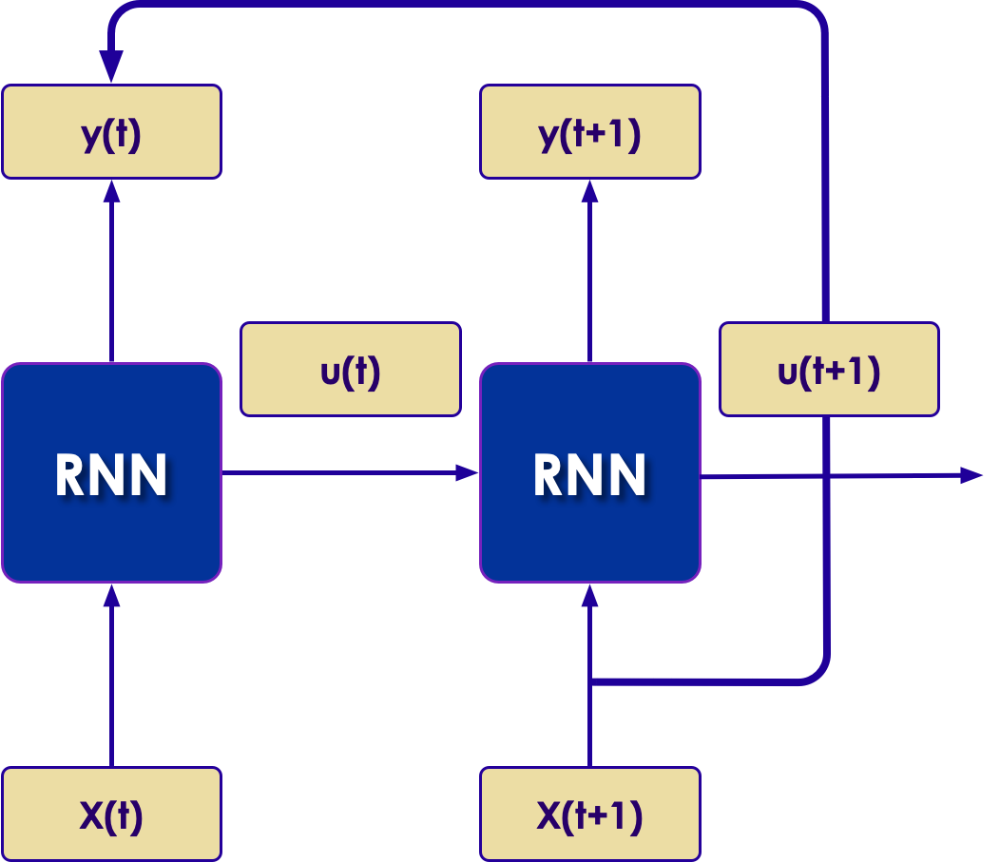
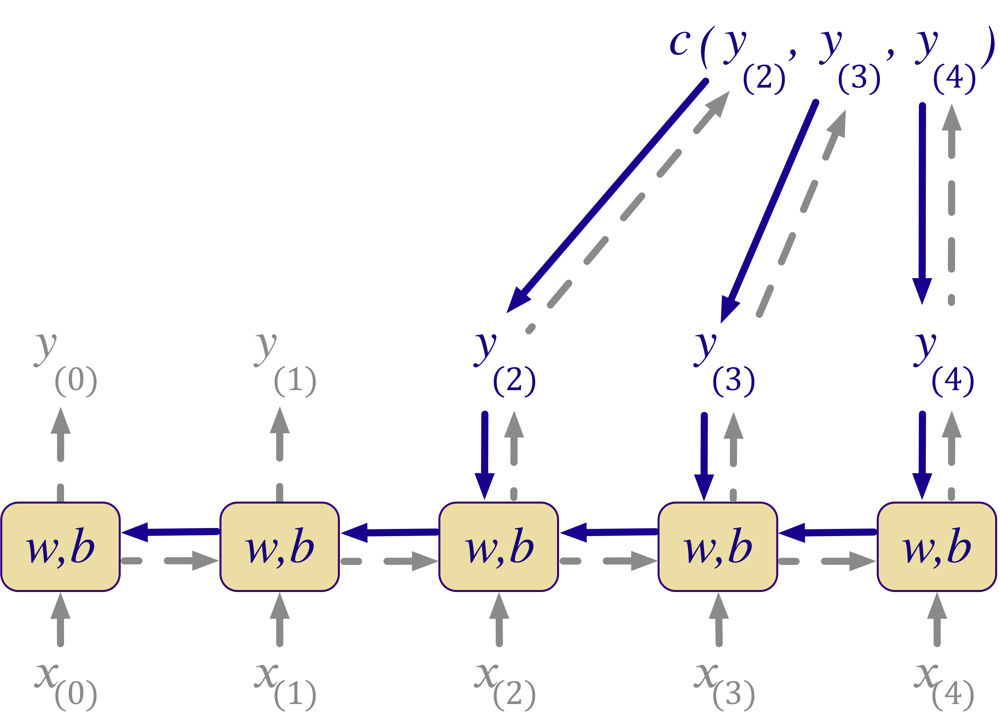
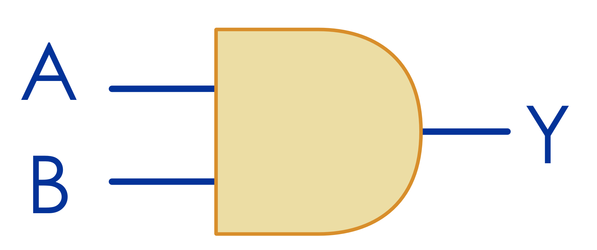
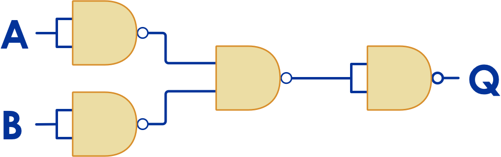
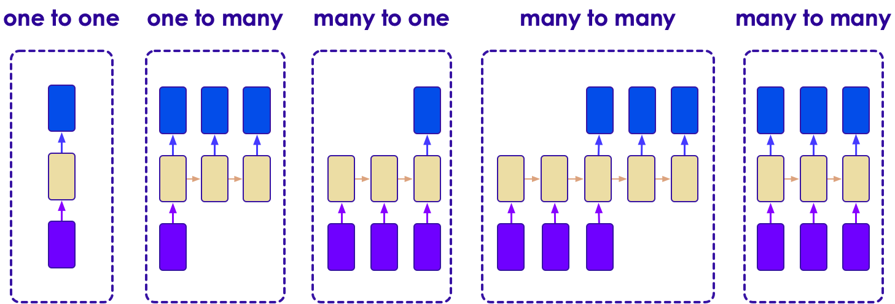
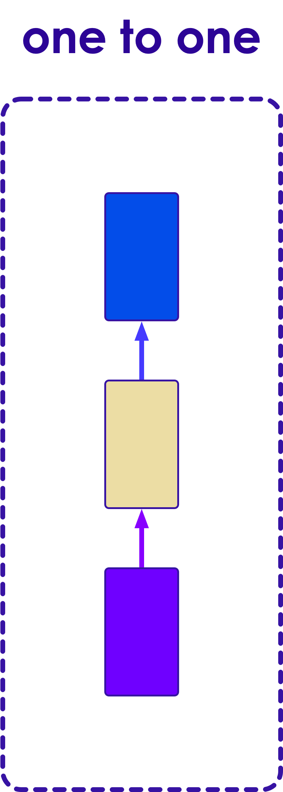
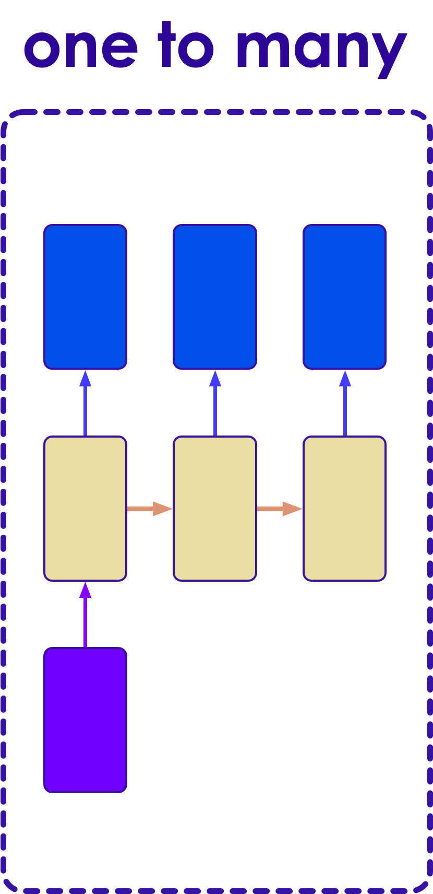
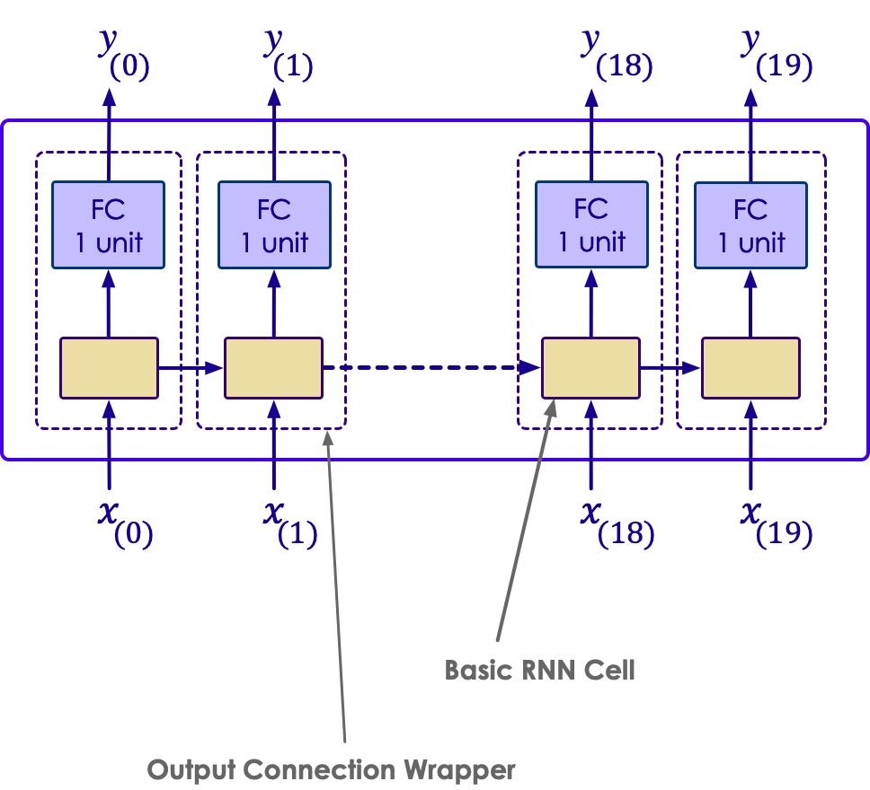
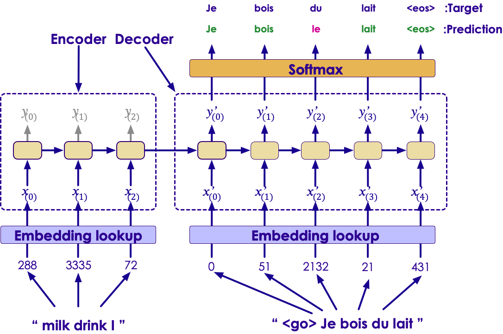

# Recurrent Neural Networks (RNN)

---

## Lesson Objectives

 * Understand RNNs

 * See how RNNs can help us solve time-series problems.

 * Understand Sequence prediction


Notes:

---
## Problems with Feedforward Neural Networks


 *  Feedforward Neural Networks can model any relationship between input and output.

 *  However they can't keep/remember **state**

     -  The only state retained is weight values from training.

     -  Impossible to maintain state in sequence

Notes:


---
## NLP example: Co-reference Resolution


 * In NLP, we often need to determine reference.

<br/>
```text
I was talking with **my** mother about politics.
"I voted for Hillary Clinton because **she** was most
aligned with **my** values," **she** said.
```
<!-- {"left" : 0, "top" : 1.68, "height" : 1.14, "width" : 10.25} -->

 * Who does the first "she" refer to?

 * Who does the "my" refer to?

 * We need  **state** to be able to figure this out!


Notes:


---
## Time Series Data


 * Sensor Data (thermostats, weather stations, buoys)

 * Stock ticks

 * Other cases where the data changes on temporal basis

     <!-- {"left" : 0.74, "top" : 3.07, "height" : 4.63, "width" : 8.77} -->


Notes:

Source: Wikipedia


---
## Time Series Data


 *  In Time Series data, the value reflects a change over Time

     -  So one value isn't so important by itself

     -  It is the change in the value over time that matters.

 * Feedforward neural networks cannot handle time series data well.

<!-- {"left" : 1.43, "top" : 3.94, "height" : 3.9, "width" : 7.39} -->


Notes:


---
## Unrolling Through Time

 * A recurrent connection now has a time dimension
 * Every output from the neuron goes back to the input at the next time.
 * One way to picture this is called unrolling through time
 * This means that each neuron is like a chain of neurons, one for each time slice.

<!-- {"left" : 2.43, "top" : 4.45, "height" : 3.87, "width" : 5.4} -->


Notes:


---
## Backpropagation Through Time

 * We can use Gradient Descent / Backpropagation to train a recurrent network.
 * But now, we have to maintain backpropagation through time.
 * For unrolling, we can treat each time step as a new layer.
     -  It's really not any different than conventional backpropagation once unrolled.

 <!-- {"left" : 2.02, "top" : 3.95, "height" : 4.43, "width" : 6.22} -->


Notes:


---
## Analogy: Hardware Combinatorial Logic


 *  In Computer Hardware, we can model logic functions with **gates**  :
     -  AND, OR, NOR, NAND, etc
     -  These can in theory produce any binary output desired from inputs.
     -  This is similar to feedforward neural network.
 *  However, Combinational Logic cannot maintain state.

 &nbsp; &nbsp; &nbsp; &nbsp; <!-- {"left" : 3.34, "top" : 4.89, "height" : 1.5, "width" : 3.57} -->   <!-- {"left" : 2.33, "top" : 6.7, "height" : 1.82, "width" : 5.58} -->


Notes:

Image credit : (creative commons license)  :  https://commons.wikimedia.org/wiki/File:Logic-gate-and-us.png

---
## Feedback Circuits to Maintain State

 * To maintain state, we need some kind of memory unit.
 * Memory is maintained using feedback, feeding the outputs back into the input.
 * By introducing feedback, we can maintain state.
 * Note the feedback loops!
 * This is a computer hardware memory cell.

  <!-- {"left" : 2.53, "top" : 4.65, "height" : 3.49, "width" : 4.77} -->


Notes:


---
## Feedback in Recurrent Neural Networks


 * RNNs have Feedback

     -  The output of some layers feeds back to the input of others

 *  The Human Brain is a RNN

     -  Your brain loops and cycles connections, and allows for state management

 *  Problem: cycles introduce instability

     -  Very hard to train a model with random types of cycles

     -  Easily can lead to unpredictable results

     -  Positive feedback can lead to instability

     -  RNNs are *essentially*  positive feedback

Notes:


---
## Units


 *  To use the hardware analogy, it's easiest to keep feedback loops inside of **units** .

 *  Units then contain both memory (state) and transformation

 *  This helps simplify training and increase stability

Notes:


---
## Sequences


 *  RNNs are very much about predicting sequences

 *  View the input as a time domain sequence.

Notes:


---
## Self-Recurrent Neurons


 *  A Neuron is *self-recurrent*  if it feeds back to itself.
 * Unrolling a network through time:

     - We see the result of a sequence of length 4
     - The output is a sequence of the inputs

 * Input 1 represents the input signal at various times
 * Input 2 is the output of the neuron at the current time step

  <!-- {"left" : 2.13, "top" : 4.33, "height" : 3.53, "width" : 5.99} -->


Notes:


---
## Layer of Recurrent Neurons


 *  The prior example showed a *single*  self-recurrent neuron.

     -  Unrolled through time, the neuron represents a chain of neurons as long as the sequence.

 *  If we have a *layer*  of recurrent neurons

     -  Then we have a vector that is itself unrolled through time.

   <!-- {"left" : 0.76, "top" : 4.53, "height" : 2.57, "width" : 8.73} -->


Notes:

---
## Activation Functions


 *  ReLU and Linear functions have a problem of being unbounded.

     -  If we have a self-recurrent loop, they tend to self-reinforce.

 *  Tanh and Sigmoid are balanced

     -  Tanh is zero centered, which is better

     -  Sigmoid is *always*  positive which also tends to self-reinforce.

 *  Tanh is the most commonly used in RNNs.

  <!-- {"left" : 2.36, "top" : 4.3, "height" : 2.16, "width" : 5.51} -->   <!-- {"left" : 2.22, "top" : 6.69, "height" : 2.16, "width" : 5.82} -->


Notes:

---
## Sequence to Sequence


 *  An RNN can input a sequence and predict a sequence.

 *  For example: stock market data

     -  The input would be a sequence of stock prices

     -  The output would be a prediction of what the next step *would*  be

  <!-- {"left" : 0.77, "top" : 4.05, "height" : 3.9, "width" : 8.71} -->


Notes:

---
## Sequence to Vector


 *  The Network will take a sequence as an input (e.g. time-series) and produce a *vector*  as an output

 *  Example: vectorization of natural language

 *  Natural Language vectorizers can be implemented this way

<!-- {"left" : 2.23, "top" : 3.55, "height" : 4.12, "width" : 5.79} -->


Notes:

---
## Vector To Sequence


 *  The Network will take a vector as an input and a produce a sequence as an output

 *  Examples: Image annotation. Image is a vector, annotation is a character sequence.

  <!-- {"left" : 1.02, "top" : 3.38, "height" : 4.67, "width" : 8.21} -->


Notes:

---
## Encoder-Decoder


 *  An encoder-decoder network takes a sequence as input and produces a sequence as output

 *  Similar to an autoencoder, but for recurrent neural networks.

 *  Language Translation

<!-- {"left" : 1.84, "top" : 3.61, "height" : 4.13, "width" : 6.57} -->


Notes:


---
## Memory Cells


 *  Self Recurrent Neurons can be seen as "memory cells"

 *  They provide a way to maintain state in the network.

<!-- {"left" : 0.5, "top" : 2.96, "height" : 3.14, "width" : 9.24} -->


Notes:


---
## Types of RNNs


 *  Here we illustrate the types of RNNs:

     -  Sequence to Sequence

 <!-- {"left" : 0.3, "top" : 3.23, "height" : 3.19, "width" : 9.64} -->


Notes:


---
## One to One

 <!-- {"left" : 7.59, "top" : 1.67, "height" : 5.73, "width" : 2.06} -->

 *  One to One is basically a feedforward network

 *  Fixed size to fixed size

 *  There is no need for recurrence in this kind of approach.

 *  CNNs and related approaches are better.


Notes:


---
## One to Many

 <!-- {"left" : 6.97, "top" : 1.54, "height" : 5.99, "width" : 2.9} -->

 *  Input is fixed

 *  Output is a sequence

 *  Examples:

     -  Image Captioning

     -  Image to Text


Notes:


---
## Many to One

 <!-- {"left" : 7.3, "top" : 1.84, "height" : 5.4, "width" : 2.62} -->

 *  Input is a sequence

 *  Output is fixed size

     -  May output to a Fully Connected Layer

 *  Examples:

     -  Sentiment Analysis (output a sentiment score)

     -  News Story Classifier (Output type of news story: Sports, Business, etc).


Notes:


---
## Many to Many

<!-- {"left" : 6.06, "top" : 2.14, "height" : 4.8, "width" : 3.88} -->

 *  Input is a Sequence

 *  Output is also a sequence

 *  Examples:

     -  Language Translation (e.g. English to French)


Notes:


---
## Many to Many (Synchronized)

 <!-- {"left" : 6.37, "top" : 1.32, "height" : 5.74, "width" : 3.43} -->

 *  Input is a Sequence

 *  Output is a synchronized sequence

 *  Examples:

     -  Frame by Frame video identification


Notes:


---
## Sequence Classifier


 *  RNNs are great for classifying sequences:

     -  Sentences

     -  Spoken words

 <!-- {"left" : 2.01, "top" : 3.01, "height" : 4.9, "width" : 6.23} -->


Notes:


---
## Time Series Predictions


 *  Time Series prediction is one of the main uses of RNN

 *  Input Time series is essentially the sequence problem again.

 <!-- {"left" : 0.51, "top" : 3.23, "height" : 3.12, "width" : 9.24} -->


Notes:


---
## RNN Cells to FC Using Output Projection

 *  To connect cells from an RNN to a Fully Connected Layer, we need to do *output projection.*
 *  This means we take each cell from the RNN and "project" it as an opening to a Fully Connected (FC) neuron.
 *  We need a Fully Connected (FC):
     -  To perform final classification (or regression)
     -  Apply model to our problem.

<!-- {"left" : 5.1, "top" : 2.7, "height" : 4.24, "width" : 4.82} -->


Notes:


---
## Deep RNNs


 *  RNNs can also be "deep".

     -  Sequentially connected neurons in one layer are not considered "deep".

 *  So far we have only looked at single layer RNNs.

  <!-- {"left" : 0.39, "top" : 3.11, "height" : 4.56, "width" : 9.48} -->


Notes:


---
## Machine Translation Model


 *  Machine translation model is essentially a deep recurrent neural network

 *  The following example shows how this is done.

  <!-- {"left" : 1.57, "top" : 3.13, "height" : 4.71, "width" : 7.1} -->


Notes:


---
## Encoding an output at prediction time


 *  The previous time step is fed in at the left.

 *  The next word in sequence is fed from the bottom, for example "go".

  <!-- {"left" : 0.48, "top" : 3.19, "height" : 4.3, "width" : 9.3} -->


Notes:


---
## Disadvantages of RNNs


 * RNNs can be difficult to train

 * Stability is a problem.

 * Sequential dependencies limits parallelization opportunities.

 * Architectures are complex

 * Sometimes CNN can be a better solution.

Notes:


---
## Summary


 * RNNs are excellent for:

     - Temporal / Time-Series data

     - Sequences

     - State Management

     - Natural Language Processing

Notes:

