# Recurrent Neural Networks (RNN)


<!-- {"left" : 8.12, "top" : 7.84, "height" : 2.94, "width" : 1.26} -->

---

## Lesson Objectives

 * Understand RNNs

 * See how RNNs can help us solve time-series problems.

 * Understand Sequence prediction


Notes:

---

# RNN Intro

---

## Sometimes to Predict the Future, We Need to Know the Past

* Can you predict the next position of the ball?

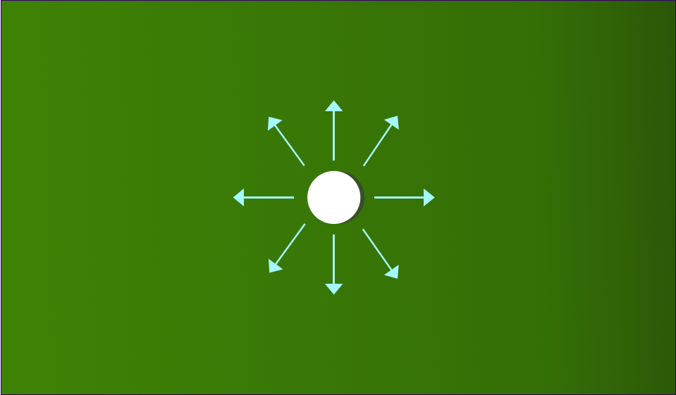<!-- {"left" : 3.74, "top" : 4.32, "height" : 5.86, "width" : 10.03} -->


---
## Sometimes to Predict the Future, We Need to Know the Past

* Can you predict the next position of the ball?

<!-- {"left" : 2.4, "top" : 4.11, "height" : 5.99, "width" : 12.7} -->


---

## Time Series Data

* Sensor Data (thermostats, weather stations, buoys)

* Stock ticks

* Other cases where the data changes on temporal basis

   <!-- {"left" : 3.64, "top" : 5.12, "height" : 5.4, "width" : 10.23} -->


Notes:

Source: Wikipedia

---

## To Predict Time Series Data, We Need to Know the Past Behavior

* For example, what is the stock price in time t2?

   <!-- {"left" : 1.77, "top" : 5.72, "height" : 3.62, "width" : 6.85} -->
   <!-- {"left" : 8.88, "top" : 5.72, "height" : 3.61, "width" : 6.85} -->

---
## Time Series Data

* In Time Series data, the value reflects a change over Time

* So one value isn't so important by itself

* It is the change in the value over time that matters.

<!-- {"left" : 3.85, "top" : 5.24, "height" : 5.17, "width" : 9.79} -->


Notes:


---
## Natural Language Processing Example


* In NLP, we often need context (history) to determine reference.

<br/>

```text
I was talking with **my** mother about politics.
"I voted for Hillary Clinton because **she** was most
aligned with **my** values," **she** said.

```
<!-- {"left" : 0.85, "top" : 2.7, "height" : 1.5, "width" : 13.51} -->

 * Who does the first "she" refer to?

 * Who does the "my" refer to?

 * We need  **state** to be able to figure this out!

Notes:


---

## Problems with Feedforward Neural Networks

*  Feedforward Neural Networks can model any relationship between input and output.
*  However they can't keep/remember **state**
     -  The only state retained is weight values from training.
     - They don't remember previous input!
     - For example, in this example, the network doesn't remember the 'previous input' (cat) when predicting the current input
* **Animation** below: [link-youtube](https://youtu.be/sLsCN9ZL9RI) | [link-S3](https://elephantscale-public.s3.amazonaws.com/media/machine-learning/neural-networks-animation-1.mp4) 

<!-- {"left" : 4.59, "top" : 6.97, "height" : 4.06, "width" : 9.63} -->


Notes:

---


## Recurrent Neural Network (RNN)

* In Feedforward Networks, data flows one way, it has **no state or memory**

* RNNs have a 'loop back' mechanism to pass the current state to the next iteration

* [Animation link](https://elephantscale-public.s3.amazonaws.com/media/machine-learning/rnn-3-animation.mp4)

<!-- {"left" : 3.52, "top" : 6.05, "height" : 5.25, "width" : 3.04} --> <!-- {"left" : 7.9, "top" : 6.31, "height" : 4.33, "width" : 1.91} -->
 <!-- {"left" : 11.51, "top" : 5.64, "height" : 4.82, "width" : 4.82} -->


---

## RNN Animation

 <!-- {"left" : 4.95, "top" : 1.89, "height" : 6.33, "width" : 7.64} -->


* **Animation**: [Link-YouTube](https://www.youtube.com/watch?v=zt18u6BgdK8) | [Link-S3](https://elephantscale-public.s3.amazonaws.com/media/machine-learning/rnn-4-animation.mp4)

---

## RNN Unrolling Through Time

<!-- {"left" : 4.9, "top" : 2.11, "height" : 4.33, "width" : 7.7} -->

<br/>

<br/>

*  [Animation link1 (gif)](https://miro.medium.com/max/960/1*TqcA9EIUF-DGGTBhIx_qbQ.gif), [link2 (mp4)](https://elephantscale-public.s3.amazonaws.com/media/machine-learning/rnn-unrolling-3.mp4),    ([Source](https://towardsdatascience.com/illustrated-guide-to-recurrent-neural-networks-79e5eb8049c9))


---
## Unrolling Through Time

 * A recurrent connection now has a time dimension
 * Every output from the neuron goes back to the input at the next time.
 * One way to picture this is called unrolling through time
    - Like taking a picture/snapshot of the network for each time frame
 * This means that each neuron is like a chain of neurons, one for each time slice.

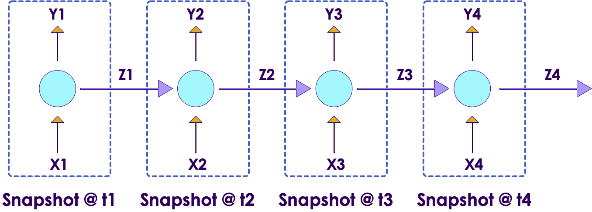 <!-- {"left" : 3.08, "top" : 6.76, "height" : 4.07, "width" : 11.35} -->


Notes:

---

## Unrolling Through Time

 <!-- {"left" : 2.53, "top" : 3.6, "height" : 6.5, "width" : 12.43} -->


---

## Backpropagation Through Time

 * We can use Gradient Descent / Backpropagation to train a recurrent network.
 * But now, we have to maintain backpropagation through time.
 * For unrolling, we can treat each time step as a new layer.
     -  It's really not any different than conventional backpropagation once unrolled.

  <!-- {"left" : 9.76, "top" : 2.67, "height" : 5.18, "width" : 7.27} -->


Notes:


---
## Analogy: Hardware Combinatorial Logic


 *  In Computer Hardware, we can model logic functions with **gates:**
     -  AND, OR, NOR, NAND, etc
     -  These can in theory produce any binary output desired from inputs.
     -  This is similar to feedforward neural network.
 *  However, Combinational Logic cannot maintain state.

 &nbsp; &nbsp; &nbsp; &nbsp; <!-- {"left" : 6.41, "top" : 6.03, "height" : 1.97, "width" : 4.7} -->   <!-- {"left" : 5.08, "top" : 8.42, "height" : 2.4, "width" : 7.34} -->


Notes:

Image credit : (creative commons license)  :  https://commons.wikimedia.org/wiki/File:Logic-gate-and-us.png

---
## Feedback Circuits to Maintain State

 * To maintain state, we need some kind of memory unit.
 * Memory is maintained using feedback, feeding the outputs back into the input.
 * By introducing feedback, we can maintain state.
 * Note the feedback loops!
 * This is a computer hardware memory cell.

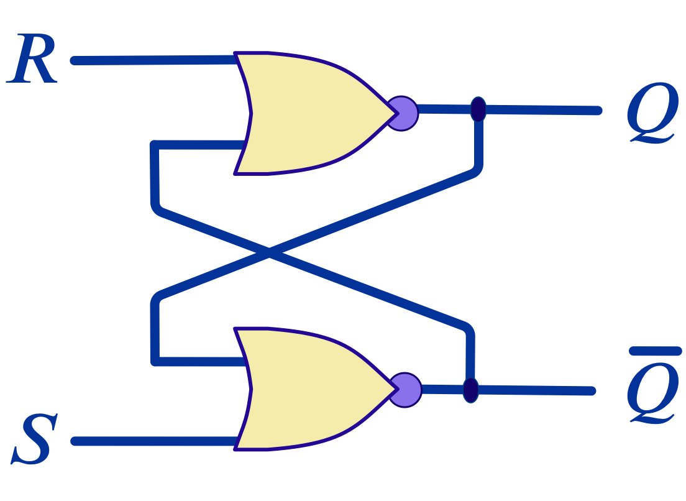   <!-- {"left" : 10.99, "top" : 3.07, "height" : 4.41, "width" : 6.03} -->

Notes:


---
## Feedback in RNNs


 * RNNs have Feedback

     -  The output of some layers feeds back to the input of others

 *  The Human Brain is a RNN

     -  Your brain loops and cycles connections, and allows for state management

 *  Problem: cycles introduce instability

     -  Very hard to train a model with random types of cycles

     -  Easily can lead to unpredictable results

     -  Positive feedback can lead to instability

     -  RNNs are *essentially*  positive feedback

Notes:

---

## Understanding RNNs

* [Great explainer video](https://www.youtube.com/watch?v=LHXXI4-IEns) by Mikael Phi

* And [accompanying writeup](https://towardsdatascience.com/illustrated-guide-to-recurrent-neural-networks-79e5eb8049c9)

* We will discuss a use case starting at 3:50 in the video

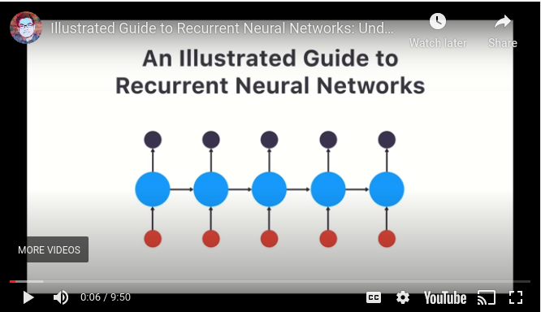   <!-- {"left" : 4.5, "top" : 5.63, "height" : 4.9, "width" : 8.5} -->


---

## Activation Functions for RNNs

<!-- {"left" : 9.61, "top" : 2.08, "height" : 2.92, "width" : 7.45} -->

 <!-- {"left" : 9.47, "top" : 5.72, "height" : 2.92, "width" : 7.87} -->

*  ReLU and Linear functions have a problem of being unbounded.
     -  If we have a self-recurrent loop, they tend to self-reinforce.
     - Think of 'mic amplification feedback'

*  Sigmoid is *always*  positive (between 0 and 1) which also tends to self-reinforce.

*  Tanh is zero centered (between -1 and +1), which is better

*  Tanh is the most commonly used in RNNs.


Notes:

---

## RNN Use Cases

* RNNs are used to analyze sequence data

* RNNs can be used to analyze time series data
    - Stock prices
    - Sensor data

* RNNs can used for text analysis
    - Language translation
    - Understanding natural text


---

## Text Understanding


 <!-- {"left" : 1.78, "top" : 3.53, "height" : 6.51, "width" : 13.95} -->


---

## Text Processing with RNNs

* This is a usecase illustrated in the [explainer video](https://www.youtube.com/watch?v=LHXXI4-IEns) (time 3:50)
    - Adopted with thanks!

* We ask a smart speaker (e.g. Alexa) for time  
    - **"What time is it?"**

* First we break the sentence into words

* **Animation** below: [Animation link1 (gif)](https://miro.medium.com/max/1000/1*G7T4sFO-1ByMepsa5OilsQ.gif), [link2 (mp4)](https://elephantscale-public.s3.amazonaws.com/media/machine-learning/rnn-text-processing-1.mp4) | ([Source](https://towardsdatascience.com/illustrated-guide-to-recurrent-neural-networks-79e5eb8049c9))

  <!-- {"left" : 4.71, "top" : 6.47, "height" : 4.77, "width" : 8.09} -->


---

## Text Processing with RNNs

* Now we feed the sequence of words into RNN

* First word **What** is encoded as a number(vector) **01**

* **Animation** below: [Animation link1 (gif)](https://miro.medium.com/max/1000/1*Qx6OiQnskfyCEzb8aZDgaA.gif), [link2 (mp4)](https://elephantscale-public.s3.amazonaws.com/media/machine-learning/rnn-text-processing-2.mp4) | ([Source](https://towardsdatascience.com/illustrated-guide-to-recurrent-neural-networks-79e5eb8049c9))

  <!-- {"left" : 4.71, "top" : 5.92, "height" : 4.77, "width" : 8.09} -->


---

## Text Processing with RNNs

* Then the next word **time** is fed

* Also the **hidden output** from previous input word **what** is also used

* These two inputs result in the output number **02**

* **Animation** below: [Animation link1 (gif)](https://miro.medium.com/max/1000/1*5byMk-6ni-dst7l9WKIj5g.gif), [link2 (mp4)](https://elephantscale-public.s3.amazonaws.com/media/machine-learning/rnn-text-processing-3.mp4)  | ([Source](https://towardsdatascience.com/illustrated-guide-to-recurrent-neural-networks-79e5eb8049c9))


  <!-- {"left" : 4.95, "top" : 6.09, "height" : 4.47, "width" : 7.59} -->

---

## Text Processing with RNNs

* The words are fed into sequence

* You can see the color coding of previous outputs influencing the current output

* The final number is **05**

* **Animation** below: [Animation link (gif)](https://miro.medium.com/max/1000/1*d_POV7c8fzHbKuTgJzCxtA.gif), [link2 (mp4)](https://elephantscale-public.s3.amazonaws.com/media/machine-learning/rnn-text-processing-4.mp4) | ([Source](https://towardsdatascience.com/illustrated-guide-to-recurrent-neural-networks-79e5eb8049c9))


  <!-- {"left" : 4.93, "top" : 6.51, "height" : 4.51, "width" : 7.65} -->

---

## Text Processing with RNNs

* So the text **"What time is it?"** is encoded as **05**
* So if the RNN produces number/vector **05** we know the user asked for time
* If the sequence is changed in anyway (different words and different order)  then we wouldn't get **05** as final output
* For example, if the input text is **"What is the time?"** (notice the order is different), the output will definitely NOT be **05**
* **Animation below:** [Animation link1 (gif)](https://miro.medium.com/max/1000/1*3bKRTcqSbto3CXfwshVwmQ.gif), [link2 (mp4)](https://elephantscale-public.s3.amazonaws.com/media/machine-learning/rnn-text-processing-6.mp4) ([Source](https://towardsdatascience.com/illustrated-guide-to-recurrent-neural-networks-79e5eb8049c9))

  <!-- {"left" : 9.81, "top" : 3.14, "height" : 4.14, "width" : 7.03} -->

---

## RNN Architectures

* These are the common designs of RNNs

* Sequence to Vector
    - Language processing

* Sequence to Sequence
    - Language translation

* Vector to Sequence


---

## Sequence to Vector

* In the previous example, RNN took sequence as an input (e.g. a sentence) and produced a *vector*  as an output

*  Natural Language vectorizers can be implemented this way

<!-- {"left" : 9.94, "top" : 2.5, "height" : 5.1, "width" : 7.16} -->


Notes:

---

## Sequence to Sequence

*  An RNN can input a sequence and predict a sequence.

*  For example: stock market data

    -  The input would be a sequence of stock prices

    -  The output would be a prediction of what the next step *would* be

* And language translation (more on this later)

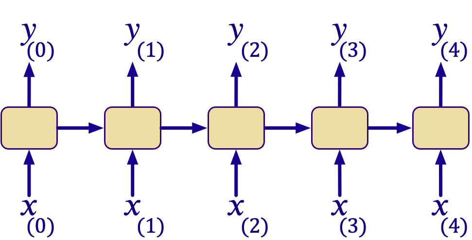  <!-- {"left" : 3.9, "top" : 6.37, "height" : 4.34, "width" : 9.7} -->


Notes:

---
## Vector To Sequence

 <!-- {"left" : 9.34, "top" : 2.31, "height" : 3.48, "width" : 7.68} -->

*  The Network will take a vector as an input and a produce a sequence as an output

*  Examples: Image annotation. Image is a vector, annotation is a character sequence.

<br clear="all" />

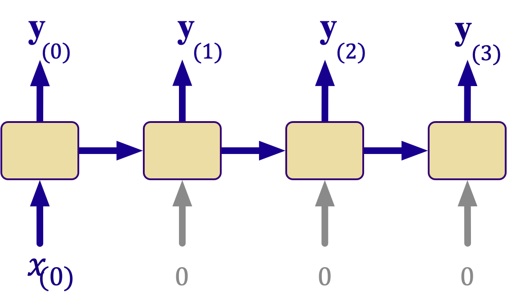  <!-- {"left" : 9.49, "top" : 6.71, "height" : 4.19, "width" : 7.38} -->

Notes:

---
## Deep RNNs

*  RNNs can also be "deep".
    -  Sequentially connected neurons in one layer are not considered "deep".

*  So far we have only looked at single layer RNNs.

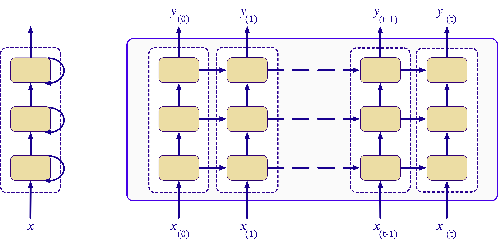  <!-- {"left" : 2.6, "top" : 5.1, "height" : 5.91, "width" : 12.29} -->

Notes:

---
## Encoder-Decoder

*  An encoder-decoder network takes a sequence as input and produces a sequence as output

*  Similar to an autoencoder, but for recurrent neural networks.

*  Used in language translation

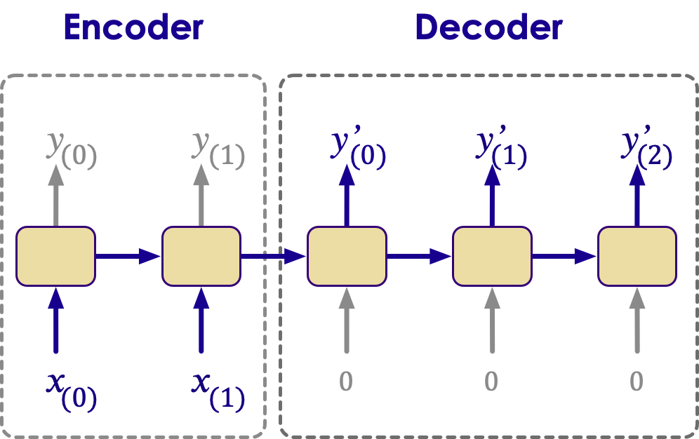 <!-- {"left" : 4.47, "top" : 5.28, "height" : 5.39, "width" : 8.57} -->

Notes:


---

## Machine Translation Model

  <!-- {"left" : 9.66, "top" : 2.13, "height" : 5.02, "width" : 7.57} -->

 *  Machine translation model is essentially a deep recurrent neural network

 * They take an input sequence (English sentence) and produce output sequence (French sentence)

 * **"I drink milk"  --> "je bois du lait"**

 *  The following example shows how this is done.


Notes:

---


## RNN Advantages

* Can process input of any length
    - e.g. input sentences can be arbitrarily long

* Model size not increasing with size of input
    - Same size model can process text of any length (typically)

* Computation takes into account historical information

* Weights are shared across time

---

## RNNs Have Short Term Memory

   <!-- {"left" : 9.97, "top" : 2.31, "height" : 3.77, "width" : 7.08} -->

* The **hidden state fades over multiple steps**

* In this diagram below, we can see the 'influence' of **word 'what' (color black)** is diminishing with each step

    - And in the last step **word '?'** the color black is almost non-existing

* **RNNs suffer from short term memory**

* What this means is, RNNs can't remember 'long sequences'
    - They can't process long sequences well (e.g. really long sentences)

* [Source](https://towardsdatascience.com/illustrated-guide-to-recurrent-neural-networks-79e5eb8049c9)

---

## RNN Drawbacks

* RNNs can be difficult to train

* Computation being slow

* Stability is a problem

* RNNs suffer from short term memory
    - Difficulty of accessing information from a long time ago (tend to forget earlier information)

* Sequential dependencies limits parallelization opportunities.

* Architectures are complex

* Sometimes CNN can be a better solution.

Notes:

---

# RNNs Advanced

**Optional**

---
## Self-Recurrent Neurons


 *  A Neuron is *self-recurrent*  if it feeds back to itself.
 * Unrolling a network through time:

     - We see the result of a sequence of length 4
     - The output is a sequence of the inputs

 * Input 1 represents the input signal at various times
 * Input 2 is the output of the neuron at the current time step

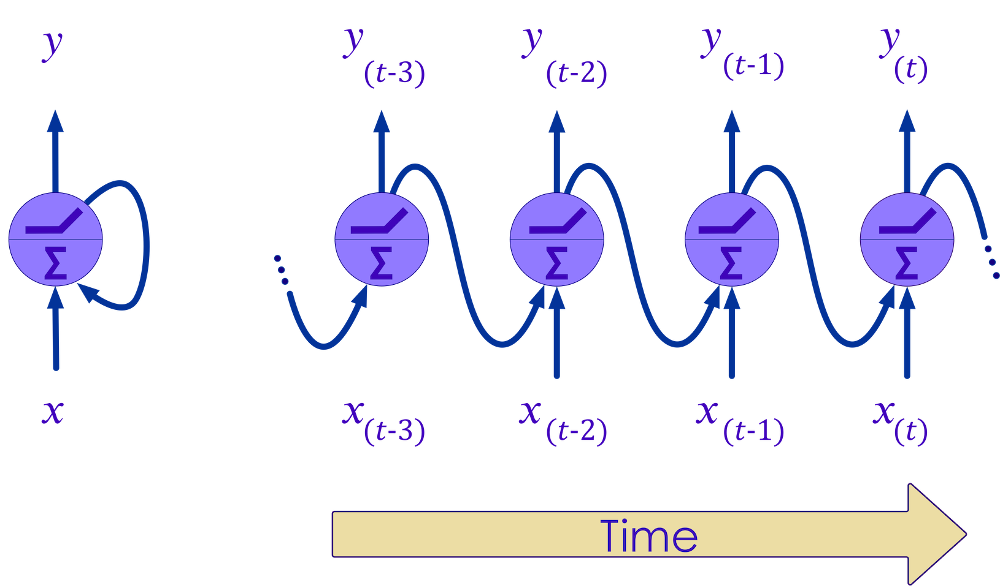  <!-- {"left" : 4.96, "top" : 6.29, "height" : 4.47, "width" : 7.58} -->


Notes:


---
## Layer of Recurrent Neurons


 *  The prior example showed a *single*  self-recurrent neuron.

     -  Unrolled through time, the neuron represents a chain of neurons as long as the sequence.

 *  If we have a *layer*  of recurrent neurons

     -  Then we have a vector that is itself unrolled through time.

   <!-- {"left" : 2.33, "top" : 6.56, "height" : 3.78, "width" : 12.85} -->


Notes:

---
## Memory Cells


 *  Self Recurrent Neurons can be seen as "memory cells"

 *  They provide a way to maintain state in the network.

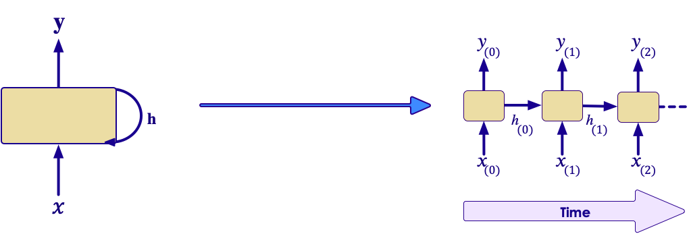 <!-- {"left" : 2.61, "top" : 5.27, "height" : 4.18, "width" : 12.29} -->


Notes:


---
## Types of RNNs


 *  Here we illustrate the types of RNNs:

     -  Sequence to Sequence

 <!-- {"left" : 1.8, "top" : 4.91, "height" : 4.6, "width" : 13.89} -->


Notes:


---
## One to One

 <!-- {"left" : 14.19, "top" : 1.89, "height" : 5.73, "width" : 2.06} -->

 *  One to One is basically a feedforward network

 *  Fixed size to fixed size

 *  There is no need for recurrence in this kind of approach.

 *  CNNs and related approaches are better.


Notes:


---
## One to Many

 <!-- {"left" : 12.97, "top" : 1.89, "height" : 7.65, "width" : 3.7} -->

 *  Input is fixed

 *  Output is a sequence

 *  Examples:

     -  Image Captioning

     -  Image to Text


Notes:


---
## Many to One

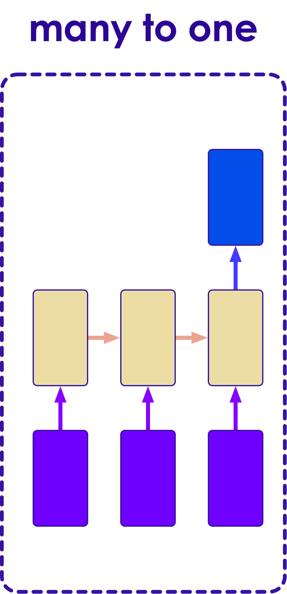 <!-- {"left" : 13.32, "top" : 1.89, "height" : 7.29, "width" : 3.54} -->

 *  Input is a sequence

 *  Output is fixed size

     -  May output to a Fully Connected Layer

 *  Examples:

     -  Sentiment Analysis (output a sentiment score)

     -  News Story Classifier (Output type of news story: Sports, Business, etc).


Notes:


---
## Many to Many

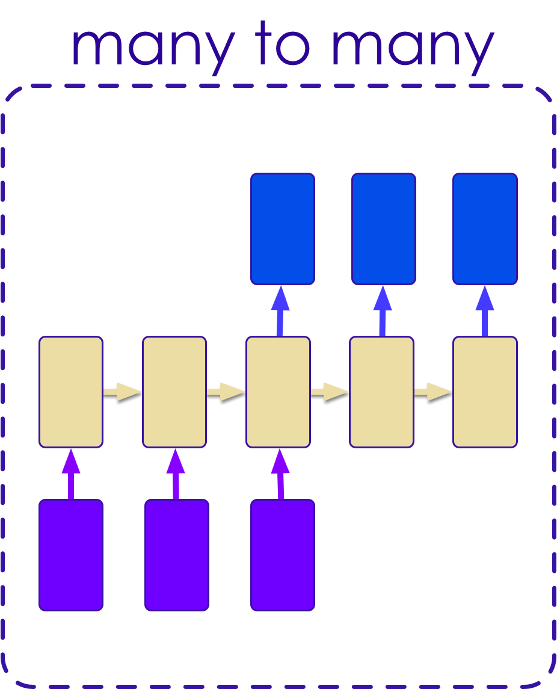<!-- {"left" : 11.29, "top" : 1.89, "height" : 6.83, "width" : 5.52} -->

 *  Input is a Sequence

 *  Output is also a sequence

 *  Examples:

     -  Language Translation (e.g. English to French)


Notes:


---
## Many to Many (Synchronized)

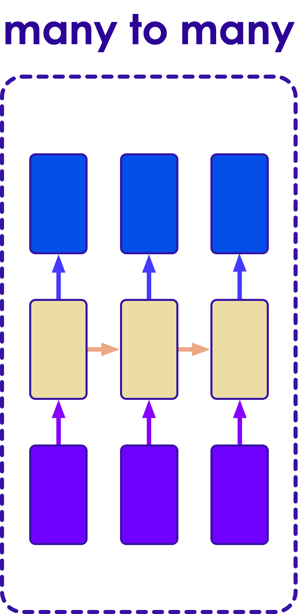 <!-- {"left" : 13.76, "top" : 2.11, "height" : 6.48, "width" : 3.15} -->

 *  Input is a Sequence

 *  Output is a synchronized sequence

 *  Examples:

     -  Frame by Frame video identification


Notes:


---
## Sequence Classifier

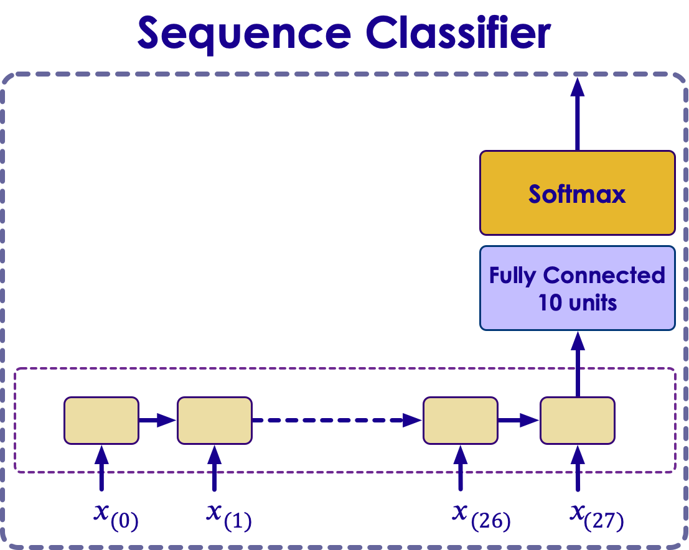 <!-- {"left" : 10.35, "top" : 1.89, "height" : 5.21, "width" : 6.52} -->

*  RNNs are great for classifying sequences:

    -  Sentences

    -  Spoken words


Notes:


---
## Time Series Predictions


 *  Time Series prediction is one of the main uses of RNN

 *  Input Time series is essentially the sequence problem again.

 <!-- {"left" : 2.18, "top" : 5.51, "height" : 4.43, "width" : 13.13} -->


Notes:


---
## RNN Cells to FC Using Output Projection

<!-- {"left" : 10.8, "top" : 1.89, "height" : 5.42, "width" : 6.15} -->

 *  To connect cells from an RNN to a Fully Connected Layer, we need to do *output projection.*
 *  This means we take each cell from the RNN and "project" it as an opening to a Fully Connected (FC) neuron.
 *  We need a Fully Connected (FC):
     -  To perform final classification (or regression)
     -  Apply model to our problem.


Notes:


---
## Encoding an output at prediction time


 *  The previous time step is fed in at the left.

 *  The next word in sequence is fed from the bottom, for example "go".

  <!-- {"left" : 2.79, "top" : 4.76, "height" : 5.51, "width" : 11.93} -->


Notes:


---
## Summary


 * RNNs are excellent for:

     - Temporal / Time-Series data

     - Sequences

     - State Management

     - Natural Language Processing

Notes:
