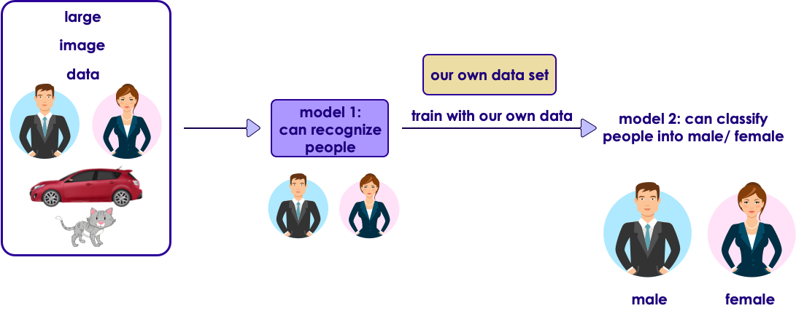

# DL TODO
Misc. stuff to add to other slides

## ResNet-50
ResNet-50 is trained on a image set with multiple categories.

---

## Transfer Learning

<!-- {"left" : 0.91, "top" : 5.34, "height" : 3.3, "width" : 8.43} -->

---

## TRAINING PARAMETERS

  - With both the data and model ready, all we have left to do is train the model. This is also known as fitting the model to the data. For training any model, we need to pick a loss function, an optimizer, initial learning rate and a metric.
  - Loss function: The loss function is the objective being minimized. For example, in a task to predict house prices, the loss function could be the mean squared error.
  - Optimizer: This is an optimization algorithm that helps minimize the loss function. We'll choose Adam, one of the fastest optimizers out there.
  - Learning rate: This defines how quickly or slowly you update the weights during training. Choosing an optimal learning rate is crucial - a big value can cause the training process to jump around, missing the target. On the other hand, a tiny value can cause the training process to take ages to reach the target. We'll keep it at 0.001 for now.
  - Metric: Choose a metric to judge the performance of the trained model. Accuracy is a good explainable metric, especially when the classes are not imbalanced, i.e. roughly equal in size. Note that this metric is not used during training to maximize or minimize an objective.

---

- Obscure trivia warning - MobileNet happens to use ReLu6 which has an upper bound with value 6. Standard ReLu, on the other hand, does not have an upper bound.

---

- There are 3 questions we want to answer for each category (cat, dog):

- Which images are we most confident about being a cat/dog?

- Which images are we least confident about being a cat/dog?

- Which images have incorrect predictions in spite of being highly confident?
