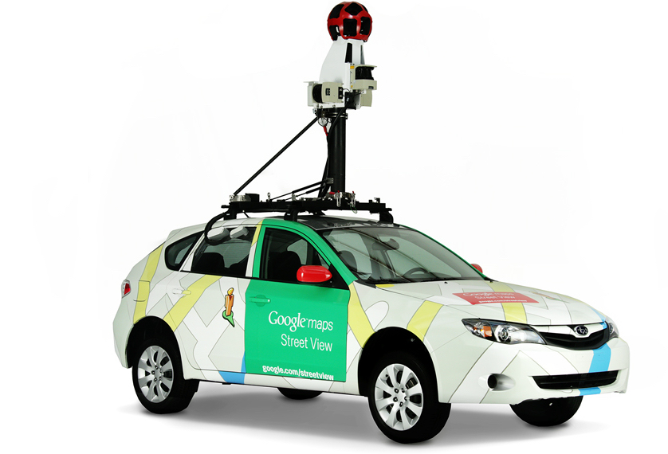
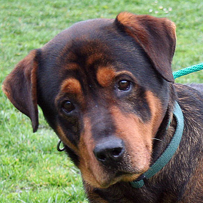

# DL TODO
Misc. stuff to add to other slides

## Dealing with Images
- Images are pixes on 2D grid


- Each pixel can contain 1 to 4 parts (known as components are channels)
- These components are RGB (Red Green Blue).  They are 8-bit integers with values ranging from 0-255  (2^8 -1 )


## ResNet-50
ResNet-50 is trained on a image set with multiple categories.

---

## Popular Image Datasets

- [ImageNet](http://image-net.org) - see below

- [Street View House numbers](http://ufldl.stanford.edu/housenumbers/)

- [Asirra]()

---

## ImageNet

- [ImageNet](http://www.image-net.org/) is an image database

- About 14 million images so far

- ImageNet, is a dataset of over 15 millions labeled high-resolution images with around 22,000 categories. ILSVRC uses a subset of ImageNet of around 1000 images in each of 1000 categories. In all, there are roughly 1.2 million training images, 50,000 validation images and 150,000 testing images.

- It is organized hierarchically

```
imagenet/
└── animals
    └── domestic
        ├── cat
        │   ├── cat1.jpg
        │   └── cat2.jpg
        └── dog
            ├── dog1.jpg
            └── dog2.jpg
```


- The ImageNet dataset was the basis for the famous ImageNet Large Scale Visual Recognition Challenge (ILSVRC)

- ILSVRC competition started in 2010

- Since then it is considered the 'Olympics' of image recognition.  Researchers compete to win this prestigious competition

- The accuracy has gone up from 70% to 97%

- Also researchers are sharing models trained with ImageNet, making rapid progress in image recognition

---

## Street View Numbers

- http://ufldl.stanford.edu/housenumbers/

- Comes from Google Street View data

- over 600,000 images




---

## Cats & Dogs

- In 2014 Microsoft Research was working on a CAPTCHA system

- For that they were using ASIRRA (Animal Species Image Recognition for Restricting Access)

- 3 million images  (800 MB in size)

- Labelled by animal shelters throughout US and also [PetFinder.com](https://petfinder.com)

- When the dataset came out the accuracy was around 80%.  Within a few weeks the top algorithms were scoring 98% accuracy!

- This image set has become a 'classic' test for image recognition algorithms!  
(The cuteness doesn't hurt either!)

- [Link to Paper](https://www.microsoft.com/en-us/research/publication/asirra-a-captcha-that-exploits-interest-aligned-manual-image-categorization/) ,   
[Link to download](https://www.microsoft.com/en-us/download/details.aspx?id=54765)




---

## Transfer Learning

- Imagine you want to learn how to play the ukulele. If you have no musical background, and you are starting fresh with the ukulele as your very first instrument, it’ll take you a few months to get proficient at playing it. On the other hand, if you are accustomed to playing the guitar, it might just take a week, due to how similar the two instruments are. Taking the learnings from one task and fine-tuning them on a similar task is something we often do in real life. The more similar the two tasks are, the easier it is to adapt the learnings from one task to the other.

---

## Organizing Training Data

- Download from  
`https://www.kaggle.com/c/dogs-vs-cats-redux-kernels-edition/download/train.zip`

- We need to divide the data into training / validation sets

- Keras can automatically assign the name of class using the folder name

- So a good folder structure is like this

```
data
├── train
│   ├── cat
│   │   ├── cat1.jpg
│   │   └── cat2.jpg
│   └── dog
│       ├── dog1.jpg
│       └── dog2.jpg
└── val
    ├── cat
    │   ├── cat3.jpg
    │   └── cat4.jpg
    └── dog
        ├── dog3.jpg
        └── dog4.jpg
```

- Keras processes the input data in the alphabetical order of the folder names. Since ‘cat’ comes before ‘dog’ alphabetically, our 1 class for prediction is ‘cat’. For a multi-class task, we can apply the same concept and infer each class id based on the folder sort order.

---

## CNN Training workflow

Make predictions on images (forward pass).

Determine which predictions were incorrect and propagate back the difference between the prediction and the true value (backpropagation).

Rinse and repeat till the predictions become sufficiently accurate.

It’s quite likely that the initial iteration would have close to 0% accuracy. Repeating the process several times, however, can yield a highly accurate model (> 90%).

The batch size defines how many images are seen by the CNN at a time. It’s important that each batch have a good variety of images from different classes in order to prevent large fluctuations in the accuracy metric between iterations. A sufficiently large batch size would be necessary for that. However, it’s important not to set the batch size too large for a couple of reasons. First, if the batch size is too large, you could end up crashing the program due to lack of memory. Second, the training process would be slower. Usually, batch sizes are set as powers of 2. 64 is a good number to start with for most problems and you can play with the number by increasing/decreasing it.

---

## Data Augmentation

From : https://learning.oreilly.com/library/view/practical-deep-learning/9781492034858/ch02.html


Usually, when you hear deep learning, you associate it with millions of images. But 500 images like what we have might be a low number for real-world training. Now, these deep neural networks are powerful, a little too powerful for small quantities of data. The danger of a limited set of training images is that the neural network might memorize your training data, and show great prediction performance on the training set, but bad accuracy on the validation set. In other words, the model has overtrained and does not generalize on previously unseen images. And we don’t want that, right?

There are often cases where there’s not enough data available. Perhaps you’re working on a niche problem and data is hard to come by. There are a few ways you can artificially augment your dataset:

Rotation: In our example, we might want to rotate the 500 images randomly by 20 degrees in either direction, yielding up to 20000 possible unique images.

Random Shift: Shift the images slightly to the left, or to the right.

Zoom: Zoom in and out slightly of the image

By combining rotation, shifting and zooming, the program can generate almost infinite unique images. This important step is called data augmentation. Keras provides ImageDataGenerator function that augments the data while it is being loaded from the directory. Example augmentations generated by the imgaug (https://github.com/aleju/imgaug) for a sample image are shown in Figure 2-3


Unlike in the training set, we don’t want to augment our validation dataset. The reason is that with dynamic augmentation, the validation set would keep changing in each iteration, and the resulting accuracy metric would be inconsistent and hard to compare across other iterations.


---

## TRAINING PARAMETERS

With both the data and model ready, all we have left to do is train the model. This is also known as fitting the model to the data. For training any model, we need to pick a loss function, an optimizer, initial learning rate and a metric.

Loss function: The loss function is the objective being minimized. For example, in a task to predict house prices, the loss function could be the mean squared error.

Optimizer: This is an optimization algorithm that helps minimize the loss function. We’ll choose Adam, one of the fastest optimizers out there.

Learning rate: This defines how quickly or slowly you update the weights during training. Choosing an optimal learning rate is crucial - a big value can cause the training process to jump around, missing the target. On the other hand, a tiny value can cause the training process to take ages to reach the target. We’ll keep it at 0.001 for now.

Metric: Choose a metric to judge the performance of the trained model. Accuracy is a good explainable metric, especially when the classes are not imbalanced, i.e. roughly equal in size. Note that this metric is not used during training to maximize or minimize an objective.


--

## Table 2-2. Deciding the loss and activation type based on the task

TODO

---

Obscure trivia warning - MobileNet happens to use ReLu6 which has an upper bound with value 6. Standard ReLu, on the other hand, does not have an upper bound.

---

There are 3 questions we want to answer for each category (cat, dog):

Which images are we most confident about being a cat/dog?

Which images are we least confident about being a cat/dog?

Which images have incorrect predictions in spite of being highly confident?

---
