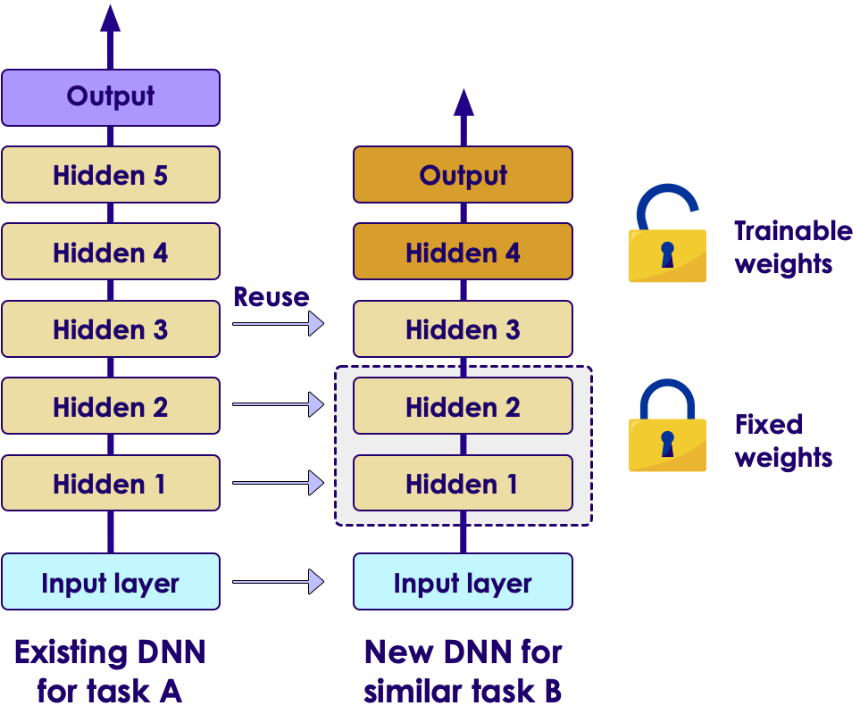

# Transfer Learning

---

# Image Classification

---

## Image Processing is Hard!

 <!-- {"left" : 11.81, "top" : 1.89, "height" : 3.47, "width" : 5.3} -->

* By now we had trained image classifiers on cat-dog / horse-human / flowers datasets

* Our datasets are of modest size (few thousands images, ~50 - 150 MB in size)

* In 'cat-dog-redux' data we had about 2000 training images (size: 45 MB) and 1000 validation images (size 22 MB)

* Our network is pretty small: 3 Convolutional layers (Conv + MaxPool); 10 layers total

* We trained this network for 100 epochs
    - Took about 20 minutes on a Ubuntu machine with 16 cores + 64 GB memory +  Nvidia GeForce RTX 2070  GPU  with 8GB  (Using Tensorflow-GPU acceleration)

* Managed to achieve about 75% accuracy

---

## Computer Vision Models

* Our modest model achieved 75% accuracy with a few minutes of training

* State of the art models can achieve 99% accuracy!

* These are trained on much larger datasets and for many hours/days/weeks!

* Can we re-use these models?

* Yes, enter **Transfer Learning**!

---

# Transfer Learning

---

## Transfer Learning Analogy

 <!-- {"left" : 11.6, "top" : 1.89, "height" : 2.5, "width" : 5.46} -->

* Imagine you want to learn how to play the **ukulele**

* If you have no musical background, and you are starting fresh with the ukulele as your very first instrument, it'll take you a few months to get proficient at playing it

* On the other hand, if you are accustomed to playing the **guitar**, it might just take a week, due to how similar the two instruments are

* Taking the learnings from one task and fine-tuning them on a similar task is something we often do in real life.

* The more similar the two tasks are, the easier it is to adapt the learnings from one task to the other.

Notes:

- Image credits : https://pixabay.com/photos/guitar-electric-guitar-2925282/, https://pixabay.com/photos/ukulele-instrument-music-pages-1376516/

---

## Training Large Models is Difficult

 * Large models have many layers (deep models)

 * Deep layers require  **LOTS**  of time and resources to train
    - Many dozens or hundreds of CPUs / GPUs

 * They may require huge amounts of **data** to train
   - Maybe **petabytes** of training data.

 * For example, Google translate model trains on 2 billion+ words on 99+ GPUs for week+

 * What if we don't have that much compute power or don't have that much data?

 * Try to re-use pre-trained models!

---

## Using a Pre-trained Model

 <!-- {"left" : 13.19, "top" : 2.18, "height" : 6.26, "width" : 3.94} -->

 * Despite what you think, your problem is not totally unique
   - Others have worked on it before.
   - Much of their work is useful to you
   - "Stand on the shoulders of giants"

 * Instead of starting from scratch, why not start from a trained model?

 * But how much of the model is reusable?

---

## Reusability of Pre-trained Models

 * In a image classifier neural network, much of the early layers are for extracting features (eyes, ears etc)

 * These features are pretty much the same for most real world use cases

 * So we can re-use the learned knowledge in these layers

<!-- {"left" : 3.05, "top" : 6.14, "height" : 4.16, "width" : 11.4} -->

Notes:

---
## Reusability of Pre-trained Models

 * The surprise is that a pre-trained model works pretty well!

 * Even if it was trained with data that is totally differently from your data

 * Why is this?
   - Because images are images
   - Words are words
   - etc

---

## Customizing Pre-Trained Models

 * Earlier layers of the pre-trained model are frozen; so their weights do not change during re-training

 * The last few layers can be re-trained

 * We often several `dense` layers to the back end of the network.

 * And then these layers are trained on **our own data**

 * This allows us to customize the model to our data

<!-- {"left" : 2.83, "top" : 6.44, "height" : 4.77, "width" : 11.84} -->

Notes:

---

## Transfer Learning Process

* Earlier layers are frozen; so their weights don't change during re-training

* And later layers are re-trained with our own data

<!-- {"left" : 4.65, "top" : 4.41, "height" : 6.81, "width" : 8.19} -->

---

## Popular Pre-Trained Models

* Explore available models at [modelzoo.co](https://modelzoo.co/)
    - Explore models available for Tensorflow

* **Image Recognition**
  - Inception
  - ResNet

* **Natural Language**
  - Word2Vec
  - BERT

Notes:

