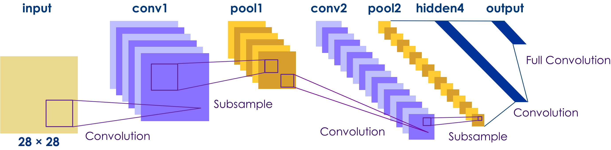
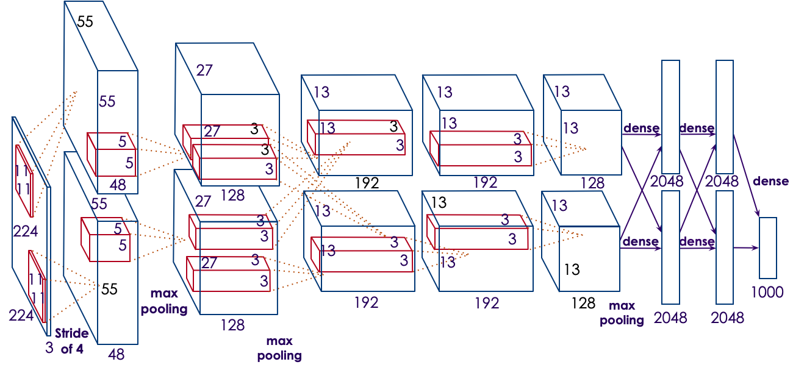
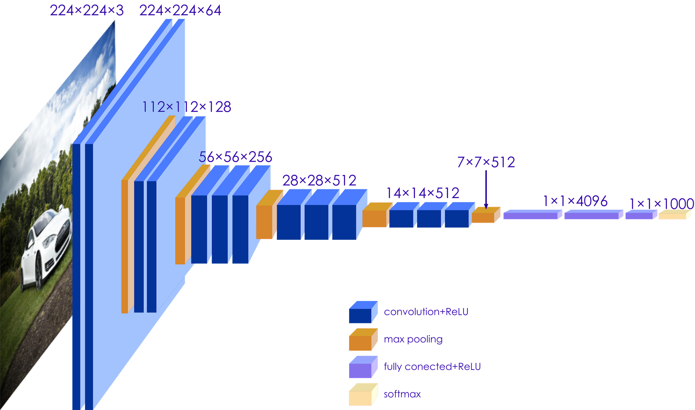
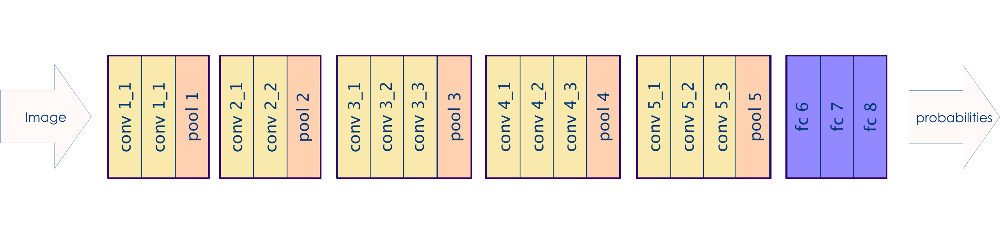
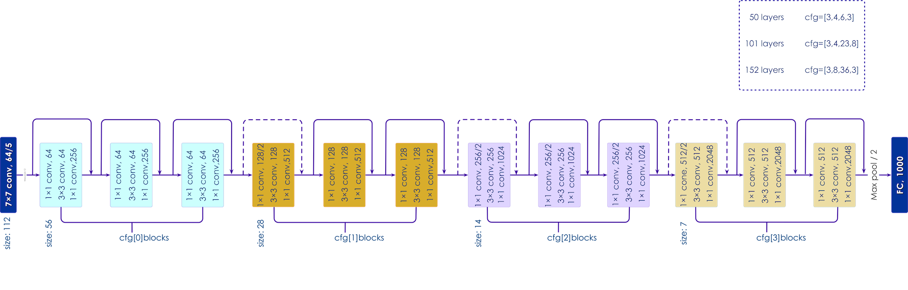
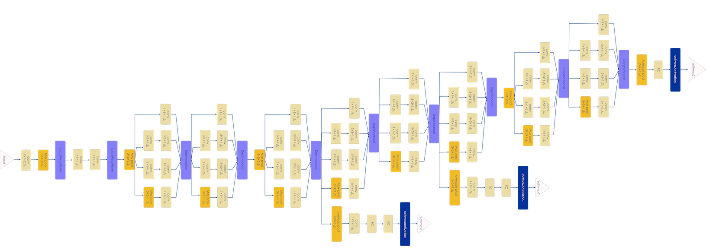
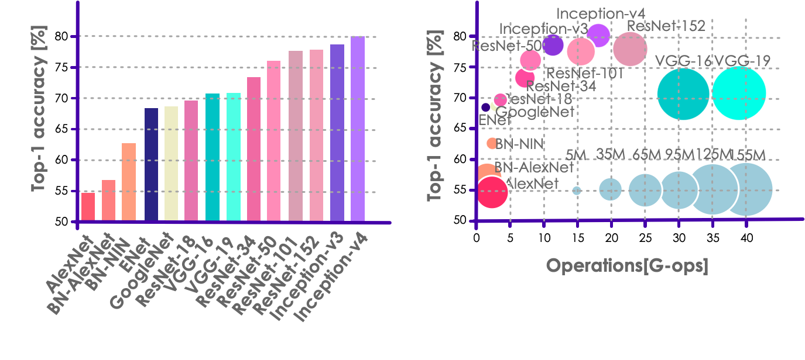

# Transfer Learning
---
## Learning Objectives
   * You will be able to:
     - Understand Transfer Learning
     - Understand Pre-Trained Models
     - Customize pretrained models

Notes:

---

# About Transfer Learning

---

## Transfer Learning

 * Let us say you need an expert in a certain field:
   - Say you need someone who knows brain surgery!
   - And let's say that there are no brain surgeons to be found!
   - What to do?

 * Well, you could start studying brain surgery!
   - But that would take some time.
   - A LOT of time!
   - YEARS of time!

---

## Transfer Learning

 * OR, you could try to find someone else
   - Maybe an expert in, say some other type of surgery.
   - Say heart surgery.

 * Will the heart surgeon be able to perform brain surgery?
   - Not right away.
   - But she probably would be better off than you would be!
   - And if she studied brain surgery, she could learn it quickly.
   - Because she knows a lot about surgery in general.

Notes:

---

## What is Transfer Learning?

 * Deep layers require  **LOTS**  of time and effort to train

 * They also may require huge amounts of **data** to train
   - Maybe **petabytes** of training data.
   - Do you have that much data?
   - Then what to do?

 * Much of the early layers are for extracting features
     - Mostly the same for most real world use cases.
     - Early layers are about identifying areas of interest in the data
     - Later layers are about applying that to a problem.

Notes:

---

## Pre trained Model

 * Despite what you think, your problem is not totally unique
   - Others have worked on it before.
   - Much of their work is useful to you
   - "Stand on the shoulders of giants"
 * Instead of starting from scratch, why not start from a known point?
   - We often "pre-initialize" weights to random values.
   - Random values are *guaranteed* not to work.
   - But a known working state would at least work for *some* problem.
 * Examples of Pre-trained models for Image Recognition
   - Inception
   - Resnet
 * Example of Pre-Trained model for Natural Language
     - Word2Vec

Notes:

---

## The Surprise

 * The surprise is that a pre-trained model works pretty well!
 * Even if it was trained totally differently from your data
 * Why is this?
   - Because Images are Images
   - Words are words
   - etc
 * Starting from somewhere is generally a good thing.
 * In real life:
   - We usually like to do some transfer learning if possible.

Notes:

---

## Applying the Model to your data.

 * Adding Layers
   - We often several `dense` layers to the back end of the network.
   - This allows us to apply the data to our problem.

Notes:

---

# Example Transfer Learning Architectures

---

## LeNet

* LeNet-5 (1998) by LeCun
  - Handwritten digits / MNIST type data (10 classes)
  - 28x28x1 monochrome images
* Revolutionary in its time
  - Mostly constrained by resources of the day

 <!-- {"left" : 1.02, "top" : 4.11, "height" : 2.02, "width" : 8.21} -->

Notes:

---

## Imagenet / AlexNet

* Applied LeNet to full size RGB imags (224x224x3) with 1000 classes.
* Still very popular

 <!-- {"left" : 1.02, "top" : 2.49, "height" : 3.97, "width" : 8.21} -->

Notes:

---

## VGGNet

* Most popular transfer learning architecture

* Simplified Architecture

 <!-- {"left" : 1.02, "top" : 2.03, "height" : 4.85, "width" : 8.21} -->

Notes:

---

## VGGNet

&nbsp;
&nbsp;

 <!-- {"left" : 0.35, "top" : 3.39, "height" : 1.19, "width" : 9.55} -->

Notes:

---

## ResNet

* Uses Residual Neural Networks (RNNs) - Not FeedforardR
* Both Residual and Convolutional

 <!-- {"left" : 0.6, "top" : 2.3, "height" : 2.9, "width" : 9.05} -->

Notes:

---

## Inception

* Created by Google; state of the art ConvNet

 <!-- {"left" : 0.6, "top" : 2.3, "height" : 2.9, "width" : 9.05} -->

Notes:

---

## Comparison of Transfer Learning Architectures

 <!-- {"left" : 0.52, "top" : 2.11, "height" : 3.75, "width" : 9.2} -->

Notes:

---

## Conclusion
 * Inception wins on performance, accuracy, and size of network (number of params)
 * ResNet is a close second with some valid use cases.
 * Inception and ResNet are often ensembled (combined together).

---

## Transfer Learning Lab

 * Download inception Dataset

 * Perform Transfer Learning on image classification dataset.

Notes:

