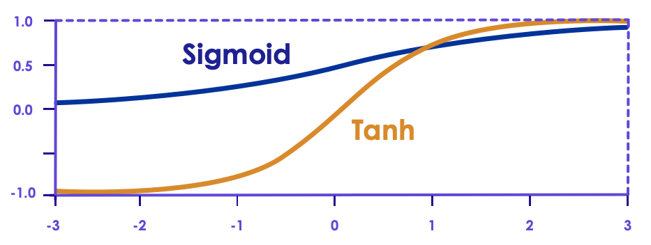

# Activation Functions

---

## Activation Functions

- Once we have the output of neuron, what do we do it?

- In our previous example, we defined a step function

     - If the output was greater than threshold b, `y = 1`,

     - Else, `y = 0`

     - Not Differentiable (no gradient, and can't use gradient descent to optimize)

---

## Activation Functions

- None (just use raw output of neuron)
- Linear
- Sigmoid
- Tanh
- ReLU
- Leaky ReLU

<!-- {"left" : 1.1, "top" : 4.91, "height" : 2.75, "width" : 8.05} -->

Notes:

---
## Activation Function - Linear

<!-- {"left" : 5.05, "top" : 2.06, "height" : 3.85, "width" : 4.88} -->

* `y = a.X + b`

* Differentiable
   - So we *can* use gradient descent

* Commonly used for **Regresssion**

* Linear Regression:
   - Single Layer (Linear)
   - Linear Activation Function

Notes:

---
## Activation Function - Sigmoid

<!-- {"left" : 6.58, "top" : 2.26, "height" : 3, "width" : 3.52} -->

- `σ(z) = 1 / (1 + exp(-z))`

- Sigmoid(Logistic) function has well defined non-zero derivative throughout
    - so we can use Gradient Descent

- Sigmoid function ranges from **`0 to +1`**

- Implementing Logistic Regression:
    - Single Layer (Linear)
    - Sigmoid Activation Function

- Note : Historically Sigmoid function has been very popular.  
Recently, ReLU functions work better and are more popular now.

Notes:  

---

## Tanh Activation

- `tanh (z) = 2σ(2z) - 1`

- Tanh is more popular, rather than Sigmoid

- The two are closely related, as tanh is a "stretched" Sigmoid

- Just like Sigmoid, Tanh is S-shaped, continuous, and differentiable

- Tanh is symmetric around zero and ranges from **`-1 to +1`**   
(sigmoid ranges from **`0 to +1`**)

<!-- {"left" : 0.77, "top" : 4.85, "height" : 3.24, "width" : 8.71} -->

Notes:

---

# Vanishing/Exploding Gradients Problems

---

## Vanishing/Exploding Gradients Problems

- As we know backpropagation works by going from output  layer to input layer (in reverse)
    - It propagates the error gradient backwards
- As it moves through the layers, the gradients gets smaller and smaller as it reaches lower layers
- So the Gradient Descent algorithm will leave lower layer connection weights virtually unchanged
    - and training never converges to a solution
    - this is **vanishing gradients problem**
- In some instances, the opposite would happen, the gradients will get larger and larger
    - so layers will get huge weight updates
    - and the algorithm will be bouncing around, never converging
    - this is **exploding gradients** problem
---

## Vanishing / Exploding Gradient Problems

<!-- {"left" : 6.33, "top" : 1.94, "height" : 2.85, "width" : 3.72} -->

- Sigmoid and Tanh both suffer from the **Vanishing Gradient** problem.
     - The derivative of a Sigmoid is less than .25
     - As we propagate that through many layers, that gradient becomes much less.
- And their slopes (derivatives) get closer to zero for large input values
    - this is called **saturating**

- Another issue is sometimes the gradients become too big
    - **Exploding gradients**
- One way is to fix the vanishing/exploding gradient problem is repeated scaling.

Notes:

---

## Vanishing/Exploding Gradients Problems

- Vanishing/exploding gradient problem has been observed in deep neural networks in the early days
    - One of the reasons, the progress was stalled

- In 2010 Xavier Glorot and Yoshua Bengio published a game changing paper called ['Understanding the difficulty of training deep feedforward neural networks'](http://proceedings.mlr.press/v9/glorot10a/glorot10a.pdf)
    - This paper outlined very good techniques that solved some of the nagging problems of neural nets

---

##  Use a Different Activation Function Than Sigmoid

<!-- {"left" : 6.64, "top" : 1.63, "height" : 2.67, "width" : 3.49} -->
* **Problem:**
- Sigmoid function was the most popular activation function used at that time   
    - Because sigmoid like functions are found in biological neurons.  (What is good for Mother Nature must be good for us too!)

- How ever, Sigmoid functions tend to 'saturate' at high values (towards the edges), that meant derivatives get close to zero.
    - Leads to vanishing gradients problem

* **Solution:**

- Use other activation functions like ReLU or variants (LeakyReLU)

---

## Activation Function - Rectified Linear Unit (ReLU)

<!-- {"left" : 6.28, "top" : 1.84, "height" : 3.16, "width" : 3.79} -->

- `ReLU (z) = max (0, z)`
- ReLU is Linear when greater than zero, and constant (zero) less than zero
- So for positive values, doesn't have a maximum value
- For values less than zero, differential becomes zero
- ReLU is used very heavily
    - Simple: very easy to understand
    - Fast: computationally cheap to compute
    - No Vanishing gradient problem
    - No Exploding Gradient problem
    - and **works well in real life scenarios**

Notes:

---

## Activation Function: Leaky ReLU

<!-- {"left" : 6.5, "top" : 1.81, "height" : 2.81, "width" : 3.46} -->

- ReLU isn't perfect; For values at or below zero or values, ReLU derivative is zero
    - Gradient Descent can not be used
    - Called **dying ReLU** problem

- **Leaky ReLU** fixes this by introducing a slope for negative values

- `LeakyReLUα(z) = max(αz, z)`  
`here ⍺ = 0.001` (small value, configurable)

- `α` controls how much the ReLU function 'leaks'

- This leak ensures that the signals never die (zero) and have a chance to wake up during later training phases  
(Going into coma vs. death

---

## ReLU Variants

- [This paper](https://arxiv.org/pdf/1505.00853.pdf) compares various ReLU implementations

- Leaky ReLU seems to perform better in most scenarios than regular ReLU
    - E.g. setting α=0.2 (huge leak) seems to outperform α=0.001 (small leak)

- Setting α randomly also seems to perform well
    - Got an additional benefit of acting as a regulator, preventing overfitting

---

## Exponential Linear Unit (ELU)

- A 2015 [paper](https://arxiv.org/pdf/1511.07289v5.pdf) by Djork-Arne Clevert, Thomas Unterthiner & Sepp Hochreiter introduced ELUs

- ELU outperformed all other ReLU variants, it trained quicker, and test accuracy was higher too.

<!-- {"left" : 5.38, "top" : 2.76, "height" : 1.52, "width" : 4.59} -->

<!-- {"left" : 3.18, "top" : 4.6, "height" : 2.83, "width" : 3.9} -->

---

## ELU Highlights

<!-- {"left" : 5.27, "top" : 2.15, "height" : 3.34, "width" : 4.61} -->

- Not zero for negative values (z < 0)
    - prevents signals dying out

- Works for negative values (z < 0) (doesn't go to zero).
    - So avoids vanishing gradients problem

- Very smooth function, even at z = 0
    - This makes smoother gradient descent convergence; it doesn't bounce around

- Downside:
    - More expensive to compute due to exponential function

---

## Final Word on ReLUs

- So which ReLU to use? :-)

-  `ELU > leaky ReLU (and its variants) > ReLU > tanh > logistic`

- If enough compute power is available, use **cross validation** to tweak hyper parameters like α

---

## Multi-class (non-binary) Outputs

 * So far, our neural networks have had exactly one output neuron.

     - For regression problems, the output neuron generates the response variable (a continuous value, e.g.  `stock price = 60.4`).

     - For classification problems, the output is binary (`0/1`)

 * What about multi-class classification? (non-binary)  
 For example, classifying a digit into one of `0, 1, 2 ... 9`

     - We need more than one output neuron.

     - Exactly one neuron for each class in classification.

 * How do we generate the output classes?

     - We can use a function called `Softmax`

Notes:

---
## Activation Function - Softmax

- The Softmax function converts an array of values to an array of probabilities.

- For example a digit classifier can produce the following output

| output class | 0   | 1    | 2   | 3    | 4    | 5   | 6   | 7   | 8   | 9   |
|--------------|-----|------|-----|------|------|-----|-----|-----|-----|-----|
| probability  | 0.0 | 0.15 | 0.0 | 0.00 | 0.05 | 0.0 | 0.0 | 0.8 | 0.0 | 0.0 |

<!-- {"left" : 0.26, "top" : 2.64, "height" : 1, "width" : 9.73, "columnwidth" : [1.62, 0.81, 0.81, 0.81, 0.81, 0.81, 0.81, 0.81, 0.81, 0.81, 0.81, 0.81]} -->

- The resultant array must add up to 1, because the output enumerates all probabilities

- We can implement the softmax function on the output, where we have k neurons indicating that we expect to see k number of output classes.

Notes:

---
## Softmax Function

<!-- {"left" : 0.9, "top" : 2.37, "height" : 4.32, "width" : 8.45} -->

Notes:

---
## Deciding the loss and activation type based on the task

| Classification Type       | Class Mode  | Loss                     | Activation on the last layer |
|---------------------------|-------------|--------------------------|------------------------------|
| 1 or 2 class              | binary      | binary_crossentropy      | sigmoid                      |
| Multi-class, single label | categorical | categorical_crossentropy | softmax                      |
| Multi-class, multi-label  | categorical | binary_crossentropy      | sigmoid                      |

<!-- {"left" : 0.25, "top" : 1.54, "height" : 2.57, "width" : 9.75} -->

Notes:   
Source :

---

## Activation Functions - Review

 * A Sigmoid Function is a mathematical function with a Sigmoid Curve ("S" Curve) and outputs a probability between 0 and 1.

 * A rectifier or ReLU (Rectified Linear Unit) is a commonly used activation function that allows one to eliminate negative units in an ANN. It helps solve vanishing/exploding gradient problems associated with other activation functions.

 * Hyperbolic or tan h function is an extension of logistic sigmoid with output stretching between -1 and +1. It enables faster learning compared to a Sigmoid.

 * The Softmax activation function is used to output the probability of the result belonging to certain classes.

---
## Activation Functions Review

<!-- {"left" : 0.44, "top" : 2.93, "height" : 3.2, "width" : 9.38} -->

