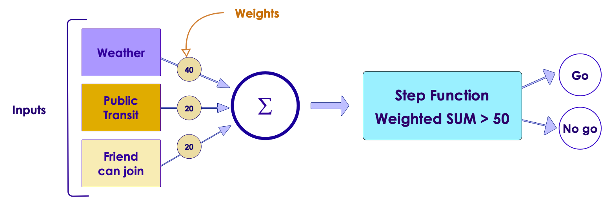
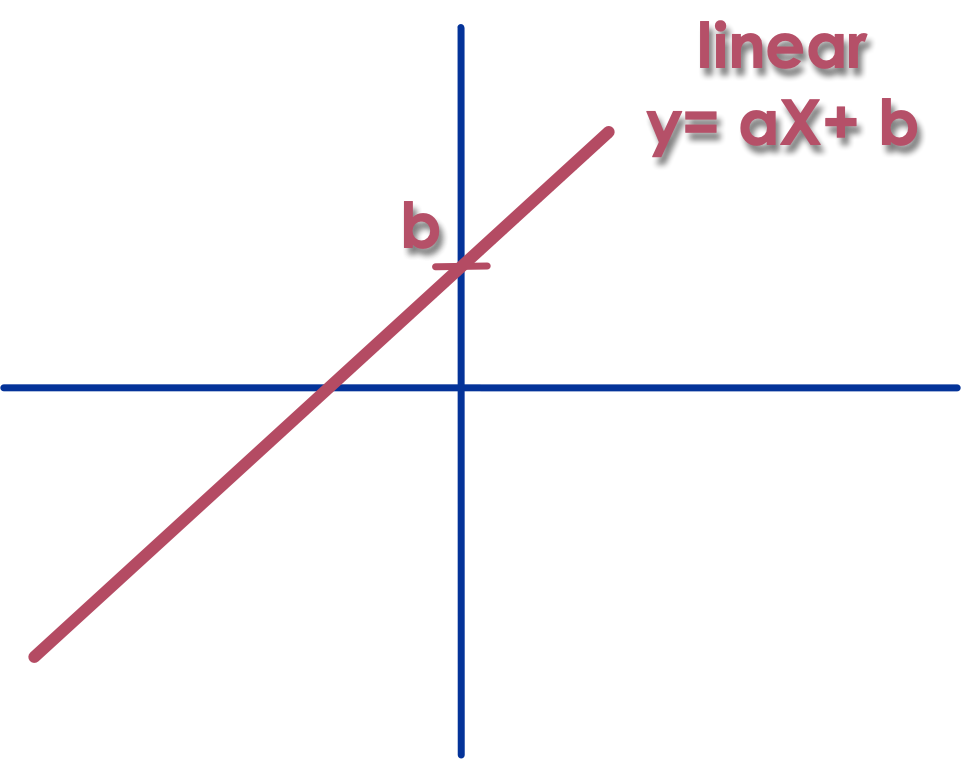
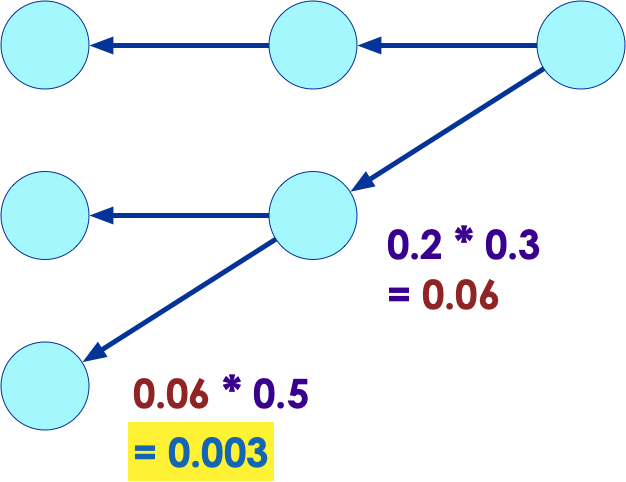
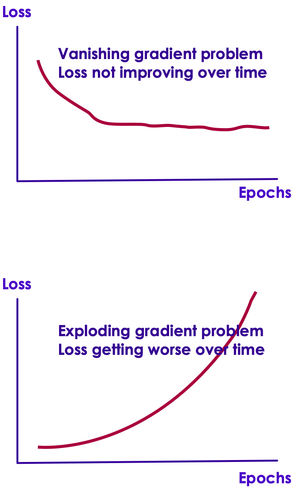

# Activation Functions

---

## Activation Functions

- Let's consider our 'simple perceptron' example

- The perceptron sums up all inputs and weights

- The output of the perceptron  would be   
__`output = weather * 40 + public * 20 + friend * 20`__

- Then we defined an __activation function__
     - If the output was greater than threshold (50) then __`answer = 1`__

     - Else, __`answer = 0`__

<!-- {"left" : 1.02, "top" : 5.21, "height" : 2.7, "width" : 8.21} -->

---

## Why Activation Functions?

- Without the activation function, the output of the perceptron would be __linear__

- Linear functions, tend to be simple; they can not solve complex problems

- Neural Nets are seen as __'universal function approximators'__
    - they can compute and learn any function

- So we need __'non linearity'__ so our NNs can compute complex functions
    - Hence we need __'activation functions'__

---

## Activation Functions

- None (just use raw output of neuron)
- Linear
- Sigmoid
- Tanh
- ReLU (Leaky ReLU ... etc)

<!-- {"left" : 0.63, "top" : 4.66, "height" : 3.07, "width" : 8.98} -->

Notes:

---
## Activation Function - Linear

<!-- {"left" : 5.22, "top" : 1.22, "height" : 3.85, "width" : 4.88} -->

* __`y = a.X + b`__

* Differentiable
   - So we *can* use gradient descent

* Commonly used for **Regresssion**

* E.g. Linear Regression:
   - Single Layer (Linear)
   - Linear Activation Function

Notes:

---
## Activation Function - Sigmoid

<!-- {"left" : 6.58, "top" : 2.26, "height" : 3, "width" : 3.52} -->

- __`σ(z) = 1 / (1 + exp(-z))`__

- Sigmoid(Logistic) function has well defined non-zero derivative throughout
    - so we can use Gradient Descent

- Sigmoid function ranges from **`0 to +1`**

- Implementing Logistic Regression:
    - Single Layer (Linear)
    - Sigmoid Activation Function

- Note : Historically Sigmoid function has been very popular.  
Recently, ReLU functions work better and are more popular now.

Notes:  

---

## Tanh Activation

- __`tanh (z) = 2σ(2z) - 1`__

- Recently Tanh is more popular, rather than Sigmoid

- The two are closely related, as tanh is a "stretched" Sigmoid

- Just like Sigmoid, Tanh is S-shaped, continuous, and differentiable

- Tanh is symmetric around zero and ranges from **`-1 to +1`**   
(sigmoid ranges from **`0 to +1`**)

<!-- {"left" : 0.77, "top" : 4.85, "height" : 3.24, "width" : 8.71} -->

Notes:

---

# Vanishing/Exploding Gradients Problems

---

## Vanishing Gradients Problem

- As we know backpropagation works by going from output  layer to input layer (in reverse)

- It propagates the error gradient backwards

- And the weights are adjusted by multiplying by derivatives

- **Animation** : [link-youtube](https://youtu.be/krTFCDCbkZg), [link-S3](https://elephantscale-public.s3.amazonaws.com/media/machine-learning/backpropagation-5.mp4)

<!-- {"left" : 1.51, "top" : 3.6, "height" : 3.62, "width" : 7.24} -->

---

## Vanishing  Gradient Problem

<!-- {"left" : 6.51, "top" : 1.62, "height" : 2.76, "width" : 3.6} -->

- Sigmoid and Tanh both suffer from the **Vanishing Gradient** problem.

- The derivative of a Sigmoid is **less than 0.25**

- As the gradients gets multiplied, they will get smaller and smaller
    - e.g. : 0.02  * 0.01 = 0.0002

- As we propagate that through many layers, that gradient becomes much less.

- And their slopes (derivatives) get closer to zero for large input values
    - this is called **saturating**

Notes:

---
## Vanishing Gradients Problem

<!-- TODO shiva -->
<!-- {"left" : 6.51, "top" : 1.62, "height" : 2.76, "width" : 3.6} -->

- Here we are showing how multiplying small numbers yields smaller numbers
    - first step:  `0.2 * 0.3 = 0.06`
    - second step: `0.06 * 0.5 = 0.003`

- As we move through the layers, the gradients gets smaller and smaller (approaching zero) as we reach lower layers

- So the Gradient Descent algorithm will leave lower layer connection weights virtually unchanged
    - and training never converges to a solution
    - this is **vanishing gradients problem**

---

## Exploding Gradient Problem

<!-- TODO shiva -->
<!-- {"left" : 6.51, "top" : 1.62, "height" : 2.76, "width" : 3.6} -->

- In some instances, the opposite would happen, the gradients will get larger and larger

- so layers will get huge weight updates

- and the algorithm will be bouncing around, never converging
    - this is **exploding gradients** problem

- Here we see both effects:
    - Vanishing gradient: The loss is not improving
    - Exploding gradient: The loss is actually getting worse

---

## Vanishing/Exploding Gradients Problems

- Vanishing/exploding gradient problem has been observed in deep neural networks in the early days
    - One of the reasons, the progress was stalled

- In 2010 Xavier Glorot and Yoshua Bengio published a game changing paper called ['Understanding the difficulty of training deep feedforward neural networks'](http://proceedings.mlr.press/v9/glorot10a/glorot10a.pdf)
    - This paper outlined very good techniques that solved some of the nagging problems of neural nets

---

##  Use a Different Activation Function Than Sigmoid

<!-- {"left" : 6.64, "top" : 1.63, "height" : 2.67, "width" : 3.49} -->
* **Problem:**  
    - Sigmoid function was the most popular activation function used at that time   
    - Because sigmoid like functions are found in biological neurons.  (What is good for Mother Nature must be good for us too!)

- How ever, Sigmoid functions tend to 'saturate' at high values (towards the edges), that meant derivatives get close to zero.
    - Leads to vanishing gradients problem

* **Solution:**
    - Use other activation functions like ReLU or variants (LeakyReLU)

---

## Activation Function - Rectified Linear Unit (ReLU)

<!-- {"left" : 6.53, "top" : 1.68, "height" : 3.04, "width" : 3.65} -->

- __`ReLU (z) = max (0, z)`__
- ReLU is Linear when greater than zero, and constant (zero) less than zero
- So for positive values, doesn't have a maximum value
- For values less than zero, differential becomes zero
- ReLU is used very heavily
    - Simple: very easy to understand
    - Fast: computationally cheap to compute
    - No Vanishing gradient problem
    - No Exploding Gradient problem
    - and **works well in real life scenarios**

Notes:

---

## Activation Function: Leaky ReLU

<!-- {"left" : 6.78, "top" : 2.95, "height" : 2.73, "width" : 3.36} -->

- ReLU isn't perfect; For values at or below zero or values, ReLU derivative is zero
    - Gradient Descent can not be used
    - Called **dying ReLU** problem

- **Leaky ReLU** fixes this by introducing a slope for negative values

- __`LeakyReLUα(z) = max(αz, z)`__  
`here ⍺ = 0.001` (small value, configurable)

- `α` controls how much the ReLU function 'leaks'

- This leak ensures that the signals never die (zero) and have a chance to wake up during later training phases  
(Going into coma vs. death)

---

## ReLU Variants

<!-- {"left" : 6.72, "top" : 1.02, "height" : 2.81, "width" : 3.46} -->

- [This paper](https://arxiv.org/pdf/1505.00853.pdf) compares various ReLU implementations

- Leaky ReLU seems to perform better in most scenarios than regular ReLU
    - E.g. setting α=0.2 (huge leak) seems to outperform α=0.001 (small leak)

- Setting α randomly also seems to perform well
    - Got an additional benefit of acting as a regulator, preventing overfitting

---

## Exponential Linear Unit (ELU)

- A 2015 [paper](https://arxiv.org/pdf/1511.07289v5.pdf) by Djork-Arne Clevert, Thomas Unterthiner & Sepp Hochreiter introduced ELUs

- ELU outperformed all other ReLU variants, it trained quicker, and test accuracy was higher too.

<!-- {"left" : 0.66, "top" : 5.47, "height" : 1.52, "width" : 4.59} --> &nbsp; &nbsp;
<!-- {"left" : 5.69, "top" : 4.82, "height" : 2.83, "width" : 3.9} -->

---

## ELU Highlights

<!-- {"left" : 5.27, "top" : 2.15, "height" : 3.34, "width" : 4.61} -->

- Not zero for negative values (z < 0)
    - prevents signals dying out

- Works for negative values (z < 0) (doesn't go to zero).
    - So avoids vanishing gradients problem

- Very smooth function, even at z = 0
    - This makes smoother gradient descent convergence; it doesn't bounce around

- Downside:
    - More expensive to compute due to exponential function

---

## Final Word on Actications

- So which activation function to use? :-)

 

|         | Advantages                                                       | Disadvantages                                                               |
|---------|------------------------------------------------------------------|-----------------------------------------------------------------------------|
| Sigmoid | - Will not lead to exploding gradients                           | - will lead to vanishing gradients   - computationally expensive to calcluate |
| ReLU    | - Not lead to vanishing gradients   - Easy to compute than sigmoid | - May lead to exploding gradients                                           |

- In practice (real world scenarios), ReLU tend to show better convergence performance than sigmoid

-  __`ELU > leaky ReLU (and its variants) > ReLU > tanh > sigmoid`__

- If enough compute power is available, use **cross validation** to tweak hyper parameters like α

Notes:
- [Relu vs. Sigmoid](https://stats.stackexchange.com/questions/126238/what-are-the-advantages-of-relu-over-sigmoid-function-in-deep-neural-networks)

---

## Activation Functions for Regression

<!-- {"left" : 5.24, "top" : 1.26, "height" : 2.44, "width" : 4.92} -->

 * For regression problems, the output neuron generates the response variable (a continuous value)
    - e.g.  stock price = 60.4

 * The following can be used as activation Functions    
    - Linear
    - Sigmoid / Logistic
    - Tanh
    - ReLU variants

---

## Activation Function for Binary Classification

<!-- {"left" : 5.59, "top" : 1.18, "height" : 2.01, "width" : 4.5} -->

- For classification problems, the output is binary (0/1  or True / False)
    - e.g. is the transaction fraud?  True / False
    - e.g. will this loan default? True / False

- Again one neuron at the output layer can handle this

- Activation Functions to use:
    - Sigmoid / Logistic

---
## Activation Function for Multi-class (non-binary) Outputs

<!-- {"left" : 5.74, "top" : 1.22, "height" : 3.93, "width" : 4.28} -->

 * What about multi-class classification? (non-binary)  
    - e.g., classifying a digit into one of `0, 1, 2 ... 9`

 * We need more than one output neuron.

 * Exactly one neuron for each class in classification.

 * How do we generate the output classes?
     - We can use a function called `Softmax`

Notes:

---
## Activation Function - Softmax

<!-- {"left" : 5.39, "top" : 1.06, "height" : 2.1, "width" : 4.79} -->

- Assume we have an image classifier that classifies animals into 4 categories: cat / dog / elephant / lion
- So the final layer will have 4 neurons, so they match the output classes (4)
- And the output layer will have __softmax__ activation function
- The Softmax function produces probabilities for output values.
- In the above example, prediction is __CAT__ as it has the highest probability (80% or 0.8)

| Output Class            | Cat  | Dog  | Elephant | Lion |
|-------------------------|------|------|----------|------|
| Probability (Total 1.0) | 0.80 | 0.05 | 0.02     | 0.13 |

<!-- {"left" : 4.85, "top" : 7.24, "height" : 1.23, "width" : 5.36, "columnwidth" : [1.81, 0.69, 0.69, 1.38, 0.8]} -->

---
## Softmax Function

<!-- {"left" : 0.9, "top" : 2.37, "height" : 4.32, "width" : 8.45} -->

Notes:

---

## Activation Functions - Review

 * A __Sigmoid Function__ is a mathematical function with a Sigmoid Curve ("S" Curve) and outputs a probability between 0 and 1.

 * A rectifier or __ReLU__ (Rectified Linear Unit) is a commonly used activation function that allows one to eliminate negative units in an ANN. It helps solve vanishing/exploding gradient problems associated with other activation functions.

 * Hyperbolic or __tan__ h function is an extension of logistic sigmoid with output stretching between -1 and +1. It enables faster learning compared to a Sigmoid.

 * The __Softmax__ activation function is used to output the probability of the result belonging to certain classes.

---
## Activation Type Based on the Task

| Problem Type   | Prediction                      | Activation on the last layer |
|----------------|---------------------------------|------------------------------|
| Regression     | a number                        | linear, relu                 |
|                |                                 |                              |
| Classification | binary (0/1)                    | sigmoid                      |
|                | Multi-class   (A, B, C , D) | softmax                      |

<!-- {"left" : 0.25, "top" : 1.54, "height" : 2.57, "width" : 9.75} -->

Notes:   

---

## Activation Functions Review

<!-- {"left" : 0.44, "top" : 2.93, "height" : 3.2, "width" : 9.38} -->

---

## Activation Functions Cheatsheet

<!-- {"left" : 1.96, "top" : 1.02, "height" : 4.75, "width" : 6.34} -->

- source: [quora](https://www.quora.com/What-is-the-role-of-the-activation-function-in-a-neural-network-How-does-this-function-in-a-human-neural-network-system)

Notes:
- source [quora](https://www.quora.com/What-is-the-role-of-the-activation-function-in-a-neural-network-How-does-this-function-in-a-human-neural-network-system)
