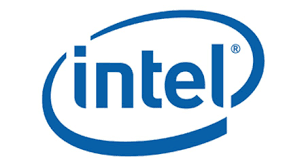
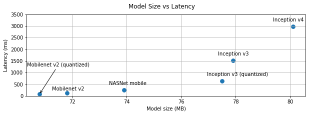

## Deep Learning Libraries

| Python                                                                                                                                                                            | R                       | Java                                                   | Mobile                                                                                                                                         |
|-----------------------------------------------------------------------------------------------------------------------------------------------------------------------------------|-------------------------|--------------------------------------------------------|------------------------------------------------------------------------------------------------------------------------------------------------|
| - [TensorFlow](https://www.tensorflow.org/)   - [Theano](http://deeplearning.net/software/theano/)  - [Caffe2](https://caffe2.ai/)  - [Keras](https://keras.io/)  | - Deepnet   - Darch | [DL4J (Deep Learning 4J)](https://deeplearning4j.org/) | - [CoreML](https://developer.apple.com/documentation/coreml) - by Apple   - [Tensorflow Lite](https://www.tensorflow.org/lite) - by Google |

<!-- {"left" : 1.97, "top" : 3.1, "height" : 1, "width" : 13.56} -->

 &nbsp; <!-- {"left" : 1.41, "top" : 9.01, "height" : 1.22, "width" : 3.3} --> &nbsp; <!-- {"left" : 5.2, "top" : 9.14, "height" : 0.97, "width" : 3.3} --> &nbsp; <!-- {"left" : 9, "top" : 9.01, "height" : 1.22, "width" : 3.3} --><!-- {"left" : 12.79, "top" : 7.53, "height" : 2.81, "width" : 3.3} -->

Notes:

---

## Deep Learning Libraries

|     Library    |          API         |              Platforms              |               Started by              | Year |
|:--------------:|:--------------------:|:-----------------------------------:|:-------------------------------------:|:----:|
| Caffe          | Python, C++, Matlab  | Linux, macOS, Windows               | Y.Jia, UC Berkeley(BVLC)              | 2013 |
| Deeplearning4j | Java, Scala, Clojure | Linux, macOS, Windows, Android      | A. Gibson, J.Patterson                | 2014 |
| H2O            | Python, R            | Linux, macOS, Windows               | H2O.ai                                | 2014 |
| MXNet          | Python, C++, others  | Linux, macOS, Windows, iOS, Android | DMLC                                  | 2015 |
| TensorFlow     | Python, C++          | Linux, macOS, Windows, iOS, Android | Google                                | 2015 |
| Theano         | Python               | Linux, macOS, iOS                   | University of Montreal                | 2010 |
| Torch          | C++, Lua             | Linux, macOS, iOS, Android          | R.Collobert, K.Kavukcuoglu, C.Farabet | 2002 |

<!-- {"left" : 0.49, "top" : 2.8, "height" : 1, "width" : 16.51} -->

Notes:

---
## Deep Learning and Big Data

 * Until recently most of the machine learning is done on "single computer" (with lots of memory-100s of GBs)

 * Most R/Python/Java libraries are "single node based"

 * Now Big Data tools make it possible to run machine learning algorithms at massive scale-distributed across a cluster

<!-- {"left" : 2.9, "top" : 6.1, "height" : 4.97, "width" : 11.7} -->

Notes:

---
## Deep Learning Software Ecosystem (Distributed)

 * **Distributed**
    - Tensorflow
    - Spark
    - BigDL

 * **Cloud Based**
    - [Amazon Machine Learning](https://aws.amazon.com/machine-learning/)
    - [Azure Machine Learning (Microsoft)](https://azure.microsoft.com/en-us/services/machine-learning-service/)
    - [Google Cloud AI](https://cloud.google.com/products/ai/)

Notes:
- http://www.kdnuggets.com/2016/04/top-15-frameworks-machine-learning-experts.html
- http://www.infoworld.com/article/2853707/machine-learning/11-open-source-tools-machine-learning.html

---
## Tools for Deep Learning - Tensorflow

<!-- {"left" : 12.58, "top" : 1.89, "height" : 3.8, "width" : 4.45} -->

 * [Tensorflow](https://www.tensorflow.org/) is an open source DL framework by Google

 * Became very popular in a very short period of time

 * Based on "data flow graphs"

 * Language support: Python, C++

 * Supports both CPU and GPU runtimes

Notes:

---
## Tools for Scalable Deep Learning - Spark

<!-- {"left" : 11.99, "top" : 1.89, "height" : 2.76, "width" : 5.2} -->

 * Spark is very popular Big Data processing platform (distributed compute engine)

 * Massively scalable (100s of TBs to PB of data)

 * Can cache data in memory for very fast iterations

 * Spark ML now supports Tensorflow and Keras as back-ends

 * Language support: Scala, Java, Python, R

---

## Tools for Scalable Deep Learning - BigDL

<!-- {"left" : 13.26, "top" : 2.18, "height" : 1.79, "width" : 3.89} -->

 * BigDL is a scalable Deep Learning framework developed and open sourced by Intel

 * Built on Spark, so is very scalable

 * Can import models built with other frameworks (Torch, Caffe, TensorFlow)

<!-- {"left" : 13.26, "top" : 5.37, "height" : 2.1, "width" : 3.89} -->

 * Uses [Intel MKL Libraries](https://software.intel.com/en-us/intel-mkl) for  high performance

 * https://bigdl-project.github.io

---
## Tools for Scalable Deep Learning - Cloud

 * Popular Cloud platforms now offer 'Machine Learning as Service'
 * Can provide huge scale
 * Pay for use billing
 * Offerings
    - Amazon Machine Learning
    - Azure ML Studio
    - Google Cloud ML

<!-- {"left" : 1.12, "top" : 7.72, "height" : 1.62, "width" : 4.99} --> <!-- {"left" : 6.11, "top" : 6.86, "height" : 3.34, "width" : 5.01} -->  <!-- {"left" : 11.4, "top" : 7.72, "height" : 1.62, "width" : 4.98} --> 

Notes:

---

## Image Recognition API Services

 * [Clarifai](https://www.clarifai.com/) : winner of the 2013 ImageNet Large Scale Visual Recognition Challenge (ILSVRC) classification

 * [Microsoft Cognitive Services](https://azure.microsoft.com/en-us/services/cognitive-services/) : Microsoft won seven tasks at the ImageNet Large Scale Visual Recognition Challenge (ILSVRC) in 2015 with ResNet-152 (a 152 layer network)

 * [Google Cloud Vision](https://cloud.google.com/vision/) - Google won 2014 ImageNet Large Scale Visual Recognition Challenge (ILSVRC) with GoogLeNet (22 layers)

 * [Amazon Rekognition](https://aws.amazon.com/rekognition/)

 * [IBM Watson Visual Recognition](https://www.ibm.com/watson/services/visual-recognition/)

<!-- {"left" : 0.65, "top" : 9.11, "height" : 0.69, "width" : 3.3} --><!-- {"left" : 4.7, "top" : 8.67, "height" : 1.85, "width" : 2.18} --><!-- {"left" : 7.3, "top" : 8.69, "height" : 1.81, "width" : 2.9} -->&nbsp; &nbsp;<!-- {"left" : 10.89, "top" : 8.47, "height" : 1.98, "width" : 1.98} --><!-- {"left" : 13.55, "top" : 8.62, "height" : 1.68, "width" : 3.3} -->

Notes:

---
## Deep Learning in Mobile

<!-- {"left" : 12.18, "top" : 1.89, "height" : 5.14, "width" : 5.14} -->

 * Why do DL on mobile?
 * **Privacy:** so no data leaves the device.This is important with PII (Personally  Identifiable Information) and Europe's GDPR (General Data Protection Regulation)
 * **Reducing Cloud Cost:** By doing DL on the device and minimizing sending data to cloud, we can save time and money
 * **Speed:** Sending data to cloud and getting an answer back can take several seconds
    - 10 seconds: user's keep their focus on a screen
    - 1 second: to keep workflow going
    - 0.1 second: users perceive system is working 'instantaneously'

Notes:

---

## Deep Learning Mobile Libraries

<!-- {"left" : 14.91, "top" : 1.75, "height" : 2.13, "width" : 2.13} -->

 * [CoreML](https://developer.apple.com/documentation/coreml) - by Apple
    - only supported on IOS (Apple) devices
    - supports models from  Keras, Caffe, XGBoost, Scikit-learn

 * [Tensorflow Lite](https://www.tensorflow.org/lite) by Google
   - works on IOS and Android

<!-- {"left" : 9.74, "top" : 4.99, "height" : 1.15, "width" : 7.42} -->

 * [MobileNets](https://arxiv.org/abs/1704.04861) - Optimized Convolutional Neural Networks for Mobile Vision Applications

Notes:  
- https://developer.apple.com/documentation/coreml
- https://www.tensorflow.org/lite

---

## Deep Learning Model Benchmarks

<!-- {"left" : 3.89, "top" : 2.74, "height" : 3.64, "width" : 9.71} -->

<!-- {"left" : 3.89, "top" : 7.38, "height" : 3.6, "width" : 9.71} -->

Notes:  
Source : https://www.tensorflow.org/lite/performance/best_practices

---

## Commercial DL Software

<!-- {"left" : 13.84, "top" : 1.89, "height" : 3.12, "width" : 3.12} -->

 *  **H2O**
    - Easy to use API
    - Friendly UI
    - Works on top of Spark ("Sparkling Water")
    - Works on cloud platforms
    - Commercially supported
    - Vendor: 0xData

&nbsp;
&nbsp;

<!-- {"left" : 11.43, "top" : 6.7, "height" : 1.09, "width" : 5.57} -->

 * SkyMind SKIL
    - Java based ML stack (DJ4J)
    - Native Big Data support (Hadoop/Spark)
    - Runs on bare metal, containers and VMs
    - Commercially supported

Notes:
