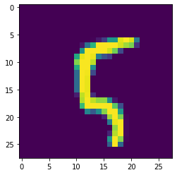
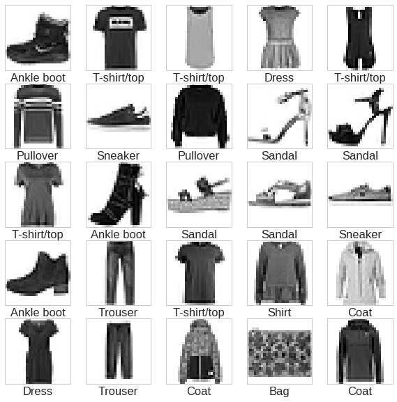
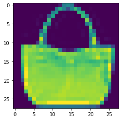

# Image Datasets

---

## Popular Image Datasets

- [MNIST](http://yann.lecun.com/exdb/mnist/)

- [Fashion MNIST](https://github.com/zalandoresearch/fashion-mnist)

- [CIFAR](https://www.cs.toronto.edu/~kriz/cifar.html)

- [ImageNet](http://image-net.org)

- [Street View House numbers](http://ufldl.stanford.edu/housenumbers/)

- Cats & Dogs


---

## MNIST

<!-- {"left" : 10.56, "top" : 1.89, "height" : 4.34, "width" : 6.56} -->

* MNIST Dataset is the "hello world" of image recognition

* 28x28 greyscale scanned digits

* Total 70,000 images
    - 60,000 training images (26 MB)
    - 10,000 test images (4.3 MB)

* MNIST is often the first dataset researchers try.  
 _"If it doesn't work on MNIST, it won't work at all",  
 "Well, if it does work on MNIST, it may still fail on others."_

* [Reference](http://yann.lecun.com/exdb/mnist/)


Notes:

---

## Exploring MNIST

```python
import tensorflow as tf
from tensorflow import keras
import matplotlib.pyplot as plt

(train_images, train_labels), (test_images, test_labels) = keras.datasets.mnist.load_data()

print("train_images shape : ", train_images.shape)
print("train_labels shape : ", train_labels.shape)
print("test_images shape : ", test_images.shape)
print("test_labels shape : ", test_labels.shape)
# train_images shape :  (60000, 28, 28)
# train_labels shape :  (60000,)
# test_images shape :  (10000, 28, 28)
# test_labels shape :  (10000,)

## Display a sample image
index = 100
print("train label [{}] = {} ".format(index, train_labels[index])))
# train label [100] = 5
plt.imshow(train_images[index])
```
<!-- {"left" : 0.85, "top" : 2.2, "height" : 4.42, "width" : 11.53} -->

 <!-- {"left" : 12.27, "top" : 1.85, "height" : 4.91, "width" : 4.97} -->

<br/>

* Training images are 28x28 pixel images
* Labels are numbers:  0 - 9
* Here we are display 100th image, which is a '5'.  
See the image and label

Notes:


---

## Fashion MNIST

<!-- {"left" : 12.22, "top" : 1.89, "height" : 5.01, "width" : 4.94} -->

* Fashion MNIST was created as a 'better MNIST'
    - MNIST is too easy;  Classic ML algorithms can achieve 97% accuracy,  CNNs can achieve 99.7% accuracy!

* Images of 10 fashion items (shirt, sweater, shoe ..etc)

* 28x28 greyscale images

* Total 70,000 images
    - 60,000 training images (26 MB)
    - 10,000 test images (4.3 MB)

* Designed as a 'drop in' replacement for MNIST

* [Reference](https://github.com/zalandoresearch/fashion-mnist) |  [bigger image](https://raw.githubusercontent.com/zalandoresearch/fashion-mnist/master/doc/img/fashion-mnist-sprite.png)

---

## Exploring Fashion-MNIST

```python
import tensorflow as tf
from tensorflow import keras
import matplotlib.pyplot as plt

(train_images, train_labels), (test_images, test_labels) = keras.datasets.fashion_mnist.load_data()

print("train_images shape : ", train_images.shape)
print("train_labels shape : ", train_labels.shape)
print("test_images shape : ", test_images.shape)
print("test_labels shape : ", test_labels.shape)
# train_images shape :  (60000, 28, 28)
# train_labels shape :  (60000,)
# test_images shape :  (10000, 28, 28)
# test_labels shape :  (10000,)

## Display a sample image
index = 100
print("train label [{}] = {} ".format(index, train_labels[index])))
# train label [100] = 8
plt.imshow(train_images[index])
```
<!-- {"left" : 0.85, "top" : 2.29, "height" : 4.31, "width" : 12.19} -->

<!-- {"left" : 13.11, "top" : 2.03, "height" : 4.17, "width" : 4.22} -->


<br/>

* Training images are 28x28 pixel images
* Labels are numbers:  0 - 9
* Here we are display 100th image, which is a '8' (handbag).  

Notes:


---

## Exploring Fashion MNIST

* Why do we use numbers are labels as opposed to 'Dress', 'Coat'

* Numbers are universal; not constrained by languages (English / Japanese ..etc)

| Label | Description |
|-------|-------------|
| 0     | T-shirt/top |
| 1     | Trouser     |
| 2     | Pullover    |
| 3     | Dress       |
| 4     | Coat        |
| 5     | Sandal      |
| 6     | Shirt       |
| 7     | Sneaker     |
| 8     | Bag         |
| 9     | Ankle boot  |

<!-- {"left" : 3.07, "top" : 4.62, "height" : 1, "width" : 11.37} -->


---

## CIFAR-10

<!-- {"left" : 10.41, "top" : 2.09, "height" : 5.01, "width" : 6.81} -->

* CIFFAR-10 dataset consists of
    - 60,000 color images
    - 32x32 pixels, color
    - 10 classes (6,000 per class)
* 50,000 training images; 10,000 test images
* 5 training batches, 1 test batch
    - 10,000 images per batch  
    - Each batch has 1000 random images from each class
* **Size ~160 MB**

---

## CIFAR-100

* [CIFAR-100](https://www.cs.toronto.edu/~kriz/cifar.html) is pretty much like CIFAR-10
    - 32x32 pixels (color)
    - 100 classes
    - 600 images per class

* The 100 classes are grouped into 20 superclasses.

* **Size ~160MB**

<br />

| Superclass           | Classes                                          |
|----------------------|--------------------------------------------------|
| aquatic mammals      | beaver, dolphin, otter, seal, whale              |
| fish                 | aquarium fish, flatfish, ray, shark, trout       |
| flowers              | orchids, poppies, roses, sunflowers, tulips      |
| fruit and vegetables | apples, mushrooms, oranges, pears, sweet peppers |

<!-- {"left" : 2.09, "top" : 6.6, "height" : 1, "width" : 13.33} -->


---

## Using CIFAR data  (TensorFlow)

```python
import tensorflow as tf
from tensorflow.keras import datasets, layers, models
import matplotlib.pyplot as plt

(train_images, train_labels), (test_images, test_labels) = datasets.cifar10.load_data()

# Normalize pixel values to be between 0 and 1
train_images, test_images = train_images / 255.0, test_images / 255.0
```
<!-- {"left" : 0.85, "top" : 2.5, "height" : 2.67, "width" : 15.61} -->

---

## ImageNet

- [ImageNet](http://www.image-net.org/) is an image database

- 15 millions+ labeled high-resolution images with around 22,000 categories.

- It is organized hierarchically

```
imagenet/
└── animals
    └── domestic
        ├── cat
        │   ├── cat1.jpg
        │   └── cat2.jpg
        └── dog
            ├── dog1.jpg
            └── dog2.jpg
```
<!-- {"left" : 0.85, "top" : 4.28, "height" : 3.57, "width" : 6.44} -->


---

## Imagenet

<!-- {"left" : 3.04, "top" : 2.31, "height" : 9.09, "width" : 11.42} -->


---

## Imagenet

- The ImageNet dataset was the basis for the famous ImageNet Large Scale Visual Recognition Challenge (ILSVRC)

- ILSVRC uses a subset of ImageNet of around 1000 images in each of 1000 categories.   
~1.2 million training images, 50,000 validation images and 150,000 testing images.

- ILSVRC competition started in 2010

- Since then it is considered the 'Olympics' of image recognition.  
 Researchers compete to win this prestigious competition

- The accuracy has gone up from 70% to 97%

- Also researchers are sharing models trained with ImageNet, making rapid progress in image recognition

---

## Street View Numbers

- [Streetview](http://ufldl.stanford.edu/housenumbers/) comes from Google Street View data

- over 600,000 images

<!-- {"left" : 2.4, "top" : 4.72, "height" : 5.45, "width" : 7.39} --> &nbsp; &nbsp; <!-- {"left" : 9.99, "top" : 5.66, "height" : 3.56, "width" : 5.24} -->


---

## Cats & Dogs

- In 2014 Microsoft Research was working on a CAPTCHA system
- For that they were using ASIRRA (Animal Species Image Recognition for Restricting Access)
- 3 million images  (800 MB in size)
- Labeled by animal shelters throughout US and also [PetFinder.com](https://petfinder.com)
- When the dataset came out the accuracy was around 80%.  Within a few weeks the top algorithms were scoring 98% accuracy!
- This image set has become a 'classic' test for image recognition algorithms!  
(The cuteness doesn't hurt either!)
- [Link to Paper](https://www.microsoft.com/en-us/research/publication/asirra-a-captcha-that-exploits-interest-aligned-manual-image-categorization/) ,   
- [Link to download](https://www.microsoft.com/en-us/download/details.aspx?id=54765)


<!-- {"left" : 3.93, "top" : 9.08, "height" : 2.19, "width" : 2.19} --> &nbsp; &nbsp; <!-- {"left" : 6.44, "top" : 9.08, "height" : 2.19, "width" : 2.76} --> &nbsp; &nbsp; <!-- {"left" : 9.52, "top" : 9.08, "height" : 2.18, "width" : 2.08} --> &nbsp; &nbsp; <!-- {"left" : 12.08, "top" : 9.08, "height" : 2.19, "width" : 1.49} -->


Notes:
