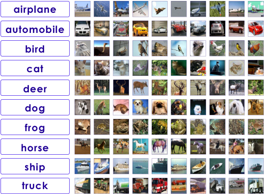
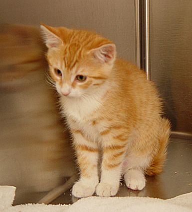

# Image Datasets

---

## Popular Image Datasets

- [MNIST](http://yann.lecun.com/exdb/mnist/)

- [CIFAR](https://www.cs.toronto.edu/~kriz/cifar.html)

- [ImageNet](http://image-net.org)

- [Street View House numbers](http://ufldl.stanford.edu/housenumbers/)

- Cats & Dogs


---

## MNIST Example

<!-- TODO shiva -->

* MNIST Dataset is the "hello world" of deep learning

* 28x28 greyscale scanned digits

* [Reference](http://yann.lecun.com/exdb/mnist/)


Notes:

---

## CIFAR-10



* CIFFAR-10 dataset consists of
    - 60,000 color images
    - 32x32 pixels, color
    - 10 classes (6,000 per class)
* 50,000 training images; 10,000 test images
* 5 training batches, 1 test batch
    - 10,000 images per batch  
    - Each batch has 1000 random images from each class
* **Size ~160 MB**

---

## CIFAR-100

* [CIFAR-100](https://www.cs.toronto.edu/~kriz/cifar.html) is pretty much like CIFAR-10
    - 32x32 pixels (color)
    - 100 classes
    - 600 images per class

* The 100 classes are grouped into 20 superclasses.

* **Size ~160MB**

<br />

| Superclass           | Classes                                          |
|----------------------|--------------------------------------------------|
| aquatic mammals      | beaver, dolphin, otter, seal, whale              |
| fish                 | aquarium fish, flatfish, ray, shark, trout       |
| flowers              | orchids, poppies, roses, sunflowers, tulips      |
| fruit and vegetables | apples, mushrooms, oranges, pears, sweet peppers |

---

## Using CIFAR data  (TensorFlow)

```python
import tensorflow as tf
from tensorflow.keras import datasets, layers, models
import matplotlib.pyplot as plt

(train_images, train_labels), (test_images, test_labels) = datasets.cifar10.load_data()

# Normalize pixel values to be between 0 and 1
train_images, test_images = train_images / 255.0, test_images / 255.0
```

---

## ImageNet

- [ImageNet](http://www.image-net.org/) is an image database

- 15 millions+ labeled high-resolution images with around 22,000 categories.

- It is organized hierarchically

```
imagenet/
└── animals
    └── domestic
        ├── cat
        │   ├── cat1.jpg
        │   └── cat2.jpg
        └── dog
            ├── dog1.jpg
            └── dog2.jpg
```
<!-- {"left" : 0, "top" : 3.57, "height" : 2.65, "width" : 4.78} -->


---

## Imagenet

<!-- {"left" : 1.8, "top" : 2.17, "height" : 5.3, "width" : 6.66} -->


---

## Imagenet

- The ImageNet dataset was the basis for the famous ImageNet Large Scale Visual Recognition Challenge (ILSVRC)

- ILSVRC uses a subset of ImageNet of around 1000 images in each of 1000 categories.   
~1.2 million training images, 50,000 validation images and 150,000 testing images.

- ILSVRC competition started in 2010

- Since then it is considered the 'Olympics' of image recognition.  
 Researchers compete to win this prestigious competition

- The accuracy has gone up from 70% to 97%

- Also researchers are sharing models trained with ImageNet, making rapid progress in image recognition

---

## Street View Numbers

- [Streetview](http://ufldl.stanford.edu/housenumbers/) comes from Google Street View data

- over 600,000 images

<!-- {"left" : 1.07, "top" : 3.09, "height" : 3.48, "width" : 4.72} --> &nbsp; &nbsp; <!-- {"left" : 6.26, "top" : 4.06, "height" : 1.99, "width" : 2.93} -->


---

## Cats & Dogs

- In 2014 Microsoft Research was working on a CAPTCHA system
- For that they were using ASIRRA (Animal Species Image Recognition for Restricting Access)
- 3 million images  (800 MB in size)
- Labeled by animal shelters throughout US and also [PetFinder.com](https://petfinder.com)
- When the dataset came out the accuracy was around 80%.  Within a few weeks the top algorithms were scoring 98% accuracy!
- This image set has become a 'classic' test for image recognition algorithms!  
(The cuteness doesn't hurt either!)
- [Link to Paper](https://www.microsoft.com/en-us/research/publication/asirra-a-captcha-that-exploits-interest-aligned-manual-image-categorization/) ,   
- [Link to download](https://www.microsoft.com/en-us/download/details.aspx?id=54765)


<!-- {"left" : 0.83, "top" : 6.63, "height" : 1.95, "width" : 1.95} --> &nbsp; &nbsp; <!-- {"left" : 3.07, "top" : 6.63, "height" : 1.95, "width" : 2.46} --> &nbsp; &nbsp; <!-- {"left" : 5.81, "top" : 6.63, "height" : 1.94, "width" : 1.85} --> &nbsp; &nbsp; <!-- {"left" : 8.09, "top" : 6.63, "height" : 1.95, "width" : 1.33} -->


Notes:
