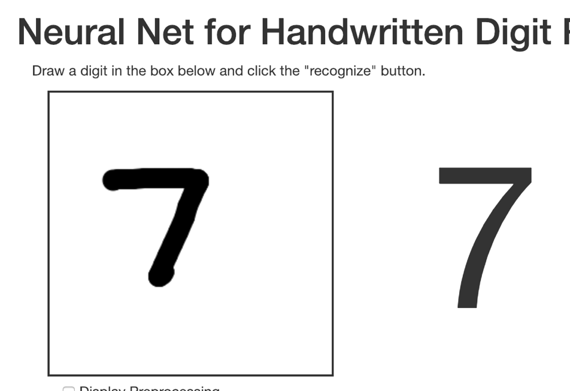
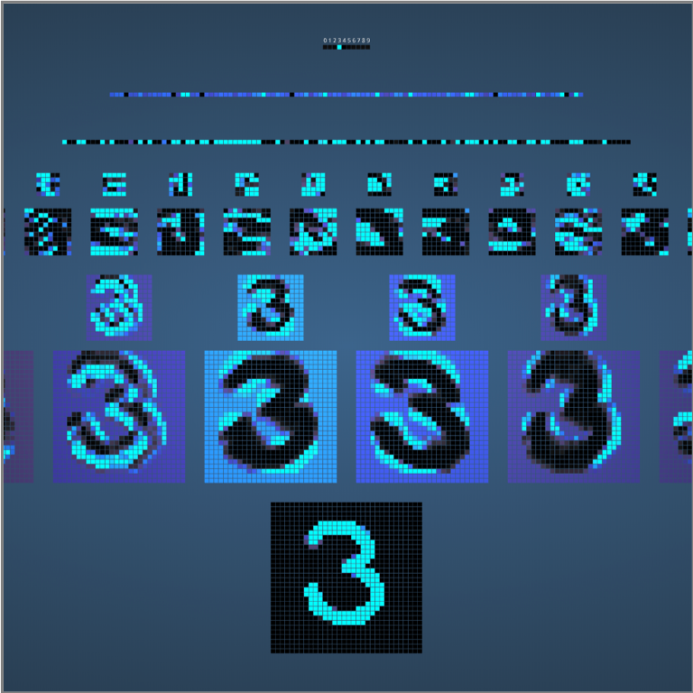

## Transfer Learning Analogy: Brain Surgeon

 * Let us say you need an expert in a certain field:
   - Say you need someone who knows brain surgery!
   - And let's say that there are no brain surgeons to be found!
   - What to do?

 * Well, you could start studying brain surgery!
   - But that would take some time.
   - A LOT of time!
   - YEARS of time!

---

## Transfer Learning Analogy: Brain Surgeon

 * OR, you could try to find someone else
   - Maybe an expert in, say some other type of surgery.
   - Say heart surgery.

 * Will the heart surgeon be able to perform brain surgery?
   - Not right away.
   - But she probably would be better off than you would be!
   - And if she studied brain surgery, she could learn it quickly.
   - Because she knows a lot about surgery in general.

Notes:

---
## Training the Model

 * Rosenblatt's original algorithm for training was simple:

     - Iterate through weights and look at the output error

     - Adjust weights until output error was zero.

     - Will converge only if the outputs are linearly separable.

 * The Problem:

     - This kind of "brute force" method will take too long to train.

Notes:

---
## Calculating the Error

 * When we randomly initialize the weights, our first pass outputs of our network will almost certainly be wrong!

     - We have training data, so we know the "right" answer

 * How do we calculate how wrong we are?

 * We consider this the  **Error** or **Loss** .  But what is the error?

 * The error is the  **distance**  between the training output vector and the current output.

 * But what is the meaning of  **distance** ?

     - Simplest: Euclidean distance, the distance in Euclidean space.

     - But this is not what we usually use.

     - For classification, we normally use  **cross entropy** to calculate loss.

Notes:

---
## Gradient Descent

 * We want to optimize our model so error is  **minimized**

 * Gradient Descent is a common optimization algorithm.

 * Imagine a snowboarder going down the slope of a mountain

     - The snowboarder descends because the slope is steep.

     - Descent slows as she approaches the bottom, because the slope is less.

     - At the bottom of the hill, the slope is zero, so the snowboarder stops. This is the minimum.

     -  There may, however, be parts of the run with a zero slope that are NOT the bottom (local minima).  

Notes:

---
## Backpropagation

 * We can complete our training by backpropagating the errors to the hidden nodes and continuing to use gradient descent to optimize.

 * This means that we take the errors output, and simply adjust the weights in the network to account for the errors.

Notes:

---

## Use Case 3: Staples

- [Staples](https://www.staples.com) relies on organic search traffic to drive sales

- One way the ways to score high on search engine results is put meaningful ALT tags for each product images

- Doing it manually was an expensive proposition

- They use  [Clarify](https://www.clarifai.com/) to automatically tag images

- [Link](https://clarifai.com/customers/staples)

 &nbsp; &nbsp; <!-- {"left" : 1.48, "top" : 5.39, "height" : 0.58, "width" : 2.93} --><!-- {"left" : 5.84, "top" : 5.38, "height" : 0.62, "width" : 2.93} -->

Notes:  
- https://clarifai.com/customers/staples

---

## Demo: Digit Recognition

- Simple NN to recognize hand-written digits

<!-- {"left" : 2.2, "top" : 1.97, "height" : 4.02, "width" : 5.85} -->

[Link](http://myselph.de/neuralNet.html)

Notes:

http://myselph.de/neuralNet.html

---

## Demo: Digit Recognition 2

- Cool visualization of signal path through NN

<!-- {"left" : 2.93, "top" : 2.34, "height" : 4.39, "width" : 4.39} -->

[Link](http://scs.ryerson.ca/~aharley/vis/conv/flat.html)

Notes:  
http://scs.ryerson.ca/~aharley/vis/conv/flat.html
