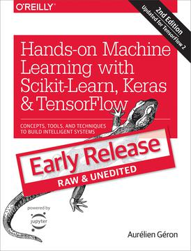
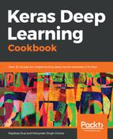
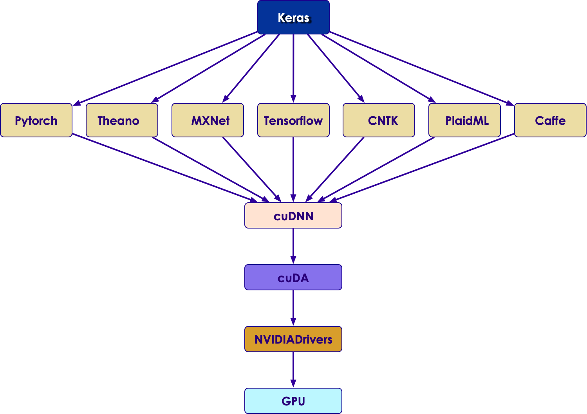
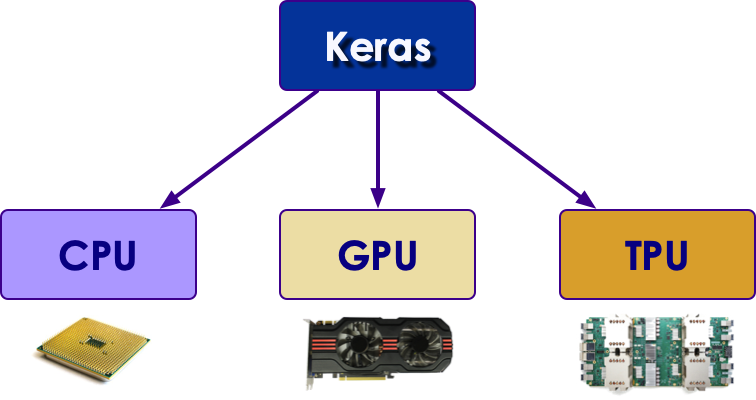
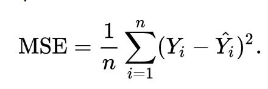
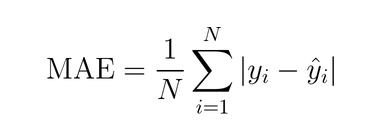
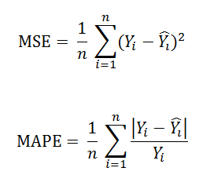
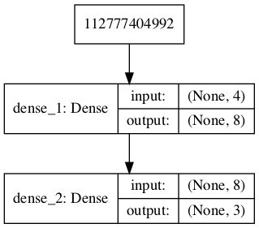
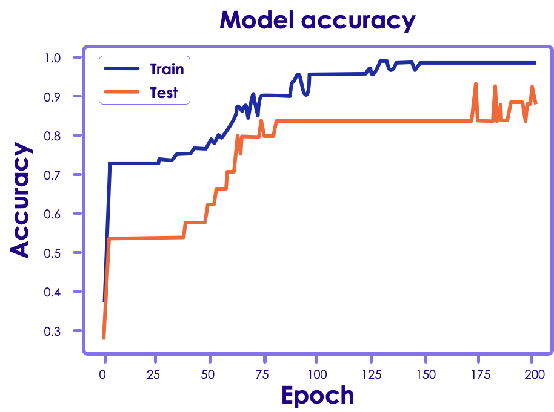
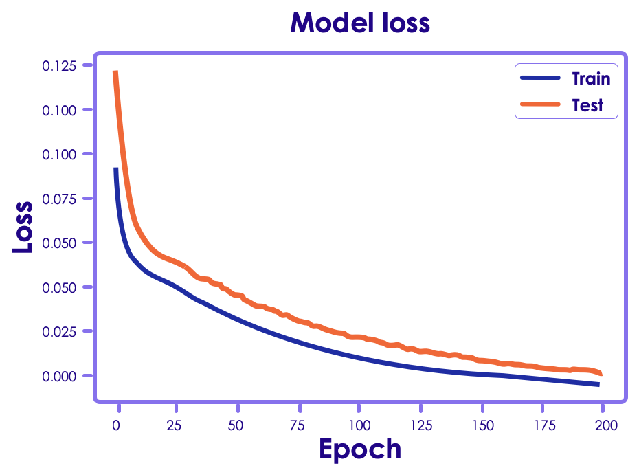

# Introduction to Keras

<!-- {"left" : 4.97, "top" : 8.21, "height" : 0.71, "width" : 2.45} -->


---

## Lesson Objectives

  * Understand Keras framework

  * Understand how Keras works with Deep Learning frameworks

Notes:  

---

## Resources

  * [Hands-on Machine Learning with Scikit-Learn, Keras, and TensorFlow, 2nd Edition (https://learning.oreilly.com/library/view/hands-on-machine-learning/9781492032632/)by Aurélien Géron (ISBN: 9781492032649)

  * [Practical Deep Learning for Cloud and Mobile](https://learning.oreilly.com/library/view/practical-deep-learning/9781492034858/) by Meher Kasam, Siddha Ganju, Anirudh Koul (ISBN: 9781492034841)


<!-- {"left" : 2.62, "top" : 4.41, "height" : 2.93, "width" : 2.23} --> &nbsp;&nbsp; <!-- {"left" : 5.39, "top" : 4.41, "height" : 2.93, "width" : 2.23} -->

---

## Resources

  * [Keras Deep Learning Cookbook](https://learning.oreilly.com/library/view/keras-deep-learning/9781788621755/)by Manpreet Singh Ghotra, Rajdeep Dua (ISBN: 9781788621755)

  * [Learn Keras for Deep Neural Networks:A Fast-Track Approach to Modern Deep Learning with Python](https://learning.oreilly.com/library/view/learn-keras-for/9781484242407/)by Jojo Moolayil (ISBN : 9781484242407)very good book that explains concepts pretty well

 &nbsp;&nbsp; <!-- {"left" : 2.66, "top" : 4.69, "height" : 3.03, "width" : 2.48} --><!-- {"left" : 5.59, "top" : 4.69, "height" : 3.03, "width" : 2} -->
---
## Resources

  * [Deep Learning with Keras : Implement various deep-learning algorithms in Keras and see how deep-learning can be used in games](https://learning.oreilly.com/library/view/deep-learning-with/9781787128422/)by Sujit Pal, Antonio Gulli (ISBN: 9781787128422)

  * [Safari books online, Keras books](https://learning.oreilly.com/topics/keras)

<!-- {"left" : 3.99, "top" : 3.9, "height" : 3.44, "width" : 2.26} -->

---

# Part 1 - Keras Intro

---

## Keras


* Keras ([Keras.io](https://keras.io/)) - is a high level neural networks API
* Written in Python
* Works with [Tensorflow](https://github.com/tensorflow/tensorflow)(from Google), [CNTK](https://github.com/Microsoft/cntk)(from Microsoft) and [Theano](https://github.com/Theano/Theano)

<!-- {"left" : 2.2, "top" : 3.57, "height" : 4.13, "width" : 5.85} -->


Notes:  
NVIDIA - leading GPU vendor - provides CUDA (Compute Unified Device Architecture) and cuDNN (CUDA Deep Neural Network)

---

## Keras Features

<!-- {"left" : 5.96, "top" : 2.11, "height" : 2.15, "width" : 4.08} -->

* Write high level code
    - easier to write
    - faster to experiment

* Can support multiple back-ends

* Runs seamlessly on CPU and GPU

* [Wins Machine Learning competitions](https://www.quora.com/Why-has-Keras-been-so-successful-lately-at-Kaggle-competitions)


Notes:
https://www.quora.com/Why-has-Keras-been-so-successful-lately-at-Kaggle-competitions

---

## Keras Guiding Principles

<!-- {"left" : 6.67, "top" : 1.28, "height" : 2.35, "width" : 3.14} -->

 * **User Friendliness**  
   - Offers consistent, simple APIs

 * **Modularity**  
   - Combine various modules, like Legos&reg;

 * **Easy Extensibility**  
   - Add new modules easily

 * **Works 100% in Python**  
   - No other libraries needed

 * ___"Keras is designed for human beings, not machines"___

---

## Keras Comparison

Here is a quick comparison of writing [MNIST](https://en.wikipedia.org/wiki/MNIST_database) digits classification code in Keras and Tensorflow

| Library    | Line Count | Character Count  (no spaces) | Avg. character  count per line |
|------------|------------|------------------------------|--------------------------------|
| Tensorflow | 31         | 2162                         | 70                             |
| Keras      | 22         | 1018                         | 46                             |

<!-- {"left" : 0.25, "top" : 2.08, "height" : 1.69, "width" : 9.75} -->


* As we can see, Keras is almost 50% more compact.

<small>source: [Practical Deep Learning for Cloud and Mobile](https://learning.oreilly.com/library/view/practical-deep-learning/9781492034858/) Ch. 2</small>
---

## Deep Learning Libraries Popularity

* These stats stats are from Github

| Library                       | Stars | Contributors |
|-------------------------------|-------|--------------|
| tensorflow/tensorflow         | 92150 |     1357     |
| fchollet/keras                | 26744 |      638     |
| BVLC/caffe                    | 23159 |      264     |
| Microsoft/CNTK                | 13995 |      173     |
| dmlc/mxnet                    | 13318 |      492     |
| pytorch/pytorch               | 12835 |      414     |
| deeplearning4j/deeplearning4j | 8472  |      140     |
| caffe2/caffe2                 | 7540  |      176     |

<!-- {"left" : 0.25, "top" : 1.96, "height" : 4.69, "width" : 9.75} -->

Notes:  
Source: 'Practical Deep Learning for Cloud and Mobile' (ISBN : 9781492034841), Ch 2

---

## Keras Version History

| Date     | Release | Features        |
|----------|---------|-----------------|
| 2015 May | v 0.1   | Initial Release |
| 2018 Oct | v 2.2   | Current v2      |

<!-- {"left" : 0.25, "top" : 1.87, "height" : 1.5, "width" : 9.75} -->

Notes:  
https://github.com/keras-team/keras/releases

---

## Parallelizing Keras

  * These days, we need to train our models on huge amount of data.  
    - This takes enormous amount of compute power; A single machine won't be able to handle this.Need to scale

  * Parallelizing Keras
    - Run on multiple GPUs (on a single machine)
    - Run on[multiple GPUs on Google Cloud cluster](https://cloud.google.com/solutions/running-distributed-tensorflow-on-compute-engine) using distributed Tensorflow
    - Use [dist keras](https://github.com/cerndb/dist-keras) on Spark engine

<!-- {"left" : 1.66, "top" : 5.73, "height" : 2.94, "width" : 6.94} -->


---

## Keras and Other DL Frameworks

* Isn't Keras a wrapper for other DL frameworks?
   - Nope, this is a common (but understandable) misconception.
   - Keras is an API standard for defining and training machine learning models.
   - Keras uses back-end engines (like Tensorflow) for execution
   - Keras is not tied to a specific implementation

* But wait, isn't Tensorflow the most popular framework?

* Newsflash!:
[Tensorflow 2.0 is standardizing on Keras](https://medium.com/tensorflow/standardizing-on-keras-guidance-on-high-level-apis-in-tensorflow-2-0-bad2b04c819a)

Notes:
https://medium.com/tensorflow/standardizing-on-keras-guidance-on-high-level-apis-in-tensorflow-2-0-bad2b04c819a

---

## Keras and Tensorflow (2.0)

* Tensorflow includes a full implementation of Keras API in [tf.keras](https://www.tensorflow.org/guide/keras) package
    - This is different from [Keras.io](http://www.keras.io/)

* What is the difference between TensorFlow built-in Keras, and the Keras version at keras.io?
    - _tf.keras_ implementation has TensorFlow specific enhancements
    - [Eager execution](https://www.tensorflow.org/guide/eager) for fast execution
    - Distributed training
    - Support for TPU

Notes:
https://medium.com/tensorflow/standardizing-on-keras-guidance-on-high-level-apis-in-tensorflow-2-0-bad2b04c819a


---

## Model Zoos

  * A model zoo is a place wheres open-source models are shared so others can use them
    - started with Caffe framework

  * Training a deep learning model from scratch on a multi-million-image database requires weeks of training time and lots of computational energy, making it a difficult task

  * Organizations that participated in the ImageNet competition open-sourced their trained models on Caffe's website

  * Models can be trained for
    - specific task (image recognition,  text analytics)
    - specific framework (Keras, Caffe)

---

## Model Zoos in Keras

ImageNet trained models

| Model               | Size  | Top 1 Accuracy | Top 5 Accuracy | Parameters  | Depth |
|---------------------|-------|----------------|----------------|-------------|-------|
| Inception-ResNet-V2 | 215MB | 0.804          | 0.953          | 55,873,736  | 572   |
| Xception            | 88MB  | 0.79           | 0.945          | 22,910,480  | 126   |
| Inception-V3        | 92MB  | 0.788          | 0.944          | 23,851,784  | 159   |
| DenseNet-201        | 80MB  | 0.77           | 0.933          | 20,242,984  | 201   |
| ResNet-50           | 99MB  | 0.759          | 0.929          | 25,636,712  | 168   |
| DenseNet-169        | 57MB  | 0.759          | 0.928          | 14,307,880  | 169   |
| DenseNet-121        | 33MB  | 0.745          | 0.918          | 8,062,504   | 121   |
| VGG-19              | 549MB | 0.727          | 0.91           | 143,667,240 | 26    |
| VGG-16              | 528MB | 0.715          | 0.901          | 138,357,544 | 23    |
| MobileNet           | 17MB  | 0.665          | 0.871          | 4,253,864   | 88    |

<!-- {"left" : 0.15, "top" : 1.87, "height" : 5.86, "width" : 9.95, "columnwidth" : [1.66, 1.66, 1.66, 1.66, 1.66, 1.66 ]} -->

<small>

Source : [Practical Deep Learning for Cloud and Mobile](https://learning.oreilly.com/library/view/practical-deep-learning/9781492034858/ch01.html#image_classification_with_keras), Ch 2
</small>

Notes:
Source : [Practical Deep Learning for Cloud and Mobile](https://learning.oreilly.com/library/view/practical-deep-learning/9781492034858/ch01.html#image_classification_with_keras), Ch 2---


---

# Getting Keras Up and Running

---

## Installing Keras

 * Before installing Keras, need to install a back-end engine.

 * **With Tensorflow (Default Keras Engine)**

```bash
# if using Anaconda Python  (highly recommended)
$  conda install tensorflow
$  conda install keras
# if using vanilla Python
$  pip install tensorflow
$  pip install keras
```

* Testing configuration

```python
$  python
>>> import keras
Using TensorFlow backend.
>>> keras.__version__
'2.2.4'
```
<!-- {"left" : 0, "top" : 4.73, "height" : 1.6, "width" : 4.94} -->

---

## Configuring Keras Back-end

  * Linux / Mac :  `$HOME/.keras/keras.json`  
  * Windows : `%USERPROFILE%/.keras/keras.json`
```json
{
    "image_data_format": "channels_last",
    "epsilon": 1e-07,
    "floatx": "float32",
    "backend": "tensorflow"
}
```
<!-- {"left" : 0, "top" : 2.25, "height" : 2.13, "width" : 8.7} -->


---

## Configuring Keras Back-end

  * Change the `backend` to "theano", "tensorflow", or "cntk"
  * Overwrite the config file by defining an environment variable `KERAS_BACKEND`

```bash
$  KERAS_BACKEND=tensorflow python -c "from keras import backend"

>  "Using TensorFlow backend."
```
<!-- {"left" : 0, "top" : 2.87, "height" : 0.94, "width" : 10.25} -->

---

## Keras Config Explained

```json
{
    "image_data_format": "channels_last",
    "epsilon": 1e-07,
    "floatx": "float32",
    "backend": "tensorflow"
}
```
<!-- {"left" : 0, "top" : 1.24, "height" : 2.08, "width" : 8.51} -->

<br/>

  * **image_data_format:**  
    - It specifies which data format convention Keras will follow. (keras.backend.image_data_format() returns it.)  
    - For 2D data (e.g. image), "channels_last" assumes (rows, cols, channels) while "channels_first" assumes (channels, rows, cols).
    - For 3D data, "channels_last" assumes (conv_dim1, conv_dim2, conv_dim3, channels) while "channels_first" assumes (channels, conv_dim1, conv_dim2, conv_dim3).
    - Values: "channels_last" or "channels_first".

---

## Keras Config Explained

```json
{
    "image_data_format": "channels_last",
    "epsilon": 1e-07,
    "floatx": "float32",
    "backend": "tensorflow"
}
```
<!-- {"left" : 0, "top" : 1.12, "height" : 1.88, "width" : 7.68} -->

<br/>

  * **epsilon:**
    - A numeric fuzzing constant used to avoid dividing by zero in some operations.

  * **floatx:**
    - Default float precision.
    - Values: "float16", "float32", or "float64".

  * **backend:**
    - Values: "tensorflow", "theano", or "cntk".


---

# Part 2 : Keras API

---

## Keras Abstractions

  * **Layer**
    - In DNN Layer is a group of neurons.
    - Keras provides many layers (more on this soon)

  * **Model**
    - Model is a collection of Layers
    - Keras has two kinds of models - Sequential and Functional

  * **Loss Functions**
    - Help network calculate the errors

  * **Optimizer**
    - Helps with training

---

## Keras Layers

  * Core layers
    - Dense
    - Dropout
  * Convolutional Layer
  * Pooling Layer
  * Recurrent Layer
  * Embedding Layer
  * Merge Layer

  * Layers are defined in **`keras.layers`** package.

  * We are only going to look at few layers here.  
  * Refer to [Keras.io](keras.io) for complete details.

---
## Keras Core Layers: Dense

  * A dense layer connects every neuron in this layer to every neuron in previous layer.

  * If Layer 1 has 3 neurons and Layer 2 (dense layer) has 4 neurons, the total number of connections between Layer 1 and Layer 2 would be 12 (3 × 4)

  * First layer need to know the input dimensions

<!-- {"left" : 2.99, "top" : 4.17, "height" : 4.12, "width" : 4.26} -->


---
## Keras Core Layers: Dense

```python
## API
keras.layers.Dense(
    units,   # number of neurons
    activation=None, # default is linear : f(x)=x
    use_bias=True,
    kernel_initializer='glorot_uniform',
    bias_initializer='zeros',
    kernel_regularizer=None,
    bias_regularizer=None,
    activity_regularizer=None,
    kernel_constraint=None,
    bias_constraint=None)

```
<!-- {"left" : 0, "top" : 1.17, "height" : 3.64, "width" : 10.25} -->


```python
## Usage 

from keras.layers import Dense

# has 32 neurons
# Takes input array of shape [*,16]
# output array shape [*,32]
d = Dense(32, input_shape=(16,)))
```
<!-- {"left" : 0, "top" : 5.07, "height" : 2.35, "width" : 8.34} -->

---

## Keras Core Layers: Dropout

  * The dropout layer in DL helps reduce overfitting by introducing regularization and generalization

  * The dropout layer drops out a few neurons or sets them to 0 and reduces computation in the training process.

```python
## API 

keras.layers.Dropout(rate, noise_shape=None, seed=None)
```
<!-- {"left" : 0, "top" : 3.16, "height" : 1.19, "width" : 10.25} -->


```python
## Usage 

from keras.layers import Dropout

d = Dropout(rate = 0.1,seed=100)
```
<!-- {"left" : 0, "top" : 4.74, "height" : 1.74, "width" : 6.11} -->

---
## Keras Optimizers

  * We can specify the optimizers by 'name' or initialize the respective classes for customization

  * Choice of optimizers
    - SGD : Stochastic Gradient Descent Optimizer
    - Momentum / Nesterov
    - Adagrad
    - RMSProp
    - Adam

---

## Optimizer: SGD

```python

# Use default values
model.compile(optimizer='sgd', loss='mean_squared_error')

# ~~~~~~~~~

# or Customize 
from keras.optimizers import SGD
sgd = SGD(lr=0.01,
          decay=1e-6,
          momentum=0.9,
          nesterov=True)  # using Nestrov momentum
model.compile(optimizer=sgd, loss='mean_squared_error')

```
<!-- {"left" : 0, "top" : 1.01, "height" : 2.39, "width" : 10.25} -->

<br/>

  * Arguments
    - `lr`: float >= 0. Learning rate.
    - `momentum`: float >= 0. Parameter that accelerates SGD in the relevant direction and dampens oscillations.
    - `decay`: float >= 0. Learning rate decay over each update.
    - `nesterov`: boolean. Whether to apply Nesterov momentum.

---

## Optimizer: Adagrad

```python
# use defaut args 
model.compile(optimizer='adagrad', ...)

# ~~~~~~~~~

# or Customize 
from keras.optimizers import Adagrad
adagrad = keras.optimizers.Adagrad(lr=0.01,
                                   epsilon=None,
                                   decay=0.0)
model.compile(optimizer=adagrad, ...)

```
<!-- {"left" : 0, "top" : 1.14, "height" : 2.39, "width" : 7.37} -->

<br/>

  * Arguments
    - `lr`: float >= 0. Initial learning rate.
    - `epsilon`: float >= 0. If None, defaults to K.epsilon().
    - `decay`: float >= 0. Learning rate decay over each update.


---

## Optimizer: RMSProp

```python
# use default values
model.compile(optimizer='rmsprop', ...)

# ~~~~~~~~~

# or customize
from keras.optimizers import RMSprop
rmsprop = keras.optimizers.RMSprop(lr=0.001,
                                   rho=0.9,
                                   epsilon=None,
                                   decay=0.0)
model.compile(optimizer=rmsprop, ...)

```
<!-- {"left" : 0, "top" : 1.11, "height" : 2.82, "width" : 6.55} -->

<br/>

  * Arguments
    - `lr`: float >= 0. Learning rate.
    - `rho`: float >= 0.
    - `epsilon`: float >= 0. Fuzz factor. If None, defaults to K.epsilon().
    - `decay`: float >= 0. Learning rate decay over each update.

---

## Optimizer: Adam

```python
# use default values
model.compile(optimizer='adam', ...)

# or customize
from keras.optimizers import Adam
adam = keras.optimizers.Adam(lr=0.001,
                             beta_1=0.9,
                             beta_2=0.999,
                             epsilon=None,
                             decay=0.0,
                             amsgrad=False)
model.compile(optimizer=adam, ...)

                             
```

<!-- {"left" : 0, "top" : 1.35, "height" : 3.78, "width" : 7.94} -->

---

## Optimizer: Adam

  * Arguments
    - `lr`: float >= 0. Learning rate.
    - `beta_1`: float, 0 < beta < 1. Generally close to 1.
    - `beta_2`: float, 0 < beta < 1. Generally close to 1.
    - `epsilon`: float >= 0. Fuzz factor. If None, defaults to K.epsilon().
    - `decay`: float >= 0. Learning rate decay over each update.
    - `amsgrad`: boolean. Whether to apply the AMSGrad variant of this algorithm from the paper "On the Convergence of Adam and Beyond".


---

## Keras Loss Functions

  * We will look at a few popular Loss functions.  
  * For full list see [Keras documentation](https://keras.io/losses/#available-loss-functions).

  * Loss functions are defined in [keras.losses](https://keras.io/losses) package

  * For Regressions:
    - Mean Squared Error
    - Mean Absolute Error
    - Mean Squared Logarithmic Error

  * For Classifications:
    - Categorical Cross-entropy
    - Binary Cross-entropy

---

## Loss Functions (Regressions)

  * **Mean Squared Error**

```python
    keras.losses.mean_squared_error(y_true, y_pred)
```
<!-- {"left" : 0, "top" : 1.71, "height" : 0.54, "width" : 8.61} -->

<!-- {"left" : 3.11, "top" : 2.56, "height" : 1.34, "width" : 4.03} -->

  *  **Mean Absolute Error**

```python
    keras.losses.mean_absolute_error(y_true, y_pred)
```
<!-- {"left" : 0, "top" : 4.89, "height" : 0.54, "width" : 8.78} -->

<!-- {"left" : 2.57, "top" : 5.55, "height" : 1.71, "width" : 5.1} -->

---

## Loss Functions (Regressions)

  * **MAPE - Mean absolute percentage error**

```python
keras.losses.mean_absolute_percentage_error
```
<!-- {"left" : 0, "top" : 1.65, "height" : 0.54, "width" : 7.94} -->

<!-- {"left" : 3.78, "top" : 2.52, "height" : 2.47, "width" : 2.69} -->

  * **MSLE - Mean square logarithmic error**

```python
keras.losses.mean_squared_logarithmic_error
```
<!-- {"left" : 0, "top" : 5.92, "height" : 0.54, "width" : 7.94} -->

---

## Loss Functions  (Categorical)

  *  **Binary Cross-entropy**
    - Used when outcome is binary (yes/now,  0/1)

```
Loss = − [ y * log(p) + (1−y) * log(1−p) ]
```
<!-- {"left" : 0, "top" : 1.91, "height" : 0.43, "width" : 6.26} -->

```python
keras.losses.binary_crossentropy(y_true, y_pred)
```
<!-- {"left" : 0, "top" : 2.43, "height" : 0.45, "width" : 7.29} -->

  * **Categorical Cross-entropy**
    - Used for multi-class classifications (class-1, class-2, class-3  ..etc)

```python
keras.losses.categorical_crossentropy(y_true, y_pred)
```
<!-- {"left" : 0, "top" : 4.55, "height" : 0.54, "width" : 9.61} -->

<!-- {"left" : 3.18, "top" : 5.73, "height" : 1.32, "width" : 3.9} -->


---
# Keras Models
---

## Keras Models Intro

  * Models are defined in `keras.models` package

```python
from keras.models import Model
from keras.layers import Input, Dense

a = Input(shape=(32,))
b = Dense(32)(a)
model = Model(inputs=a, outputs=b)
```
<!-- {"left" : 0, "top" : 1.65, "height" : 2.5, "width" : 9.32} -->

---

## Model Methods

Keras models have the following methods

| Method             | Description                                              |
|--------------------|----------------------------------------------------------|
| `fit`              | Trains the model                                         |
| `evaluate`         | Computes model accuracy for test                         |
| `predict`          | Generates predictions for inputs                         |
| `train_on_batch`   | Runs a single gradient update on a single batch of data. |
| `test_on_batch`    | Test the model on a single batch of samples              |
| `predict_on_batch` | predictions for a single batch of samples                |

<!-- {"left" : 0.25, "top" : 1.88, "height" : 3.88, "width" : 9.75} -->

---

## Keras workflow

Here is a typical Keras workflow.  This is pretty common workflow for most neural networks

<!-- {"left" : 4.15, "top" : 2.46, "height" : 4.73, "width" : 1.95} -->


---
## Compile method

```python
compile(optimizer,
        loss=None,
        metrics=None,
        loss_weights=None,
        sample_weight_mode=None,
        weighted_metrics=None,
        target_tensors=None)
```
<!-- {"left" : 0, "top" : 1.11, "height" : 2.23, "width" : 5.87} -->

<br/>

  * Arguments
    - **optimzer:** optimizer name ('adam', 'sgd') or optimizer instance
    - **loss:** loss function name or instance
    - **metrics:** metrics to evaluate during training/testing  
      `metrics = ['accuracy']`

---

## Fit method

```python
fit(x=None, y=None,
    batch_size=None, epochs=1,
    verbose=1, callbacks=None,
    validation_split=0.0, validation_data=None,
    shuffle=True, class_weight=None,
    sample_weight=None, initial_epoch=0,
    steps_per_epoch=None, validation_steps=None, validation_freq=1)
```
<!-- {"left" : 0, "top" : 1.66, "height" : 1.82, "width" : 10.25} -->


---

## Fit method

  * This method does training

  * Arguments
    - x : training input data (numpy array or list of numpy arrays)
    - y : training target data (numpy array)
    - batch_size: integer, usually powers of two (default = 32)
    - epochs: integer, how many times to go through data
    - verbose: 0 or 1 or 2  (0 = silent, 1 = progress bar, 2 = one line per epoch)

---

## Evaluate

- Measures performance metrics (loss values) for testing data

```python
evaluate(x=None, y=None,
         batch_size=None, verbose=1,
         sample_weight=None, steps=None, callbacks=None)
```
<!-- {"left" : 0, "top" : 2.02, "height" : 1.07, "width" : 10.25} -->

<br/>

  * Arguments
    - x: test data inputs (numpy array(s) )
    - y: test data labels (numpy array(s) )
    - batch_size: integer, usually powers of two (default = 32)
    - verbose: 0 or 1. Verbosity mode. 0 = silent, 1 = progress bar.

---

## Predict

```python
predictions = predict(x, batch_size=None,
                      verbose=0, steps=None, callbacks=None)
```
<!-- {"left" : 0, "top" : 1.43, "height" : 0.82, "width" : 10.25} -->

<br/>

  * Arguments
    - x: The input data, as a Numpy array (or list of Numpy arrays if the model has multiple inputs).
    - batch_size: Integer. If unspecified, it will default to 32.
    - verbose: Verbosity mode, 0 or 1.

---

# Defining a Keras Sequential Model

---

## Keras Sequential Model

Here is the overall workflow for creating a Sequential model:

1. Import the sequential class from **`keras.models`**

2. Stack layers using the **`.add()`** method

3. Configure the learning process using the **`compile()`** method

4. Import the data

5. Train the model on the train dataset using the **`.fit()`** method

---

## Creating a Keras Sequential Model

  * Let's create a simple model that will classify the classic IRIS dataset

  * IRIS is a very simple dataset that has
    - 4 inputs (a,b,c,d),
    - and 3 output classes `label` (1,2,3)

| a   | b   | c   | d   | label |
|-----|-----|-----|-----|-------|
| 6.4 | 2.8 | 5.6 | 2.2 | 3     |
| 5.0 | 2.3 | 3.3 | 1.0 | 2     |
| 4.9 | 3.1 | 1.5 | 0.1 | 1     |

<!-- {"left" : 0.25, "top" : 3.82, "height" : 2, "width" : 9.75} -->

---

## Keras Sequential Model for Classifying IRIS

- We will have 2 dense layers
    - First layer will have 8 neurons, with 'ReLU' activation
    - Second layer will have 3 neurons with 'SoftMax' activation

<!-- {"left" : 1.33, "top" : 3.4, "height" : 4.71, "width" : 7.6} -->


---

## Keras Sequential Model for Classifying IRIS

   **Step 1: Define Model**

<!-- {"left" : 7.7, "top" : 4.26, "height" : 3.89, "width" : 1.6} -->

```python
# shorter form
from keras.models import Sequential
from keras.layers import Dense

model = new Sequential()
model.add(Dense(8, input_dim=4, activation='relu'))
model.add(Dense(3, activation='softmax'))
```
<!-- {"left" : 0, "top" : 1.69, "height" : 2.13, "width" : 9.28} -->


<!-- {"left" : 0.63, "top" : 4.59, "height" : 3.55, "width" : 5.72} -->


---

## Keras Sequential Model for Classifying IRIS

 **Step 2: Compile the Model**

<!-- {"left" : 8.08, "top" : 3.7, "height" : 4.19, "width" : 1.73} -->

```python
model.compile( optimizer = 'adam',
               loss = 'categorical_crossentropy',
               metrics = ['accuracy'] )
```
<!-- {"left" : 0, "top" : 1.77, "height" : 1.07, "width" : 8.94} -->
  * Parameters explained:
    - Optimizer: one of 'adam', 'sgd', 'rmsprop'
    - loss function: how to measure the loss/error  (regression / classification)
    - metrics: what metrics to optimize for

---

## Keras Sequential Model for Classifying IRIS

**Step 3: Fit Model to Data (or Training)**

  * Training might take a while depending on amount of data and model.

```python
## without validation
history = model.fit(train_X, train_y, epochs = 100, batch_size = 2**4)

## with validation
history = model.fit(train_X, train_y, epochs = 100, batch_size = 2**4,
validation_split=0.25)
```
<!-- {"left" : 0, "top" : 2.51, "height" : 1.41, "width" : 9.41} -->

<!-- {"left" : 4.29, "top" : 4.34, "height" : 4.06, "width" : 1.67} -->


---

## Keras Sequential Model for Classifying IRIS

**Step 4: Evaluate network**
  * For this we will use test dataset.

<!-- {"left" : 4.29, "top" : 4.34, "height" : 4.06, "width" : 1.67} -->

```python
scores = model.evaluate(test_X, test_y)
print("\n%s: %.2f%%" % (model.metrics_names[1], scores[1]*100))

>> acc = 96%
```
<!-- {"left" : 0, "top" : 2.51, "height" : 1.17, "width" : 9.89} -->

---
## Keras Sequential Model for Classifying IRIS

**Step 4.5: Evaluate network**
  * We will visualize the training progress

<!-- {"left" : 4.24, "top" : 3.19, "height" : 4.29, "width" : 1.76} -->


---

## Keras Visualizations

  * In Keras we can visualize **models** and **training history**

  * Models  are visualized using python plot library **graphviz**

  * Training history can be visualized using python **matplotlib** or **Tensorboard**

---

## Visualizing a Model

```python
from keras.utils import plot_model

(plot_model(model, to_file='model.png',
           # following are optional parameters
           # with their default values
               show_shapes=False, # output shapes are shown?
               show_layer_names=True, # layer names are shown?
               expand_nested=False, # expand nested models into clusters?
               dpi=96  # image dpi
           ))
# to display this in Jupyter notebook
from IPython.display import Image
Image("model_plot.png")
```
<!-- {"left" : 0, "top" : 1.15, "height" : 2.94, "width" : 10.25} -->

<!-- {"left" : 3.66, "top" : 4.86, "height" : 2.58, "width" : 2.93} -->


---

## Visualizing Training History 1

  * The `fit()` method on a Keras Model returns a `History` object.

  * The `History.history` attribute is a dictionary recording training loss values and metrics values at successive epochs,

  * Also records  validation loss values and validation metrics values (if applicable).

```python
history = (model.fit(x, y,
                     validation_split=0.25, epochs=50,
                     batch_size=16, verbose=1))

```
<!-- {"left" : 0, "top" : 3.88, "height" : 1.12, "width" : 10.25} -->


---
## Visualizing Training History 1 - Accuracy

```python
import matplotlib.pyplot as plt

 # Plot training & validation accuracy values
 plt.plot(history.history['acc'])
 if 'val_acc' in history.history:
     plt.plot(history.history['val_acc'])
 plt.title('Model accuracy')
 plt.ylabel('Accuracy')
 plt.xlabel('Epoch')
 plt.legend(['Train', 'Test'], loc='upper left')
 plt.show()
```
<!-- {"left" : 0, "top" : 1.11, "height" : 3.18, "width" : 8.78} -->

<!-- {"left" : 2.72, "top" : 4.76, "height" : 3.59, "width" : 4.82} -->


---

## Visualizing Training History 1 - Loss

```python
import matplotlib.pyplot as plt

# Plot training & validation loss values
plt.plot(history.history['loss'])
if 'val_loss' in history.history:
    plt.plot(history.history['val_loss'])
plt.title('Model loss')
plt.ylabel('Loss')
plt.xlabel('Epoch')
plt.legend(['Train', 'Test'], loc='upper left')
plt.show()

```
<!-- {"left" : 0, "top" : 1.11, "height" : 3.18, "width" : 8.61} -->

<!-- {"left" : 2.78, "top" : 4.77, "height" : 3.5, "width" : 4.69} -->


---
## Training Accuracy & Loss

<!-- {"left" : 2.96, "top" : 1.65, "height" : 3.22, "width" : 4.32} --><br clear="all;"/>
<!-- {"left" : 2.96, "top" : 5.24, "height" : 3.22, "width" : 4.32} -->


---

## Visualizing Training History With Tensorboard (3)

Use Keras callback for saving your training and test metrics, as well as activation histograms for the different layers in your model

```python
(keras.callbacks.TensorBoard(log_dir='./logs',
                            histogram_freq=0,
                            write_graph=True,
                            write_images=False) )
```
<br/>


- Saved data can then be visualized with Tensorboard


```bash
$   tensorboard --logdir=/full_path_to_your_logs
```

<br/>
- See next slide for a visualization.

---

## Keras and Tensorboard

<!-- {"left" : 1.51, "top" : 2.18, "height" : 5.28, "width" : 7.22} -->


---

## Lab

<!-- {"left" : 6.73, "top" : 2.04, "height" : 3.9, "width" : 2.93} -->

  * **Overview:**
     - KERAS-1: Simple Keras network to classify IRIS

  * **Depends on:**
     - None

  * **Runtime:**
     - 15 mins

  * **Instructions:**
     - Follow 'KERAS-1'

---

## Final Thoughts
