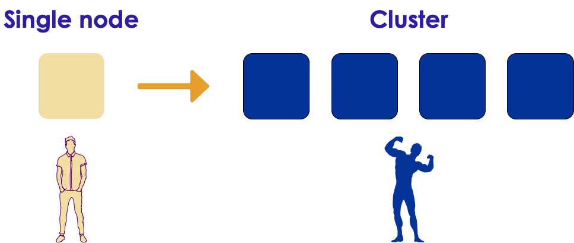

# Introduction to Keras

<!-- {"left" : 4.97, "top" : 8.21, "height" : 0.71, "width" : 2.45} -->


---

## Lesson Objectives

  * Understand Keras framework

  * Understand how Keras works with Deep Learning frameworks

  * Resources: See appendix

Notes:  

---


# Keras Intro

---

## Keras


* Keras ([Keras.io](https://keras.io/)) - is a high level neural networks API
* Written in Python
* Works with [Tensorflow](https://github.com/tensorflow/tensorflow)(from Google), [CNTK](https://github.com/Microsoft/cntk)(from Microsoft) and [Theano](https://github.com/Theano/Theano)

<!-- {"left" : 2.2, "top" : 3.57, "height" : 4.13, "width" : 5.85} -->


Notes:  
NVIDIA - leading GPU vendor - provides CUDA (Compute Unified Device Architecture) and cuDNN (CUDA Deep Neural Network)

---

## Keras Features

<!-- {"left" : 5.96, "top" : 2.11, "height" : 2.15, "width" : 4.08} -->

* Write high level code
    - easier to write
    - faster to experiment

* Can support multiple back-ends

* Runs seamlessly on CPU and GPU

* [Wins Machine Learning competitions](https://www.quora.com/Why-has-Keras-been-so-successful-lately-at-Kaggle-competitions)


Notes:
https://www.quora.com/Why-has-Keras-been-so-successful-lately-at-Kaggle-competitions

---

## Keras Guiding Principles

<!-- {"left" : 6.67, "top" : 1.28, "height" : 2.35, "width" : 3.14} -->

 * **User Friendliness**  
   - Offers consistent, simple APIs

 * **Modularity**  
   - Combine various modules, like Legos&reg;

 * **Easy Extensibility**  
   - Add new modules easily

 * **Works 100% in Python**  
   - No other libraries needed

 * ___"Keras is designed for human beings, not machines"___

---

## Keras Comparison

Here is a quick comparison of writing [MNIST](https://en.wikipedia.org/wiki/MNIST_database) digits classification code in Keras and Tensorflow

| Library    | Line Count | Character Count  (no spaces) | Avg. character  count per line |
|------------|------------|------------------------------|--------------------------------|
| Tensorflow | 31         | 2162                         | 70                             |
| Keras      | 22         | 1018                         | 46                             |

<!-- {"left" : 0.25, "top" : 2.08, "height" : 1.69, "width" : 9.75} -->


* As we can see, Keras is almost 50% more compact.

<small>source: [Practical Deep Learning for Cloud and Mobile](https://learning.oreilly.com/library/view/practical-deep-learning/9781492034858/) Ch. 2</small>
---

## Deep Learning Libraries Popularity

* These stats stats are from Github

| Library                       | Stars | Contributors |
|-------------------------------|-------|--------------|
| tensorflow/tensorflow         | 92150 |     1357     |
| fchollet/keras                | 26744 |      638     |
| BVLC/caffe                    | 23159 |      264     |
| Microsoft/CNTK                | 13995 |      173     |
| dmlc/mxnet                    | 13318 |      492     |
| pytorch/pytorch               | 12835 |      414     |
| deeplearning4j/deeplearning4j | 8472  |      140     |
| caffe2/caffe2                 | 7540  |      176     |

<!-- {"left" : 0.25, "top" : 1.96, "height" : 4.69, "width" : 9.75} -->

Notes:  
Source: 'Practical Deep Learning for Cloud and Mobile' (ISBN : 9781492034841), Ch 2

---

## Keras Version History

| Date     | Release | Features        |
|----------|---------|-----------------|
| 2015 May | v 0.1   | Initial Release |
| 2018 Oct | v 2.2   | Current v2      |

<!-- {"left" : 0.25, "top" : 1.87, "height" : 1.5, "width" : 9.75} -->

Notes:  
https://github.com/keras-team/keras/releases

---

## Parallelizing Keras

  * These days, we need to train our models on huge amount of data.  
    - This takes enormous amount of compute power; A single machine won't be able to handle this.Need to scale

  * Parallelizing Keras
    - Run on multiple GPUs (on a single machine)
    - Run on[multiple GPUs on Google Cloud cluster](https://cloud.google.com/solutions/running-distributed-tensorflow-on-compute-engine) using distributed Tensorflow
    - Use [dist keras](https://github.com/cerndb/dist-keras) on Spark engine

<!-- {"left" : 1.66, "top" : 5.73, "height" : 2.94, "width" : 6.94} -->


---

## Keras and Other DL Frameworks

* Isn't Keras a wrapper for other DL frameworks?
   - Nope, this is a common (but understandable) misconception.
   - Keras is an API standard for defining and training machine learning models.
   - Keras uses back-end engines (like Tensorflow) for execution
   - Keras is not tied to a specific implementation

* But wait, isn't Tensorflow the most popular framework?

* Newsflash!:
[Tensorflow 2.0 is standardizing on Keras](https://medium.com/tensorflow/standardizing-on-keras-guidance-on-high-level-apis-in-tensorflow-2-0-bad2b04c819a)

Notes:
https://medium.com/tensorflow/standardizing-on-keras-guidance-on-high-level-apis-in-tensorflow-2-0-bad2b04c819a

---

## Keras and Tensorflow (2.0)

* Tensorflow includes a full implementation of Keras API in [tf.keras](https://www.tensorflow.org/guide/keras) package
    - This is different from [Keras.io](http://www.keras.io/)

* What is the difference between TensorFlow built-in Keras, and the Keras version at keras.io?
    - _tf.keras_ implementation has TensorFlow specific enhancements
    - [Eager execution](https://www.tensorflow.org/guide/eager) for fast execution
    - Distributed training
    - Support for TPU

Notes:
https://medium.com/tensorflow/standardizing-on-keras-guidance-on-high-level-apis-in-tensorflow-2-0-bad2b04c819a


---

## Future of Keras

* From [keras.io](https://keras.io) project site...

* As of January 2020, current version is 2.2   
Next major (and final) release of Keras will be 2.3

* __`Multi-backend Keras`__ is superseded by __`tf.keras`__

* Users are encouraged to switch to __`tf.keras`__
    - It is better maintained
    - And supports TF2 better

*

---

## Keras Model Zoos

<!-- TODO shiva -->
<!-- {"left" : 5.49, "top" : 1.14, "height" : 4.61, "width" : 4.61} -->

  * A model zoo is a place wheres open-source models are shared so others can use them

  * Training a deep learning model from scratch on a multi-million-image database requires weeks of training time and lots of computational energy, making it a difficult task


  * Models can be trained for
    - specific task (image recognition,  text analytics)
    - specific framework (Keras, Caffe)

  * Popular Zoos
     - https://modelzoo.co/
     - https://github.com/albertomontesg/keras-model-zoo

---

## Model Zoos in Keras

ImageNet trained models

| Model               | Size  | Top 1 Accuracy | Top 5 Accuracy | Parameters  | Depth |
|---------------------|-------|----------------|----------------|-------------|-------|
| Inception-ResNet-V2 | 215MB | 0.804          | 0.953          | 55,873,736  | 572   |
| Xception            | 88MB  | 0.79           | 0.945          | 22,910,480  | 126   |
| Inception-V3        | 92MB  | 0.788          | 0.944          | 23,851,784  | 159   |
| DenseNet-201        | 80MB  | 0.77           | 0.933          | 20,242,984  | 201   |
| ResNet-50           | 99MB  | 0.759          | 0.929          | 25,636,712  | 168   |
| DenseNet-169        | 57MB  | 0.759          | 0.928          | 14,307,880  | 169   |
| DenseNet-121        | 33MB  | 0.745          | 0.918          | 8,062,504   | 121   |
| VGG-19              | 549MB | 0.727          | 0.91           | 143,667,240 | 26    |
| VGG-16              | 528MB | 0.715          | 0.901          | 138,357,544 | 23    |
| MobileNet           | 17MB  | 0.665          | 0.871          | 4,253,864   | 88    |

<!-- {"left" : 0.15, "top" : 1.87, "height" : 5.86, "width" : 9.95, "columnwidth" : [1.66, 1.66, 1.66, 1.66, 1.66, 1.66 ]} -->

<small>

Source : [Practical Deep Learning for Cloud and Mobile](https://learning.oreilly.com/library/view/practical-deep-learning/9781492034858/ch01.html#image_classification_with_keras), Ch 2
</small>

Notes:
Source : [Practical Deep Learning for Cloud and Mobile](https://learning.oreilly.com/library/view/practical-deep-learning/9781492034858/ch01.html#image_classification_with_keras), Ch 2---


---

# Getting Keras Up and Running

---

## Installing Keras

 * Before installing Keras, need to install a back-end engine.

 * With tensorflow v2 keras is included (tf.keras).  
 No need to install keras seperatly

```bash
# if using Anaconda Python
$  conda install tensorflow

# if using vanilla Python
$  pip install tensorflow
```

* Testing configuration

```python
$  python
>>> import tensorflow as tf
>>> from tensorflow import keras

>>> print(keras.__version__)
#   2.2.4-tf
```
<!-- {"left" : 0, "top" : 4.73, "height" : 1.6, "width" : 4.94} -->

---

## Configuring Keras Back-end

  * Linux / Mac:  `$HOME/.keras/keras.json`  
  * Windows: `%USERPROFILE%/.keras/keras.json`

```json
{
    "image_data_format": "channels_last",
    "epsilon": 1e-07,
    "floatx": "float32",
    "backend": "tensorflow"
}
```
<!-- {"left" : 0, "top" : 2.25, "height" : 2.13, "width" : 8.7} -->


---

## Configuring Keras Back-end

  * Change the `backend` to "theano", "tensorflow", or "cntk"
  * Overwrite the config file by defining an environment variable `KERAS_BACKEND`

```bash
$  KERAS_BACKEND=tensorflow python -c "from keras import backend"

>  "Using TensorFlow backend."
```
<!-- {"left" : 0, "top" : 2.87, "height" : 0.94, "width" : 10.25} -->

---

## Keras Config Explained

```json
{
    "image_data_format": "channels_last",
    "epsilon": 1e-07,
    "floatx": "float32",
    "backend": "tensorflow"
}
```
<!-- {"left" : 0, "top" : 1.37, "height" : 2.08, "width" : 8.51} -->

<br/>

  * **image_data_format:**  
    - It specifies which data format convention Keras will follow. (keras.backend.image_data_format() returns it.)  
    - For 2D data (e.g. image), "channels_last" assumes (rows, cols, channels) while "channels_first" assumes (channels, rows, cols).
    - For 3D data, "channels_last" assumes (conv_dim1, conv_dim2, conv_dim3, channels) while "channels_first" assumes (channels, conv_dim1, conv_dim2, conv_dim3).
    - Values: "channels_last" or "channels_first".

---

## Keras Config Explained

```json
{
    "image_data_format": "channels_last",
    "epsilon": 1e-07,
    "floatx": "float32",
    "backend": "tensorflow"
}
```
<!-- {"left" : 0, "top" : 1.12, "height" : 1.88, "width" : 7.68} -->

<br/>

  * **epsilon:**
    - A numeric fuzzing constant used to avoid dividing by zero in some operations.

  * **floatx:**
    - Default float precision.
    - Values: "float16", "float32", or "float64".

  * **backend:**
    - Values: "tensorflow", "theano", or "cntk".

---

# Resources

---

## Resources

  * [Hands-on Machine Learning with Scikit-Learn, Keras, and TensorFlow, 2nd Edition (https://learning.oreilly.com/library/view/hands-on-machine-learning/9781492032632/)by Aurélien Géron (ISBN: 9781492032649)

  * [Practical Deep Learning for Cloud and Mobile](https://learning.oreilly.com/library/view/practical-deep-learning/9781492034858/) by Meher Kasam, Siddha Ganju, Anirudh Koul (ISBN: 9781492034841)


<!-- {"left" : 2.62, "top" : 4.41, "height" : 2.93, "width" : 2.23} --> &nbsp;&nbsp; <!-- {"left" : 5.39, "top" : 4.41, "height" : 2.93, "width" : 2.23} -->

---

## Resources

  * [Keras Deep Learning Cookbook](https://learning.oreilly.com/library/view/keras-deep-learning/9781788621755/)by Manpreet Singh Ghotra, Rajdeep Dua (ISBN: 9781788621755)

  * [Learn Keras for Deep Neural Networks:A Fast-Track Approach to Modern Deep Learning with Python](https://learning.oreilly.com/library/view/learn-keras-for/9781484242407/)by Jojo Moolayil (ISBN : 9781484242407)very good book that explains concepts pretty well

 &nbsp;&nbsp; <!-- {"left" : 2.66, "top" : 4.69, "height" : 3.03, "width" : 2.48} --><!-- {"left" : 5.59, "top" : 4.69, "height" : 3.03, "width" : 2} -->
---
## Resources

  * [Deep Learning with Keras : Implement various deep-learning algorithms in Keras and see how deep-learning can be used in games](https://learning.oreilly.com/library/view/deep-learning-with/9781787128422/)by Sujit Pal, Antonio Gulli (ISBN: 9781787128422)

  * [Safari books online, Keras books](https://learning.oreilly.com/topics/keras)

<!-- {"left" : 3.99, "top" : 3.9, "height" : 3.44, "width" : 2.26} -->
