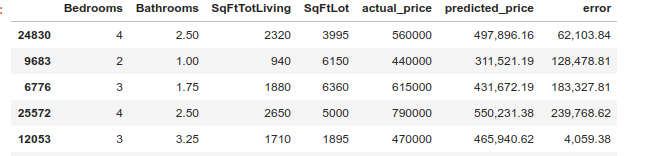

# Neural Network Design with Tensorflow and Keras

<!-- TODO shiva -->
 &nbsp;  &nbsp; <!-- {"left" : 2.79, "top" : 6.07, "height" : 1.81, "width" : 2.13} -->
<!-- {"left" : 4.97, "top" : 8.21, "height" : 0.71, "width" : 2.45} -->


---

## Lesson Objectives

  * Use Keras API to build networks

Notes:  

---

## Keras / TF.Keras

* From January 2020 onwards, it is recommended to use __`tf.keras`__ package

* When ever you see __`keras.xyz`__  substitute __`tf.keras.xyz`__

```python

try:
  # %tensorflow_version only exists in Colab.
  %tensorflow_version 2.x
except Exception:
  pass

## --- import tf.keras ---
import tensorflow as tf
from tensorflow import keras

## From this point on, when we say keras, we are using tf.keras

## continue using tf.keras APIs
model = keras.Sequential([
            keras.layers.Dense(units=input_dim, activation=tf.nn.relu, input_dim=input_dim),
            keras.layers.Dense(units=64, activation=tf.nn.relu),
            keras.layers.Dense(units=output_clases,  activation=tf.nn.softmax)
            ])

```

---


## Keras Abstractions

<!-- TODO shiva -->


  * **Layer**
    - A Layer is a group of neurons.

  * **Model**
    - Model is a collection of Layers

  * **Loss Functions**
    - Help network calculate the errors
    - (Like a referee)

  * **Optimizer**
    - Helps with training
    - (Like a coach)


---
# Keras Models
---

## Keras Models Intro

<!-- TODO shiva -->

<!-- {"left" : 4.15, "top" : 2.46, "height" : 4.73, "width" : 1.95} -->

* Models are defined in __`keras.models`__ package

* There are 2 ways to build a Keras model
    - Option 1 : Functional API -- simplest
    - Option 2 : Extending Model class -- more work but flexible


---
## Creating a Model - Using Functional API

<!-- TODO shiva -->


* With the "functional API", we start from Input
* And chain layer calls to specify the model's forward pass
* Finally we create your model from inputs and outputs:
* Model is a __sequence of layers__


```python
from tensorflow import keras

# a is the input layer.  Here input has 4 dimensions
a = keras.layers.Input(shape=(4,))

# now 'a' is input to 'b'
b = keras.layers.Dense(units=64, activation=tf.nn.relu) (a)

# 'b' is input to 'c'
c = keras.layers.Dense(units=32, activation=tf.nn.relu) (b)

# d is final layer, takes  'c' as input
d = keras.layers.Dense(units=1, activation=tf.nn.sigmoid) (c)

# create a model
model = Model(inputs=a, outputs=d)
```
<!-- {"left" : 0, "top" : 1.65, "height" : 2.5, "width" : 9.32} -->

---

## Model Creation - Functional API

<!-- TODO shiva -->

* Here is another way of adding layers to model
* Start with an empty model and keep adding layers


```python
## option 1
## explicitly defining input layer
model = keras.models.Sequential()
model.add (keras.layers.Input(shape=(4,)))
model.add (keras.layers.Dense(units=64, activation=tf.nn.relu))
model.add (keras.layers.Dense(units=32, activation=tf.nn.relu))
model.add (keras.layers.Dense(units=1, activation=tf.nn.sigmoid))


## option 2: same as above
## no explicit input layer,
## first layer accepts 'input_shape' argument
model = keras.models.Sequential()
model.add (keras.layers.Dense(units=64, activation=tf.nn.relu, input_shape=(4,)))
# Afterwards, we do automatic shape inference
model.add (keras.layers.Dense(units=32, activation=tf.nn.relu))
model.add (keras.layers.Dense(units=1, activation=tf.nn.sigmoid))


## option 3 : same as above two
model = keras.Sequential([
            keras.layers.Dense(units=64, activation=tf.nn.relu, input_shape=(4,)),
            keras.layers.Dense(units=32, activation=tf.nn.relu)
            keras.layers.Dense(units=1, activation=tf.nn.sigmoid)
        ])
```

---

## Model Creation - Subclassing Model Class

* More flexible
* Define your layers in __`init`__ method
* Implement the model's forward pass in __`call`__ function

```python
import tensorflow as tf

class MyModel(tf.keras.Model):

  def __init__(self):
    super(MyModel, self).__init__()
    self.dense1 = tf.keras.layers.Dense(4, activation=tf.nn.relu)
    self.dense2 = tf.keras.layers.Dense(5, activation=tf.nn.softmax)

  def call(self, inputs):
    x = self.dense1(inputs)
    return self.dense2(x)

model = MyModel()
```

---

## Model Methods

Keras models have the following methods

| Method             | Description                                              |
|--------------------|----------------------------------------------------------|
| `fit`              | Trains the model                                         |
| `evaluate`         | Computes model accuracy for test                         |
| `predict`          | Generates predictions for inputs                         |
| `train_on_batch`   | Runs a single gradient update on a single batch of data. |
| `test_on_batch`    | Test the model on a single batch of samples              |
| `predict_on_batch` | predictions for a single batch of samples                |

<!-- {"left" : 0.25, "top" : 1.88, "height" : 3.88, "width" : 9.75} -->

---


## Compile method

<!-- TODO shiva -->
<!-- {"left" : 4.15, "top" : 2.46, "height" : 4.73, "width" : 1.95} -->

```python
compile(optimizer,
        loss=None,
        metrics=None,
        loss_weights=None,
        sample_weight_mode=None,
        weighted_metrics=None,
        target_tensors=None)
```
<!-- {"left" : 0, "top" : 1.2, "height" : 2.23, "width" : 5.87} -->

<br/>

  * Arguments
    - **optimzer:** optimizer name ('adam', 'sgd') or optimizer instance
    - **loss:** loss function name or instance
    - **metrics:** metrics to evaluate during training/testing  
      `metrics = ['accuracy']`

---

## Fit method

<!-- TODO shiva -->

<!-- {"left" : 4.15, "top" : 2.46, "height" : 4.73, "width" : 1.95} -->

```python
fit(x=None, y=None,
    batch_size=None, epochs=1,
    verbose=1, callbacks=None,
    validation_split=0.0, validation_data=None,
    shuffle=True, class_weight=None,
    sample_weight=None, initial_epoch=0,
    steps_per_epoch=None, validation_steps=None, validation_freq=1)
```
<!-- {"left" : 0, "top" : 1.66, "height" : 1.82, "width" : 10.25} -->


  * This method does training
  * Arguments
    - x: training input data (numpy array or list of numpy arrays)
    - y: training target data (numpy array)
    - batch_size: integer, usually powers of two (default = 32)
    - epochs: integer, how many times to go through data
    - verbose: 0 or 1 or 2  (0 = silent, 1 = progress bar, 2 = one line per epoch)

---

## Evaluate

<!-- TODO shiva -->
<!-- {"left" : 4.15, "top" : 2.46, "height" : 4.73, "width" : 1.95} -->

```python
evaluate(x=x_test, y=y_test,
         batch_size=None, verbose=1,
         sample_weight=None, steps=None, callbacks=None)
```
<!-- {"left" : 0, "top" : 2.02, "height" : 1.07, "width" : 10.25} -->

<br/>

* Measures performance metrics (loss values) for testing data
* Arguments
    - x: test data inputs (numpy array(s) )
    - y: test data labels (numpy array(s) )
    - batch_size: integer, usually powers of two (default = 32)
    - verbose: 0 or 1. Verbosity mode. 0 = silent, 1 = progress bar.

---

## Predict
<!-- TODO shiva -->
<!-- {"left" : 4.15, "top" : 2.46, "height" : 4.73, "width" : 1.95} -->

```python
predictions = predict(x, batch_size=None,
                      verbose=0, steps=None, callbacks=None)
```
<!-- {"left" : 0, "top" : 1.62, "height" : 0.82, "width" : 10.25} -->

<br/>

  * Arguments
    - x: The input data, as a Numpy array (or list of Numpy arrays if the model has multiple inputs).
    - batch_size: Integer. If unspecified, it will default to 32.
    - verbose: Verbosity mode, 0 or 1.

---

# Keras Layers

---

## Keras Layers

  * Core layers
    - Dense
    - Dropout
  * Convolutional Layer
  * Pooling Layer
  * Recurrent Layer
  * Embedding Layer
  * Merge Layer

  * Layers are defined in **`keras.layers`** package.

  * We are only going to look at few layers here.  
  * Refer to [Keras.io](keras.io) for complete details.

---
## Keras Core Layers: Dense

  * A dense layer connects every neuron in this layer to every neuron in previous layer.

  * If Layer 1 has 3 neurons and Layer 2 (dense layer) has 4 neurons, the total number of connections between Layer 1 and Layer 2 would be 12 (3 × 4)

  * First layer need to know the input dimensions

<!-- {"left" : 2.99, "top" : 4.17, "height" : 4.12, "width" : 4.26} -->


---
## Keras Core Layers: Dense

```python
## API
keras.layers.Dense(
    units,   # number of neurons
    activation=None, # default is linear : f(x)=x
    use_bias=True,
    kernel_initializer='glorot_uniform',
    bias_initializer='zeros',
    kernel_regularizer=None,
    bias_regularizer=None,
    activity_regularizer=None,
    kernel_constraint=None,
    bias_constraint=None)

```
<!-- {"left" : 0, "top" : 1.17, "height" : 3.64, "width" : 10.25} -->


```python
## Usage

from keras.layers import Dense

# has 32 neurons
# Takes input array of shape [*,16]
# output array shape [*,32]
d = Dense(32, input_shape=(16,)))
```
<!-- {"left" : 0, "top" : 5.07, "height" : 2.35, "width" : 8.34} -->

---

## Keras Core Layers: Dropout

<!-- TODO shiva -->


  * The dropout layer in DL helps reduce overfitting by introducing regularization and generalization

  * The dropout layer drops out a few neurons or sets them to 0 and reduces computation in the training process.

```python
## API

keras.layers.Dropout(rate, noise_shape=None, seed=None)
```
<!-- {"left" : 0, "top" : 3.16, "height" : 1.19, "width" : 10.25} -->


```python
## Usage

from keras.layers import Dropout

d = Dropout(rate = 0.1,seed=100)
```
<!-- {"left" : 0, "top" : 4.74, "height" : 1.74, "width" : 6.11} -->

---

# Keras Optimizers

---
## Keras Optimizers

<!-- TODO shiva -->


  * We can specify the optimizers by 'name' or initialize the respective classes for customization

  * Choice of optimizers
    - SGD: Stochastic Gradient Descent Optimizer
    - Momentum / Nesterov
    - Adagrad
    - RMSProp
    - Adam

---

## Optimizer: SGD

```python

# Use default values
model.compile(optimizer='sgd', loss='mean_squared_error')

# ~~~~~~~~~

# or Customize
from keras.optimizers import SGD
sgd = SGD(lr=0.01,
          decay=1e-6,
          momentum=0.9,
          nesterov=True)  # using Nestrov momentum
model.compile(optimizer=sgd, loss='mean_squared_error')

```
<!-- {"left" : 0, "top" : 1.01, "height" : 2.39, "width" : 10.25} -->

<br/>

  * Arguments
    - `lr`: float >= 0. Learning rate.
    - `momentum`: float >= 0. Parameter that accelerates SGD in the relevant direction and dampens oscillations.
    - `decay`: float >= 0. Learning rate decay over each update.
    - `nesterov`: boolean. Whether to apply Nesterov momentum.

---

## Optimizer: Adagrad

```python
# use defaut args
model.compile(optimizer='adagrad', ...)

# ~~~~~~~~~

# or Customize
from keras.optimizers import Adagrad
adagrad = keras.optimizers.Adagrad(lr=0.01,
                                   epsilon=None,
                                   decay=0.0)
model.compile(optimizer=adagrad, ...)

```
<!-- {"left" : 0, "top" : 1.14, "height" : 2.39, "width" : 7.37} -->

<br/>

  * Arguments
    - `lr`: float >= 0. Initial learning rate.
    - `epsilon`: float >= 0. If None, defaults to K.epsilon().
    - `decay`: float >= 0. Learning rate decay over each update.


---

## Optimizer: RMSProp

```python
# use default values
model.compile(optimizer='rmsprop', ...)

# ~~~~~~~~~

# or customize
from keras.optimizers import RMSprop
rmsprop = keras.optimizers.RMSprop(lr=0.001,
                                   rho=0.9,
                                   epsilon=None,
                                   decay=0.0)
model.compile(optimizer=rmsprop, ...)

```
<!-- {"left" : 0, "top" : 1.11, "height" : 2.82, "width" : 6.55} -->

<br/>

  * Arguments
    - `lr`: float >= 0. Learning rate.
    - `rho`: float >= 0.
    - `epsilon`: float >= 0. Fuzz factor. If None, defaults to K.epsilon().
    - `decay`: float >= 0. Learning rate decay over each update.

---

## Optimizer: Adam

```python
# use default values
model.compile(optimizer='adam', ...)

# or customize
from keras.optimizers import Adam
adam = keras.optimizers.Adam(lr=0.001,
                             beta_1=0.9,
                             beta_2=0.999,
                             epsilon=None,
                             decay=0.0,
                             amsgrad=False)
model.compile(optimizer=adam, ...)


```

<!-- {"left" : 0, "top" : 1.35, "height" : 3.78, "width" : 7.94} -->

---

## Optimizer: Adam

  * Arguments
    - `lr`: float >= 0. Learning rate.
    - `beta_1`: float, 0 < beta < 1. Generally close to 1.
    - `beta_2`: float, 0 < beta < 1. Generally close to 1.
    - `epsilon`: float >= 0. Fuzz factor. If None, defaults to K.epsilon().
    - `decay`: float >= 0. Learning rate decay over each update.
    - `amsgrad`: boolean. Whether to apply the AMSGrad variant of this algorithm from the paper "On the Convergence of Adam and Beyond".


---

# Keras Loss Functions

---

## Keras Loss Functions


  * We will look at a few popular Loss functions.  
  * For full list see [Keras documentation](https://keras.io/losses/#available-loss-functions).

  * Loss functions are defined in [keras.losses](https://keras.io/losses) package

  * For Regressions:
    - Mean Squared Error
    - Mean Absolute Error
    - more...

  * For Classifications:
    - Categorical Cross-entropy
    - Binary Cross-entropy

---

## Loss Functions for Regressions

<!-- TODO shiva -->

| Bedrooms | Bathrooms | Size | Sale Price (in thousands) |
|--------------------|---------------------|----------------|------------------------------------------------------|
| 3                  | 1                   | 1500           | 230                                                  |
| 3                  | 2                   | 1800           | 320                                                  |
| 5                  | 3                   | 2400           | 600                                                  |

<br />

* **Mean Squared Error**

```python
model.compile(optimizer=optimizer,
              loss='mean_squared_error', # or 'mse'
              metrics = ['mean_squared_error']) # or 'mse'

model.compile(optimizer=optimizer,
              loss=tf.keras.losses.MeanSquaredError(),
              metrics = ['mse'])
```


<!-- {"left" : 0, "top" : 1.71, "height" : 0.54, "width" : 8.61} -->


*  **Mean Absolute Error**


```python
model.compile(optimizer=optimizer,
              loss='mean_absolute_error',  # or 'mae'
              metrics = ['mean_absolute_error'])  # or 'mae'

model.compile(optimizer=optimizer,
              loss=tf.keras.losses.MeanAbsoluteError(),
              metrics = ['mae'])
```
<!-- {"left" : 0, "top" : 4.89, "height" : 0.54, "width" : 8.78} -->

---

## Loss Functions for Binary Classifications

| gre     | gpa     | rank.    | admit      |
|---------|---------|----------|------------|
| 380     | 3.6     | 3        | 0          |
| 660     | 3.67    | 3        | 1          |
| 800     | 4       | 1        | 1          |
| 640     | 3.19    | 4        | 0          |

<br />

*  **Binary Cross-entropy**
* Used when outcome is binary (true/false,  0/1)
* In this example, __`admit`__ is a boolean outcome we are trying to predict


<!-- TODO shiva  -->
```python
model.compile(optimizer=optimizer,
              loss='binary_crossentropy',
              metrics=['accuracy'])

model.compile(optimizer=optimizer,
              loss=tf.keras.losses.BinaryCrossentropy(),
              metrics=['accuracy'])
```
<!-- {"left" : 0, "top" : 1.91, "height" : 0.43, "width" : 6.26} -->

---
## Loss Functions for Multi-Class Classifications

<!-- TODO shiva -->

| a   | b   | c   | d   | label |
|-----|-----|-----|-----|-------|
| 6.4 | 2.8 | 5.6 | 2.2 | 1     |
| 5.0 | 2.3 | 3.3 | 1.0 | 2     |
| 4.9 | 3.1 | 1.5 | 0.1 | 3     |

<br />

* **Sparse Categorical Cross-entropy**
* Used for multi-class classifications ('cat', 'dog', 'lion' ..etc)
* In this dataset, we are trying to predict __`label`__ as __`1 or 2 or 3`__


```python
model.compile(optimizer=optimizer,
              loss='sparse_categorical_crossentropy',
              metrics=['accuracy'])

model.compile(optimizer=optimizer,
              loss=tf.keras.losses.SparseCategoricalCrossentropy(),
              metrics=['accuracy'])
```
<!-- {"left" : 0, "top" : 4.55, "height" : 0.54, "width" : 9.61} -->


---
## Loss Functions for Multi-Class Classifications

<!-- TODO shiva -->
| a   | b   | c   | d   | label    |
|-----|-----|-----|-----|----------|
| 6.4 | 2.8 | 5.6 | 2.2 | [1,0,0]  |
| 5.0 | 2.3 | 3.3 | 1.0 | [0,1,0]  |
| 4.9 | 3.1 | 1.5 | 0.1 | [0,0,1]  |

<br />

* **Categorical Cross-entropy**
* Used for multi-class classifications ('cat', 'dog', 'lion' ..etc)
* In this dataset, we are trying to predict __`label`__ as __`1 or 2 or 3`__
* Labels must be __`one-hot`__ encoded

```python
model.compile(optimizer=optimizer,
              loss='categorical_crossentropy',
              metrics=['accuracy'])

model.compile(optimizer=optimizer,
              loss=tf.keras.losses.CategoricalCrossentropy(),
              metrics=['accuracy'])
```
<!-- {"left" : 0, "top" : 4.55, "height" : 0.54, "width" : 9.61} -->

---

# Keras Activation Functions

---

## Keras Activation Functions
* Linear
* Sigmoid
* Tanh
* ReLU
* Softmax

<!-- TODO shiva -->
```python

## Easiest to use activation function names
## like 'relu'  , 'tanh'  and 'softmax'

from tensorflow import keras
from keras.layers import Dense

model.add(Dense(units=64, activation='relu', input_dim=100))
model.add(Dense(units=10, activation='softmax'))

# --------------------------

## Also can initialize using classes
act = keras.activations.softmax(x, axis=-1)
model.add(Dense(units=10, activation=act))

```

---

## Activation for Regressions

<!-- TODO shiva -->
| Bedrooms | Bathrooms | Size | Sale Price (in thousands) |
|--------------------|---------------------|----------------|------------------------------------------------------|
| 3                  | 1                   | 1500           | 230                                                  |
| 3                  | 2                   | 1800           | 320                                                  |
| 5                  | 3                   | 2400           | 600                                                  |

<br />

* For regressions, the last layer will have
    - __`ONE`__ neuron
    - __`LINEAR`__ activation

```python

from tensorflow import keras

model = keras.models.Sequential()
# model.add (...)

## Last layer
model.add(keras.layers.Dense(units=1, activation='linear'))

# or
model.add(Dense(units=1,
                activation=tf.keras.activations.linear()))


```

---

## Activation for Binary Classifications

<!-- TODO shiva -->

| gre     | gpa     | rank.    | admit      |
|---------|---------|----------|------------|
| 380     | 3.6     | 3        | 0          |
| 660     | 3.67    | 3        | 1          |
| 640     | 3.19    | 4        | 0          |

<br />

* Used when outcome is binary (true/false,  0/1)
* For binary classifiers, the last layer will have
    - __`ONE`__ neuron
    - __`SIGMOID`__ activation
    - Sigmoid provides output between __0 and 1__ representing probability


```python
# model.add (...)

## Last layer
model.add(Dense(units=1, activation='sigmoid'))

# or
model.add(Dense(units=1,
                activation=tf.keras.activations.linear()))

```
---

## Activation for Multi-class Classifiers
<!-- TODO shiva -->

| a   | b   | c   | d   | label |
|-----|-----|-----|-----|-------|
| 6.4 | 2.8 | 5.6 | 2.2 | 1     |
| 5.0 | 2.3 | 3.3 | 1.0 | 2     |
| 4.9 | 3.1 | 1.5 | 0.1 | 3     |

<br />

* In this dataset, we are trying to predict __`label`__ as __`1 or 2 or 3`__
* Last layer will have
    - Number of neurons matching possible outputs
    - Activation function is __`softmax`__
    - Softmax provides an array of numbers representing probabilities for each class (sum is 1.0)
    - Sample output: [0.1, 0.8, 0.1] (so label 2 is the winner)

```python
## Last layer
# 3 units to match 3 output classes
model.add(Dense(units=3, activation='softmax'))

# or
model.add(Dense(units=3,
                activation=tf.keras.activations.softmax()))
```

---

# NN for Regression

---
## Keras Workflow

<!-- TODO shiva -->
<!-- {"left" : 4.15, "top" : 2.46, "height" : 4.73, "width" : 1.95} -->

* Here is a typical Keras workflow.  This is pretty common workflow for most neural networks

* Step 1 - Define the network
    - Step 1A - Use a model class from **`keras.models`**
    - Step 1B - Stack layers using the **`.add()`** method

* Step 2 - Configure the learning process using the **`compile()`** method

* Step 3 - Train the model on the train dataset using the **`.fit()`** method

* Step 4 - Evaluate the network

* Step 5 - Predict

---

## Predicting House Prices


| Sale Price $ | Bedrooms | Bathrooms | Sqft_Living | Sqft_Lot |
|--------------|----------|-----------|-------------|----------|
| 280,000      | 6        | 3         | 2,400       | 9,373    |
| 1,000,000    | 4        | 3.75      | 3,764       | 20,156   |
| 745,000      | 4        | 1.75      | 2.06        | 26,036   |
| 425,000      | 5        | 3.75      | 3,200       | 8,618    |
| 240,000      | 4        | 1.75      | 1,720       | 8,620    |
| 327,000      | 3        | 1.5       | 1,750       | 34,465   |
| 347,000      | 4        | 1.75      | 1,860       | 14,650   |

<br />

* Inputs: Bedrooms, Bathrooms, Sqft_Living, Sqft_Lot
* Output: Sale Price

---

## Step 0: Preparing Data

```python
import pandas as pd
from sklearn.model_selection import train_test_split

house_prices = pd.read_csv('house_sale.csv')

x = house_prices [['Bedrooms', 'Bathrooms', 'SqFtTotLiving', 'SqFtLot']]
y = house_prices[['Sale Price']]

# --- x ----
# Bedrooms  Bathrooms  SqFtTotLiving  SqFtLot
# 0         6       3.00           2400     9373
# 1         4       3.75           3764    20156
# 2         4       1.75           2060    26036
# 3         5       3.75           3200     8618
# 4         4       1.75           1720     8620
# --- y ----
# 0     280000
# 1    1000000
# 2     745000
# 3     425000
# 4     240000


## split train/test = 80% / 20%
x_train, x_test, y_train, y_test = train_test_split(x, y, test_size = 0.2, random_state = 0)

# x_train.shape :  (21650, 4)
# y_train.shape :  (21650, 1)
# x_test.shape :  (5413, 4)
# y_test.shape :  (5413, 1)
```

---

## 1: Network Design

<!-- TODO shiva  -->

<!-- {"left" : 4.15, "top" : 2.46, "height" : 4.73, "width" : 1.95} -->

* We will do __4 layers__
* First layer : Input layer with __shape=4__ (to match number of input dimensions)
* Two hidden layers, __64 neurons__ each, with __ReLU__ activation
* Output layer : __1 neuron__ with __linear__ activation

<!-- {"left" : 4.15, "top" : 2.46, "height" : 4.73, "width" : 1.95} -->

---

## 1: Network Design

<!-- TODO shiva  -->

<!-- {"left" : 4.15, "top" : 2.46, "height" : 4.73, "width" : 1.95} -->

```python
import tensorflow as tf
from tensorflow import keras

model = keras.Sequential([
                keras.layers.Dense(units=64, activation='relu', input_shape=(4,)),
                keras.layers.Dense(units=64, activation='relu'),
                keras.layers.Dense(units=1, activation='linear')
            ])

keras.utils.plot_model(model, to_file='model.png', show_shapes=True)
```

<!-- {"left" : 4.15, "top" : 2.46, "height" : 4.73, "width" : 1.95} -->

---

## 2: Compile Network

<!-- TODO shiva  -->

<!-- {"left" : 4.15, "top" : 2.46, "height" : 4.73, "width" : 1.95} -->

* We are using __`mean_squared_error (mse)`__ for loss
* We are tracking two metrics : __`mean_squared_error`__ and __`mean_absolute_error`__

* Both __`RMSProp`__ and __`Adam`__ are pretty good optimizers, that can self-adjust parameters as they learn

```python
optimizer = tf.keras.optimizers.RMSprop(0.01)
#optimizer = 'adam'

model.compile(loss='mean_squared_error', # or 'mse'
              optimizer=optimizer,
              metrics=['mean_squared_error', 'mean_absolute_error']) # or 'mse', 'mae'
```


---

## 3: Fit Network
<!-- TODO shiva  -->

<!-- {"left" : 4.15, "top" : 2.46, "height" : 4.73, "width" : 1.95} -->

* We train on __training_data__ (__`x_train`__ and __`y_train`__)
* Output may look like below; we did 100 epochs in about 3m 34 secs

```python
%%time

epochs = 100  ## experiment 100, 500, 1000

print ("training starting ...")

history = model.fit(x_train, y_train, epochs=epochs)

print ("training done.")
```


```text
Train on 21650 samples

Epoch 1/100
21650/21650 [==============================] -  loss: 219936094589.5996 -  
mean_squared_error: 219936030720.0000
...
...
Epoch 100/100
21650/21650 [==============================] -  loss: 52353343859.5725 --
mean_squared_error: 52353351680.0000

training done.

CPU times: user 18min 53s, sys: 29min 51s, total: 48min 44s
Wall time: 3min 34s
```

---

## 3.5: Visualize Training History
<!-- TODO shiva  -->

<!-- {"left" : 4.15, "top" : 2.46, "height" : 4.73, "width" : 1.95} -->


```python
%matplotlib inline
import matplotlib.pyplot as plt

plt.plot(history.history['mean_squared_error'], label='mse')
plt.plot(history.history['mean_absolute_error'], label='mae')
plt.legend()
plt.show()
```

<!-- {"left" : 4.15, "top" : 2.46, "height" : 4.73, "width" : 1.95} -->

---
## 4: Evaluate Network
<!-- TODO shiva  -->

<!-- {"left" : 4.15, "top" : 2.46, "height" : 4.73, "width" : 1.95} -->

* __`model.evaluate`__ is returning a few metrics, displayed below

```python
metric_names = model.metrics_names
print ("model metrics : " , metric_names)
metrics = model.evaluate(x_test, y_test, verbose=0)

for idx, metric in enumerate(metric_names):
    print ("Metric : {} = {:,.2f}".format (metric_names[idx], metrics[idx]))
```


```text
model metrics :  ['loss', 'mean_absolute_error', 'mean_squared_error']
Metric : loss = 63,529,597,115.28
Metric : mean_absolute_error = 132,878.83
Metric : mean_squared_error = 63,529,586,688.00
```

---
## 5: Predict
<!-- TODO shiva  -->

<!-- {"left" : 4.15, "top" : 2.46, "height" : 4.73, "width" : 1.95} -->

* We predict on __`x_test`__
* That gives us __`predictions`__ or __`y_pred`__
* And compare that with __`y_test`__ (expected output)
* See output below, we calculate __`error`__ or __`residual`__

```python
predictions = model.predict(x_test)
# predictions is just an array [324716.38, 491426.2, 504381.22]

# lets do some pretty output
# comparing actual vs. predicted prices
predictions_df = pd.DataFrame(x_test)  
predictions_df['actual_price'] = y_test
predictions_df['predicted_price'] = predictions
predictions_df['error'] = predictions_df['actual_price'] -
                          predictions_df['predicted_price']
```


<!-- {"left" : 4.15, "top" : 2.46, "height" : 4.73, "width" : 1.95} -->


---
## 5: Predict - Analyze Error
<!-- TODO shiva  -->

<!-- {"left" : 4.15, "top" : 2.46, "height" : 4.73, "width" : 1.95} -->

* We are analyzing error, just displaying a error-distribution


```python
%matplotlib inline
import matplotlib.pyplot as plt

predictions_df_filtered =
 predictions_df[predictions_df['error'].abs() < 100000]

plt.hist (predictions_df_filtered['error'], bins=10, rwidth=0.8)
plt.xlabel("Prediction Error [$]")
_ = plt.ylabel("Count")
```

<!-- {"left" : 4.15, "top" : 2.46, "height" : 4.73, "width" : 1.95} -->

---

## 5: Predict - Analyze Error
<!-- TODO shiva  -->

<!-- {"left" : 4.15, "top" : 2.46, "height" : 4.73, "width" : 1.95} -->

* Inspect the biggest erorr and smallest error.  Can you explain?

```python
## which house we got really wrong?
print ("biggest error : ")
predictions_df.loc[predictions_df['error'].abs().idxmax()]
```

```text
biggest error :
Bedrooms                   6.00
Bathrooms                  6.50
SqFtTotLiving          7,560.00
SqFtLot               44,000.00
actual_price      11,000,000.00
predicted_price    2,582,545.50
error              8,417,454.50
```


```python
## which house we are spot on?
print ("lowest error")
predictions_df.loc[predictions_df['error'].abs().idxmin()]
```

```text
lowest error
Bedrooms                3.00
Bathrooms               2.00
SqFtTotLiving       1,310.00
SqFtLot             5,040.00
actual_price      385,000.00
predicted_price   385,004.03
error                  -4.03
```

---
## Lab: Regressions Using NN

<!-- {"left" : 6.76, "top" : 0.88, "height" : 4.37, "width" : 3.28} -->


* **Overview:**
    - Solve regression problems with Tensorflow

* **Approximate run time:**
    - 40 - 60 mins

* **Instructions:**
    - Please follow instructions for
        - **Regression-1** : Bill and Tips
        - **Regression-2** : House Prices

Notes:

---


# Classifications with NNs

---
## Keras Workflow

<!-- TODO shiva -->
<!-- {"left" : 4.15, "top" : 2.46, "height" : 4.73, "width" : 1.95} -->

* Here is a typical Keras workflow.  This is pretty common workflow for most neural networks

* Step 1 - Define the network
    - Step 1A - Use a model class from **`keras.models`**
    - Step 1B - Stack layers using the **`.add()`** method

* Step 2 - Configure the learning process using the **`compile()`** method

* Step 3 - Train the model on the train dataset using the **`.fit()`** method

* Step 4 - Evaluate the network

* Step 5 - Predict


---

## Let's use IRIS Dataset


<!-- TODO shiva -->


* IRIS is a very simple dataset (a ML classic)

* 4 inputs (a,b,c,d) - representing dimensions of the flower, like 'petal width'
* and 3 output classes `label` (1,2,3)
* Total samples : 150
* Well balanced, each label (1,2,3) has 50 samples each

<br />

| a   | b   | c   | d   | label |
|-----|-----|-----|-----|-------|
| 6.4 | 2.8 | 5.6 | 2.2 | 3     |
| 5.0 | 2.3 | 3.3 | 1.0 | 2     |
| 4.9 | 3.1 | 1.5 | 0.1 | 1     |

<!-- {"left" : 0.25, "top" : 3.82, "height" : 2, "width" : 9.75} -->

Notes:
Image by <a href="https://pixabay.com/users/pixel2013-2364555/?utm_source=link-attribution&amp;utm_medium=referral&amp;utm_campaign=image&amp;utm_content=2339883">S. Hermann &amp; F. Richter</a> from <a href="https://pixabay.com/?utm_source=link-attribution&amp;utm_medium=referral&amp;utm_campaign=image&amp;utm_content=2339883">Pixabay</a>

---

## Step 0 - Data Prep

```python
### --- read input ----
iris = pd.read_csv('iris.csv')
x = iris [['SepalLengthCm', 'SepalWidthCm', 'PetalLengthCm', 'PetalWidthCm']]
y = iris[['Species']]
# SepalLengthCm  SepalWidthCm  PetalLengthCm  PetalWidthCm
# 0            5.1           3.5            1.4           0.2
# 4            5.0           3.6            1.4           0.2
# -----
#      Species
# 0  Iris-setosa
# 1  Iris-virginica

# ---- pre processing ----
from sklearn.preprocessing import LabelEncoder
encoder =  LabelEncoder()
y1 = encoder.fit_transform(y.values) ## need y.values which is an array
# [0 0 0 ...  1 1 1 ... 2 2 2]

# --- train test split ----
from sklearn.model_selection import train_test_split
x_train,x_test, y_train,y_test = train_test_split(x,y1,test_size=0.2,random_state=0)

print ("x_train.shape : ", x_train.shape)
print ("y_train.shape : ", y_train.shape)
print ("x_test.shape : ", x_test.shape)
print ("y_test.shape : ", y_test.shape)

# x_train.shape :  (120, 4)
# y_train.shape :  (120,)
# x_test.shape :  (30, 4)
# y_test.shape :  (30,)

```

---


## 1: Network Design

<!-- TODO shiva -->
<!-- {"left" : 4.15, "top" : 2.46, "height" : 4.73, "width" : 1.95} -->

- Input layer will have __`4 neurons`__ to match input dimensions (a,b,c,d)

- Hidden layer will have __`8 neurons`__, with __`ReLU`__ activation

- Output layer will have __`3 neurons`__ with __`SoftMax`__ activation

<!-- {"left" : 1.33, "top" : 3.4, "height" : 4.71, "width" : 7.6} -->


---

## Step 1: Define Model

<!-- {"left" : 7.7, "top" : 4.26, "height" : 3.89, "width" : 1.6} -->

```python
from keras.models import Sequential
from keras.layers import Dense

model = Sequential()
model.add(Dense(8, input_dim=4, activation='relu'))
model.add(Dense(3, activation='softmax'))

keras.utils.plot_model(model, to_file='model.png', show_shapes=True)
```
<!-- {"left" : 0, "top" : 1.69, "height" : 2.13, "width" : 9.28} -->


<!-- {"left" : 0.63, "top" : 4.59, "height" : 3.55, "width" : 5.72} -->


---

## Step 2: Compile the Model

<!-- {"left" : 8.08, "top" : 3.7, "height" : 4.19, "width" : 1.73} -->

* We are using __`sparse_categorical_crossentropy`__ for loss, because this is a __multi-class classifier__
* We are tracking metric  __`accuracy`__
* __`Adam`__ is a pretty good optimizer, that can self-adjust parameters as they learn


```python
model.compile( optimizer = 'adam',
               loss = 'categorical_crossentropy',
               metrics = ['accuracy'] )
```
<!-- {"left" : 0, "top" : 1.77, "height" : 1.07, "width" : 8.94} -->

---

## Step 3: Train the Network

* We train on __training_data__ (__`x_train`__ and __`y_train`__)
* Output may look like below; we did 100 epochs in about 10 seconds

<!-- TODO shiva -->


```python
## without validation
history = model.fit(x_train, y_train, epochs = 100, batch_size = 2**4)

## with validation
history = model.fit(x_train, y_train, epochs = 100, batch_size = 2**4,
validation_split=0.25)
```
<!-- {"left" : 0, "top" : 2.51, "height" : 1.41, "width" : 9.41} -->

```text
training starting ...

Train on 96 samples, validate on 24 samples

Epoch 1/100 [==============================] - loss: 2.1204 - accuracy: 0.2708 -
val_loss: 1.5499 - val_accuracy: 0.4583
...
...
Epoch 100/100 [==============================] - loss: 0.2375 - accuracy: 0.9583 -
val_loss: 0.2986 - val_accuracy: 0.9167

training done.

CPU times: user 14.3 s, sys: 18.9 s, total: 33.3 s
Wall time: 10.1 s
```

---

## Step 3.5: Visualize Training History
<!-- TODO shiva  -->

<!-- {"left" : 4.15, "top" : 2.46, "height" : 4.73, "width" : 1.95} -->

* The __`fit()`__ method on a Keras Model returns a __`History`__ object.
* The __`History.history`__ attribute is a dictionary recording training loss values and metrics values at successive epochs

```python
import matplotlib.pyplot as plt

plt.plot(history.history['acc'])
if 'val_acc' in history.history:
     plt.plot(history.history['val_acc'])
plt.title('Model accuracy')
plt.ylabel('Accuracy')
plt.xlabel('Epoch')
plt.legend(['Train', 'Test'], loc='upper left')
plt.show()
```

<!-- {"left" : 2.72, "top" : 4.76, "height" : 3.59, "width" : 4.82} -->
<!-- {"left" : 2.78, "top" : 4.77, "height" : 3.5, "width" : 4.69} -->
---

## Step 4: Evaluate network

<!-- TODO shiva -->


* __`model.evaluate`__ is returning a few metrics, displayed below

```python
metric_names = model.metrics_names
print ("model metrics : " , metric_names)

metrics = model.evaluate(x_test, y_test, verbose=0)

for idx, metric in enumerate(metric_names):
    print ("Metric : {} = {:,.2f}".format (metric_names[idx], metrics[idx]))
```
<!-- {"left" : 0, "top" : 2.51, "height" : 1.17, "width" : 9.89} -->

```text
model metrics :  ['loss', 'accuracy']
Metric : loss = 0.27
Metric : accuracy = 0.93
```

---
## Step 4.5: Training Accuracy & Loss

<!-- {"left" : 2.96, "top" : 1.65, "height" : 3.22, "width" : 4.32} --><br clear="all;"/>
<!-- {"left" : 2.96, "top" : 5.24, "height" : 3.22, "width" : 4.32} -->


---

## Step 4.5: Visualizing Training History With Tensorboard

* Tensorboard allows us to view training metrics live

```python
## Step 1: Setup Tensorboard
import datetime
import os

app_name = 'classification-iris-1' # you can change this, if you like

tb_top_level_dir= '/tmp/tensorboard-logs'
tensorboard_logs_dir= os.path.join (tb_top_level_dir, app_name,
                                    datetime.datetime.now().strftime("%Y-%m-%d--%H-%M-%S"))
print ("Saving TB logs to : " , tensorboard_logs_dir)
# Saving TB logs to :  /tmp/tensorboard-logs/classification-iris-1/2020-02-05--18-47-10

tensorboard_callback = tf.keras.callbacks.TensorBoard(log_dir=tensorboard_logs_dir, histogram_freq=1)
```

```bash
## Step 2: Run Tensorboard
$   tensorboard --logdir=/tmp/tensorboard-logs
```

```python
# Step 3: Use tensorboard callback during training
history = model.fit( x_train, y_train,
              epochs=epochs, validation_split = 0.2, verbose=1,
              callbacks=[tensorboard_callback]) # <-- here is the TB callback

```
<!-- {"left" : 0, "top" : 2.72, "height" : 1.44, "width" : 8.94} -->

---

## Keras and Tensorboard

<!-- {"left" : 1.51, "top" : 2.18, "height" : 5.28, "width" : 7.22} -->


---

## Step 5: Predict
<!-- TODO shiva  -->

<!-- {"left" : 4.15, "top" : 2.46, "height" : 4.73, "width" : 1.95} -->

* __`model.predict`__ is run on __`x_test`__

* It returns __`predictions`__ which is a __`softmax`__ output

* Softmax output is an array of probabilities for each output class (in our case 3);  
They should add up to 1.0 (total probability)

```python
np.set_printoptions(formatter={'float': '{: 0.3f}'.format})

predictions = model.predict(x_test)
predictions
```

```text
array([[ 0.002,  0.249,  0.749], # winner class-3 (0.749)
       [ 0.023,  0.602,  0.375], # winner class-2 (0.602)
       [ 0.987,  0.012,  0.000], # winner class-1 (0.987)
       [ 0.000,  0.111,  0.889],
       [ 0.965,  0.034,  0.001],
       [ 0.000,  0.151,  0.849],
```
---

## Step 5: Predict
<!-- TODO shiva  -->

<!-- {"left" : 4.15, "top" : 2.46, "height" : 4.73, "width" : 1.95} -->

* Here we use __`predict_classes`__ to convert softmax output actual class label

```python
## Use 'predict_classes' instead of 'predict'
y_pred = model.predict_classes(x_test)
y_pred
```

```text
array([2, 1, 0, 2, 0, 2, 0, 1, 1, 1, 2, 1, 2, 1, 2, 0, 1, 2, 0, 0, 2, 2,
       0, 0, 2, 0, 0, 1, 1, 0])
```

---

## Evaluation - Confusion Matrix

<!-- TODO shiva  -->

```python
## plain confusion matrix

from sklearn.metrics import confusion_matrix
import matplotlib.pyplot as plt
import seaborn as sns

cm = confusion_matrix(y_test, y_pred, labels = [0,1,2])

plt.figure(figsize = (8,5))
# colormaps : cmap="YlGnBu" , cmap="Greens", cmap="Blues",  cmap="Reds"
sns.heatmap(cm, annot=True, cmap="Reds", fmt='d').plot()
```

<!-- {"left" : 1.51, "top" : 2.18, "height" : 5.28, "width" : 7.22} -->

* __To the Instructor:__  You may want to cover __Confusion Matrix__ from __ML Concepts__

* Can you interpret the confusion matrix?
---

## Lab: Classifier with NN

<!-- {"left" : 6.73, "top" : 2.04, "height" : 3.9, "width" : 2.93} -->

  * **Overview:**
     - Build a classification network with NN

  * **Depends on:**
     - None

  * **Runtime:**
     - 40-60 mins

  * **Instructions:**
     - Follow instructions for
        - __Classification-1__ : IRIS
        - __Classification-2__ : Propser Loan

---

## Review and Q&A

<!-- {"left" : 8.24, "top" : 1.21, "height" : 1.28, "width" : 1.73} -->


* Let's go over what we have covered so far

* Any questions?

* See following slides for 'resources'

<!-- {"left" : 2.69, "top" : 4.43, "height" : 3.24, "width" : 4.86} -->
---

# Resources

---

## Resources

  * [Hands-on Machine Learning with Scikit-Learn, Keras, and TensorFlow, 2nd Edition (https://learning.oreilly.com/library/view/hands-on-machine-learning/9781492032632/)by Aurélien Géron (ISBN: 9781492032649)

  * [Practical Deep Learning for Cloud and Mobile](https://learning.oreilly.com/library/view/practical-deep-learning/9781492034858/) by Meher Kasam, Siddha Ganju, Anirudh Koul (ISBN: 9781492034841)


<!-- {"left" : 2.62, "top" : 4.41, "height" : 2.93, "width" : 2.23} --> &nbsp;&nbsp; <!-- {"left" : 5.39, "top" : 4.41, "height" : 2.93, "width" : 2.23} -->

---

## Resources

  * [Keras Deep Learning Cookbook](https://learning.oreilly.com/library/view/keras-deep-learning/9781788621755/)by Manpreet Singh Ghotra, Rajdeep Dua (ISBN: 9781788621755)

  * [Learn Keras for Deep Neural Networks:A Fast-Track Approach to Modern Deep Learning with Python](https://learning.oreilly.com/library/view/learn-keras-for/9781484242407/)by Jojo Moolayil (ISBN : 9781484242407)very good book that explains concepts pretty well

 &nbsp;&nbsp; <!-- {"left" : 2.66, "top" : 4.69, "height" : 3.03, "width" : 2.48} --><!-- {"left" : 5.59, "top" : 4.69, "height" : 3.03, "width" : 2} -->
---
## Resources

  * [Deep Learning with Keras : Implement various deep-learning algorithms in Keras and see how deep-learning can be used in games](https://learning.oreilly.com/library/view/deep-learning-with/9781787128422/)by Sujit Pal, Antonio Gulli (ISBN: 9781787128422)

  * [Safari books online, Keras books](https://learning.oreilly.com/topics/keras)

<!-- {"left" : 3.99, "top" : 3.9, "height" : 3.44, "width" : 2.26} -->
