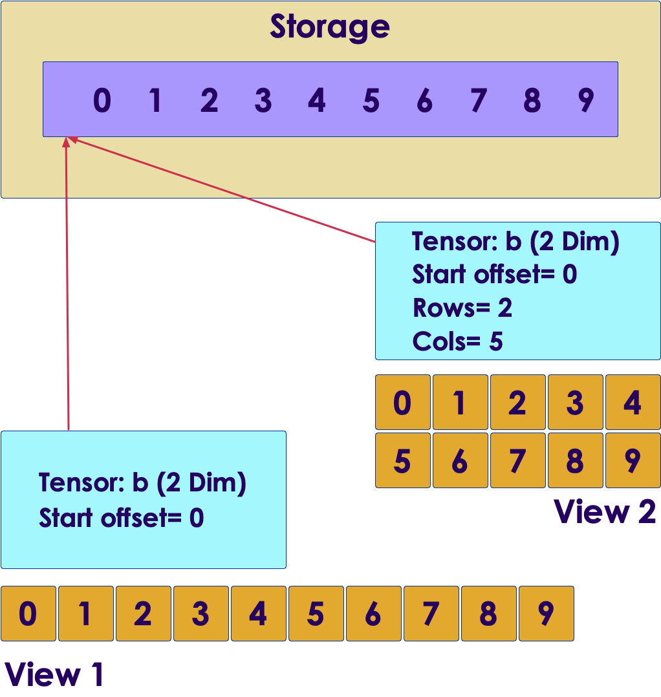

# PyTorch API

 <!-- {"left" : 6.17, "top" : 7.96, "height" : 1.28, "width" : 5.15} -->


---

## Objectives

* Getting started with PyTorch API

---

# Tensors

---

## Tensors Intro

* Tensor is **multi dimensional array**

* Tensors are core to PyTorch

* [Numpy](https://numpy.org/) also implements efficient multi-dimensional arrays

* PyTorch tensor has some extra functionalities compared to Numpy
  - They can be operated on GPU
  - Also PyTorch keeps track of transformations done to tensors

 <!-- {"left" : 3.68, "top" : 6.94, "height" : 3.7, "width" : 10.14} -->


Notes:

---

## Tensors vs Python List

* Python list is a collection of individual objects that are allocated in memory
  - Python will allocate an object for each number (called boxing)
  - Allocating millions will get very inefficient

* Tensors on the other hand are stored as contiguous blocks in memory
  -  This makes tensors very efficient to store and process

 <!-- {"left" : 10.46, "top" : 2.95, "height" : 5.28, "width" : 6.65} -->


Notes:

---

## PyTorch Tensors

* Creating tensors

```python
import torch

t1 = torch.tensor([1,2,3,4,5])
print (t1)
# tensor([1, 2, 3, 4, 5])

print (t1.shape))  # find overall shape
# torch.Size([5])

print (t1[3])  # accessing elements
# tensor(4)
```
<!-- {"left" : 0.85, "top" : 2.66, "height" : 3.49, "width" : 7.28} -->

<br/>

* Zeros / Ones / Random tensors

```python
import torch

zeros = torch.zeros(5)
print(zeros)
#  tensor([0., 0., 0., 0., 0.])

ones = torch.ones(5)
print (ones)
# tensor([1., 1., 1., 1., 1.])

rand = torch.rand(5)
print (rand)
# tensor([0.8583, 0.9562, 0.9140, 0.5607, 0.8529])
```
<!-- {"left" : 0.85, "top" : 7.02, "height" : 4.07, "width" : 9.11} -->


---

## PyTorch Tensors

```python
## multi dimensional

import torch
t1 = torch.tensor([[1,2,3], [4,5,6]])
print (t1)
# tensor([[1, 2, 3],
#         [4, 5, 6]])

# ~~~~~~~

print (t1.shape)
# torch.Size([2, 3])

t2 = torch.tensor(range(0,10)).reshape([2,5])
print(t2)
# tensor([[0, 1, 2, 3, 4],
#         [5, 6, 7, 8, 9]])

print(t2.shape)
# torch.Size([2, 5])

print (t2[1,2])  # accessing elements
# tensor(7)

```
 <!-- {"left" : 0.85, "top" : 2.11, "height" : 8.52, "width" : 10.09} -->


---

## Indexing Tensors

```python
import torch

t1 = torch.tensor(range(0,10))
print (t1)
# tensor([0, 1, 2, 3, 4, 5, 6, 7, 8, 9])

print (t1 [0:4])
# tensor([0, 1, 2, 3])

print (t1[5:])
# tensor([5, 6, 7, 8, 9]))

print (t1[:3])
# tensor([0, 1, 2])

print (t1[:-1]) # index from last
# ensor([0, 1, 2, 3, 4, 5, 6, 7, 8]))
```
 <!-- {"left" : 0.85, "top" : 2.42, "height" : 8.05, "width" : 11.44} -->


---

## Tensor Types

* Default type for integers is **int64** or **long**
* Default type for floating numbers is **float32**
  - Typically using a higher precision floating point like **double** will not produce significantly more accurate results
* We can also specify tensor types, see below

```python
import torch

## integers
a = torch.tensor([1,2,3,4,5])
print (a.dtype)
# torch.int64

## short ints
b = torch.tensor([1,2,3,4,5], dtype=torch.short)
print (b.dtype)
# torch.int16

## floats
c = torch.tensor( [1.1, 2.2, 3.3])
print (c.dtype)
# torch.float32

## conversion
d = torch.zeros(10).to(torch.double)
print(d)
# tensor([0., 0., 0., 0., 0., 0., 0., 0., 0., 0.], dtype=torch.float64)
```
 <!-- {"left" : 0.85, "top" : 4.97, "height" : 6.4, "width" : 12.61} -->

---

## PyTorch Tensor Types

| Type          | Alias        | Description                             |
|---------------|--------------|-----------------------------------------|
| torch.float32 | torch.float  | 32-bit floating-point                   |
| torch.float64 | torch.double | 64-bit, double-precision floating-point |
| torch.float16 | torch.half   | 16-bit, half-precision floating-point   |
| torch.int8    |              | signed 8-bit integers                   |
| torch.uint8   |              | unsigned 8-bit integers                 |
| torch.int16   | torch.short  | signed 16-bit integers                  |
| torch.int32   | torch.int    | signed 32-bit integers                  |
| torch.int64   | torch.long   | signed 64-bit integers                  |
| torch.bool    |              | Boolean                                 |

 <!-- {"left" : 0.91, "top" : 3.11, "height" : 1, "width" : 15.68} -->


---

## Tensor Storage and Views

 <!-- {"left" : 11.64, "top" : 2, "height" : 5.84, "width" : 5.54} -->
 


* Tensor values are stored in memory pool as contiguous chunk of memory
  - This is done by **`torch.storage`** class
  - This is one-dimensional array of numbers of any type (int or float)

* The storage can be shared by tensors
  - These are called **views**
  - They can index the data differently


---

## Tensor Storage and Views

   <!-- {"left" : 11.29, "top" : 1.88, "height" : 6.15, "width" : 5.83} -->


```python
import torch

a = torch.tensor(range(0,10))
print(a)
# tensor([0, 1, 2, 3, 4, 5, 6, 7, 8, 9])

## Another tensor
b = a.reshape(2,5)
print (b)
# tensor([[0, 1, 2, 3, 4],
#         [5, 6, 7, 8, 9]])

## modify a, it affects both
a[3] = -3
print (a)
# tensor([ 0,  1,  2, -3,  4,  5,  6,  7,  8,  9])

print (b)
# tensor([[ 0,  1,  2, -3,  4],
#         [ 5,  6,  7,  8,  9]])

## zero out a
a.zero_() # underscore means, in place modifier
print (a)
# tensor([0, 0, 0, 0, 0, 0, 0, 0, 0, 0])

print (b)
# tensor([[0, 0, 0, 0, 0],
#         [0, 0, 0, 0, 0]])
```
<!-- {"left" : 0.85, "top" : 1.88, "height" : 9.31, "width" : 9.71} -->

---

## PyTorch and GPU

```python
# setting device on GPU if available, else CPU
device = torch.device('cuda' if torch.cuda.is_available() else 'cpu')
print('Using device:', device)
print()

#Additional Info when using cuda
if device.type == 'cuda':
    print('GPU[0] name :', torch.cuda.get_device_name(0))
    print('Memory Usage:')
    print('  Allocated:', round(torch.cuda.memory_allocated(0)/1024**3,1), 'GB')
    print('  Cached:   ', round(torch.cuda.memory_reserved(0)/1024**3,1), 'GB')
```
<!-- {"left" : 0.85, "top" : 2.33, "height" : 3.9, "width" : 15.78} -->


```text
Using device: cuda

GPU[0] name : GeForce RTX 2070
Memory Usage:
  Allocated: 0.0 GB
  Cached:    0.0 GB
```
<!-- {"left" : 0.85, "top" : 6.64, "height" : 2.68, "width" : 7.63} -->


---

## Tensor Operations on GPU


```python
import torch
print ('GPU available? : ', torch.cuda.is_available())
# GPU available? :  True

## CPU Tensor
t_cpu = torch.tensor(range(0,10))
print ('device :', t_cpu.device)
print ('is_cuda? :', t_cpu.is_cuda)
# device : cpu
# is_cuda? : False

## GPU tensor
## Creating a tensor on GPU
print ('GPU memory allocated before : ', torch.cuda.memory_allocated(0))
t_gpu = torch.tensor(range(0,10), device='cuda')
print ('device :', t_gpu.device)
print ('is_cuda? :', t_gpu.is_cuda)
print ('GPU memory allocated after : ', torch.cuda.memory_allocated(0))
# GPU memory allocated before :  0
# device : cuda:0
# is_cuda? : True
# GPU memory allocated after :  512


## copying a tensor from CPU --> GPU
print ('GPU memory allocated before : ', torch.cuda.memory_allocated(0))
t_gpu2 = t_cpu.cuda()
print ('device :', t_gpu2.device)
print ('is_cuda? :', t_gpu.is_cuda)
print ('GPU memory allocated after : ', torch.cuda.memory_allocated(0)))
# GPU memory allocated before :  512
# device : cuda:0
# is_cuda? : True
# GPU memory allocated after :  1024
```
<!-- {"left" : 0.85, "top" : 1.99, "height" : 9.45, "width" : 11.84} -->

---

## Lab: Tensor Operations in PyTorch

<!-- {"left" : 12.34, "top" : 1.89, "height" : 5.75, "width" : 4.32} -->

* **Overview:**
  - Work with tensors

* **Approximate run time:**
  - 20-30 mins

* **Instructions:**
  - **PYTORCH-2:** Tensor operations

Notes:

---

# Reading Datasets Into PyTorch

---

## CSV Data Into PyTorch Tensors

* Here we will focus on reading numeric CSV data

```python
import pandas as pd
import torch

data = pd.read_csv('https://elephantscale-public.s3.amazonaws.com/data/house-prices/house-sales-sample.csv')

# select numbers columns
data2 = data[['SalePrice', 'Bedrooms', 'Bathrooms', 'SqFtTotLiving', 'SqFtLot']]
print(data2)
# > see below

# We convert the value arrays into tensors
tensor = torch.from_numpy(data2.values)

print (tensor.shape)
# > torch.Size([100, 5])
```
<!-- {"left" : 0.85, "top" : 2.76, "height" : 4, "width" : 16.16} -->


```text
# data2 output
    SalePrice  Bedrooms  Bathrooms  SqFtTotLiving  SqFtLot
0      716831         5       3.50           3470     5326
1      439900         4       2.50           2250     9988
..        ...       ...        ...            ...      ...
98     344950         2       1.75           1330     1097
99     384950         3       3.50           1522     1255

[100 rows x 5 columns]
```
<!-- {"left" : 0.85, "top" : 7.1, "height" : 2.9, "width" : 10.44} -->

---

## Categorical Variables to Tensors

---

## Review and Q&A

<!-- {"left" : 13.17, "top" : 1.89, "height" : 2.81, "width" : 3.79} -->

* Let's go over what we have covered so far

* Any questions?

<!-- {"left" : 4.73, "top" : 5.51, "height" : 5.34, "width" : 8.03} -->

