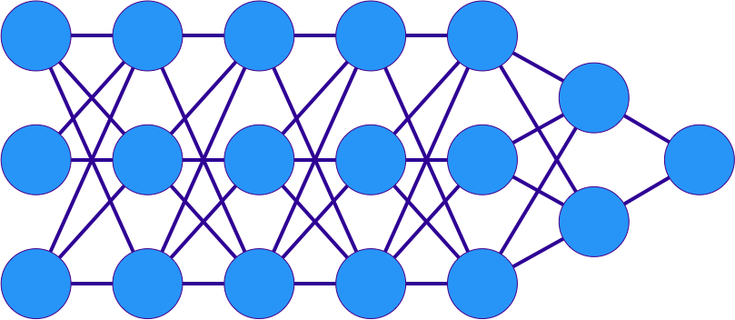

# Neural Networks in PyTorch

 <!-- {"left" : 3.29, "top" : 7.88, "height" : 2.01, "width" : 4.61} -->

 <!-- {"left" : 9.52, "top" : 8.3, "height" : 1.16, "width" : 4.69} -->

---

## Objectives

* Learn to implement neural networks in PyTorch

---

# PyTorch.nn

---

## Slide

* hello world

Notes:

---

## Slide

* goodbye world

Notes:

---

## Lab: Doing XYZ

<!-- {"left" : 12.34, "top" : 1.89, "height" : 5.75, "width" : 4.32} -->

* **Overview:**
  - Work with xyz

* **Approximate run time:**
  - 20-30 mins

* **Instructions:**
  - Please complete A, B, C

Notes:

---

## Review and Q&A

<!-- {"left" : 13.17, "top" : 1.89, "height" : 2.81, "width" : 3.79} -->

* Let's go over what we have covered so far

* Any questions?

<!-- {"left" : 4.73, "top" : 5.51, "height" : 5.34, "width" : 8.03} -->
