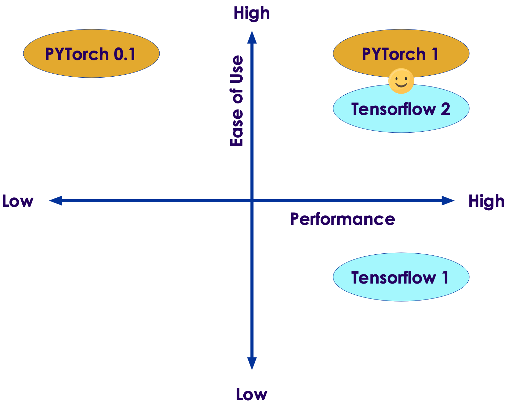
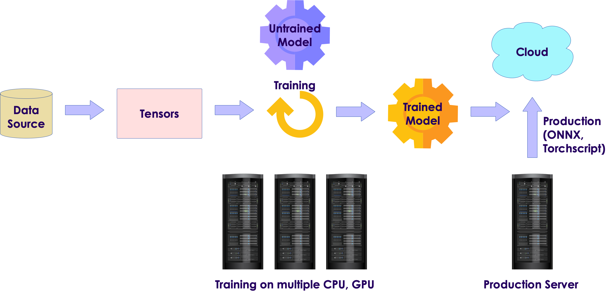

# PyTorch Introduction

  <!-- {"left" : 5.88, "top" : 6.56, "height" : 1.23, "width" : 1.45} -->    &nbsp; &nbsp;

---

## Objectives

* Learn about PyTorch library and ecosystem

---

# PyTorch

---

## About PyTorch

* [PyTorch](https://pytorch.org/) is an open source,  python library for deep learning

* Primarily developed by [Facebook AI Research Lab (FAIR)](https://ai.facebook.com/)

Notes:

---

## Why PyTorch

* Simple to use API

* Very easy to prototype solutions quickly, so embraced by the research community

* **Pythonic**: Programming in PyTorch feels very natural in Python

* **GPU support**: Using GPUs can result in 10x to 50x speedups

* For performance, core of PyTorch is written in C++ and [CUDA](https://www.geforce.com/hardware/technology/cuda) - A C++ language from Nvidia for GPU programming

* Integrates with other Python ecosystem tools like Numpy

Notes:

---

## Deep Learning Landscape

* Deep Learning landscape evolved very quickly
* Around 2017 (Version 1.0, if you will)
  - Theano and TensorFlow (v1) were the premiere low-level libraries
  - Pytorch v0.1
  - Keras was high level library around Tensorflow, CNTK ..etc
  - Niche libraries: Caffe, Chainer, DyNet, Torch, MXNet, CNTK, DL4J
* Around 2019 (Version 2.0)
  - Theano, one of the first deep learning frameworks, has ceased active development
  - Tensorflow version 2 (tf2) 
    - standardized on Keras high level API
    - 'Eager mode execution' is default (just like PyTorch)
  - PyTorch v1.0
    - Standardized on Caffe2 for its backend
    - Replaced CNTK and Chainer frameworks

---

## PyTorch vs. Tensorflow

<!-- {"left" : 6.76, "top" : 0.88, "height" : 4.37, "width" : 3.28} -->

* These are the two go-to frameworks for deep learning now

* In the early days, 
  - Tensorflow was considered 'fast but too low level'
  - PyTorch was considered 'easy but slow'

* But now in 2020,  they are both in par

* At the International Conference on Learning Representations (ICLR) 2019, PyTorch appeared as a citation in 252 papers, up from 87 the previous year and at the same level as TensorFlow, which appeared in 266 papers. (Source: Deep Learning with PyTorch book)

---

## PyTorch Workflow

<!-- {"left" : 6.76, "top" : 0.88, "height" : 4.37, "width" : 3.28} -->

---

## Hardware and Software Requirements

* Development System
  - Python 3.6 or later
  - 2+ cores on CPU
  - 4GB+ memory
  - a GPU is highly recommended with atleast 8GB RAM (Nvidia GTX 1070 or better)
* Production systems
  - Large networks can take hours to days to train
  - So we would use multiple machines and multiple GPUs
* Operating Systems
  - Linux: Both CPU and GPU support
  - Mac OS: CPU support only for now
* [Dawn Bench](https://dawn.cs.stanford.edu/benchmark/index.html) provides benchmark times across cloud

---

## Hardware Acceleration

* As of 2020, PyTorch official releases supported Nvidia GPUs

* AMD GPU support is available, but you need to compile the code yourself

* Google TPU suport is experimental
  - [PyTorch XLA](https://github.com/pytorch/xla)
  - You can try it on Google COLAB
  - References: [1](https://towardsdatascience.com/running-pytorch-on-tpu-a-bag-of-tricks-b6d0130bddd4)

---

## Google Colaboratory

<!-- {"left" : 6.65, "top" : 1.31, "height" : 1.07, "width" : 3.57} -->

* Google Colaboratory is a **free** hosted environment for AI

* Familiar Jupyter notebook environment

* Provides GPU and TPU platforms!
  - The only **free** GPU and TPU access available!

* Great for light workloads and evaluation

* Serious users will want to upgrade to Google Cloud
  - Security
  - Guaranteed performance access

---

## Cloud Cost

* Cost on Google Cloud Platform: (Hourly)

&nbsp;


| Device | Type | Gen    | Year | Memory | Cost  |
|--------|------|--------|------|--------|-------|
| T4     | GPU  | Turing | 2018 | 16GB   | $0.95 |
| P4     | GPU  | Pascal | 2016 | 16GB   | $0.60 |
| K4     | GPU  | Kepler | 2014 | 16GB   | $0.45 |
| TPU3  | TPU  | 3rd    | 2019 | 64GB   | $8.00 |
| TPU2  | TPU  | 2nd    | 2017 | 64GB   | $4.50 |

<!-- {"left" : 0.25, "top" : 2.18, "height" : 3, "width" : 9.75} -->

---

## Quick Start

* Here is a quick install guide using Anaconda Python

```bash

# Recommended to create a seperate environment
# here our environment is named 'pytorch'
# And we are installing CUDA toolkit for GPU support
$  conda create --name pytorch pytorch torchvision cudatoolkit=10.1 -c pytorch

# Activate pytorch environment
$  conda activate pytorch

# Install other packages
$  conda install -y numpy pandas matplotlib seaborn scikit-learn scipy jupyterlab

# install a kernel so we can use pytorch in Jupyter Notebooks
$  python -m ipykernel install --user --name pytorch-gpu --display-name "PyTorch-GPU"

# Start Jupyter
$  jupyter lab

# This will open a browser tab
```

* Testing Pytorch 

```python
import torch
print (torch.__version__)        # output: 1.6.0  as of Sept 2020
print(torch.cuda.is_available()) # output: True if GPU is enabled
```

---

## Lab: Getting Started with PyTorch

<!-- {"left" : 6.76, "top" : 0.88, "height" : 4.37, "width" : 3.28} -->

* **Overview:**
  - Get PyTorch working

* **Approximate run time:**
  - ~10 mins

* **Instructions:**
  - **PYTORCH-1** Intro

Notes:

---

## Review and Q&A

<!-- {"left" : 8.56, "top" : 1.21, "height" : 1.15, "width" : 1.55} -->
<!-- {"left" : 6.53, "top" : 2.66, "height" : 2.52, "width" : 3.79} -->

* Let's go over what we have covered so far
  - PyTorch features

* Any questions?
